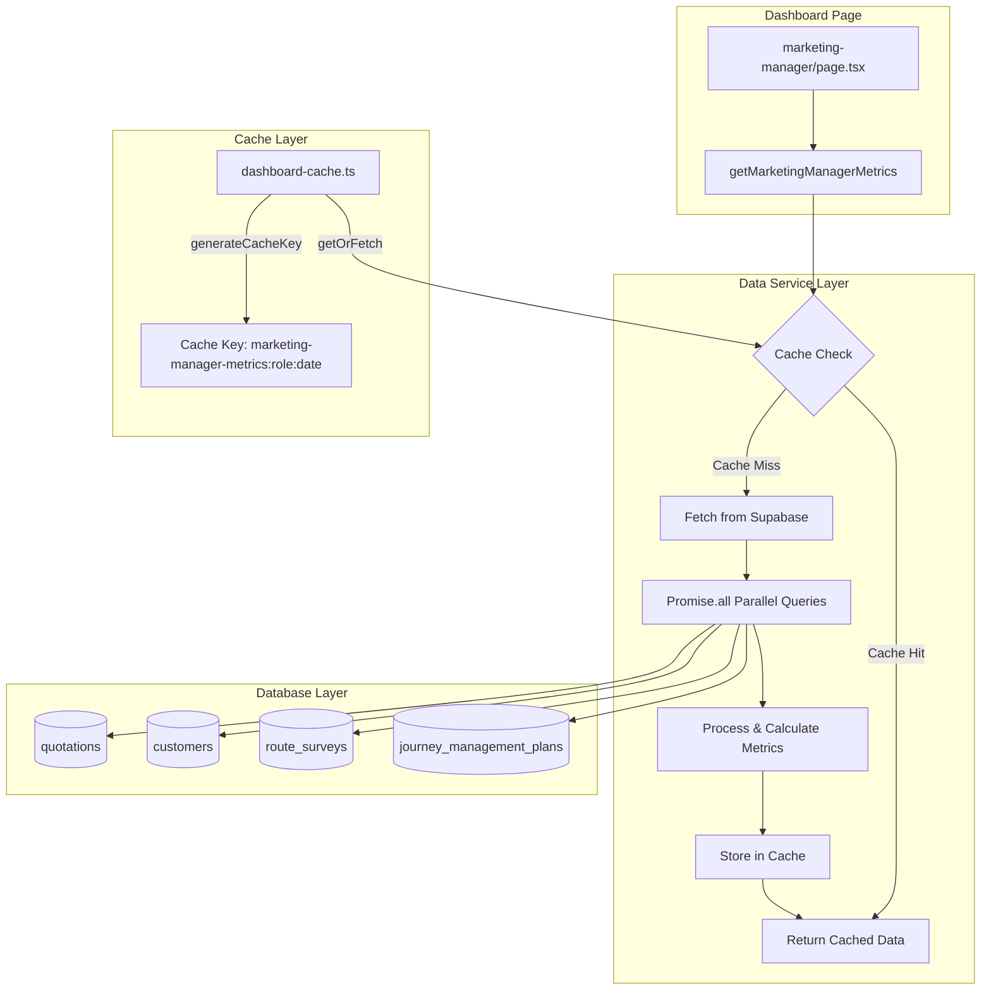

# Design Document: Marketing Manager Dashboard Real Data

## Overview

This design converts the Marketing Manager dashboard from mock/placeholder data to real Supabase database queries. The implementation follows the established pattern from the Finance Manager dashboard (`lib/dashboard/finance-manager-data.ts`), using server-side data fetching with 5-minute caching for optimal performance.

The Marketing Manager (Hutami) oversees both Marketing and Engineering departments, requiring visibility into:
- Sales pipeline metrics (quotations, win rates, pipeline value)
- Customer acquisition and portfolio
- Engineering department status (surveys, JMPs)
- Revenue metrics (permission-gated via `can_see_revenue`)

## Architecture



## Components and Interfaces

### MarketingManagerMetrics Interface

```typescript
export interface MarketingManagerMetrics {
  // Sales Pipeline
  quotationsSentMTD: number
  quotationValueMTD: number
  wonQuotationsMTD: number
  lostQuotationsMTD: number
  winRatePercent: number
  activeQuotations: number
  pipelineValue: number
  
  // Pipeline Breakdown
  pipelineByStatus: {
    draft: number
    engineering_review: number
    ready: number
    submitted: number
    won: number
    lost: number
  }
  
  // Customer Metrics
  totalCustomers: number
  newCustomersMTD: number
  
  // Revenue Metrics (permission-gated)
  revenueMTD: number | null
  averageDealSize: number | null
  
  // Engineering Department
  pendingEngineeringReview: number
  activeSurveys: number
  activeJMPs: number
  
  // Recent Activity
  recentQuotations: RecentQuotation[]
  recentCustomers: RecentCustomer[]
}

export interface RecentQuotation {
  id: string
  quotation_number: string
  title: string
  customer_name: string
  status: string
  created_at: string
}

export interface RecentCustomer {
  id: string
  name: string
  created_at: string
}
```

### Data Service Function

```typescript
// lib/dashboard/marketing-manager-data.ts
'use server'

import { createClient } from '@/lib/supabase/server'
import { getOrFetch, generateCacheKey } from '@/lib/dashboard-cache'

const CACHE_TTL = 5 * 60 * 1000 // 5 minutes

export async function getMarketingManagerMetrics(): Promise<MarketingManagerMetrics> {
  const cacheKey = await generateCacheKey('marketing-manager-metrics', 'marketing_manager')
  
  return getOrFetch(cacheKey, async () => {
    const supabase = await createClient()
    const now = new Date()
    const startOfMonth = new Date(now.getFullYear(), now.getMonth(), 1)
    
    // Parallel queries using Promise.all
    const [
      quotationsMTDResult,
      activeQuotationsResult,
      pipelineStatusResult,
      customersResult,
      newCustomersResult,
      surveysResult,
      jmpsResult,
      recentQuotationsResult,
      recentCustomersResult,
    ] = await Promise.all([
      // Quotations created this month
      supabase
        .from('quotations')
        .select('id, status, total_revenue, outcome_date')
        .gte('created_at', startOfMonth.toISOString())
        .eq('is_active', true),
      
      // Active quotations (pipeline)
      supabase
        .from('quotations')
        .select('id, total_revenue')
        .in('status', ['draft', 'engineering_review', 'ready', 'submitted'])
        .eq('is_active', true),
      
      // Pipeline by status
      supabase
        .from('quotations')
        .select('status')
        .eq('is_active', true),
      
      // Total customers
      supabase
        .from('customers')
        .select('id', { count: 'exact', head: true })
        .eq('is_active', true),
      
      // New customers this month
      supabase
        .from('customers')
        .select('id', { count: 'exact', head: true })
        .gte('created_at', startOfMonth.toISOString())
        .eq('is_active', true),
      
      // Active surveys
      supabase
        .from('route_surveys')
        .select('id', { count: 'exact', head: true })
        .in('status', ['pending', 'in_progress']),
      
      // Active JMPs
      supabase
        .from('journey_management_plans')
        .select('id', { count: 'exact', head: true })
        .in('status', ['draft', 'pending_review', 'approved', 'active']),
      
      // Recent quotations (last 5)
      supabase
        .from('quotations')
        .select('id, quotation_number, title, status, created_at, customer:customers(name)')
        .eq('is_active', true)
        .order('created_at', { ascending: false })
        .limit(5),
      
      // Recent customers (last 5)
      supabase
        .from('customers')
        .select('id, name, created_at')
        .eq('is_active', true)
        .order('created_at', { ascending: false })
        .limit(5),
    ])
    
    // Process results and calculate metrics
    // ... (calculation logic)
    
    return metrics
  }, CACHE_TTL)
}
```

## Data Models

### Database Tables Used

| Table | Purpose | Key Fields |
|-------|---------|------------|
| `quotations` | Sales pipeline data | `id`, `status`, `total_revenue`, `created_at`, `outcome_date`, `is_active` |
| `customers` | Customer portfolio | `id`, `name`, `created_at`, `is_active` |
| `route_surveys` | Engineering surveys | `id`, `status` |
| `journey_management_plans` | JMP tracking | `id`, `status` |

### Quotation Status Values

```typescript
type QuotationStatus = 
  | 'draft'           // Initial creation
  | 'engineering_review'  // Pending engineering assessment
  | 'ready'           // Ready to submit
  | 'submitted'       // Sent to customer
  | 'won'             // Customer accepted
  | 'lost'            // Customer rejected
  | 'cancelled'       // Internally cancelled
```

### Survey Status Values

```typescript
type SurveyStatus = 'pending' | 'in_progress' | 'completed' | 'cancelled'
```

### JMP Status Values

```typescript
type JMPStatus = 'draft' | 'pending_review' | 'approved' | 'active' | 'completed' | 'cancelled'
```


## Correctness Properties

*A property is a characteristic or behavior that should hold true across all valid executions of a system—essentially, a formal statement about what the system should do. Properties serve as the bridge between human-readable specifications and machine-verifiable correctness guarantees.*

### Property 1: MTD Quotation Count Accuracy

*For any* set of quotations in the database with various `created_at` dates, the `quotationsSentMTD` metric SHALL equal the count of quotations where `created_at >= startOfMonth` and `is_active = true`.

**Validates: Requirements 1.1**

### Property 2: MTD Quotation Value Aggregation

*For any* set of quotations with various `total_revenue` values and `created_at` dates, the `quotationValueMTD` metric SHALL equal the sum of `total_revenue` for all quotations where `created_at >= startOfMonth` and `is_active = true`.

**Validates: Requirements 1.2**

### Property 3: Win Rate Calculation

*For any* set of quotations with `status` in ('won', 'lost'), the `winRatePercent` SHALL equal `(count of won / count of won + lost) * 100`. When no closed quotations exist (won + lost = 0), the win rate SHALL be 0.

**Validates: Requirements 1.5, 1.6**

### Property 4: Pipeline Status Breakdown Completeness

*For any* set of active quotations, the sum of all status counts in `pipelineByStatus` (draft + engineering_review + ready + submitted + won + lost) SHALL equal the total count of active quotations. Each individual status count SHALL match the actual count of quotations with that status.

**Validates: Requirements 1.3, 1.4, 4.1, 5.1**

### Property 5: Customer Count Accuracy

*For any* set of customers in the database, `totalCustomers` SHALL equal the count of customers where `is_active = true`, and `newCustomersMTD` SHALL equal the count of customers where `created_at >= startOfMonth` and `is_active = true`.

**Validates: Requirements 2.1, 2.2**

> **Note**: Requirement 2.3 (customer breakdown by type) is deferred as the `customers` table does not have a `customer_type` field. This can be added as a future enhancement when customer segmentation is needed.

### Property 6: Permission-Gated Revenue Metrics

*For any* user profile, if `can_see_revenue = false`, then `revenueMTD` and `averageDealSize` SHALL be `null`. If `can_see_revenue = true`, then `revenueMTD` SHALL equal the sum of `total_revenue` for won quotations with `outcome_date` in current month, and `averageDealSize` SHALL equal `revenueMTD / count of won quotations` (or 0 if no won quotations).

**Validates: Requirements 3.1, 3.2, 3.3, 3.4**

### Property 7: Engineering Metrics Accuracy

*For any* set of route surveys and JMPs, `activeSurveys` SHALL equal the count of surveys with `status` in ('pending', 'in_progress'), and `activeJMPs` SHALL equal the count of JMPs with `status` in ('draft', 'pending_review', 'approved', 'active').

**Validates: Requirements 5.2, 5.3**

### Property 8: Recent Items Ordering

*For any* set of quotations and customers, `recentQuotations` SHALL contain at most 5 items ordered by `created_at` descending (most recent first), and `recentCustomers` SHALL contain at most 5 items ordered by `created_at` descending.

**Validates: Requirements 6.1, 6.2**

### Property 9: Cache Behavior

*For any* sequence of calls to `getMarketingManagerMetrics` within the 5-minute TTL window, all calls after the first SHALL return the same cached data without executing database queries. After TTL expiration, the next call SHALL fetch fresh data from the database.

**Validates: Requirements 7.1, 7.2, 7.3**

### Property 10: Currency Formatting

*For any* numeric value representing IDR currency, the formatted output SHALL match the pattern with thousands separators (e.g., 1000000 → "1.000.000" or "Rp 1.000.000").

**Validates: Requirements 8.3**

## Error Handling

### Database Query Errors

| Error Scenario | Handling Strategy |
|----------------|-------------------|
| Supabase connection failure | Return cached data if available, otherwise throw error |
| Query timeout | Log error, return partial data with error flag |
| Invalid query result | Log error, return default/zero values for affected metrics |

### Cache Errors

| Error Scenario | Handling Strategy |
|----------------|-------------------|
| Cache read failure | Proceed with fresh database query |
| Cache write failure | Log warning, return data without caching |

### Permission Errors

| Error Scenario | Handling Strategy |
|----------------|-------------------|
| User not authenticated | Redirect to login page |
| User lacks marketing_manager role | Redirect to appropriate dashboard |
| Revenue permission denied | Return null for revenue metrics (not an error) |

### Implementation Pattern

```typescript
try {
  const metrics = await getMarketingManagerMetrics()
  return metrics
} catch (error) {
  console.error('Failed to fetch marketing manager metrics:', error)
  // Return safe defaults or cached data
  return getDefaultMetrics()
}
```

## Testing Strategy

### Dual Testing Approach

This feature requires both unit tests and property-based tests for comprehensive coverage:

1. **Unit Tests**: Verify specific examples, edge cases, and integration points
2. **Property-Based Tests**: Verify universal properties across randomly generated inputs

### Property-Based Testing Configuration

- **Library**: fast-check (TypeScript property-based testing library)
- **Minimum iterations**: 100 per property test
- **Tag format**: `Feature: marketing-manager-dashboard-real-data, Property {number}: {property_text}`

### Test Categories

#### Unit Tests

1. **Data Service Tests** (`lib/dashboard/__tests__/marketing-manager-data.test.ts`)
   - Test with empty database (zero counts)
   - Test with single record scenarios
   - Test date boundary conditions (start/end of month)
   - Test permission gating (can_see_revenue true/false)

2. **Integration Tests**
   - Dashboard page renders with real data service
   - Currency formatting displays correctly
   - Recent items display in correct order

#### Property-Based Tests

Each correctness property (1-10) will have a corresponding property-based test:

```typescript
// Example: Property 3 - Win Rate Calculation
describe('Feature: marketing-manager-dashboard-real-data, Property 3: Win Rate Calculation', () => {
  it('should calculate win rate as won/(won+lost)*100', () => {
    fc.assert(
      fc.property(
        fc.nat({ max: 100 }), // won count
        fc.nat({ max: 100 }), // lost count
        (won, lost) => {
          const total = won + lost
          const expectedRate = total === 0 ? 0 : Math.round((won / total) * 100)
          const actualRate = calculateWinRate(won, lost)
          return actualRate === expectedRate
        }
      ),
      { numRuns: 100 }
    )
  })
})
```

### Test File Structure

```
lib/dashboard/__tests__/
├── marketing-manager-data.test.ts      # Unit tests
└── marketing-manager-data.property.ts  # Property-based tests
```

### Mocking Strategy

- Mock Supabase client for unit tests
- Use test database with seeded data for integration tests
- Mock cache for testing cache behavior in isolation
