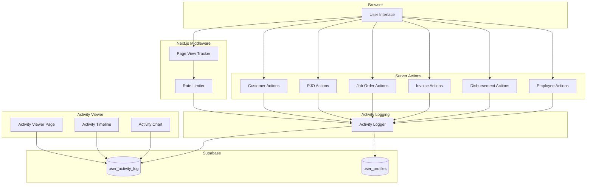

# Design Document: User Activity Tracking (v0.13.1)

## Overview

This feature adds comprehensive user activity tracking to GAMA ERP, enabling administrators to monitor user adoption and identify UX issues. The system tracks two types of activities:

1. **Page Views**: Automatically tracked via middleware when users navigate between pages
2. **Action Events**: Explicitly logged when users perform key actions (create, update, delete, approve, reject)

**Important Distinction**: This feature creates a NEW `user_activity_log` table separate from the existing `activity_log` table:
- `activity_log` (existing) = Document-focused audit trail for compliance
- `user_activity_log` (new) = User behavior tracking for adoption metrics

The architecture prioritizes non-blocking, asynchronous logging to ensure tracking doesn't impact user experience. A new activity viewer page at `/settings/activity` will display metrics and charts for user activity data.

## Architecture



### Key Design Decisions

1. **Async Non-Blocking Logging**: Activity logging uses fire-and-forget pattern to avoid impacting response times
2. **Rate Limiting in Middleware**: Prevents spam from rapid page navigation using in-memory cache with 1-minute TTL
3. **Server-Side Only**: All logging happens server-side to prevent tampering and ensure data integrity
4. **RLS for Access Control**: Leverages Supabase RLS to enforce who can view activity data

## Components and Interfaces

### 1. Activity Logger Utility (`lib/activity-logger.ts`)

```typescript
interface ActivityLogEntry {
  user_id: string;
  user_email: string;
  action_type: ActionType;
  resource_type?: ResourceType;
  resource_id?: string;
  page_path?: string;
  metadata?: Record<string, unknown>;
  ip_address?: string;
  user_agent?: string;
  session_id?: string;
}

type ActionType = 
  | 'page_view' 
  | 'create' 
  | 'update' 
  | 'delete' 
  | 'login' 
  | 'logout' 
  | 'approve' 
  | 'reject';

type ResourceType = 
  | 'customer' 
  | 'pjo' 
  | 'job_order' 
  | 'invoice' 
  | 'disbursement' 
  | 'employee' 
  | 'project' 
  | 'quotation';

// Main logging function - async, non-blocking
async function logActivity(
  userId: string,
  actionType: ActionType,
  resourceType?: ResourceType,
  resourceId?: string,
  metadata?: Record<string, unknown>
): Promise<void>;

// Page view logging with rate limiting
async function logPageView(
  userId: string,
  pagePath: string,
  sessionId?: string,
  ipAddress?: string,
  userAgent?: string
): Promise<void>;
```

### 2. Middleware Page View Tracker

Updates to `middleware.ts` to track page views:

```typescript
// Rate limiter cache (in-memory, per-instance)
const pageViewCache = new Map<string, number>();
const RATE_LIMIT_MS = 60000; // 1 minute

function shouldLogPageView(userId: string, pagePath: string): boolean {
  const key = `${userId}:${pagePath}`;
  const lastLog = pageViewCache.get(key);
  const now = Date.now();
  
  if (!lastLog || now - lastLog > RATE_LIMIT_MS) {
    pageViewCache.set(key, now);
    return true;
  }
  return false;
}

// Paths to exclude from tracking
const EXCLUDED_PATHS = [
  '/_next',
  '/api',
  '/auth',
  '/login',
  '/favicon.ico',
  '/static',
];
```

### 3. Activity Viewer Page (`app/(main)/settings/activity/page.tsx`)

```typescript
interface ActivityDashboardProps {
  // Server-side props
}

interface ActivityFilters {
  userId?: string;
  actionType?: ActionType | 'all';
  dateRange: 'today' | 'last_7_days' | 'last_30_days';
}

interface DailyActivityCount {
  date: string;
  count: number;
}

// Activity Viewer displays:
// - Daily active users count
// - Activity timeline (last 50 actions)
// - Bar chart (actions per day, last 7 days)
// - Filter controls
```

### 4. Activity Timeline Component (`components/activity/activity-timeline.tsx`)

```typescript
interface ActivityTimelineProps {
  activities: ActivityLogEntry[];
  onResourceClick?: (resourceType: ResourceType, resourceId: string) => void;
}

// Displays activities with:
// - User email
// - Action type badge
// - Resource type and ID (clickable)
// - Relative timestamp
// - Page path for page_view actions
```

### 5. Activity Chart Component (`components/activity/activity-chart.tsx`)

```typescript
interface ActivityChartProps {
  data: DailyActivityCount[];
}

// Simple bar chart showing actions per day
// Uses native HTML/CSS or a lightweight chart library
```

## Data Models

### user_activity_log Table

```sql
CREATE TABLE IF NOT EXISTS user_activity_log (
  id UUID PRIMARY KEY DEFAULT gen_random_uuid(),
  user_id UUID REFERENCES auth.users(id) ON DELETE CASCADE,
  user_email TEXT,
  action_type TEXT NOT NULL,
  resource_type TEXT,
  resource_id TEXT,
  page_path TEXT,
  metadata JSONB DEFAULT '{}',
  ip_address TEXT,
  user_agent TEXT,
  session_id TEXT,
  created_at TIMESTAMPTZ DEFAULT NOW()
);

-- Indexes for efficient querying
CREATE INDEX idx_activity_user_id ON user_activity_log(user_id);
CREATE INDEX idx_activity_created ON user_activity_log(created_at DESC);
CREATE INDEX idx_activity_type ON user_activity_log(action_type);
CREATE INDEX idx_activity_resource ON user_activity_log(resource_type);

-- Composite index for rate limiting queries
CREATE INDEX idx_activity_user_page ON user_activity_log(user_id, page_path, created_at DESC);
```

### RLS Policies

```sql
-- Enable RLS
ALTER TABLE user_activity_log ENABLE ROW LEVEL SECURITY;

-- Users can view their own activity
CREATE POLICY "Users view own activity"
ON user_activity_log FOR SELECT
USING (auth.uid() = user_id);

-- Admins (owner, director, sysadmin) can view all activity
CREATE POLICY "Admins view all activity"
ON user_activity_log FOR SELECT
USING (
  EXISTS (
    SELECT 1 FROM user_profiles
    WHERE user_profiles.user_id = auth.uid()
    AND user_profiles.role IN ('owner', 'director', 'sysadmin')
  )
);

-- System can insert activity (authenticated users)
CREATE POLICY "System can insert activity"
ON user_activity_log FOR INSERT
WITH CHECK (true);
```

### TypeScript Types (`types/activity.ts`)

```typescript
export interface UserActivityLog {
  id: string;
  user_id: string;
  user_email: string | null;
  action_type: string;
  resource_type: string | null;
  resource_id: string | null;
  page_path: string | null;
  metadata: Record<string, unknown>;
  ip_address: string | null;
  user_agent: string | null;
  session_id: string | null;
  created_at: string;
}

export type ActionType = 
  | 'page_view' 
  | 'create' 
  | 'update' 
  | 'delete' 
  | 'login' 
  | 'logout' 
  | 'approve' 
  | 'reject';

export type ResourceType = 
  | 'customer' 
  | 'pjo' 
  | 'job_order' 
  | 'invoice' 
  | 'disbursement' 
  | 'employee' 
  | 'project' 
  | 'quotation';

export interface ActivityFilters {
  userId?: string;
  actionType?: ActionType | 'all';
  dateRange: 'today' | 'last_7_days' | 'last_30_days';
}

export interface DailyActivityCount {
  date: string;
  count: number;
}
```


## Correctness Properties

*A property is a characteristic or behavior that should hold true across all valid executions of a system—essentially, a formal statement about what the system should do. Properties serve as the bridge between human-readable specifications and machine-verifiable correctness guarantees.*

Based on the prework analysis, the following properties have been identified and consolidated to eliminate redundancy:

### Property 1: RLS Access Control

*For any* user querying the user_activity_log table, if the user's role is NOT owner, director, or sysadmin, then the query results SHALL only contain records where user_id matches the querying user's ID.

**Validates: Requirements 1.3, 1.4, 10.6**

### Property 2: Activity Logging Consistency

*For any* successful action (create, update, delete, approve, reject) on any resource (customer, pjo, job_order, invoice, disbursement, employee), calling logActivity with the action parameters SHALL result in a record being inserted into user_activity_log with:
- Correct action_type matching the action performed
- Correct resource_type matching the resource affected
- Correct resource_id matching the affected record
- Metadata containing the resource identifier (name, number, or reference)
- user_email populated from the user's profile

**Validates: Requirements 2.2, 2.3, 4.1-4.4, 5.1-5.5, 6.1-6.4, 7.1-7.4, 8.1-8.4, 9.1-9.3**

### Property 3: Page View Rate Limiting

*For any* user visiting the same page path multiple times within a 60-second window, the system SHALL log at most one page_view activity for that user-page combination within that window.

**Validates: Requirements 3.3**

### Property 4: Page View Exclusion

*For any* request to a path matching the exclusion patterns (/_next, /api, /auth, /login, /favicon.ico, /static), the system SHALL NOT log a page_view activity.

**Validates: Requirements 3.2**

### Property 5: Page View Data Capture

*For any* page_view activity logged, the record SHALL contain:
- user_id matching the authenticated user
- page_path matching the visited URL path
- action_type equal to 'page_view'

**Validates: Requirements 3.1, 3.4**

### Property 6: Filter Correctness

*For any* filter combination (userId, actionType, dateRange) applied to the activity dashboard, all returned activities SHALL match ALL specified filter criteria:
- If userId is specified, activity.user_id === userId
- If actionType is specified and not 'all', activity.action_type === actionType
- If dateRange is specified, activity.created_at falls within the date range

**Validates: Requirements 10.4, 12.4, 12.5**

### Property 7: Activity Display Completeness

*For any* activity displayed in the timeline, the display SHALL include:
- user_email (non-null)
- action_type (non-null)
- created_at formatted as relative time
- For page_view actions: page_path
- For action events with resource: resource_type and resource_id

**Validates: Requirements 11.1, 11.3, 11.4**

### Property 8: Resource Navigation URL Generation

*For any* activity with a resource_type and resource_id, the generated navigation URL SHALL follow the pattern:
- customer → /customers/{resource_id}
- pjo → /proforma-jo/{resource_id}
- job_order → /job-orders/{resource_id}
- invoice → /invoices/{resource_id}
- disbursement → /disbursements/{resource_id}
- employee → /hr/employees/{resource_id}

**Validates: Requirements 11.5**

## Error Handling

### Activity Logger Errors

| Error Scenario | Handling Strategy |
|----------------|-------------------|
| Database insert fails | Log error to console, do NOT throw exception |
| User profile lookup fails | Use null for user_email, continue logging |
| Invalid action_type | Log warning, reject the log request |
| Invalid resource_type | Log warning, allow with null resource_type |
| Network timeout | Retry once with exponential backoff, then fail silently |

### Middleware Errors

| Error Scenario | Handling Strategy |
|----------------|-------------------|
| Rate limiter cache full | Clear oldest entries, continue processing |
| User session invalid | Skip page view logging, continue request |
| Logging service unavailable | Skip logging, continue request normally |

### Dashboard Errors

| Error Scenario | Handling Strategy |
|----------------|-------------------|
| Query timeout | Show error message, offer retry button |
| No activities found | Show empty state with helpful message |
| Filter returns no results | Show "No activities match filters" message |
| Chart data unavailable | Show placeholder with error message |

## Testing Strategy

### Dual Testing Approach

This feature requires both unit tests and property-based tests for comprehensive coverage:

- **Unit tests**: Verify specific examples, edge cases, and error conditions
- **Property tests**: Verify universal properties across all inputs using randomized testing

### Property-Based Testing Configuration

- **Library**: fast-check (TypeScript property-based testing library)
- **Minimum iterations**: 100 per property test
- **Tag format**: `Feature: v0.13.1-user-activity-tracking, Property {number}: {property_text}`

### Test Categories

#### Unit Tests

1. **Activity Logger Unit Tests**
   - Test logActivity with valid parameters
   - Test logActivity with missing optional parameters
   - Test error handling when database insert fails
   - Test user_email lookup from profile

2. **Rate Limiter Unit Tests**
   - Test first page view is logged
   - Test second page view within 1 minute is not logged
   - Test page view after 1 minute is logged
   - Test different pages are logged independently

3. **Dashboard Component Tests**
   - Test filter state management
   - Test date range calculations
   - Test relative timestamp formatting
   - Test resource URL generation

4. **RLS Policy Tests**
   - Test regular user sees only own activities
   - Test owner sees all activities
   - Test director sees all activities
   - Test sysadmin sees all activities

#### Property-Based Tests

Each correctness property MUST be implemented as a single property-based test:

1. **Property 1 Test**: Generate random users with random roles, create activities, verify RLS filtering
2. **Property 2 Test**: Generate random actions on random resources, verify logging consistency
3. **Property 3 Test**: Generate random page visits with random timing, verify rate limiting
4. **Property 4 Test**: Generate random excluded paths, verify no logging occurs
5. **Property 5 Test**: Generate random page views, verify required fields are captured
6. **Property 6 Test**: Generate random filter combinations, verify all results match criteria
7. **Property 7 Test**: Generate random activities, verify display completeness
8. **Property 8 Test**: Generate random resource types and IDs, verify URL generation

### Integration Tests

1. **End-to-End Action Logging**
   - Create a customer, verify activity logged
   - Update a PJO, verify activity logged
   - Approve a disbursement, verify activity logged

2. **Dashboard Integration**
   - Load dashboard with real data
   - Apply filters, verify results update
   - Click resource link, verify navigation

