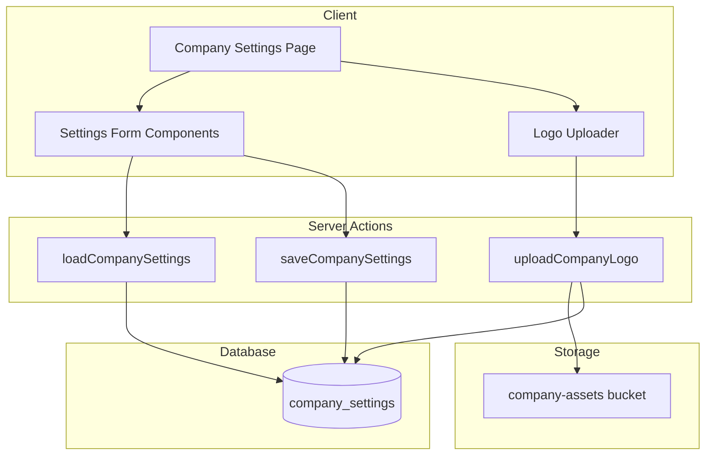

# Design Document: Company Settings

## Overview

The Company Settings feature provides a centralized configuration interface for administrators to manage company-wide settings in Gama ERP. This includes company information (name, address, tax ID), invoice defaults (VAT rate, payment terms, bank details), document numbering formats, and company logo management.

The settings are stored in a key-value table (`company_settings`) allowing flexible addition of new settings without schema changes. Settings are loaded on-demand and cached where appropriate for performance.

## Architecture



## Components and Interfaces

### Page Component

**File:** `app/(main)/settings/company/page.tsx`

Server component that checks permissions and renders the settings client component.

```typescript
interface CompanySettingsPageProps {
  // No props - data loaded via server actions
}
```

### Client Component

**File:** `components/settings/company-settings-form.tsx`

Main form component managing all settings sections.

```typescript
interface CompanySettingsFormProps {
  initialSettings: CompanySettings;
}

interface CompanySettings {
  // Company Information
  company_name: string;
  legal_name: string;
  tax_id: string;
  address: string;
  phone: string;
  email: string;
  
  // Invoice Settings
  vat_rate: number;
  default_payment_terms: number;
  invoice_prefix: string;
  bank_name: string;
  bank_account: string;
  bank_account_name: string;
  
  // Document Numbering
  pjo_format: string;
  jo_format: string;
  invoice_format: string;
  
  // Logo
  logo_url: string | null;
}
```

### Logo Uploader Component

**File:** `components/settings/logo-uploader.tsx`

Handles logo file selection, validation, and upload.

```typescript
interface LogoUploaderProps {
  currentLogoUrl: string | null;
  onUploadComplete: (url: string) => void;
}
```

### Document Number Preview Component

**File:** `components/settings/document-number-preview.tsx`

Displays live preview of document number format.

```typescript
interface DocumentNumberPreviewProps {
  format: string;
  sequenceNumber?: number;
}
```

### Server Actions

**File:** `app/(main)/settings/company/actions.ts`

```typescript
// Load all company settings
async function loadCompanySettings(): Promise<CompanySettings>

// Save company settings (partial update supported)
async function saveCompanySettings(settings: Partial<CompanySettings>): Promise<{ success: boolean; error?: string }>

// Upload company logo
async function uploadCompanyLogo(formData: FormData): Promise<{ success: boolean; url?: string; error?: string }>
```

### Utility Functions

**File:** `lib/company-settings-utils.ts`

```typescript
// Validate VAT rate (0-100)
function validateVatRate(rate: number): boolean

// Validate payment terms (positive integer)
function validatePaymentTerms(days: number): boolean

// Validate document number format (must contain NNNN, MM, YYYY)
function validateDocumentFormat(format: string): { valid: boolean; missingPlaceholders: string[] }

// Generate document number from format
function generateDocumentNumber(format: string, sequence: number, date?: Date): string

// Parse document number format for preview
function previewDocumentNumber(format: string, sequence?: number): string

// Validate logo file (type and size)
function validateLogoFile(file: File): { valid: boolean; error?: string }

// Get setting value with type coercion
function getSettingValue<T>(settings: Record<string, string>, key: string, defaultValue: T): T
```

## Data Models

### Database Table

```sql
CREATE TABLE company_settings (
  id UUID PRIMARY KEY DEFAULT gen_random_uuid(),
  key VARCHAR(100) UNIQUE NOT NULL,
  value TEXT,
  updated_at TIMESTAMPTZ DEFAULT NOW(),
  updated_by UUID REFERENCES auth.users(id)
);

-- RLS Policies
ALTER TABLE company_settings ENABLE ROW LEVEL SECURITY;

-- Read: All authenticated users can read settings
CREATE POLICY "Authenticated users can read settings"
  ON company_settings FOR SELECT
  TO authenticated
  USING (true);

-- Write: Only admin/owner can modify settings
CREATE POLICY "Admins can modify settings"
  ON company_settings FOR ALL
  TO authenticated
  USING (
    EXISTS (
      SELECT 1 FROM users 
      WHERE users.id = auth.uid() 
      AND users.role IN ('admin', 'owner', 'super_admin')
    )
  );
```

### Default Settings

| Key | Default Value | Description |
|-----|---------------|-------------|
| company_name | PT. Gama Intisamudera | Display name |
| legal_name | PT. Gama Intisamudera | Legal entity name |
| tax_id | | NPWP number |
| address | | Company address |
| phone | | Contact phone |
| email | | Contact email |
| vat_rate | 11 | VAT percentage |
| default_payment_terms | 30 | Days until due |
| invoice_prefix | GIS-A | Invoice number prefix |
| bank_name | Bank Mandiri | Bank name |
| bank_account | | Account number |
| bank_account_name | PT. Gama Intisamudera | Account holder |
| pjo_format | NNNN/CARGO/MM/YYYY | PJO number format |
| jo_format | NNNN/GG/MM/YYYY | JO number format |
| invoice_format | NNNN/GIS-A/MM/YYYY | Invoice number format |
| logo_url | null | Company logo URL |

### TypeScript Types

**File:** `types/company-settings.ts`

```typescript
export interface CompanySettingsRow {
  id: string;
  key: string;
  value: string | null;
  updated_at: string;
  updated_by: string | null;
}

export interface CompanySettings {
  company_name: string;
  legal_name: string;
  tax_id: string;
  address: string;
  phone: string;
  email: string;
  vat_rate: number;
  default_payment_terms: number;
  invoice_prefix: string;
  bank_name: string;
  bank_account: string;
  bank_account_name: string;
  pjo_format: string;
  jo_format: string;
  invoice_format: string;
  logo_url: string | null;
}

export const SETTING_KEYS = [
  'company_name',
  'legal_name', 
  'tax_id',
  'address',
  'phone',
  'email',
  'vat_rate',
  'default_payment_terms',
  'invoice_prefix',
  'bank_name',
  'bank_account',
  'bank_account_name',
  'pjo_format',
  'jo_format',
  'invoice_format',
  'logo_url'
] as const;

export type SettingKey = typeof SETTING_KEYS[number];
```

## Correctness Properties

*A property is a characteristic or behavior that should hold true across all valid executions of a system-essentially, a formal statement about what the system should do. Properties serve as the bridge between human-readable specifications and machine-verifiable correctness guarantees.*

### Property 1: Settings persistence round-trip
*For any* valid company settings object, saving it to the database and then loading it back should return an equivalent settings object.
**Validates: Requirements 1.2, 5.2**

### Property 2: Audit trail on save
*For any* settings save operation by an authenticated user, the updated_at timestamp should be set to the current time and updated_by should match the user's ID.
**Validates: Requirements 1.3**

### Property 3: Required field validation
*For any* settings object where company_name is empty or whitespace-only, the validation function should return invalid.
**Validates: Requirements 1.4**

### Property 4: VAT rate validation
*For any* numeric value, the VAT rate validation should return true if and only if the value is between 0 and 100 inclusive.
**Validates: Requirements 2.2**

### Property 5: Payment terms validation
*For any* numeric value, the payment terms validation should return true if and only if the value is a positive integer.
**Validates: Requirements 2.3**

### Property 6: Document number format validation
*For any* format string, the format validation should return valid if and only if the string contains all required placeholders: NNNN, MM, and YYYY.
**Validates: Requirements 3.3**

### Property 7: Document number generation
*For any* valid format string and sequence number, the generated document number should contain the sequence number zero-padded to 4 digits, the current month as 2 digits, and the current year as 4 digits in the positions specified by the format.
**Validates: Requirements 3.2, 3.4, 3.5, 3.6**

### Property 8: Logo file type validation
*For any* file, the logo validation should accept the file if and only if its MIME type is image/png, image/jpeg, or image/svg+xml.
**Validates: Requirements 4.2**

### Property 9: Logo file size validation
*For any* file, the logo validation should accept the file if and only if its size is less than or equal to 2MB (2,097,152 bytes).
**Validates: Requirements 4.3**

### Property 10: Access control
*For any* user with a role other than admin, owner, or super_admin, attempting to access the company settings page should result in access denial.
**Validates: Requirements 6.1**

## Error Handling

| Error Scenario | Handling Strategy |
|----------------|-------------------|
| Database connection failure | Display error toast, preserve form state, allow retry |
| Validation failure | Highlight invalid fields, show inline error messages |
| Logo upload failure | Display error message, preserve current logo |
| Unauthorized access | Redirect to dashboard with access denied message |
| Concurrent edit conflict | Last write wins (acceptable for single-tenant settings) |

### Validation Error Messages

```typescript
const VALIDATION_MESSAGES = {
  company_name_required: 'Company name is required',
  vat_rate_invalid: 'VAT rate must be between 0 and 100',
  payment_terms_invalid: 'Payment terms must be a positive number',
  format_missing_sequence: 'Format must include NNNN for sequence number',
  format_missing_month: 'Format must include MM for month',
  format_missing_year: 'Format must include YYYY for year',
  logo_invalid_type: 'Logo must be PNG, JPG, or SVG format',
  logo_too_large: 'Logo file size must not exceed 2MB',
};
```

## Testing Strategy

### Unit Testing

Unit tests will verify specific behaviors and edge cases:

- Settings form renders all fields correctly
- Validation functions handle boundary values
- Document number preview updates on format change
- Logo uploader shows current logo when present

### Property-Based Testing

Property-based tests will use **fast-check** library to verify universal properties:

- Settings round-trip persistence
- VAT rate validation accepts exactly 0-100 range
- Payment terms validation accepts exactly positive integers
- Document format validation requires all placeholders
- Document number generation produces correct output for any valid input
- Logo validation accepts exactly valid file types and sizes

Each property-based test will be configured to run a minimum of 100 iterations and will be tagged with the corresponding correctness property from this design document.

**Test file:** `__tests__/company-settings-utils.test.ts`

Format for property test comments:
```typescript
// **Feature: company-settings, Property 4: VAT rate validation**
```
