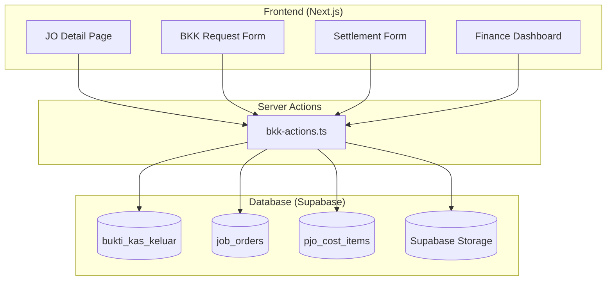
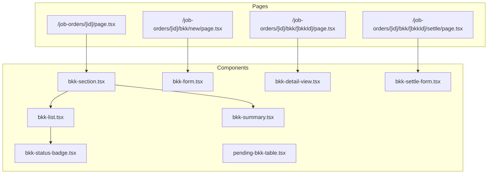

# Design Document: Bukti Kas Keluar (BKK) System

## Overview

The Bukti Kas Keluar (BKK) system provides a complete cash disbursement workflow for job order operations. It integrates with the existing JO and PJO cost items infrastructure to enable budget-controlled cash advances with full audit trails.

The system follows a state machine pattern for BKK lifecycle management:
```
pending → approved → released → settled
    ↓         ↓
 cancelled  rejected
```

## Architecture

### System Context



### Component Architecture



## Components and Interfaces

### Server Actions (`app/(main)/job-orders/bkk-actions.ts`)

```typescript
// Create a new BKK request
export async function createBKK(data: CreateBKKInput): Promise<ActionResult<BKK>>

// Get all BKKs for a job order
export async function getBKKsByJobOrder(joId: string): Promise<BKK[]>

// Get a single BKK by ID
export async function getBKKById(bkkId: string): Promise<BKK | null>

// Approve a BKK request
export async function approveBKK(bkkId: string): Promise<ActionResult<BKK>>

// Reject a BKK request
export async function rejectBKK(bkkId: string, reason: string): Promise<ActionResult<BKK>>

// Cancel a pending BKK request
export async function cancelBKK(bkkId: string): Promise<ActionResult<void>>

// Release cash for an approved BKK
export async function releaseBKK(bkkId: string, data: ReleaseBKKInput): Promise<ActionResult<BKK>>

// Settle a released BKK
export async function settleBKK(bkkId: string, data: SettleBKKInput): Promise<ActionResult<BKK>>

// Get pending BKKs for approval (Finance dashboard)
export async function getPendingBKKs(): Promise<BKK[]>

// Get BKK summary for a job order
export async function getBKKSummary(joId: string): Promise<BKKSummary>
```

### Utility Functions (`lib/bkk-utils.ts`)

```typescript
// Generate BKK number
export function generateBKKNumber(year: number, sequence: number): string

// Calculate available budget for a cost item
export function calculateAvailableBudget(
  budgetAmount: number,
  existingBKKs: BKK[]
): AvailableBudget

// Calculate settlement difference
export function calculateSettlementDifference(
  releasedAmount: number,
  spentAmount: number
): SettlementDifference

// Validate BKK status transition
export function isValidStatusTransition(
  currentStatus: BKKStatus,
  newStatus: BKKStatus
): boolean

// Get BKK summary totals
export function calculateBKKSummary(bkks: BKK[]): BKKSummaryTotals

// Format BKK for display
export function formatBKKDisplay(bkk: BKK): FormattedBKK
```

### React Components

#### BKKSection (`components/bkk/bkk-section.tsx`)
Container component for the BKK area on JO detail page.

```typescript
interface BKKSectionProps {
  jobOrderId: string
  bkks: BKK[]
  costItems: PJOCostItem[]
  canRequest: boolean
  canApprove: boolean
  canRelease: boolean
}
```

#### BKKList (`components/bkk/bkk-list.tsx`)
Table displaying all BKKs for a job order.

```typescript
interface BKKListProps {
  bkks: BKK[]
  onView: (bkkId: string) => void
  onSettle: (bkkId: string) => void
  onCancel: (bkkId: string) => void
  onApprove: (bkkId: string) => void
  onReject: (bkkId: string) => void
  onRelease: (bkkId: string) => void
  userRole: UserRole
}
```

#### BKKForm (`components/bkk/bkk-form.tsx`)
Form for creating a new BKK request.

```typescript
interface BKKFormProps {
  jobOrderId: string
  costItems: PJOCostItem[]
  existingBKKs: BKK[]
  onSubmit: (data: CreateBKKInput) => Promise<void>
  onCancel: () => void
}
```

#### BKKSettleForm (`components/bkk/bkk-settle-form.tsx`)
Form for settling a released BKK.

```typescript
interface BKKSettleFormProps {
  bkk: BKK
  onSubmit: (data: SettleBKKInput) => Promise<void>
  onCancel: () => void
}
```

#### BKKStatusBadge (`components/ui/bkk-status-badge.tsx`)
Status badge component with appropriate colors.

```typescript
interface BKKStatusBadgeProps {
  status: BKKStatus
  showDetails?: boolean
}
```

#### PendingBKKTable (`components/dashboard/finance/pending-bkk-table.tsx`)
Table for Finance dashboard showing pending approvals.

```typescript
interface PendingBKKTableProps {
  bkks: BKK[]
  onApprove: (bkkId: string) => Promise<void>
  onReject: (bkkId: string, reason: string) => Promise<void>
}
```

## Data Models

### Database Schema

```sql
CREATE TABLE bukti_kas_keluar (
  id UUID PRIMARY KEY DEFAULT gen_random_uuid(),
  bkk_number VARCHAR(50) UNIQUE NOT NULL,
  
  -- Link to JO and cost item
  jo_id UUID REFERENCES job_orders(id) NOT NULL,
  pjo_cost_item_id UUID REFERENCES pjo_cost_items(id),
  
  -- Request details
  purpose VARCHAR(500) NOT NULL,
  amount_requested DECIMAL(15,2) NOT NULL,
  
  -- Budget reference
  budget_category VARCHAR(50),
  budget_amount DECIMAL(15,2),
  
  -- Workflow status
  status VARCHAR(30) DEFAULT 'pending',
  
  -- Request
  requested_by UUID REFERENCES user_profiles(id),
  requested_at TIMESTAMPTZ DEFAULT NOW(),
  
  -- Approval
  approved_by UUID REFERENCES user_profiles(id),
  approved_at TIMESTAMPTZ,
  rejection_reason TEXT,
  
  -- Release
  released_by UUID REFERENCES user_profiles(id),
  released_at TIMESTAMPTZ,
  release_method VARCHAR(30),
  release_reference VARCHAR(100),
  
  -- Settlement
  amount_spent DECIMAL(15,2),
  amount_returned DECIMAL(15,2),
  settled_at TIMESTAMPTZ,
  settled_by UUID REFERENCES user_profiles(id),
  
  -- Documents
  receipt_urls JSONB DEFAULT '[]',
  notes TEXT,
  
  created_at TIMESTAMPTZ DEFAULT NOW(),
  updated_at TIMESTAMPTZ DEFAULT NOW()
);

CREATE INDEX idx_bkk_jo ON bukti_kas_keluar(jo_id);
CREATE INDEX idx_bkk_status ON bukti_kas_keluar(status);
CREATE INDEX idx_bkk_cost_item ON bukti_kas_keluar(pjo_cost_item_id);
```

### TypeScript Types

```typescript
// BKK Status enum
export type BKKStatus = 
  | 'pending' 
  | 'approved' 
  | 'rejected' 
  | 'released' 
  | 'settled' 
  | 'cancelled';

// BKK Release Method
export type BKKReleaseMethod = 'cash' | 'transfer';

// Main BKK type
export interface BKK {
  id: string
  bkk_number: string
  jo_id: string
  pjo_cost_item_id: string | null
  purpose: string
  amount_requested: number
  budget_category: string | null
  budget_amount: number | null
  status: BKKStatus
  requested_by: string | null
  requested_at: string
  approved_by: string | null
  approved_at: string | null
  rejection_reason: string | null
  released_by: string | null
  released_at: string | null
  release_method: BKKReleaseMethod | null
  release_reference: string | null
  amount_spent: number | null
  amount_returned: number | null
  settled_at: string | null
  settled_by: string | null
  receipt_urls: string[]
  notes: string | null
  created_at: string
  updated_at: string
}

// Extended BKK with relations
export interface BKKWithRelations extends BKK {
  job_order?: JobOrder
  cost_item?: PJOCostItem
  requester?: UserProfile
  approver?: UserProfile
  releaser?: UserProfile
  settler?: UserProfile
}

// Create BKK input
export interface CreateBKKInput {
  jo_id: string
  pjo_cost_item_id?: string
  purpose: string
  amount_requested: number
  budget_category?: string
  budget_amount?: number
  notes?: string
}

// Release BKK input
export interface ReleaseBKKInput {
  release_method: BKKReleaseMethod
  release_reference?: string
}

// Settle BKK input
export interface SettleBKKInput {
  amount_spent: number
  receipt_urls?: string[]
  notes?: string
}

// Available budget calculation result
export interface AvailableBudget {
  budgetAmount: number
  alreadyDisbursed: number
  available: number
  pendingRequests: number
}

// Settlement difference calculation
export interface SettlementDifference {
  releasedAmount: number
  spentAmount: number
  difference: number
  type: 'return' | 'additional' | 'exact'
}

// BKK Summary totals
export interface BKKSummaryTotals {
  totalRequested: number
  totalReleased: number
  totalSettled: number
  pendingReturn: number
  count: {
    pending: number
    approved: number
    released: number
    settled: number
    rejected: number
    cancelled: number
  }
}
```

### Status Transition Rules

```typescript
const VALID_TRANSITIONS: Record<BKKStatus, BKKStatus[]> = {
  pending: ['approved', 'rejected', 'cancelled'],
  approved: ['released', 'cancelled'],
  rejected: [],
  released: ['settled'],
  settled: [],
  cancelled: []
}
```


## Correctness Properties

*A property is a characteristic or behavior that should hold true across all valid executions of a system—essentially, a formal statement about what the system should do. Properties serve as the bridge between human-readable specifications and machine-verifiable correctness guarantees.*

### Property 1: BKK Number Format Validity

*For any* year and sequence number, the generated BKK number SHALL match the format "BKK-YYYY-NNNN" where YYYY is the 4-digit year and NNNN is a zero-padded 4-digit sequence.

**Validates: Requirements 1.2**

### Property 2: Status Transition Validity

*For any* BKK with a given status, only the defined valid transitions SHALL be allowed:
- pending → approved, rejected, cancelled
- approved → released, cancelled
- released → settled
- rejected, settled, cancelled → no transitions allowed

**Validates: Requirements 2.1, 2.5, 3.1, 4.1**

### Property 3: State Consistency After Transitions

*For any* valid status transition on a BKK:
- After creation: status = "pending", requested_by and requested_at are set
- After approval: status = "approved", approved_by and approved_at are set
- After rejection: status = "rejected", rejection_reason, approved_by, and approved_at are set
- After release: status = "released", released_by, released_at, and release_method are set
- After settlement: status = "settled", settled_by, settled_at, and amount_spent are set

**Validates: Requirements 1.6, 2.2, 2.4, 3.3, 4.6**

### Property 4: Input Validation Completeness

*For any* BKK operation:
- Creation requires: purpose (non-empty), amount_requested (> 0)
- Rejection requires: rejection_reason (non-empty)
- Release requires: release_method (cash or transfer)
- Settlement requires: amount_spent (>= 0)

Operations missing required fields SHALL fail validation.

**Validates: Requirements 1.5, 2.3, 3.2, 4.2**

### Property 5: Budget Calculation Correctness

*For any* cost item with a budget amount and a set of BKKs:
- available_budget = budget_amount - sum(amount_requested for all non-rejected, non-cancelled BKKs)
- already_disbursed = sum(amount_requested for all released or settled BKKs)
- The available budget SHALL never be negative in the calculation (though requests exceeding it are allowed with warning)

**Validates: Requirements 1.3, 1.4, 7.1, 7.2**

### Property 6: Settlement Difference Calculation

*For any* BKK settlement with released amount R and spent amount S:
- If S < R: amount_returned = R - S, type = "return"
- If S > R: difference = S - R, type = "additional"
- If S = R: difference = 0, type = "exact"

The sum (amount_spent + amount_returned) SHALL equal the released amount for settled BKKs.

**Validates: Requirements 4.3, 4.4**

### Property 7: Cost Item Synchronization After Settlement

*For any* BKK that is settled with a linked cost item:
- The cost item's actual_amount SHALL be updated to include the BKK's amount_spent
- If total actual_amount > budget_amount: cost item status = "exceeded"
- If total actual_amount <= budget_amount: cost item status = "confirmed"

**Validates: Requirements 4.7, 4.8, 4.9**

### Property 8: BKK Summary Calculation

*For any* set of BKKs for a job order:
- total_requested = sum(amount_requested for all non-cancelled, non-rejected BKKs)
- total_released = sum(amount_requested for all released or settled BKKs)
- total_settled = sum(amount_spent for all settled BKKs)
- pending_return = total_released - total_settled (for released but not settled BKKs)

**Validates: Requirements 5.3**

### Property 9: Action Availability Based on Status

*For any* BKK with a given status, the available actions SHALL be:
- pending: Cancel, Approve (for approvers), Reject (for approvers)
- approved: Release (for cashiers), Cancel
- released: Settle (for requester)
- settled: View only
- rejected: View only
- cancelled: View only

**Validates: Requirements 5.4, 5.5, 5.6**

## Error Handling

### Validation Errors

| Error Code | Condition | User Message |
|------------|-----------|--------------|
| `BKK_MISSING_PURPOSE` | Purpose is empty or whitespace | "Purpose is required" |
| `BKK_INVALID_AMOUNT` | Amount <= 0 | "Amount must be greater than zero" |
| `BKK_MISSING_REJECTION_REASON` | Rejection without reason | "Rejection reason is required" |
| `BKK_MISSING_RELEASE_METHOD` | Release without method | "Release method is required" |
| `BKK_MISSING_SPENT_AMOUNT` | Settlement without amount_spent | "Amount spent is required" |
| `BKK_INVALID_SPENT_AMOUNT` | amount_spent < 0 | "Amount spent cannot be negative" |

### State Errors

| Error Code | Condition | User Message |
|------------|-----------|--------------|
| `BKK_INVALID_TRANSITION` | Invalid status transition | "Cannot {action} a BKK with status {status}" |
| `BKK_NOT_FOUND` | BKK ID doesn't exist | "BKK not found" |
| `BKK_ALREADY_PROCESSED` | Attempting to modify processed BKK | "This BKK has already been {status}" |
| `BKK_COST_ITEM_CLOSED` | Creating BKK for confirmed/exceeded cost item | "Cannot create BKK for a closed cost item" |

### Permission Errors

| Error Code | Condition | User Message |
|------------|-----------|--------------|
| `BKK_UNAUTHORIZED_APPROVE` | Non-approver trying to approve | "You don't have permission to approve BKK requests" |
| `BKK_UNAUTHORIZED_RELEASE` | Non-cashier trying to release | "You don't have permission to release cash" |
| `BKK_UNAUTHORIZED_CANCEL` | Non-requester trying to cancel | "Only the requester can cancel this BKK" |

### Budget Warnings (Non-blocking)

| Warning Code | Condition | User Message |
|--------------|-----------|--------------|
| `BKK_EXCEEDS_BUDGET` | Requested amount > available budget | "Warning: Requested amount exceeds available budget by {amount}" |
| `BKK_SETTLEMENT_EXCEEDS` | Spent amount > released amount | "Note: Additional {amount} was spent beyond the released amount" |

## Testing Strategy

### Property-Based Testing

We will use **fast-check** as the property-based testing library for TypeScript.

Each correctness property will be implemented as a property-based test with minimum 100 iterations.

**Test Configuration:**
```typescript
import fc from 'fast-check'

// Configure minimum iterations
const PBT_CONFIG = { numRuns: 100 }
```

**Property Test Tags:**
Each property test must be annotated with:
- Feature name: `bukti-kas-keluar`
- Property number and title
- Requirements reference

### Unit Tests

Unit tests will cover:
- Specific examples demonstrating correct behavior
- Edge cases (zero amounts, empty strings, boundary values)
- Error conditions and validation failures
- Integration points between components

### Test File Structure

```
__tests__/
  bkk-utils.test.ts          # Utility function tests (unit + property)
  bkk-actions.test.ts        # Server action tests
  bkk-components.test.tsx    # Component rendering tests
```

### Key Test Scenarios

1. **BKK Number Generation**
   - Property: Format matches "BKK-YYYY-NNNN"
   - Edge: Year boundaries, sequence overflow

2. **Status Transitions**
   - Property: Only valid transitions succeed
   - Edge: Attempting invalid transitions

3. **Budget Calculations**
   - Property: Available = Budget - Disbursed
   - Edge: Zero budget, multiple BKKs, cancelled BKKs excluded

4. **Settlement Calculations**
   - Property: Return + Spent = Released
   - Edge: Exact match, overspend, underspend

5. **Summary Calculations**
   - Property: Totals correctly aggregate
   - Edge: Empty list, mixed statuses
