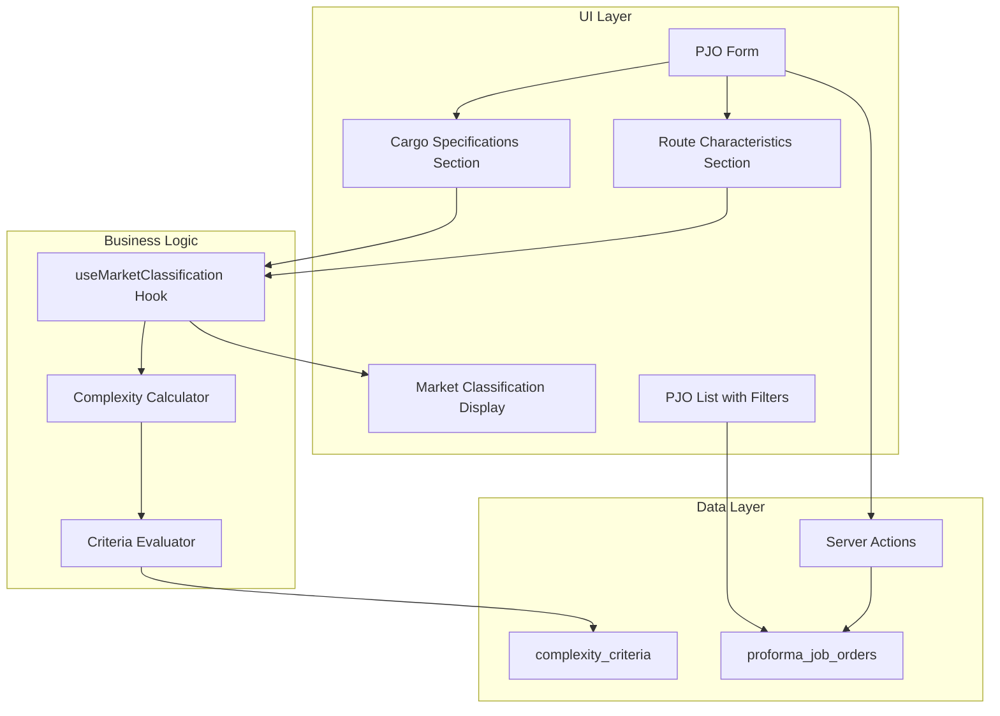

# Design Document: Market Type Classification

## Overview

This feature adds market type classification to Proforma Job Orders (PJOs) to categorize projects as "Simple" or "Complex" based on cargo specifications and route characteristics. The classification uses a weighted scoring system with configurable criteria stored in the database. Complex projects (score ≥ 20) require Engineering assessment before approval.

The system automatically calculates complexity scores when cargo specifications or route characteristics change, providing real-time feedback to users. This enables appropriate pricing strategies and ensures complex logistics operations receive proper engineering review.

## Architecture



## Components and Interfaces

### New Components

#### 1. CargoSpecificationsSection
Location: `components/pjo/cargo-specifications-section.tsx`

```typescript
interface CargoSpecificationsProps {
  values: CargoSpecifications
  onChange: (values: CargoSpecifications) => void
  disabled?: boolean
}

interface CargoSpecifications {
  cargo_weight_kg: number | null
  cargo_length_m: number | null
  cargo_width_m: number | null
  cargo_height_m: number | null
  cargo_value: number | null
  duration_days: number | null
}
```

Renders input fields for cargo weight, dimensions (length, width, height), estimated value, and project duration.

#### 2. RouteCharacteristicsSection
Location: `components/pjo/route-characteristics-section.tsx`

```typescript
interface RouteCharacteristicsProps {
  values: RouteCharacteristics
  onChange: (values: RouteCharacteristics) => void
  disabled?: boolean
}

interface RouteCharacteristics {
  is_new_route: boolean
  terrain_type: TerrainType | null
  requires_special_permit: boolean
  is_hazardous: boolean
}

type TerrainType = 'normal' | 'mountain' | 'unpaved' | 'narrow'
```

Renders checkboxes for route characteristics and terrain type selector.

#### 3. MarketClassificationDisplay
Location: `components/pjo/market-classification-display.tsx`

```typescript
interface MarketClassificationDisplayProps {
  classification: MarketClassification | null
  isCalculating: boolean
  onRecalculate?: () => void
}

interface MarketClassification {
  market_type: 'simple' | 'complex'
  complexity_score: number
  complexity_factors: ComplexityFactor[]
  requires_engineering: boolean
}

interface ComplexityFactor {
  criteria_code: string
  criteria_name: string
  weight: number
  triggered_value: string
}
```

Displays complexity score progress bar, market type badge, triggered factors list, and engineering warning.

#### 4. PricingApproachSection
Location: `components/pjo/pricing-approach-section.tsx`

```typescript
interface PricingApproachProps {
  pricingApproach: PricingApproach | null
  pricingNotes: string
  marketType: 'simple' | 'complex'
  onPricingApproachChange: (value: PricingApproach) => void
  onPricingNotesChange: (value: string) => void
  disabled?: boolean
}

type PricingApproach = 'standard' | 'premium' | 'negotiated' | 'cost_plus'
```

Renders pricing approach dropdown and notes textarea.

#### 5. MarketTypeBadge
Location: `components/ui/market-type-badge.tsx`

```typescript
interface MarketTypeBadgeProps {
  marketType: 'simple' | 'complex'
  score?: number
  showScore?: boolean
}
```

Displays colored badge (green for Simple, orange for Complex) with optional score.

### Modified Components

#### PJOForm
Add new sections for cargo specifications, route characteristics, market classification display, and pricing approach. Integrate `useMarketClassification` hook.

#### PJOFilters
Add market type filter dropdown with options: All, Simple Only, Complex Only.

#### PJOTable
Add market type badge column showing classification and score.

#### PJOListClient
Add market type filter state and summary counts display.

### Hooks

#### useMarketClassification
Location: `hooks/use-market-classification.ts`

```typescript
interface UseMarketClassificationProps {
  cargoSpecs: CargoSpecifications
  routeChars: RouteCharacteristics
}

interface UseMarketClassificationReturn {
  classification: MarketClassification | null
  isCalculating: boolean
  recalculate: () => Promise<void>
}

function useMarketClassification(props: UseMarketClassificationProps): UseMarketClassificationReturn
```

Debounced hook that calculates market classification when inputs change. Uses 300ms debounce to avoid excessive calculations.

### Utility Functions

Location: `lib/market-classification-utils.ts`

```typescript
// Complexity thresholds
const COMPLEXITY_THRESHOLDS = {
  SIMPLE_MAX: 19,      // 0-19 = Simple
  COMPLEX_MIN: 20,     // 20+ = Complex
  ENGINEERING_MIN: 20, // 20+ requires engineering
}

// Calculate market classification from PJO data
async function calculateMarketClassification(
  pjoData: PJOClassificationInput,
  criteria: ComplexityCriteria[]
): Promise<MarketClassification>

// Evaluate single criterion against PJO data
function evaluateCriterion(
  criterion: ComplexityCriteria,
  pjoData: PJOClassificationInput
): boolean

// Get display value for triggered criterion
function getTriggeredDisplayValue(
  criterion: ComplexityCriteria,
  pjoData: PJOClassificationInput
): string

// Format complexity score as percentage
function formatComplexityScore(score: number): string
```

### Server Actions

Location: `app/(main)/proforma-jo/classification-actions.ts`

```typescript
// Fetch active complexity criteria
async function getComplexityCriteria(): Promise<ComplexityCriteria[]>

// Update PJO classification
async function updatePJOClassification(
  pjoId: string,
  classification: MarketClassification,
  pricingApproach: PricingApproach | null,
  pricingNotes: string | null
): Promise<{ error?: string }>
```

## Data Models

### Database Schema Changes

#### proforma_job_orders table additions

```sql
-- Market classification fields
market_type VARCHAR(20) DEFAULT 'simple',
complexity_score INTEGER DEFAULT 0,
complexity_factors JSONB DEFAULT '[]',
pricing_approach VARCHAR(30),
pricing_notes TEXT,

-- Cargo specification fields
cargo_weight_kg DECIMAL(12,2),
cargo_length_m DECIMAL(6,2),
cargo_width_m DECIMAL(6,2),
cargo_height_m DECIMAL(6,2),
cargo_value DECIMAL(15,2),
duration_days INTEGER,

-- Route characteristic fields
is_new_route BOOLEAN DEFAULT FALSE,
terrain_type VARCHAR(30),
requires_special_permit BOOLEAN DEFAULT FALSE,
is_hazardous BOOLEAN DEFAULT FALSE
```

#### complexity_criteria table (new)

```sql
CREATE TABLE complexity_criteria (
  id UUID PRIMARY KEY DEFAULT gen_random_uuid(),
  criteria_code VARCHAR(30) UNIQUE NOT NULL,
  criteria_name VARCHAR(100) NOT NULL,
  description TEXT,
  weight INTEGER DEFAULT 10,
  auto_detect_rules JSONB,
  is_active BOOLEAN DEFAULT TRUE,
  display_order INTEGER DEFAULT 0,
  created_at TIMESTAMPTZ DEFAULT NOW()
);
```

### TypeScript Types

Location: `types/market-classification.ts`

```typescript
export type MarketType = 'simple' | 'complex'
export type PricingApproach = 'standard' | 'premium' | 'negotiated' | 'cost_plus'
export type TerrainType = 'normal' | 'mountain' | 'unpaved' | 'narrow'

export interface ComplexityCriteria {
  id: string
  criteria_code: string
  criteria_name: string
  description: string | null
  weight: number
  auto_detect_rules: AutoDetectRules | null
  is_active: boolean
  display_order: number
  created_at: string
}

export interface AutoDetectRules {
  field: string
  operator: '>' | '<' | '>=' | '<=' | '=' | 'in'
  value: number | boolean | string | string[]
}

export interface ComplexityFactor {
  criteria_code: string
  criteria_name: string
  weight: number
  triggered_value: string
}

export interface MarketClassification {
  market_type: MarketType
  complexity_score: number
  complexity_factors: ComplexityFactor[]
  requires_engineering: boolean
}

export interface CargoSpecifications {
  cargo_weight_kg: number | null
  cargo_length_m: number | null
  cargo_width_m: number | null
  cargo_height_m: number | null
  cargo_value: number | null
  duration_days: number | null
}

export interface RouteCharacteristics {
  is_new_route: boolean
  terrain_type: TerrainType | null
  requires_special_permit: boolean
  is_hazardous: boolean
}

export interface PJOClassificationInput extends CargoSpecifications, RouteCharacteristics {}
```

### Default Complexity Criteria

| Code | Name | Weight | Rule |
|------|------|--------|------|
| heavy_cargo | Heavy Cargo (>30 tons) | 20 | cargo_weight_kg > 30000 |
| over_length | Over Length (>12m) | 15 | cargo_length_m > 12 |
| over_width | Over Width (>2.5m) | 15 | cargo_width_m > 2.5 |
| over_height | Over Height (>4.2m) | 15 | cargo_height_m > 4.2 |
| long_duration | Long Duration (>30 days) | 10 | duration_days > 30 |
| new_route | New/Unfamiliar Route | 10 | is_new_route = true |
| challenging_terrain | Challenging Terrain | 15 | terrain_type in ['mountain', 'unpaved', 'narrow'] |
| special_permits | Special Permits Required | 15 | requires_special_permit = true |
| high_value | High Value Cargo (>5B) | 10 | cargo_value > 5000000000 |
| hazardous | Hazardous Material | 20 | is_hazardous = true |


## Correctness Properties

*A property is a characteristic or behavior that should hold true across all valid executions of a system—essentially, a formal statement about what the system should do. Properties serve as the bridge between human-readable specifications and machine-verifiable correctness guarantees.*

### Property 1: Complexity Score Threshold Classification

*For any* complexity score value, the market_type SHALL be 'simple' if score < 20, and 'complex' if score >= 20.

**Validates: Requirements 5.4, 5.5**

### Property 2: Criteria Evaluation and Score Calculation

*For any* set of active complexity criteria and PJO data, the total complexity score SHALL equal the sum of weights from all criteria whose auto_detect_rules match the PJO data.

**Validates: Requirements 5.1, 5.2**

### Property 3: Operator Evaluation Correctness

*For any* criterion with operator '>', '<', '>=', '<=', '=', or 'in', the evaluateCriterion function SHALL return true if and only if the PJO field value satisfies the operator condition against the rule value.

**Validates: Requirements 5.3**

### Property 4: Triggered Factors Completeness

*For any* triggered complexity criterion, the resulting ComplexityFactor object SHALL contain non-empty criteria_code, criteria_name, positive weight, and triggered_value fields.

**Validates: Requirements 5.6**

### Property 5: Input Change Triggers Recalculation

*For any* change to cargo specification fields (weight, dimensions, value, duration) or route characteristic fields (is_new_route, terrain_type, requires_special_permit, is_hazardous), the useMarketClassification hook SHALL trigger a new complexity calculation.

**Validates: Requirements 3.4, 4.2**

### Property 6: Numeric Input Validation

*For any* negative number input to cargo specification fields (cargo_weight_kg, cargo_length_m, cargo_width_m, cargo_height_m, cargo_value, duration_days), the form validation SHALL reject the input.

**Validates: Requirements 3.3**

### Property 7: Market Type Filter Correctness

*For any* list of PJOs and market type filter selection ('simple' or 'complex'), the filtered result SHALL contain only PJOs where market_type matches the filter value.

**Validates: Requirements 8.2**

### Property 8: Summary Counts Accuracy

*For any* list of PJOs, the displayed Simple count SHALL equal the number of PJOs with market_type='simple', and the Complex count SHALL equal the number of PJOs with market_type='complex'.

**Validates: Requirements 8.3**

### Property 9: Classification Data Round-Trip

*For any* valid MarketClassification data (market_type, complexity_score, complexity_factors, pricing_approach, pricing_notes), saving to database then loading SHALL produce equivalent data.

**Validates: Requirements 9.1, 9.2**

### Property 10: Premium Pricing Default for Complex

*For any* PJO where market_type transitions from 'simple' to 'complex', if pricing_approach was not previously set, it SHALL default to 'premium'.

**Validates: Requirements 7.3**

### Property 11: Engineering Warning Display

*For any* MarketClassification, the engineering warning message SHALL be displayed if and only if market_type is 'complex'.

**Validates: Requirements 6.4**

### Property 12: Badge Color Consistency

*For any* MarketTypeBadge component, the badge color SHALL be green when marketType='simple' and orange when marketType='complex'.

**Validates: Requirements 6.2**

### Property 13: Criteria Code Uniqueness

*For any* two complexity criteria in the database, their criteria_code values SHALL be distinct.

**Validates: Requirements 2.3**

### Property 14: Inactive Criteria Exclusion

*For any* complexity calculation, criteria with is_active=false SHALL NOT contribute to the complexity score or appear in triggered factors.

**Validates: Requirements 2.4**

## Error Handling

### Input Validation Errors

| Error Condition | Handling |
|----------------|----------|
| Negative cargo weight | Display inline error "Weight must be non-negative", prevent form submission |
| Negative dimensions | Display inline error "Dimensions must be non-negative", prevent form submission |
| Negative cargo value | Display inline error "Value must be non-negative", prevent form submission |
| Negative duration | Display inline error "Duration must be non-negative", prevent form submission |
| Invalid terrain type | Ignore invalid value, default to null |

### Database Errors

| Error Condition | Handling |
|----------------|----------|
| Failed to fetch criteria | Log error, use empty criteria list, show toast "Unable to load complexity criteria" |
| Failed to save classification | Show toast "Failed to save classification", allow retry |
| Duplicate criteria_code | Database constraint violation, show error "Criteria code already exists" |

### Calculation Errors

| Error Condition | Handling |
|----------------|----------|
| Invalid operator in rules | Skip criterion, log warning |
| Missing field in PJO data | Treat as null/false, criterion does not trigger |
| Malformed auto_detect_rules JSON | Skip criterion, log warning |

## Testing Strategy

### Unit Tests

Unit tests will verify specific examples and edge cases:

1. **Threshold boundary tests**: Score 19 → simple, Score 20 → complex
2. **Operator evaluation tests**: Each operator with sample values
3. **Default criteria seed verification**: All 10 default criteria exist
4. **Form validation tests**: Negative input rejection
5. **Badge color tests**: Green for simple, orange for complex

### Property-Based Tests

Property-based tests will use **fast-check** library for TypeScript to verify universal properties across generated inputs.

**Configuration**:
- Minimum 100 iterations per property test
- Each test tagged with: **Feature: market-type-classification, Property {N}: {description}**

**Test Files**:
- `__tests__/market-classification-utils.test.ts` - Core calculation logic properties
- `__tests__/market-classification-filter.test.ts` - Filter and count properties

**Generators**:
```typescript
// Generate random complexity score (0-150)
const complexityScoreArb = fc.integer({ min: 0, max: 150 })

// Generate random cargo specifications
const cargoSpecsArb = fc.record({
  cargo_weight_kg: fc.option(fc.float({ min: 0, max: 100000 })),
  cargo_length_m: fc.option(fc.float({ min: 0, max: 50 })),
  cargo_width_m: fc.option(fc.float({ min: 0, max: 10 })),
  cargo_height_m: fc.option(fc.float({ min: 0, max: 10 })),
  cargo_value: fc.option(fc.float({ min: 0, max: 10000000000 })),
  duration_days: fc.option(fc.integer({ min: 0, max: 365 })),
})

// Generate random route characteristics
const routeCharsArb = fc.record({
  is_new_route: fc.boolean(),
  terrain_type: fc.option(fc.constantFrom('normal', 'mountain', 'unpaved', 'narrow')),
  requires_special_permit: fc.boolean(),
  is_hazardous: fc.boolean(),
})

// Generate random complexity criterion
const criterionArb = fc.record({
  criteria_code: fc.string({ minLength: 1, maxLength: 30 }),
  criteria_name: fc.string({ minLength: 1, maxLength: 100 }),
  weight: fc.integer({ min: 1, max: 50 }),
  is_active: fc.boolean(),
  auto_detect_rules: fc.option(fc.record({
    field: fc.constantFrom('cargo_weight_kg', 'cargo_length_m', 'is_new_route'),
    operator: fc.constantFrom('>', '<', '=', 'in'),
    value: fc.oneof(fc.integer(), fc.boolean()),
  })),
})

// Generate random PJO with market classification
const pjoWithClassificationArb = fc.record({
  id: fc.uuid(),
  market_type: fc.constantFrom('simple', 'complex'),
  complexity_score: fc.integer({ min: 0, max: 100 }),
})
```

**Property Test Implementation Pattern**:
```typescript
describe('Market Classification Utils', () => {
  // Feature: market-type-classification, Property 1: Complexity Score Threshold Classification
  it('should classify market type based on score threshold', () => {
    fc.assert(
      fc.property(complexityScoreArb, (score) => {
        const expectedType = score < 20 ? 'simple' : 'complex'
        const result = classifyMarketType(score)
        return result === expectedType
      }),
      { numRuns: 100 }
    )
  })
})
```

### Integration Tests

1. **PJO Form Integration**: Test that changing cargo specs updates classification display
2. **PJO List Filter Integration**: Test filter dropdown updates list correctly
3. **Save/Load Integration**: Test classification persists through save/load cycle
