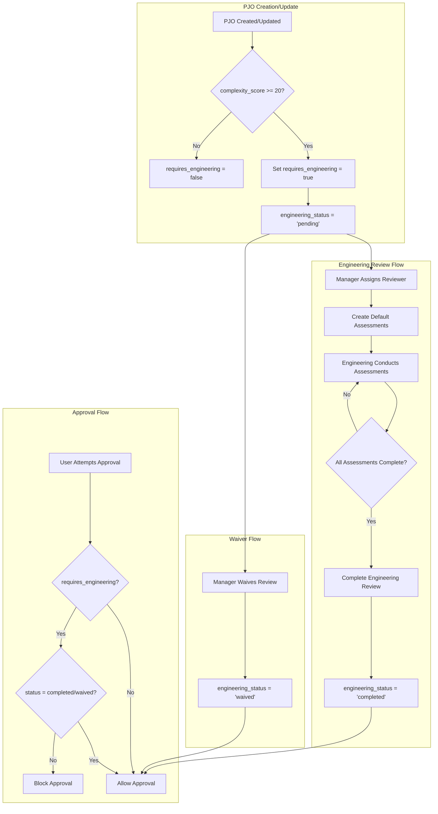

# Design Document: Engineering Flag System

## Overview

The Engineering Flag System extends the PJO (Proforma Job Order) workflow to include mandatory engineering review for complex projects. When a PJO's complexity score meets or exceeds a threshold (20 points), the system automatically flags it for engineering review, blocking approval until the review is completed or waived.

The system introduces:
- Engineering status tracking on PJOs
- Individual engineering assessments (route survey, technical review, permit check, JMP creation)
- Approval blocking mechanism
- Review completion and waiver workflows
- Notification integration

## Architecture



## Components and Interfaces

### Server Actions

#### `lib/engineering-utils.ts`

Core utility functions for engineering flag system:

```typescript
// Types
export type EngineeringStatus = 
  | 'not_required' 
  | 'pending' 
  | 'in_progress' 
  | 'completed' 
  | 'waived';

export type AssessmentType = 
  | 'route_survey' 
  | 'technical_review' 
  | 'permit_check' 
  | 'jmp_creation';

export type RiskLevel = 'low' | 'medium' | 'high' | 'critical';

export type EngineeringDecision = 
  | 'approved' 
  | 'approved_with_conditions' 
  | 'not_recommended' 
  | 'rejected';

// Check if PJO requires engineering based on complexity score
export function checkEngineeringRequired(complexityScore: number): boolean;

// Determine which assessments to create based on complexity factors
export function determineRequiredAssessments(
  complexityFactors: ComplexityFactor[]
): AssessmentType[];

// Calculate overall engineering status from assessments
export function calculateEngineeringStatus(
  assessments: EngineeringAssessment[]
): EngineeringStatus;

// Check if PJO can be approved
export function canApprovePJO(pjo: {
  requires_engineering: boolean;
  engineering_status: EngineeringStatus;
}): { canApprove: boolean; reason?: string };

// Calculate total additional costs from assessments
export function calculateTotalAdditionalCosts(
  assessments: EngineeringAssessment[]
): number;
```

#### `app/(main)/proforma-jo/engineering-actions.ts`

Server actions for engineering operations:

```typescript
'use server'

// Initialize engineering review for a PJO
export async function initializeEngineeringReview(
  pjoId: string,
  assignedTo: string
): Promise<{ success: boolean; error?: string }>;

// Start an assessment
export async function startAssessment(
  assessmentId: string
): Promise<{ success: boolean; error?: string }>;

// Complete an assessment
export async function completeAssessment(
  assessmentId: string,
  data: {
    findings: string;
    recommendations: string;
    risk_level: RiskLevel;
    additional_cost_estimate?: number;
    cost_justification?: string;
  }
): Promise<{ success: boolean; error?: string }>;

// Complete entire engineering review
export async function completeEngineeringReview(
  pjoId: string,
  data: {
    overall_risk_level: RiskLevel;
    decision: EngineeringDecision;
    engineering_notes: string;
    apply_additional_costs: boolean;
  }
): Promise<{ success: boolean; error?: string }>;

// Waive engineering review (manager+ only)
export async function waiveEngineeringReview(
  pjoId: string,
  reason: string
): Promise<{ success: boolean; error?: string }>;

// Fetch engineering assessments for a PJO
export async function getEngineeringAssessments(
  pjoId: string
): Promise<EngineeringAssessment[]>;
```

### UI Components

#### `components/engineering/engineering-status-banner.tsx`

Displays engineering review status prominently on PJO detail page:

```typescript
interface EngineeringStatusBannerProps {
  pjo: {
    id: string;
    requires_engineering: boolean;
    engineering_status: EngineeringStatus;
    engineering_assigned_to?: string;
    engineering_assigned_at?: string;
    engineering_notes?: string;
    engineering_waived_reason?: string;
    complexity_factors?: ComplexityFactor[];
  };
  assignedUser?: { full_name: string };
  onViewAssessments: () => void;
  onCompleteReview: () => void;
  onWaiveReview: () => void;
  canCompleteReview: boolean;
  canWaiveReview: boolean;
}
```

#### `components/engineering/engineering-assessments-section.tsx`

Lists and manages individual assessments:

```typescript
interface EngineeringAssessmentsSectionProps {
  pjoId: string;
  assessments: EngineeringAssessment[];
  canManageAssessments: boolean;
  onAssessmentUpdated: () => void;
}
```

#### `components/engineering/assessment-card.tsx`

Individual assessment display and actions:

```typescript
interface AssessmentCardProps {
  assessment: EngineeringAssessment;
  assignedUser?: { full_name: string };
  onStart: () => void;
  onComplete: () => void;
  onEdit: () => void;
  canManage: boolean;
}
```

#### `components/engineering/complete-assessment-dialog.tsx`

Dialog for completing an individual assessment:

```typescript
interface CompleteAssessmentDialogProps {
  assessment: EngineeringAssessment;
  open: boolean;
  onOpenChange: (open: boolean) => void;
  onComplete: (data: AssessmentCompletionData) => void;
}
```

#### `components/engineering/complete-review-dialog.tsx`

Dialog for completing the overall engineering review:

```typescript
interface CompleteReviewDialogProps {
  pjo: ProformaJobOrder;
  assessments: EngineeringAssessment[];
  open: boolean;
  onOpenChange: (open: boolean) => void;
  onComplete: (data: ReviewCompletionData) => void;
}
```

#### `components/engineering/waive-review-dialog.tsx`

Dialog for waiving engineering review:

```typescript
interface WaiveReviewDialogProps {
  pjo: ProformaJobOrder;
  open: boolean;
  onOpenChange: (open: boolean) => void;
  onWaive: (reason: string) => void;
}
```

#### `components/engineering/approval-blocked-dialog.tsx`

Dialog shown when approval is blocked due to pending engineering:

```typescript
interface ApprovalBlockedDialogProps {
  pjo: ProformaJobOrder;
  assignedUser?: { full_name: string };
  open: boolean;
  onOpenChange: (open: boolean) => void;
  onWaiveReview: () => void;
  canWaive: boolean;
}
```

### Integration Points

#### PJO Detail View Updates

The `pjo-detail-view.tsx` component will be updated to:
1. Display `EngineeringStatusBanner` when `requires_engineering` is true
2. Include `EngineeringAssessmentsSection` below the banner
3. Modify approval button to check engineering status before allowing approval

#### PJO Actions Updates

The `actions.ts` for PJO will be updated to:
1. Check engineering status in `approvePJO` function
2. Auto-set `requires_engineering` when complexity score threshold is met
3. Integrate with notification system for engineering events

## Data Models

### Database Schema Extensions

#### proforma_job_orders table additions

```sql
ALTER TABLE proforma_job_orders
ADD COLUMN IF NOT EXISTS requires_engineering BOOLEAN DEFAULT FALSE,
ADD COLUMN IF NOT EXISTS engineering_status VARCHAR(30) DEFAULT 'not_required',
ADD COLUMN IF NOT EXISTS engineering_assigned_to UUID REFERENCES user_profiles(id),
ADD COLUMN IF NOT EXISTS engineering_assigned_at TIMESTAMPTZ,
ADD COLUMN IF NOT EXISTS engineering_completed_at TIMESTAMPTZ,
ADD COLUMN IF NOT EXISTS engineering_completed_by UUID REFERENCES user_profiles(id),
ADD COLUMN IF NOT EXISTS engineering_notes TEXT,
ADD COLUMN IF NOT EXISTS engineering_waived_reason TEXT;
```

#### engineering_assessments table

```sql
CREATE TABLE engineering_assessments (
  id UUID PRIMARY KEY DEFAULT gen_random_uuid(),
  pjo_id UUID NOT NULL REFERENCES proforma_job_orders(id) ON DELETE CASCADE,
  assessment_type VARCHAR(30) NOT NULL,
  status VARCHAR(20) DEFAULT 'pending',
  assigned_to UUID REFERENCES user_profiles(id),
  assigned_at TIMESTAMPTZ,
  completed_at TIMESTAMPTZ,
  completed_by UUID REFERENCES user_profiles(id),
  findings TEXT,
  recommendations TEXT,
  risk_level VARCHAR(20),
  attachment_urls JSONB DEFAULT '[]',
  additional_cost_estimate DECIMAL(15,2),
  cost_justification TEXT,
  notes TEXT,
  created_at TIMESTAMPTZ DEFAULT NOW(),
  updated_at TIMESTAMPTZ DEFAULT NOW()
);

CREATE INDEX idx_engineering_assessments_pjo ON engineering_assessments(pjo_id);
CREATE INDEX idx_engineering_assessments_status ON engineering_assessments(status);
CREATE INDEX idx_engineering_assessments_assigned ON engineering_assessments(assigned_to);
```

### TypeScript Types

```typescript
// types/engineering.ts

export type EngineeringStatus = 
  | 'not_required' 
  | 'pending' 
  | 'in_progress' 
  | 'completed' 
  | 'waived';

export type AssessmentType = 
  | 'route_survey' 
  | 'technical_review' 
  | 'permit_check' 
  | 'jmp_creation';

export type AssessmentStatus = 
  | 'pending' 
  | 'in_progress' 
  | 'completed' 
  | 'cancelled';

export type RiskLevel = 'low' | 'medium' | 'high' | 'critical';

export type EngineeringDecision = 
  | 'approved' 
  | 'approved_with_conditions' 
  | 'not_recommended' 
  | 'rejected';

export interface EngineeringAssessment {
  id: string;
  pjo_id: string;
  assessment_type: AssessmentType;
  status: AssessmentStatus;
  assigned_to?: string;
  assigned_at?: string;
  completed_at?: string;
  completed_by?: string;
  findings?: string;
  recommendations?: string;
  risk_level?: RiskLevel;
  attachment_urls: string[];
  additional_cost_estimate?: number;
  cost_justification?: string;
  notes?: string;
  created_at: string;
  updated_at: string;
}

export interface EngineeringReviewData {
  requires_engineering: boolean;
  engineering_status: EngineeringStatus;
  engineering_assigned_to?: string;
  engineering_assigned_at?: string;
  engineering_completed_at?: string;
  engineering_completed_by?: string;
  engineering_notes?: string;
  engineering_waived_reason?: string;
}

export interface AssessmentCompletionData {
  findings: string;
  recommendations: string;
  risk_level: RiskLevel;
  additional_cost_estimate?: number;
  cost_justification?: string;
}

export interface ReviewCompletionData {
  overall_risk_level: RiskLevel;
  decision: EngineeringDecision;
  engineering_notes: string;
  apply_additional_costs: boolean;
}

export const ASSESSMENT_TYPE_LABELS: Record<AssessmentType, string> = {
  route_survey: 'Route Survey',
  technical_review: 'Technical Review',
  permit_check: 'Permit Check',
  jmp_creation: 'JMP Creation',
};

export const RISK_LEVEL_LABELS: Record<RiskLevel, string> = {
  low: 'Low',
  medium: 'Medium',
  high: 'High',
  critical: 'Critical',
};

export const ENGINEERING_STATUS_LABELS: Record<EngineeringStatus, string> = {
  not_required: 'Not Required',
  pending: 'Pending',
  in_progress: 'In Progress',
  completed: 'Completed',
  waived: 'Waived',
};

export const DECISION_LABELS: Record<EngineeringDecision, string> = {
  approved: 'Approved',
  approved_with_conditions: 'Approved with Conditions',
  not_recommended: 'Not Recommended',
  rejected: 'Rejected',
};

// Complexity threshold for requiring engineering review
export const ENGINEERING_REQUIRED_THRESHOLD = 20;
```


## Correctness Properties

*A property is a characteristic or behavior that should hold true across all valid executions of a system—essentially, a formal statement about what the system should do. Properties serve as the bridge between human-readable specifications and machine-verifiable correctness guarantees.*

### Property 1: Engineering Flag Based on Complexity Score

*For any* PJO with a complexity_score, if the score is >= 20 then requires_engineering should be true, and if the score is < 20 then requires_engineering should be false.

**Validates: Requirements 2.1**

### Property 2: Engineering Status Initialization

*For any* PJO where requires_engineering transitions from false to true, the engineering_status should be set to 'pending'.

**Validates: Requirements 2.2**

### Property 3: Complexity Recalculation on Update

*For any* PJO update that modifies complexity factors, the requires_engineering flag should be recalculated based on the new complexity_score.

**Validates: Requirements 2.3**

### Property 4: Assignment Updates Fields

*For any* engineering review assignment action, the PJO's engineering_assigned_to should equal the assigned user ID and engineering_assigned_at should be set to a timestamp.

**Validates: Requirements 3.1**

### Property 5: Assessment Creation Based on Complexity Factors

*For any* engineering review initialization with complexity factors:
- A technical_review assessment is always created
- If factors include 'new_route' or 'challenging_terrain', a route_survey assessment is created
- If factors include 'special_permits', a permit_check assessment is created
- If factors include 'over_length', 'over_width', or 'over_height', a jmp_creation assessment is created

**Validates: Requirements 3.2, 3.3, 3.4, 3.5, 3.6**

### Property 6: Assessment Status Transitions

*For any* assessment that is started, its status should transition to 'in_progress'.

**Validates: Requirements 4.1**

### Property 7: Assessment Completion Records Data

*For any* completed assessment, the findings, recommendations, and risk_level fields should be non-empty, and completed_at and completed_by should be set.

**Validates: Requirements 4.2, 4.3**

### Property 8: Engineering Status Calculation from Assessments

*For any* PJO with engineering assessments:
- If all assessments have status 'completed', engineering_status should be 'completed'
- If any assessment has status 'in_progress' and none are 'pending', engineering_status should be 'in_progress'
- Otherwise, engineering_status should be 'pending'

**Validates: Requirements 4.4, 4.5, 4.6**

### Property 9: Review Completion Validation

*For any* attempt to complete an engineering review, if overall_risk_level, decision, or engineering_notes is missing, the operation should fail.

**Validates: Requirements 5.1**

### Property 10: Review Completion Records Data

*For any* successfully completed engineering review, engineering_completed_at and engineering_completed_by should be set.

**Validates: Requirements 5.3**

### Property 11: Cost Application on Review Completion

*For any* engineering review completion where apply_additional_costs is true and total additional costs from assessments is > 0, a new cost item should be created on the PJO with the total amount.

**Validates: Requirements 5.4, 5.5**

### Property 12: Waiver Validation

*For any* attempt to waive an engineering review, if the reason is empty or missing, the operation should fail.

**Validates: Requirements 6.1**

### Property 13: Waiver Status Transition

*For any* successfully waived engineering review, engineering_status should be 'waived', and engineering_waived_reason, engineering_completed_at, and engineering_completed_by should be set.

**Validates: Requirements 6.2, 6.3**

### Property 14: Waiver Permission Restriction

*For any* user attempting to waive an engineering review, if the user does not have manager role or higher, the operation should fail.

**Validates: Requirements 6.4**

### Property 15: Approval Blocking Logic

*For any* PJO:
- If requires_engineering is false, approval should be allowed
- If requires_engineering is true and engineering_status is 'completed' or 'waived', approval should be allowed
- If requires_engineering is true and engineering_status is 'pending' or 'in_progress', approval should be blocked with a reason

**Validates: Requirements 7.1, 7.2, 7.3, 7.4**

### Property 16: Notification Creation

*For any* engineering review assignment, a notification should be created for the assigned user containing the PJO number and link. *For any* engineering review completion, a notification should be created for the PJO creator containing the PJO number and link.

**Validates: Requirements 10.1, 10.2, 10.3**

## Error Handling

### Validation Errors

| Error Condition | Error Message | HTTP Status |
|----------------|---------------|-------------|
| Missing waiver reason | "Waiver reason is required" | 400 |
| Missing review completion fields | "Overall risk level, decision, and notes are required" | 400 |
| Invalid assessment type | "Invalid assessment type" | 400 |
| Invalid risk level | "Invalid risk level" | 400 |
| Invalid decision | "Invalid engineering decision" | 400 |

### Permission Errors

| Error Condition | Error Message | HTTP Status |
|----------------|---------------|-------------|
| Non-manager waiving review | "Only managers can waive engineering review" | 403 |
| Non-engineering completing assessment | "Only assigned engineering staff can complete assessments" | 403 |

### State Errors

| Error Condition | Error Message | HTTP Status |
|----------------|---------------|-------------|
| Approving blocked PJO | "Cannot approve: Engineering review is {status}" | 400 |
| Completing already completed assessment | "Assessment is already completed" | 400 |
| Waiving already completed review | "Engineering review is already completed" | 400 |

### Database Errors

| Error Condition | Error Message | HTTP Status |
|----------------|---------------|-------------|
| PJO not found | "PJO not found" | 404 |
| Assessment not found | "Assessment not found" | 404 |
| Foreign key violation | "Invalid reference" | 400 |

## Testing Strategy

### Unit Tests

Unit tests will verify specific examples and edge cases:

1. **Engineering Utils Tests** (`__tests__/engineering-utils.test.ts`)
   - `checkEngineeringRequired` returns true for score >= 20, false otherwise
   - `determineRequiredAssessments` returns correct assessment types for various factor combinations
   - `calculateEngineeringStatus` returns correct status for various assessment combinations
   - `canApprovePJO` returns correct result for all status combinations
   - `calculateTotalAdditionalCosts` sums costs correctly

2. **Server Action Tests** (`__tests__/engineering-actions.test.ts`)
   - Assignment creates assessments correctly
   - Assessment completion updates status
   - Review completion with cost application creates cost item
   - Waiver requires reason and manager permission
   - Approval blocking works correctly

3. **Component Tests** (`__tests__/engineering-components.test.tsx`)
   - Banner displays correct information for each status
   - Assessment cards show correct actions based on permissions
   - Dialogs validate required fields

### Property-Based Tests

Property-based tests will use `fast-check` to verify universal properties:

1. **Complexity Score Property** - For any complexity score, the engineering flag is set correctly
2. **Assessment Creation Property** - For any set of complexity factors, the correct assessments are created
3. **Status Calculation Property** - For any combination of assessment statuses, the overall status is calculated correctly
4. **Approval Blocking Property** - For any PJO state, approval is correctly allowed or blocked

Each property test will run a minimum of 100 iterations.

### Test Configuration

```typescript
// vitest.config.ts additions
export default defineConfig({
  test: {
    // ... existing config
    testTimeout: 10000, // Allow time for property tests
  },
});
```

### Test Annotations

Each property test will be annotated with:
```typescript
// Feature: engineering-flag-system, Property 1: Engineering flag based on complexity score
// Validates: Requirements 2.1
```
