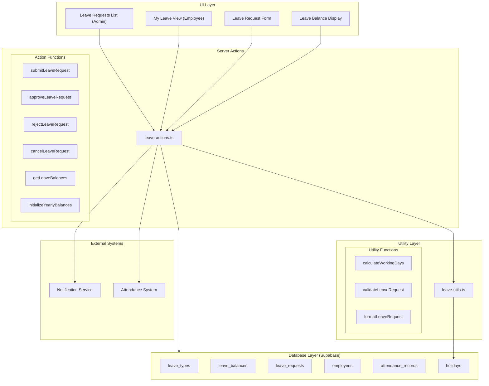
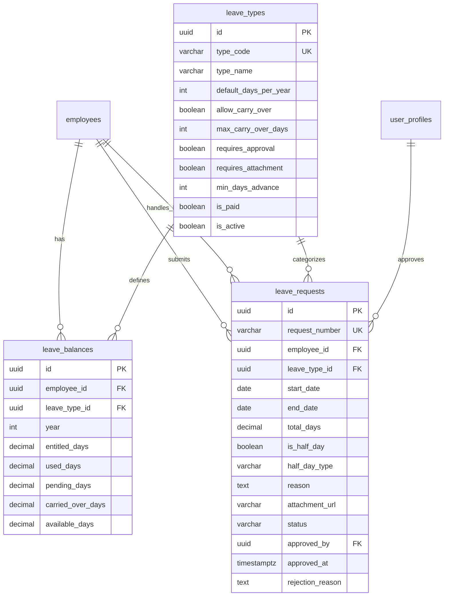
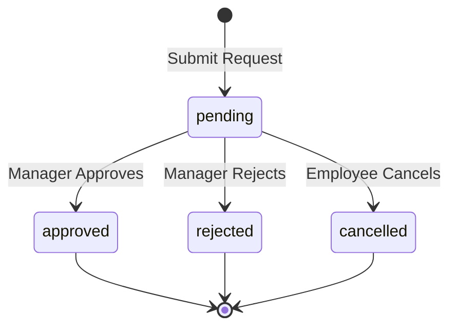

# Design Document: HR Leave Management

## Overview

The HR Leave Management module provides a comprehensive system for managing employee leave requests in Gama ERP. It supports multiple leave types with configurable rules, balance tracking with carry-over capabilities, an approval workflow, and integration with the attendance system.

The module consists of three main database tables (leave_types, leave_balances, leave_requests), utility functions for calculations and validations, server actions for CRUD operations, and React components for the user interface.

## Architecture



## Components and Interfaces

### Database Schema

#### leave_types Table
```sql
CREATE TABLE leave_types (
    id UUID PRIMARY KEY DEFAULT gen_random_uuid(),
    type_code VARCHAR(20) UNIQUE NOT NULL,
    type_name VARCHAR(100) NOT NULL,
    default_days_per_year INTEGER DEFAULT 12,
    allow_carry_over BOOLEAN DEFAULT FALSE,
    max_carry_over_days INTEGER DEFAULT 0,
    requires_approval BOOLEAN DEFAULT TRUE,
    requires_attachment BOOLEAN DEFAULT FALSE,
    min_days_advance INTEGER DEFAULT 1,
    is_paid BOOLEAN DEFAULT TRUE,
    is_active BOOLEAN DEFAULT TRUE,
    created_at TIMESTAMPTZ DEFAULT NOW()
);
```

#### leave_balances Table
```sql
CREATE TABLE leave_balances (
    id UUID PRIMARY KEY DEFAULT gen_random_uuid(),
    employee_id UUID NOT NULL REFERENCES employees(id),
    leave_type_id UUID NOT NULL REFERENCES leave_types(id),
    year INTEGER NOT NULL,
    entitled_days DECIMAL(4,1) NOT NULL,
    used_days DECIMAL(4,1) DEFAULT 0,
    pending_days DECIMAL(4,1) DEFAULT 0,
    carried_over_days DECIMAL(4,1) DEFAULT 0,
    available_days DECIMAL(4,1) GENERATED ALWAYS AS 
        (entitled_days + carried_over_days - used_days - pending_days) STORED,
    created_at TIMESTAMPTZ DEFAULT NOW(),
    updated_at TIMESTAMPTZ DEFAULT NOW(),
    UNIQUE(employee_id, leave_type_id, year)
);
```

#### leave_requests Table
```sql
CREATE TABLE leave_requests (
    id UUID PRIMARY KEY DEFAULT gen_random_uuid(),
    request_number VARCHAR(30) UNIQUE,
    employee_id UUID NOT NULL REFERENCES employees(id),
    leave_type_id UUID NOT NULL REFERENCES leave_types(id),
    start_date DATE NOT NULL,
    end_date DATE NOT NULL,
    total_days DECIMAL(4,1) NOT NULL,
    is_half_day BOOLEAN DEFAULT FALSE,
    half_day_type VARCHAR(10),
    reason TEXT,
    attachment_url VARCHAR(500),
    emergency_contact VARCHAR(200),
    handover_to UUID REFERENCES employees(id),
    handover_notes TEXT,
    status VARCHAR(20) DEFAULT 'pending',
    approved_by UUID REFERENCES user_profiles(id),
    approved_at TIMESTAMPTZ,
    rejection_reason TEXT,
    created_at TIMESTAMPTZ DEFAULT NOW(),
    updated_at TIMESTAMPTZ DEFAULT NOW()
);
```

### TypeScript Interfaces

```typescript
// types/leave.ts

export interface LeaveType {
  id: string;
  type_code: string;
  type_name: string;
  default_days_per_year: number;
  allow_carry_over: boolean;
  max_carry_over_days: number;
  requires_approval: boolean;
  requires_attachment: boolean;
  min_days_advance: number;
  is_paid: boolean;
  is_active: boolean;
  created_at: string;
}

export interface LeaveBalance {
  id: string;
  employee_id: string;
  leave_type_id: string;
  year: number;
  entitled_days: number;
  used_days: number;
  pending_days: number;
  carried_over_days: number;
  available_days: number;
  created_at: string;
  updated_at: string;
  leave_type?: LeaveType;
}

export interface LeaveRequest {
  id: string;
  request_number: string;
  employee_id: string;
  leave_type_id: string;
  start_date: string;
  end_date: string;
  total_days: number;
  is_half_day: boolean;
  half_day_type?: 'morning' | 'afternoon';
  reason?: string;
  attachment_url?: string;
  emergency_contact?: string;
  handover_to?: string;
  handover_notes?: string;
  status: 'pending' | 'approved' | 'rejected' | 'cancelled';
  approved_by?: string;
  approved_at?: string;
  rejection_reason?: string;
  created_at: string;
  updated_at: string;
  employee?: Employee;
  leave_type?: LeaveType;
  handover_employee?: Employee;
}

export interface LeaveRequestFormData {
  leave_type_id: string;
  start_date: string;
  end_date: string;
  is_half_day: boolean;
  half_day_type?: 'morning' | 'afternoon';
  reason?: string;
  emergency_contact?: string;
  handover_to?: string;
  handover_notes?: string;
  attachment_url?: string;
}

export type LeaveRequestStatus = 'pending' | 'approved' | 'rejected' | 'cancelled';
```

### Component Structure

```
components/leave/
├── leave-balance-cards.tsx      # Display balance summary cards
├── leave-request-form.tsx       # Form for submitting leave requests
├── leave-request-list.tsx       # List of leave requests (admin view)
├── leave-request-card.tsx       # Individual request card with actions
├── my-leave-view.tsx            # Employee's leave dashboard
├── leave-status-badge.tsx       # Status indicator badge
├── leave-type-select.tsx        # Dropdown for selecting leave type
├── approve-reject-dialog.tsx    # Dialog for approval/rejection
└── leave-filters.tsx            # Filter controls for list view
```

### Server Actions

```typescript
// app/(main)/hr/leave/actions.ts

'use server'

// Get all leave types
export async function getLeaveTypes(): Promise<LeaveType[]>

// Get leave balances for an employee
export async function getLeaveBalances(
  employeeId: string, 
  year?: number
): Promise<LeaveBalance[]>

// Initialize yearly balances for an employee
export async function initializeYearlyBalances(
  employeeId: string, 
  year: number
): Promise<void>

// Submit a new leave request
export async function submitLeaveRequest(
  employeeId: string,
  data: LeaveRequestFormData
): Promise<{ success: boolean; data?: LeaveRequest; error?: string }>

// Approve a leave request
export async function approveLeaveRequest(
  requestId: string
): Promise<{ success: boolean; error?: string }>

// Reject a leave request
export async function rejectLeaveRequest(
  requestId: string,
  reason: string
): Promise<{ success: boolean; error?: string }>

// Cancel a leave request
export async function cancelLeaveRequest(
  requestId: string
): Promise<{ success: boolean; error?: string }>

// Get leave requests with filters
export async function getLeaveRequests(
  filters?: LeaveRequestFilters
): Promise<LeaveRequest[]>

// Get employee's leave requests
export async function getMyLeaveRequests(
  employeeId: string
): Promise<LeaveRequest[]>
```

### Utility Functions

```typescript
// lib/leave-utils.ts

// Calculate working days between two dates (excluding weekends and holidays)
export function calculateWorkingDays(
  startDate: string,
  endDate: string,
  holidays: string[]
): number

// Validate a leave request before submission
export function validateLeaveRequest(
  data: LeaveRequestFormData,
  leaveType: LeaveType,
  balance: LeaveBalance
): { valid: boolean; errors: string[] }

// Format leave request for display
export function formatLeaveRequest(request: LeaveRequest): FormattedLeaveRequest

// Check if a date is a working day
export function isWorkingDay(date: Date, holidays: string[]): boolean

// Get dates between start and end (inclusive)
export function getDateRange(startDate: string, endDate: string): string[]

// Calculate carry-over days for year transition
export function calculateCarryOver(
  balance: LeaveBalance,
  leaveType: LeaveType
): number
```

## Data Models

### Entity Relationship Diagram



### State Transitions



### Default Leave Types Data

| Type Code | Type Name | Days/Year | Carry Over | Attachment | Advance Notice |
|-----------|-----------|-----------|------------|------------|----------------|
| annual | Annual Leave (Cuti Tahunan) | 12 | No | No | 3 days |
| sick | Sick Leave (Sakit) | 14 | No | Yes | 0 days |
| maternity | Maternity Leave | 90 | No | Yes | 30 days |
| paternity | Paternity Leave | 3 | No | No | 7 days |
| marriage | Marriage Leave | 3 | No | No | 14 days |
| bereavement | Bereavement Leave | 3 | No | No | 0 days |
| unpaid | Unpaid Leave | 0 | No | No | 7 days |


## Correctness Properties

*A property is a characteristic or behavior that should hold true across all valid executions of a system—essentially, a formal statement about what the system should do. Properties serve as the bridge between human-readable specifications and machine-verifiable correctness guarantees.*

### Property 1: Available Balance Calculation

*For any* leave balance with entitled_days, carried_over_days, used_days, and pending_days, the available_days SHALL equal entitled_days + carried_over_days - used_days - pending_days.

**Validates: Requirements 2.2**

### Property 2: Working Days Calculation Excludes Non-Working Days

*For any* date range and list of holidays, the calculateWorkingDays function SHALL return a count that excludes all Saturdays, Sundays, and dates in the holiday list.

**Validates: Requirements 3.3, 3.4**

### Property 3: Balance Validation Rejects Insufficient Balance

*For any* leave request where total_days exceeds the employee's available_days for that leave type, the submission SHALL fail with an error indicating the available balance.

**Validates: Requirements 3.6, 3.7**

### Property 4: Successful Submission Updates Pending Days

*For any* successfully submitted leave request with total_days = N, the employee's pending_days for that leave type SHALL increase by exactly N.

**Validates: Requirements 3.8**

### Property 5: Approval Moves Days from Pending to Used

*For any* approved leave request with total_days = N, the employee's pending_days SHALL decrease by N and used_days SHALL increase by N, keeping available_days unchanged.

**Validates: Requirements 4.4**

### Property 6: Rejection Returns Pending Days

*For any* rejected leave request with total_days = N, the employee's pending_days SHALL decrease by N and available_days SHALL increase by N.

**Validates: Requirements 4.7**

### Property 7: Cancellation Returns Pending Days and Updates Status

*For any* cancelled leave request with total_days = N, the status SHALL be 'cancelled' and the employee's pending_days SHALL decrease by N.

**Validates: Requirements 5.2, 5.3**

### Property 8: Only Pending Requests Can Be Cancelled

*For any* leave request with status other than 'pending', attempting to cancel SHALL fail.

**Validates: Requirements 5.1, 5.4**

### Property 9: Advance Notice Validation

*For any* leave request, if the leave type requires min_days_advance = M, then requests with start_date less than M days from submission date SHALL be rejected.

**Validates: Requirements 1.4, 1.5**

### Property 10: Attachment Requirement Validation

*For any* leave request where the leave type has requires_attachment = true, submission without an attachment_url SHALL fail.

**Validates: Requirements 1.3, 8.1**

### Property 11: Request Number Format

*For any* created leave request, the request_number SHALL match the pattern LV-YYYY-NNNN where YYYY is the current year and NNNN is a zero-padded sequential number.

**Validates: Requirements 3.2**

### Property 12: Carry-Over Calculation

*For any* leave balance at year-end where the leave type allows carry-over, the carried_over_days for the next year SHALL equal min(unused_days, max_carry_over_days).

**Validates: Requirements 2.4**

### Property 13: Half-Day Support

*For any* half-day leave request, total_days SHALL equal 0.5 and half_day_type SHALL be either 'morning' or 'afternoon'.

**Validates: Requirements 2.5, 3.5**

### Property 14: Filter Results Accuracy

*For any* filter criteria applied to leave requests, all returned results SHALL match all specified filter conditions.

**Validates: Requirements 6.2**

## Error Handling

### Validation Errors

| Error Condition | Error Message | HTTP Status |
|-----------------|---------------|-------------|
| Insufficient balance | "Insufficient leave balance. Available: {N} days" | 400 |
| Advance notice not met | "Leave must be requested at least {N} days in advance" | 400 |
| Missing required attachment | "Medical certificate is required for sick leave" | 400 |
| Invalid date range | "End date must be on or after start date" | 400 |
| Request not found | "Leave request not found" | 404 |
| Cannot cancel approved request | "Cannot cancel an already approved request" | 400 |
| Missing rejection reason | "Rejection reason is required" | 400 |

### Database Errors

- Connection failures: Retry with exponential backoff, return generic error to user
- Constraint violations: Map to user-friendly messages
- Transaction failures: Rollback and return error

### Edge Cases

1. **Year boundary requests**: Leave spanning Dec 31 - Jan 1 should be split or handled as single request based on business rules
2. **Concurrent approvals**: Use database transactions to prevent race conditions
3. **Balance initialization race**: Use upsert with conflict handling
4. **Holiday updates**: Recalculate affected pending requests if holidays change

## Testing Strategy

### Unit Tests

Unit tests will verify specific examples and edge cases:

1. **Working days calculation**
   - Date range with no weekends
   - Date range spanning multiple weeks
   - Date range with holidays
   - Single day (weekday vs weekend)
   - Half-day requests

2. **Balance calculations**
   - Standard calculation
   - With carry-over
   - Edge case: all days used
   - Edge case: negative available (should not occur)

3. **Validation functions**
   - Valid request passes
   - Insufficient balance fails
   - Advance notice validation
   - Attachment requirement validation

### Property-Based Tests

Property-based tests will use **fast-check** library to verify universal properties across many generated inputs.

Configuration:
- Minimum 100 iterations per property test
- Each test tagged with: **Feature: hr-leave-management, Property {number}: {property_text}**

Properties to implement:
1. Balance calculation formula (Property 1)
2. Working days excludes weekends/holidays (Property 2)
3. Balance validation (Property 3)
4. Pending days update on submission (Property 4)
5. Approval balance transfer (Property 5)
6. Rejection balance return (Property 6)
7. Cancellation behavior (Property 7)
8. Status-based cancellation permission (Property 8)
9. Advance notice validation (Property 9)
10. Attachment requirement (Property 10)
11. Request number format (Property 11)
12. Carry-over calculation (Property 12)
13. Half-day support (Property 13)
14. Filter accuracy (Property 14)

### Integration Tests

1. **Full request lifecycle**: Submit → Approve → Verify attendance marked
2. **Rejection flow**: Submit → Reject → Verify balance restored
3. **Cancellation flow**: Submit → Cancel → Verify balance restored
4. **Year-end carry-over**: Initialize balances → Verify carry-over amounts

### Test File Structure

```
__tests__/
├── leave-utils.test.ts           # Unit tests for utility functions
├── leave-utils.property.test.ts  # Property-based tests
├── leave-actions.test.ts         # Server action tests
└── leave-integration.test.ts     # Integration tests
```
