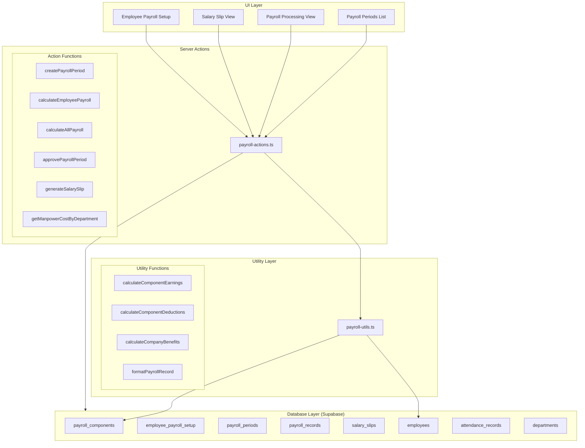
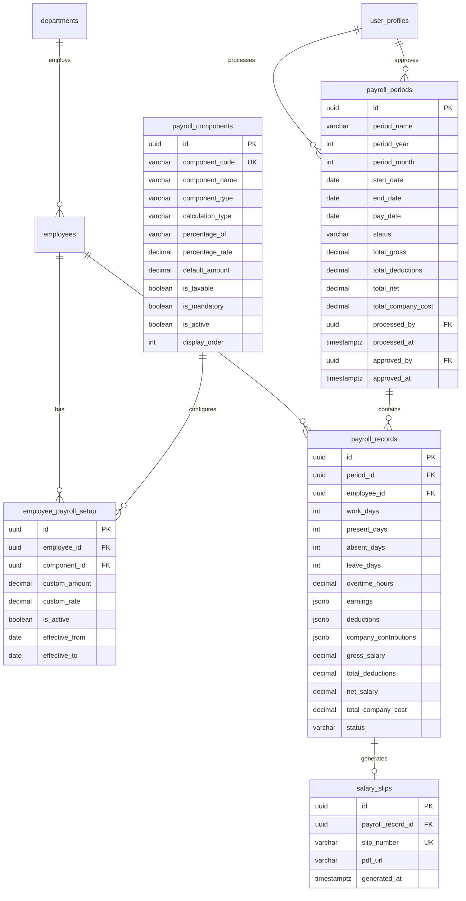
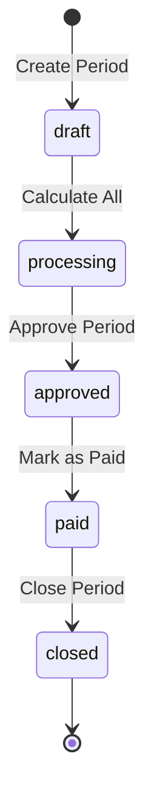

# Design Document: HR Basic Payroll

## Overview

The HR Basic Payroll module provides salary calculation, payroll processing, and salary slip generation for Gama ERP. It supports configurable payroll components (earnings, deductions, benefits), integrates with attendance data, handles Indonesian statutory deductions (BPJS, PPh 21), and generates PDF salary slips.

The module consists of four main database tables (payroll_components, employee_payroll_setup, payroll_periods, payroll_records, salary_slips), utility functions for calculations, server actions for CRUD operations, and React components for the user interface.

## Architecture



## Components and Interfaces

### Database Schema

#### payroll_components Table
```sql
CREATE TABLE payroll_components (
    id UUID PRIMARY KEY DEFAULT gen_random_uuid(),
    component_code VARCHAR(30) UNIQUE NOT NULL,
    component_name VARCHAR(100) NOT NULL,
    component_type VARCHAR(20) NOT NULL, -- 'earning', 'deduction', 'benefit'
    calculation_type VARCHAR(20) DEFAULT 'fixed', -- 'fixed', 'percentage', 'formula'
    percentage_of VARCHAR(30), -- 'base_salary', 'gross_salary'
    percentage_rate DECIMAL(5,2),
    default_amount DECIMAL(15,2),
    is_taxable BOOLEAN DEFAULT TRUE,
    is_mandatory BOOLEAN DEFAULT FALSE,
    is_active BOOLEAN DEFAULT TRUE,
    display_order INTEGER DEFAULT 0,
    created_at TIMESTAMPTZ DEFAULT NOW()
);
```

#### employee_payroll_setup Table
```sql
CREATE TABLE employee_payroll_setup (
    id UUID PRIMARY KEY DEFAULT gen_random_uuid(),
    employee_id UUID NOT NULL REFERENCES employees(id),
    component_id UUID NOT NULL REFERENCES payroll_components(id),
    custom_amount DECIMAL(15,2),
    custom_rate DECIMAL(5,2),
    is_active BOOLEAN DEFAULT TRUE,
    effective_from DATE,
    effective_to DATE,
    created_at TIMESTAMPTZ DEFAULT NOW(),
    UNIQUE(employee_id, component_id)
);
```

#### payroll_periods Table
```sql
CREATE TABLE payroll_periods (
    id UUID PRIMARY KEY DEFAULT gen_random_uuid(),
    period_name VARCHAR(50) NOT NULL,
    period_year INTEGER NOT NULL,
    period_month INTEGER NOT NULL,
    start_date DATE NOT NULL,
    end_date DATE NOT NULL,
    pay_date DATE NOT NULL,
    status VARCHAR(20) DEFAULT 'draft', -- 'draft', 'processing', 'approved', 'paid', 'closed'
    total_gross DECIMAL(18,2) DEFAULT 0,
    total_deductions DECIMAL(18,2) DEFAULT 0,
    total_net DECIMAL(18,2) DEFAULT 0,
    total_company_cost DECIMAL(18,2) DEFAULT 0,
    processed_by UUID REFERENCES user_profiles(id),
    processed_at TIMESTAMPTZ,
    approved_by UUID REFERENCES user_profiles(id),
    approved_at TIMESTAMPTZ,
    created_at TIMESTAMPTZ DEFAULT NOW(),
    UNIQUE(period_year, period_month)
);
```

#### payroll_records Table
```sql
CREATE TABLE payroll_records (
    id UUID PRIMARY KEY DEFAULT gen_random_uuid(),
    period_id UUID NOT NULL REFERENCES payroll_periods(id),
    employee_id UUID NOT NULL REFERENCES employees(id),
    work_days INTEGER DEFAULT 0,
    present_days INTEGER DEFAULT 0,
    absent_days INTEGER DEFAULT 0,
    leave_days INTEGER DEFAULT 0,
    overtime_hours DECIMAL(5,2) DEFAULT 0,
    earnings JSONB DEFAULT '[]', -- [{component_id, component_name, amount}]
    deductions JSONB DEFAULT '[]', -- [{component_id, component_name, amount}]
    company_contributions JSONB DEFAULT '[]', -- [{component_id, component_name, amount}]
    gross_salary DECIMAL(15,2) DEFAULT 0,
    total_deductions DECIMAL(15,2) DEFAULT 0,
    net_salary DECIMAL(15,2) DEFAULT 0,
    total_company_cost DECIMAL(15,2) DEFAULT 0,
    bank_name VARCHAR(100),
    bank_account VARCHAR(50),
    bank_account_name VARCHAR(100),
    status VARCHAR(20) DEFAULT 'calculated', -- 'calculated', 'approved', 'paid'
    notes TEXT,
    created_at TIMESTAMPTZ DEFAULT NOW(),
    UNIQUE(period_id, employee_id)
);
```

#### salary_slips Table
```sql
CREATE TABLE salary_slips (
    id UUID PRIMARY KEY DEFAULT gen_random_uuid(),
    payroll_record_id UUID NOT NULL REFERENCES payroll_records(id),
    slip_number VARCHAR(30) UNIQUE NOT NULL,
    pdf_url VARCHAR(500),
    generated_at TIMESTAMPTZ DEFAULT NOW()
);
```

### TypeScript Interfaces

```typescript
// types/payroll.ts

export type ComponentType = 'earning' | 'deduction' | 'benefit';
export type CalculationType = 'fixed' | 'percentage' | 'formula';
export type PayrollPeriodStatus = 'draft' | 'processing' | 'approved' | 'paid' | 'closed';
export type PayrollRecordStatus = 'calculated' | 'approved' | 'paid';

export interface PayrollComponent {
  id: string;
  component_code: string;
  component_name: string;
  component_type: ComponentType;
  calculation_type: CalculationType;
  percentage_of?: 'base_salary' | 'gross_salary';
  percentage_rate?: number;
  default_amount?: number;
  is_taxable: boolean;
  is_mandatory: boolean;
  is_active: boolean;
  display_order: number;
  created_at: string;
}

export interface EmployeePayrollSetup {
  id: string;
  employee_id: string;
  component_id: string;
  custom_amount?: number;
  custom_rate?: number;
  is_active: boolean;
  effective_from?: string;
  effective_to?: string;
  created_at: string;
  component?: PayrollComponent;
}

export interface PayrollPeriod {
  id: string;
  period_name: string;
  period_year: number;
  period_month: number;
  start_date: string;
  end_date: string;
  pay_date: string;
  status: PayrollPeriodStatus;
  total_gross: number;
  total_deductions: number;
  total_net: number;
  total_company_cost: number;
  processed_by?: string;
  processed_at?: string;
  approved_by?: string;
  approved_at?: string;
  created_at: string;
  employee_count?: number;
}

export interface PayrollComponentItem {
  component_id: string;
  component_name: string;
  amount: number;
}

export interface PayrollRecord {
  id: string;
  period_id: string;
  employee_id: string;
  work_days: number;
  present_days: number;
  absent_days: number;
  leave_days: number;
  overtime_hours: number;
  earnings: PayrollComponentItem[];
  deductions: PayrollComponentItem[];
  company_contributions: PayrollComponentItem[];
  gross_salary: number;
  total_deductions: number;
  net_salary: number;
  total_company_cost: number;
  bank_name?: string;
  bank_account?: string;
  bank_account_name?: string;
  status: PayrollRecordStatus;
  notes?: string;
  created_at: string;
  employee?: Employee;
  period?: PayrollPeriod;
}

export interface SalarySlip {
  id: string;
  payroll_record_id: string;
  slip_number: string;
  pdf_url?: string;
  generated_at: string;
  payroll_record?: PayrollRecord;
}

export interface PayrollPeriodFormData {
  period_year: number;
  period_month: number;
  pay_date: string;
}

export interface DepartmentManpowerCost {
  department_id: string;
  department_name: string;
  employee_count: number;
  total_gross: number;
  total_net: number;
  total_company_cost: number;
}

export interface PayrollSummary {
  total_gross: number;
  total_deductions: number;
  total_net: number;
  total_company_cost: number;
  employee_count: number;
}
```

### Component Structure

```
components/payroll/
├── payroll-period-list.tsx       # List of payroll periods
├── payroll-period-form.tsx       # Form for creating new period
├── payroll-processing-view.tsx   # Period processing with employee records
├── payroll-summary-cards.tsx     # Summary statistics cards
├── payroll-record-table.tsx      # Table of employee payroll records
├── payroll-record-detail.tsx     # Detailed view of single record
├── salary-slip-preview.tsx       # Preview salary slip before PDF
├── employee-payroll-setup.tsx    # Configure employee-specific components
└── payroll-status-badge.tsx      # Status indicator badge
```

### Server Actions

```typescript
// app/(main)/hr/payroll/actions.ts

'use server'

// Get all payroll components
export async function getPayrollComponents(): Promise<PayrollComponent[]>

// Get employee payroll setup
export async function getEmployeePayrollSetup(
  employeeId: string
): Promise<EmployeePayrollSetup[]>

// Update employee payroll setup
export async function updateEmployeePayrollSetup(
  employeeId: string,
  componentId: string,
  data: { custom_amount?: number; custom_rate?: number }
): Promise<{ success: boolean; error?: string }>

// Get all payroll periods
export async function getPayrollPeriods(): Promise<PayrollPeriod[]>

// Create a new payroll period
export async function createPayrollPeriod(
  data: PayrollPeriodFormData
): Promise<{ success: boolean; data?: PayrollPeriod; error?: string }>

// Get payroll period with records
export async function getPayrollPeriodWithRecords(
  periodId: string
): Promise<{ period: PayrollPeriod; records: PayrollRecord[] }>

// Calculate single employee payroll
export async function calculateEmployeePayroll(
  periodId: string,
  employeeId: string
): Promise<{ success: boolean; data?: PayrollRecord; error?: string }>

// Calculate all employees for period
export async function calculateAllPayroll(
  periodId: string
): Promise<{ success: boolean; count: number; error?: string }>

// Approve payroll period
export async function approvePayrollPeriod(
  periodId: string
): Promise<{ success: boolean; error?: string }>

// Generate salary slip PDF
export async function generateSalarySlip(
  payrollRecordId: string
): Promise<{ success: boolean; data?: SalarySlip; error?: string }>

// Get manpower cost by department
export async function getManpowerCostByDepartment(
  year: number,
  month: number
): Promise<DepartmentManpowerCost[]>
```

### Utility Functions

```typescript
// lib/payroll-utils.ts

// Calculate earnings for an employee
export function calculateEarnings(
  baseSalary: number,
  components: PayrollComponent[],
  employeeSetup: EmployeePayrollSetup[],
  overtimeHours: number
): PayrollComponentItem[]

// Calculate deductions for an employee
export function calculateDeductions(
  grossSalary: number,
  baseSalary: number,
  components: PayrollComponent[],
  employeeSetup: EmployeePayrollSetup[]
): PayrollComponentItem[]

// Calculate company contributions
export function calculateCompanyContributions(
  grossSalary: number,
  baseSalary: number,
  components: PayrollComponent[],
  employeeSetup: EmployeePayrollSetup[]
): PayrollComponentItem[]

// Calculate BPJS amounts
export function calculateBPJS(
  baseSalary: number,
  type: 'kesehatan' | 'jht' | 'jp' | 'jkk' | 'jkm',
  isEmployee: boolean
): number

// Format currency for display
export function formatPayrollCurrency(amount: number): string

// Generate period name from year/month
export function generatePeriodName(year: number, month: number): string

// Get attendance summary for payroll
export function getAttendanceSummary(
  attendanceRecords: AttendanceRecord[],
  startDate: string,
  endDate: string
): { workDays: number; presentDays: number; absentDays: number; leaveDays: number; overtimeHours: number }

// Validate payroll period data
export function validatePayrollPeriod(
  data: PayrollPeriodFormData
): { valid: boolean; errors: string[] }
```

## Data Models

### Entity Relationship Diagram



### State Transitions



### Default Payroll Components Data

| Code | Name | Type | Calc Type | Rate/Amount | Mandatory |
|------|------|------|-----------|-------------|-----------|
| base_salary | Base Salary (Gaji Pokok) | earning | fixed | - | Yes |
| transport | Transport Allowance | earning | fixed | - | No |
| meal | Meal Allowance | earning | fixed | - | No |
| position | Position Allowance | earning | fixed | - | No |
| overtime | Overtime Pay | earning | formula | - | No |
| bpjs_kes_emp | BPJS Kesehatan (Employee) | deduction | percentage | 1% | Yes |
| bpjs_jht_emp | BPJS JHT (Employee 2%) | deduction | percentage | 2% | Yes |
| bpjs_jp_emp | BPJS JP (Employee 1%) | deduction | percentage | 1% | Yes |
| pph21 | PPh 21 (Income Tax) | deduction | formula | - | Yes |
| bpjs_kes_com | BPJS Kesehatan (Company) | benefit | percentage | 4% | Yes |
| bpjs_jht_com | BPJS JHT (Company 3.7%) | benefit | percentage | 3.7% | Yes |
| bpjs_jkk | BPJS JKK (Company) | benefit | percentage | 0.24% | Yes |
| bpjs_jkm | BPJS JKM (Company) | benefit | percentage | 0.3% | Yes |

## Correctness Properties

### Property 1: Gross Salary Calculation

*For any* payroll record, the gross_salary SHALL equal the sum of all amounts in the earnings array.

**Validates: Requirements 4.5**

### Property 2: Net Salary Calculation

*For any* payroll record, the net_salary SHALL equal gross_salary minus total_deductions.

**Validates: Requirements 4.7**

### Property 3: Total Deductions Calculation

*For any* payroll record, the total_deductions SHALL equal the sum of all amounts in the deductions array.

**Validates: Requirements 4.6**

### Property 4: Company Cost Calculation

*For any* payroll record, the total_company_cost SHALL equal gross_salary plus the sum of all amounts in the company_contributions array.

**Validates: Requirements 4.8**

### Property 5: Percentage Component Calculation

*For any* percentage-based component with percentage_of = 'base_salary' and percentage_rate = R, the calculated amount SHALL equal base_salary * (R / 100).

**Validates: Requirements 4.9**

### Property 6: Period Totals Accuracy

*For any* payroll period, the total_gross SHALL equal the sum of gross_salary from all payroll_records in that period.

**Validates: Requirements 3.4**

### Property 7: Unique Period Constraint

*For any* two payroll periods, if period_year and period_month are equal, they SHALL be the same period (no duplicates).

**Validates: Requirements 3.2**

### Property 8: Approved Period Immutability

*For any* payroll period with status = 'approved', 'paid', or 'closed', modifications to payroll_records SHALL be rejected.

**Validates: Requirements 6.4**

### Property 9: Slip Number Format

*For any* salary slip, the slip_number SHALL match the pattern SLIP-YYYY-MM-NNNN where YYYY is the year, MM is the month, and NNNN is a zero-padded sequential number.

**Validates: Requirements 7.1**

### Property 10: BPJS Calculation Accuracy

*For any* BPJS component calculation, the amount SHALL be calculated using the correct statutory rate applied to the appropriate base.

**Validates: Requirements 1.5, 1.6**

## Error Handling

### Validation Errors

| Error Condition | Error Message | HTTP Status |
|-----------------|---------------|-------------|
| Period already exists | "Payroll period for {month}/{year} already exists" | 400 |
| Period not found | "Payroll period not found" | 404 |
| Employee not found | "Employee not found" | 404 |
| Period already approved | "Cannot modify an approved payroll period" | 400 |
| No active employees | "No active employees found for payroll calculation" | 400 |
| Invalid date range | "Pay date must be after period end date" | 400 |
| Record already exists | "Payroll record already exists for this employee" | 400 |

### Database Errors

- Connection failures: Retry with exponential backoff, return generic error to user
- Constraint violations: Map to user-friendly messages
- Transaction failures: Rollback and return error

### Edge Cases

1. **Employee with no base salary**: Use 0 as base, skip percentage calculations
2. **Mid-month joiners**: Prorate salary based on actual work days
3. **Terminated employees**: Include in payroll if termination is after period start
4. **Missing attendance data**: Default to full work days or flag for review
5. **Concurrent calculations**: Use database transactions to prevent race conditions

## Testing Strategy

### Unit Tests

1. **Earnings calculation**
   - Fixed amount components
   - Percentage-based components
   - Overtime calculation
   - Employee-specific overrides

2. **Deductions calculation**
   - BPJS employee contributions
   - PPh 21 calculation
   - Custom deductions

3. **Company contributions**
   - BPJS company contributions
   - Total company cost

4. **Period management**
   - Period name generation
   - Date validation
   - Status transitions

### Property-Based Tests

Configuration:
- Minimum 100 iterations per property test
- Each test tagged with: **Feature: hr-payroll, Property {number}: {property_text}**

Properties to implement:
1. Gross salary = sum of earnings (Property 1)
2. Net salary = gross - deductions (Property 2)
3. Total deductions = sum of deductions (Property 3)
4. Company cost = gross + benefits (Property 4)
5. Percentage calculation accuracy (Property 5)
6. Period totals accuracy (Property 6)
7. Unique period constraint (Property 7)
8. Approved period immutability (Property 8)
9. Slip number format (Property 9)
10. BPJS calculation accuracy (Property 10)

### Integration Tests

1. **Full payroll cycle**: Create period → Calculate all → Approve → Generate slips
2. **Employee-specific setup**: Configure custom amounts → Calculate → Verify
3. **Department cost report**: Calculate payroll → Get department costs → Verify totals

### Test File Structure

```
__tests__/
├── payroll-utils.test.ts           # Unit tests for utility functions
├── payroll-utils.property.test.ts  # Property-based tests
├── payroll-actions.test.ts         # Server action tests
└── payroll-integration.test.ts     # Integration tests
```

