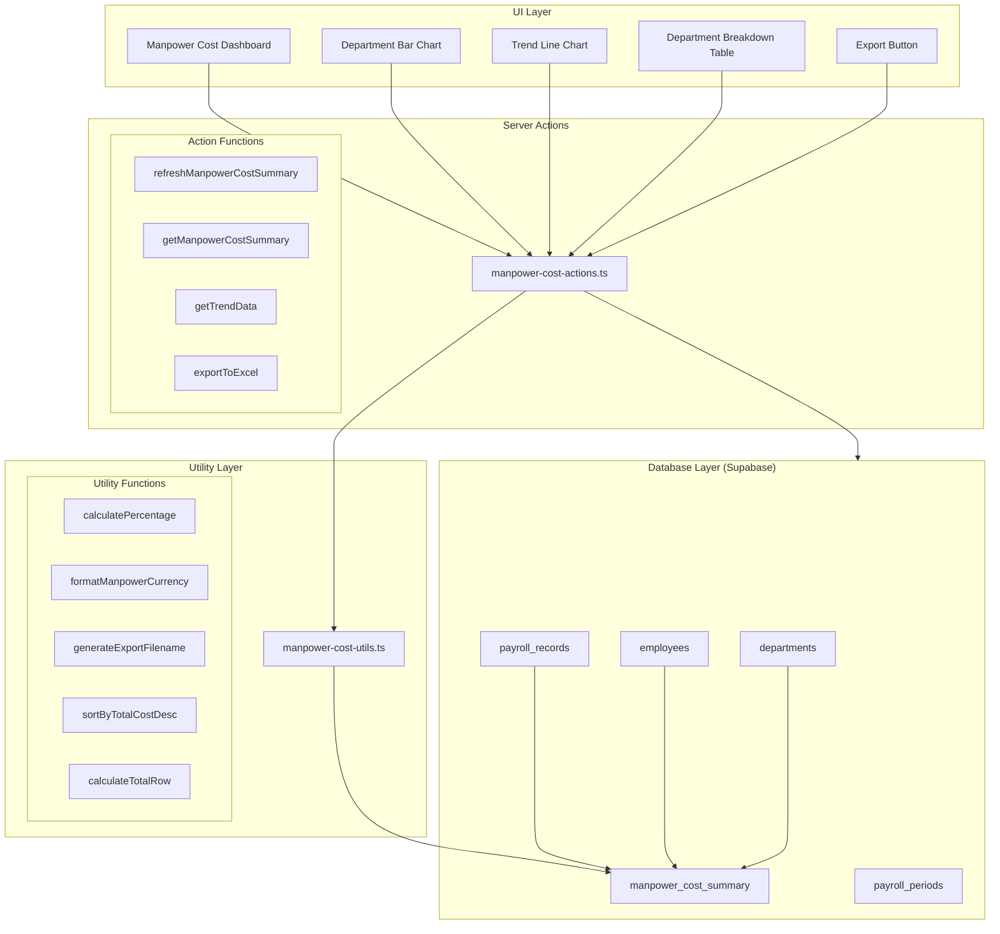
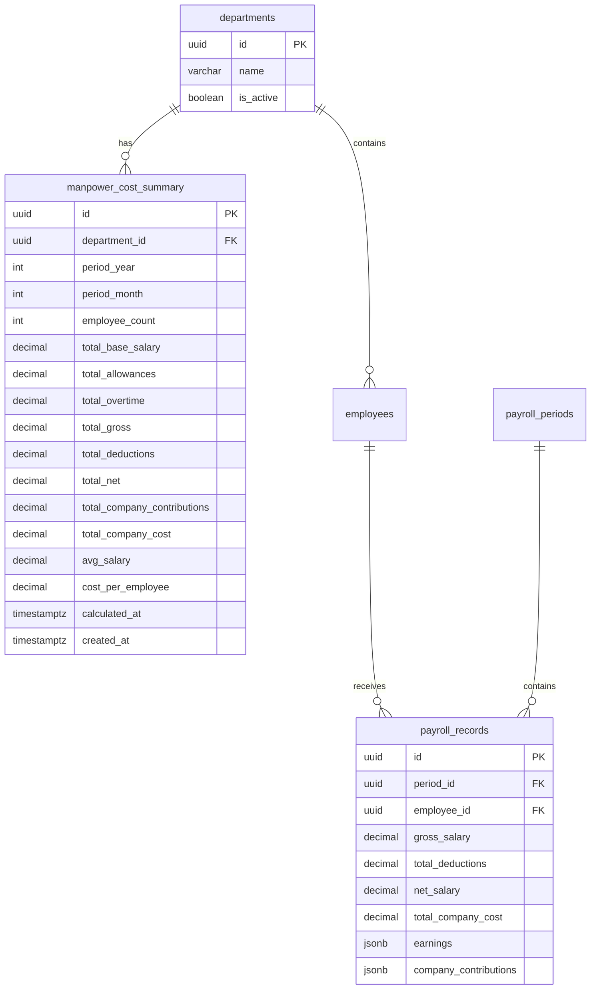
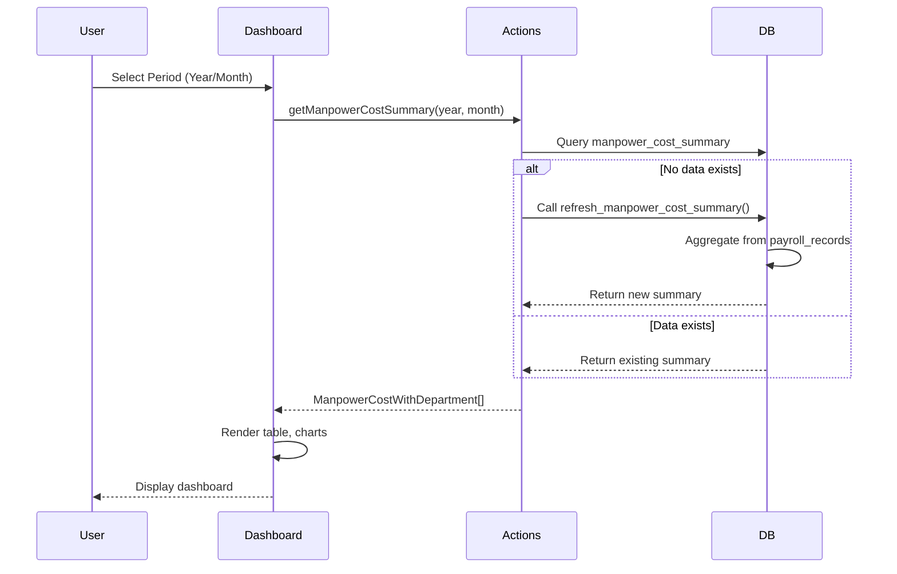

# Design Document: HR Manpower Cost Tracking

## Overview

The HR Manpower Cost Tracking module provides labor cost analysis by department for overhead allocation purposes. It aggregates payroll data from the existing payroll_records table into a materialized summary table (manpower_cost_summary) for fast queries. The module includes a dashboard with visualizations (bar chart for cost distribution, line chart for trends), department breakdown table, and Excel export functionality.

This module builds on v0.31 HR Basic Payroll and feeds into the overhead allocation system (v0.26).

## Architecture



## Components and Interfaces

### Database Schema

#### manpower_cost_summary Table
```sql
CREATE TABLE manpower_cost_summary (
    id UUID PRIMARY KEY DEFAULT gen_random_uuid(),
    department_id UUID NOT NULL REFERENCES departments(id),
    period_year INTEGER NOT NULL,
    period_month INTEGER NOT NULL,
    -- Head count
    employee_count INTEGER DEFAULT 0,
    -- Cost breakdown
    total_base_salary DECIMAL(18,2) DEFAULT 0,
    total_allowances DECIMAL(18,2) DEFAULT 0,
    total_overtime DECIMAL(18,2) DEFAULT 0,
    total_gross DECIMAL(18,2) DEFAULT 0,
    total_deductions DECIMAL(18,2) DEFAULT 0,
    total_net DECIMAL(18,2) DEFAULT 0,
    total_company_contributions DECIMAL(18,2) DEFAULT 0,
    total_company_cost DECIMAL(18,2) DEFAULT 0,
    -- Averages
    avg_salary DECIMAL(15,2) DEFAULT 0,
    cost_per_employee DECIMAL(15,2) DEFAULT 0,
    -- Metadata
    calculated_at TIMESTAMPTZ,
    created_at TIMESTAMPTZ DEFAULT NOW(),
    UNIQUE(department_id, period_year, period_month)
);

-- Indexes for query performance
CREATE INDEX idx_manpower_cost_period ON manpower_cost_summary(period_year, period_month);
CREATE INDEX idx_manpower_cost_dept ON manpower_cost_summary(department_id);
```

#### Refresh Function
```sql
CREATE OR REPLACE FUNCTION refresh_manpower_cost_summary(
    p_year INTEGER,
    p_month INTEGER
) RETURNS void AS $$
BEGIN
    -- Delete existing records for the period
    DELETE FROM manpower_cost_summary 
    WHERE period_year = p_year AND period_month = p_month;
    
    -- Insert fresh calculations from payroll data
    INSERT INTO manpower_cost_summary (
        department_id, period_year, period_month,
        employee_count, total_base_salary, total_allowances, total_overtime,
        total_gross, total_deductions, total_net,
        total_company_contributions, total_company_cost,
        avg_salary, cost_per_employee, calculated_at
    )
    SELECT 
        e.department_id,
        p_year,
        p_month,
        COUNT(DISTINCT pr.employee_id),
        SUM(COALESCE((
            SELECT SUM((item->>'amount')::DECIMAL)
            FROM jsonb_array_elements(pr.earnings) AS item
            WHERE item->>'component_code' = 'base_salary'
        ), 0)),
        SUM(COALESCE((
            SELECT SUM((item->>'amount')::DECIMAL)
            FROM jsonb_array_elements(pr.earnings) AS item
            WHERE item->>'component_code' IN ('transport', 'meal', 'position')
        ), 0)),
        SUM(COALESCE((
            SELECT SUM((item->>'amount')::DECIMAL)
            FROM jsonb_array_elements(pr.earnings) AS item
            WHERE item->>'component_code' = 'overtime'
        ), 0)),
        SUM(pr.gross_salary),
        SUM(pr.total_deductions),
        SUM(pr.net_salary),
        SUM(COALESCE((
            SELECT SUM((item->>'amount')::DECIMAL)
            FROM jsonb_array_elements(pr.company_contributions) AS item
        ), 0)),
        SUM(pr.total_company_cost),
        CASE WHEN COUNT(DISTINCT pr.employee_id) > 0 
             THEN SUM(pr.gross_salary) / COUNT(DISTINCT pr.employee_id) 
             ELSE 0 END,
        CASE WHEN COUNT(DISTINCT pr.employee_id) > 0 
             THEN SUM(pr.total_company_cost) / COUNT(DISTINCT pr.employee_id) 
             ELSE 0 END,
        NOW()
    FROM payroll_records pr
    JOIN employees e ON pr.employee_id = e.id
    JOIN payroll_periods pp ON pr.period_id = pp.id
    WHERE pp.period_year = p_year AND pp.period_month = p_month
    GROUP BY e.department_id;
END;
$$ LANGUAGE plpgsql;
```

#### RLS Policies
```sql
-- Enable RLS
ALTER TABLE manpower_cost_summary ENABLE ROW LEVEL SECURITY;

-- Policy for finance, manager, super_admin roles
CREATE POLICY "manpower_cost_summary_select" ON manpower_cost_summary
    FOR SELECT
    USING (
        EXISTS (
            SELECT 1 FROM user_profiles up
            WHERE up.id = auth.uid()
            AND up.role IN ('finance', 'manager', 'super_admin')
        )
    );

-- Policy for insert/update/delete (super_admin only)
CREATE POLICY "manpower_cost_summary_modify" ON manpower_cost_summary
    FOR ALL
    USING (
        EXISTS (
            SELECT 1 FROM user_profiles up
            WHERE up.id = auth.uid()
            AND up.role = 'super_admin'
        )
    );
```

### TypeScript Interfaces

```typescript
// types/manpower-cost.ts

export interface ManpowerCostSummary {
  id: string;
  department_id: string;
  period_year: number;
  period_month: number;
  employee_count: number;
  total_base_salary: number;
  total_allowances: number;
  total_overtime: number;
  total_gross: number;
  total_deductions: number;
  total_net: number;
  total_company_contributions: number;
  total_company_cost: number;
  avg_salary: number;
  cost_per_employee: number;
  calculated_at: string | null;
  created_at: string;
  department?: Department;
}

export interface ManpowerCostWithDepartment extends ManpowerCostSummary {
  department: {
    id: string;
    name: string;
  };
}

export interface ManpowerCostTotals {
  employee_count: number;
  total_base_salary: number;
  total_allowances: number;
  total_overtime: number;
  total_gross: number;
  total_deductions: number;
  total_net: number;
  total_company_contributions: number;
  total_company_cost: number;
  avg_salary: number;
  cost_per_employee: number;
}

export interface DepartmentCostPercentage {
  department_id: string;
  department_name: string;
  total_cost: number;
  percentage: number;
}

export interface ManpowerCostTrendPoint {
  period_year: number;
  period_month: number;
  month_label: string;
  total_company_cost: number;
}

export interface ManpowerCostExportRow {
  department: string;
  employee_count: number;
  base_salary: number;
  allowances: number;
  overtime: number;
  gross_salary: number;
  deductions: number;
  net_salary: number;
  company_contributions: number;
  total_company_cost: number;
  avg_salary: number;
  cost_per_employee: number;
}

export interface ManpowerCostFilters {
  year: number;
  month: number;
}
```

### Component Structure

```
components/manpower-cost/
├── manpower-cost-dashboard.tsx      # Main dashboard container
├── manpower-cost-header.tsx         # Period selector and export button
├── manpower-cost-summary-card.tsx   # Total company cost display
├── department-breakdown-table.tsx   # Table with department costs
├── cost-distribution-chart.tsx      # Horizontal bar chart
├── cost-trend-chart.tsx             # 6-month line chart
└── index.ts                         # Barrel export
```

### Server Actions

```typescript
// app/(main)/hr/manpower-cost/actions.ts

'use server'

// Refresh manpower cost summary for a period
export async function refreshManpowerCostSummary(
  year: number,
  month: number
): Promise<{ success: boolean; error?: string }>

// Get manpower cost summary for a period
export async function getManpowerCostSummary(
  year: number,
  month: number
): Promise<ManpowerCostWithDepartment[]>

// Get total company cost for a period
export async function getTotalCompanyCost(
  year: number,
  month: number
): Promise<number>

// Get cost trend data for last N months
export async function getCostTrendData(
  endYear: number,
  endMonth: number,
  months: number
): Promise<ManpowerCostTrendPoint[]>

// Calculate department cost percentages
export async function getDepartmentCostPercentages(
  year: number,
  month: number
): Promise<DepartmentCostPercentage[]>

// Export manpower cost data to Excel
export async function exportManpowerCostToExcel(
  year: number,
  month: number
): Promise<{ success: boolean; data?: Blob; filename?: string; error?: string }>

// Get manpower cost for overhead allocation
export async function getManpowerCostForOverhead(
  year: number,
  month: number
): Promise<ManpowerCostSummary[]>
```

### Utility Functions

```typescript
// lib/manpower-cost-utils.ts

// Calculate percentage of total
export function calculatePercentage(
  departmentCost: number,
  totalCost: number
): number

// Format currency in Indonesian Rupiah
export function formatManpowerCurrency(amount: number): string

// Generate export filename
export function generateExportFilename(year: number, month: number): string

// Sort departments by total cost descending
export function sortByTotalCostDesc(
  departments: ManpowerCostWithDepartment[]
): ManpowerCostWithDepartment[]

// Calculate total row from department summaries
export function calculateTotalRow(
  summaries: ManpowerCostSummary[]
): ManpowerCostTotals

// Get month abbreviation for chart labels
export function getMonthAbbreviation(month: number): string

// Format large numbers for chart axis (e.g., 180M)
export function formatChartAxisValue(value: number): string

// Validate period parameters
export function validatePeriod(year: number, month: number): boolean

// Get last N months from a given period
export function getLastNMonths(
  endYear: number,
  endMonth: number,
  count: number
): Array<{ year: number; month: number }>
```

## Data Models

### Entity Relationship Diagram



### Data Flow



## Correctness Properties

*A property is a characteristic or behavior that should hold true across all valid executions of a system-essentially, a formal statement about what the system should do. Properties serve as the bridge between human-readable specifications and machine-verifiable correctness guarantees.*

### Property 1: Refresh Idempotence

*For any* period (year, month), calling refreshManpowerCostSummary twice in succession SHALL produce the same result as calling it once - the summary data should be identical.

**Validates: Requirements 2.2**

### Property 2: Aggregation Sum Correctness

*For any* set of payroll records in a department for a given period, the manpower_cost_summary totals (total_gross, total_deductions, total_net, total_company_cost) SHALL equal the sum of the corresponding fields from all payroll_records in that department.

**Validates: Requirements 2.5, 2.6, 2.7, 2.8**

### Property 3: Distinct Employee Count

*For any* department and period, the employee_count in manpower_cost_summary SHALL equal the count of distinct employee_ids in payroll_records for that department and period.

**Validates: Requirements 2.4**

### Property 4: Average Calculation Correctness

*For any* manpower_cost_summary record where employee_count > 0:
- avg_salary SHALL equal total_gross / employee_count
- cost_per_employee SHALL equal total_company_cost / employee_count

**Validates: Requirements 2.9, 2.10**

### Property 5: Total Row Calculation

*For any* set of department summaries, the calculateTotalRow function SHALL return totals where each sum field equals the sum of that field across all input summaries.

**Validates: Requirements 3.5**

### Property 6: Percentage Calculation

*For any* department cost and company total cost where total > 0, calculatePercentage(departmentCost, totalCost) SHALL return (departmentCost / totalCost) * 100.

**Validates: Requirements 4.2**

### Property 7: Department Ordering

*For any* array of department summaries, sortByTotalCostDesc SHALL return an array where each element's total_company_cost is greater than or equal to the next element's total_company_cost.

**Validates: Requirements 4.4**

### Property 8: Currency Formatting

*For any* non-negative number, formatManpowerCurrency SHALL return a string that starts with "Rp " and contains properly formatted digits with thousand separators.

**Validates: Requirements 3.6**

### Property 9: Export Filename Format

*For any* valid year (2000-2099) and month (1-12), generateExportFilename SHALL return a string matching the pattern "manpower-cost-{year}-{month}.xlsx" where month is zero-padded to 2 digits.

**Validates: Requirements 6.5**

## Error Handling

### Validation Errors

| Error Condition | Error Message | HTTP Status |
|-----------------|---------------|-------------|
| Invalid year | "Year must be between 2000 and 2099" | 400 |
| Invalid month | "Month must be between 1 and 12" | 400 |
| No payroll data | "No payroll data found for the specified period" | 404 |
| Unauthorized access | "You do not have permission to view manpower costs" | 403 |
| Export not allowed | "You do not have permission to export data" | 403 |

### Database Errors

- Connection failures: Retry with exponential backoff, return generic error to user
- Refresh function failure: Log error, return user-friendly message
- Missing department reference: Skip record, log warning

### Edge Cases

1. **No payroll data for period**: Display empty state with message
2. **Department with no employees**: Skip in summary (handled by GROUP BY)
3. **Division by zero**: Return 0 for avg_salary and cost_per_employee when employee_count is 0
4. **Missing trend data**: Fill gaps with zero values or skip months
5. **Very large numbers**: Use DECIMAL(18,2) to handle up to quadrillions

## Testing Strategy

### Unit Tests

1. **Utility functions**
   - calculatePercentage with various inputs
   - formatManpowerCurrency with edge cases (0, large numbers, decimals)
   - generateExportFilename format validation
   - sortByTotalCostDesc ordering verification
   - calculateTotalRow sum accuracy
   - getMonthAbbreviation for all months
   - formatChartAxisValue for various magnitudes

2. **Data transformation**
   - Converting database records to display format
   - Aggregating department data for charts

### Property-Based Tests

Configuration:
- Minimum 100 iterations per property test
- Each test tagged with: **Feature: hr-manpower-cost-tracking, Property {number}: {property_text}**

Properties to implement:
1. Refresh idempotence (Property 1)
2. Aggregation sum correctness (Property 2)
3. Distinct employee count (Property 3)
4. Average calculation correctness (Property 4)
5. Total row calculation (Property 5)
6. Percentage calculation (Property 6)
7. Department ordering (Property 7)
8. Currency formatting (Property 8)
9. Export filename format (Property 9)

### Integration Tests

1. **Full refresh cycle**: Create payroll data → Refresh summary → Verify aggregation
2. **Dashboard data flow**: Load dashboard → Verify all components receive correct data
3. **Export functionality**: Generate export → Verify file content and format
4. **Access control**: Test role-based restrictions

### Test File Structure

```
__tests__/
├── manpower-cost-utils.test.ts           # Unit tests for utility functions
├── manpower-cost-utils.property.test.ts  # Property-based tests
└── manpower-cost-actions.test.ts         # Server action tests
```
