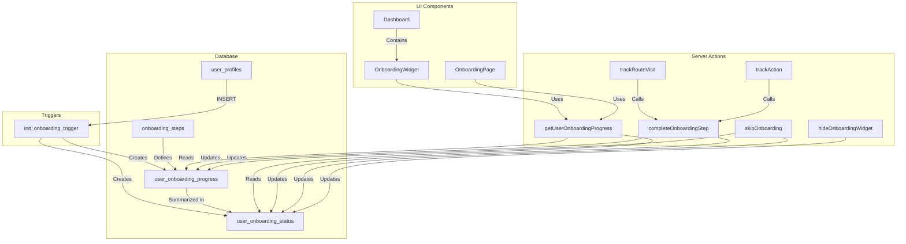
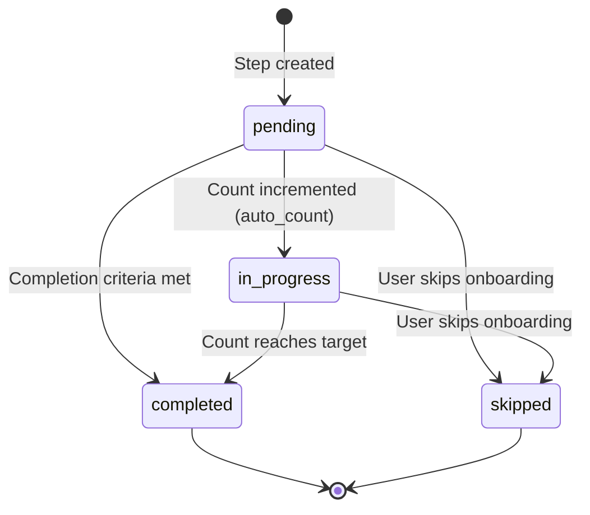

# Design Document: Onboarding Checklist System

## Overview

The Onboarding Checklist System guides new GAMA ERP users through essential setup tasks and feature exploration based on their role. The system uses a combination of predefined steps, automatic progress tracking, and gamification to encourage user engagement and system adoption.

The architecture follows a database-driven approach where:
1. Steps are defined in a central table with role-based filtering
2. Progress is tracked per-user with automatic completion detection
3. UI components (widget and full page) render progress from the database
4. Triggers and utility functions handle automatic initialization and completion

## Architecture



## Components and Interfaces

### Database Tables

#### onboarding_steps
Central definition table for all onboarding steps.

```sql
CREATE TABLE onboarding_steps (
  id UUID PRIMARY KEY DEFAULT gen_random_uuid(),
  step_code VARCHAR(50) UNIQUE NOT NULL,
  step_name VARCHAR(200) NOT NULL,
  description TEXT,
  category VARCHAR(50) NOT NULL,
  step_order INTEGER NOT NULL,
  applicable_roles TEXT[] DEFAULT '{}',
  completion_type VARCHAR(30) NOT NULL,
  completion_route VARCHAR(200),
  completion_action VARCHAR(100),
  completion_count INTEGER DEFAULT 1,
  completion_table VARCHAR(100),
  icon VARCHAR(50),
  action_label VARCHAR(100),
  action_route VARCHAR(200),
  points INTEGER DEFAULT 10,
  badge_on_complete VARCHAR(100),
  is_required BOOLEAN DEFAULT FALSE,
  is_active BOOLEAN DEFAULT TRUE,
  created_at TIMESTAMPTZ DEFAULT NOW()
);
```

#### user_onboarding_progress
Per-user progress tracking for each step.

```sql
CREATE TABLE user_onboarding_progress (
  id UUID PRIMARY KEY DEFAULT gen_random_uuid(),
  user_id UUID NOT NULL REFERENCES user_profiles(id),
  step_id UUID NOT NULL REFERENCES onboarding_steps(id),
  status VARCHAR(20) DEFAULT 'pending',
  started_at TIMESTAMPTZ,
  completed_at TIMESTAMPTZ,
  current_count INTEGER DEFAULT 0,
  created_at TIMESTAMPTZ DEFAULT NOW(),
  UNIQUE(user_id, step_id)
);
```

#### user_onboarding_status
Summary table for quick access to user's overall progress.

```sql
CREATE TABLE user_onboarding_status (
  id UUID PRIMARY KEY DEFAULT gen_random_uuid(),
  user_id UUID UNIQUE NOT NULL REFERENCES user_profiles(id),
  total_steps INTEGER DEFAULT 0,
  completed_steps INTEGER DEFAULT 0,
  skipped_steps INTEGER DEFAULT 0,
  total_points INTEGER DEFAULT 0,
  is_onboarding_complete BOOLEAN DEFAULT FALSE,
  onboarding_completed_at TIMESTAMPTZ,
  show_onboarding_widget BOOLEAN DEFAULT TRUE,
  show_welcome_modal BOOLEAN DEFAULT TRUE,
  created_at TIMESTAMPTZ DEFAULT NOW(),
  updated_at TIMESTAMPTZ DEFAULT NOW()
);
```

### TypeScript Interfaces

```typescript
// types/onboarding.ts

export type OnboardingCategory = 'profile' | 'explore' | 'first_action' | 'advanced';
export type CompletionType = 'manual' | 'auto_route' | 'auto_action' | 'auto_count';
export type ProgressStatus = 'pending' | 'in_progress' | 'completed' | 'skipped';

export interface OnboardingStep {
  id: string;
  step_code: string;
  step_name: string;
  description: string | null;
  category: OnboardingCategory;
  step_order: number;
  applicable_roles: string[];
  completion_type: CompletionType;
  completion_route: string | null;
  completion_action: string | null;
  completion_count: number;
  completion_table: string | null;
  icon: string | null;
  action_label: string | null;
  action_route: string | null;
  points: number;
  badge_on_complete: string | null;
  is_required: boolean;
  is_active: boolean;
}

export interface OnboardingProgress {
  id: string;
  user_id: string;
  step_id: string;
  status: ProgressStatus;
  started_at: string | null;
  completed_at: string | null;
  current_count: number;
  step?: OnboardingStep;
}

export interface OnboardingStatus {
  id: string;
  user_id: string;
  total_steps: number;
  completed_steps: number;
  skipped_steps: number;
  total_points: number;
  is_onboarding_complete: boolean;
  onboarding_completed_at: string | null;
  show_onboarding_widget: boolean;
  show_welcome_modal: boolean;
}

export interface OnboardingProgressWithStep extends OnboardingProgress {
  step: OnboardingStep;
}

export interface UserOnboardingData {
  status: OnboardingStatus;
  steps: OnboardingProgressWithStep[];
  stepsByCategory: Record<OnboardingCategory, OnboardingProgressWithStep[]>;
  nextStep: OnboardingProgressWithStep | null;
  percentComplete: number;
}
```

### Server Actions Interface

```typescript
// lib/onboarding-actions.ts

// Get complete onboarding data for a user
export async function getUserOnboardingProgress(
  userId: string
): Promise<UserOnboardingData>

// Mark a step as completed
export async function completeOnboardingStep(
  userId: string,
  stepCode: string
): Promise<{ success: boolean; error?: string }>

// Track route visit for auto_route completion
export async function trackRouteVisit(
  userId: string,
  route: string
): Promise<void>

// Track record creation for auto_count completion
export async function trackAction(
  userId: string,
  table: string,
  action: 'create' | 'update' | 'delete'
): Promise<void>

// Skip all remaining onboarding steps
export async function skipOnboarding(
  userId: string
): Promise<{ success: boolean; error?: string }>

// Hide the onboarding widget
export async function hideOnboardingWidget(
  userId: string
): Promise<{ success: boolean; error?: string }>

// Manually mark a step as completed (for manual completion_type)
export async function markStepComplete(
  userId: string,
  stepCode: string
): Promise<{ success: boolean; error?: string }>
```

### UI Components

#### OnboardingWidget
Compact dashboard component showing progress summary and next steps.

```typescript
// components/onboarding/onboarding-widget.tsx

interface OnboardingWidgetProps {
  userId: string;
  onHide?: () => void;
}

export function OnboardingWidget({ userId, onHide }: OnboardingWidgetProps): JSX.Element
```

#### OnboardingPage
Full page showing all steps grouped by category.

```typescript
// app/(main)/onboarding/page.tsx

// Server component that fetches and displays complete onboarding checklist
```

#### OnboardingStepCard
Individual step display component.

```typescript
// components/onboarding/onboarding-step-card.tsx

interface OnboardingStepCardProps {
  progress: OnboardingProgressWithStep;
  onAction?: () => void;
}

export function OnboardingStepCard({ progress, onAction }: OnboardingStepCardProps): JSX.Element
```

#### OnboardingProgressBar
Visual progress indicator.

```typescript
// components/onboarding/onboarding-progress-bar.tsx

interface OnboardingProgressBarProps {
  completed: number;
  total: number;
  points?: number;
}

export function OnboardingProgressBar({ completed, total, points }: OnboardingProgressBarProps): JSX.Element
```

## Data Models

### Step Categories

| Category | Description | Step Order Range |
|----------|-------------|------------------|
| profile | User profile setup tasks | 1-9 |
| explore | System exploration tasks | 10-19 |
| first_action | First-time actions | 20-29 |
| advanced | Advanced features | 30-39 |

### Completion Types

| Type | Description | Auto-Complete Trigger |
|------|-------------|----------------------|
| manual | User clicks "Mark Complete" | User action |
| auto_route | Completes when user visits a route | Route navigation |
| auto_action | Completes when user performs action | Specific action |
| auto_count | Completes after N records created | Record creation |

### Default Steps Configuration

```typescript
const DEFAULT_STEPS = [
  // Profile Setup
  { code: 'complete_profile', category: 'profile', order: 1, roles: ['*'], type: 'auto_action' },
  { code: 'set_preferences', category: 'profile', order: 2, roles: ['*'], type: 'auto_route' },
  
  // Explore (role-specific)
  { code: 'explore_dashboard', category: 'explore', order: 10, roles: ['*'], type: 'auto_route' },
  { code: 'explore_customers', category: 'explore', order: 11, roles: ['owner', 'admin', 'manager', 'sales'], type: 'auto_route' },
  { code: 'explore_quotations', category: 'explore', order: 12, roles: ['owner', 'admin', 'manager', 'sales'], type: 'auto_route' },
  { code: 'explore_jobs', category: 'explore', order: 13, roles: ['owner', 'admin', 'manager', 'ops'], type: 'auto_route' },
  { code: 'explore_invoices', category: 'explore', order: 14, roles: ['owner', 'admin', 'manager', 'finance'], type: 'auto_route' },
  { code: 'explore_vendors', category: 'explore', order: 15, roles: ['owner', 'admin', 'manager', 'finance', 'ops'], type: 'auto_route' },
  
  // First Actions (role-specific)
  { code: 'first_quotation', category: 'first_action', order: 20, roles: ['owner', 'admin', 'sales'], type: 'auto_count', table: 'quotations' },
  { code: 'first_customer', category: 'first_action', order: 21, roles: ['owner', 'admin', 'sales'], type: 'auto_count', table: 'customers' },
  { code: 'first_payment', category: 'first_action', order: 22, roles: ['owner', 'admin', 'finance'], type: 'auto_count', table: 'payments' },
  { code: 'first_surat_jalan', category: 'first_action', order: 23, roles: ['owner', 'admin', 'ops'], type: 'auto_count', table: 'surat_jalan' },
  { code: 'first_bkk', category: 'first_action', order: 24, roles: ['owner', 'admin', 'ops'], type: 'auto_count', table: 'bkk' },
  
  // Advanced
  { code: 'use_global_search', category: 'advanced', order: 30, roles: ['*'], type: 'manual' },
  { code: 'view_reports', category: 'advanced', order: 31, roles: ['owner', 'admin', 'manager', 'finance'], type: 'auto_route' },
  { code: 'customize_dashboard', category: 'advanced', order: 32, roles: ['*'], type: 'auto_route' },
];
```

### Progress Status Transitions



### Points Calculation

```typescript
function calculateTotalPoints(progress: OnboardingProgress[], steps: OnboardingStep[]): number {
  return progress
    .filter(p => p.status === 'completed')
    .reduce((total, p) => {
      const step = steps.find(s => s.id === p.step_id);
      return total + (step?.points || 0);
    }, 0);
}

function calculatePercentComplete(completed: number, total: number): number {
  if (total === 0) return 0;
  return Math.round((completed / total) * 100);
}
```


## Correctness Properties

*A property is a characteristic or behavior that should hold true across all valid executions of a system—essentially, a formal statement about what the system should do. Properties serve as the bridge between human-readable specifications and machine-verifiable correctness guarantees.*

### Property 1: Role-Based Step Filtering

*For any* user role and *for any* onboarding step, the step should be included in the user's onboarding if and only if the user's role is contained in the step's applicable_roles array OR the step has a wildcard role ('*').

**Validates: Requirements 1.2, 10.1, 10.5**

### Property 2: Completion Type Validation

*For any* onboarding step with completion_type 'auto_route', the step must have a non-null completion_route. *For any* step with completion_type 'auto_count', the step must have non-null completion_table and completion_count >= 1.

**Validates: Requirements 1.3, 1.4, 1.5**

### Property 3: Progress Initialization Consistency

*For any* newly created user with a given role, the number of progress records created should equal the count of active onboarding steps where the user's role is in applicable_roles, and the total_steps in the status record should match this count.

**Validates: Requirements 2.1, 3.2, 3.3, 3.4**

### Property 4: Status Transition Validity

*For any* progress record, the status must be one of: 'pending', 'in_progress', 'completed', or 'skipped'. *For any* user, is_onboarding_complete should be true if and only if all progress records have status 'completed' or 'skipped'.

**Validates: Requirements 2.2, 2.6**

### Property 5: Route-Based Auto-Completion

*For any* route visit and *for any* pending step with completion_type 'auto_route' and matching completion_route, the step should be marked as completed. Steps with other completion_types or non-pending status should remain unchanged.

**Validates: Requirements 4.1, 4.2, 4.3**

### Property 6: Count-Based Completion

*For any* record creation in a tracked table and *for any* step with completion_type 'auto_count' matching that table: if current_count + 1 < completion_count, status should become 'in_progress' with incremented count; if current_count + 1 >= completion_count, status should become 'completed'. Update and delete actions should not affect counts.

**Validates: Requirements 5.1, 5.2, 5.3, 5.4**

### Property 7: Skip Onboarding Behavior

*For any* user who skips onboarding, all progress records with status 'pending' or 'in_progress' should become 'skipped', is_onboarding_complete should be true, and show_onboarding_widget should be false.

**Validates: Requirements 8.1, 8.2, 8.3, 8.4**

### Property 8: Points Accumulation

*For any* step completion, the user's total_points should increase by exactly the step's points value. *For any* skipped step, total_points should not change. *For any* completed step, completed_at timestamp should be set.

**Validates: Requirements 2.3, 4.4, 9.1, 9.3**

### Property 9: Summary Consistency

*For any* user, the percent_complete should equal Math.round((completed_steps / total_steps) * 100), and completed_steps should equal the count of progress records with status 'completed'.

**Validates: Requirements 2.5, 9.2**

### Property 10: Category Grouping

*For any* list of onboarding steps grouped by category, each step should appear in exactly one category group, and the category should match the step's category field.

**Validates: Requirements 7.1**

### Property 11: Next Steps Selection

*For any* user's onboarding progress, the next steps returned should be the first N pending steps ordered by step_order, where N is the display limit (typically 2-3).

**Validates: Requirements 6.3**

## Error Handling

### Database Errors

| Error Scenario | Handling Strategy |
|----------------|-------------------|
| User profile not found | Return empty onboarding data with default status |
| Step not found by code | Log warning, return error response |
| Duplicate progress record | Use UPSERT to handle gracefully |
| Foreign key violation | Validate user_id and step_id before insert |

### Validation Errors

| Error Scenario | Handling Strategy |
|----------------|-------------------|
| Invalid status value | Reject with validation error |
| Invalid completion_type | Reject with validation error |
| Missing required fields for completion_type | Reject step creation |
| Negative points value | Default to 0 |

### Edge Cases

| Edge Case | Handling Strategy |
|-----------|-------------------|
| User with no applicable steps | Create status with total_steps = 0, is_onboarding_complete = true |
| Step with empty applicable_roles | Step not shown to any user |
| Concurrent completion attempts | Use database transactions to prevent race conditions |
| Route visit for already completed step | No-op, return success |

## Testing Strategy

### Property-Based Testing

The system will use **fast-check** for property-based testing in TypeScript. Each correctness property will be implemented as a property test with minimum 100 iterations.

```typescript
// Test configuration
import fc from 'fast-check';

const PBT_CONFIG = {
  numRuns: 100,
  verbose: true,
};
```

### Test Categories

#### Unit Tests
- Step filtering by role
- Completion type validation
- Points calculation
- Percentage calculation
- Status transition logic
- Category grouping

#### Property Tests
- Property 1: Role filtering consistency
- Property 2: Completion type field requirements
- Property 3: Initialization count consistency
- Property 4: Status value validity
- Property 5: Route completion behavior
- Property 6: Count completion behavior
- Property 7: Skip behavior consistency
- Property 8: Points accumulation accuracy
- Property 9: Summary calculation accuracy
- Property 10: Category grouping correctness
- Property 11: Next steps ordering

#### Integration Tests
- Full onboarding flow from user creation to completion
- Route tracking middleware integration
- Action tracking hook integration
- Widget rendering with real data
- Full page rendering with real data

### Test Data Generators

```typescript
// Arbitrary generators for property tests

const roleArb = fc.constantFrom('owner', 'admin', 'manager', 'finance', 'ops', 'sales');

const completionTypeArb = fc.constantFrom('manual', 'auto_route', 'auto_action', 'auto_count');

const statusArb = fc.constantFrom('pending', 'in_progress', 'completed', 'skipped');

const categoryArb = fc.constantFrom('profile', 'explore', 'first_action', 'advanced');

const onboardingStepArb = fc.record({
  id: fc.uuid(),
  step_code: fc.string({ minLength: 1, maxLength: 50 }),
  step_name: fc.string({ minLength: 1, maxLength: 200 }),
  description: fc.option(fc.string(), { nil: null }),
  category: categoryArb,
  step_order: fc.integer({ min: 1, max: 100 }),
  applicable_roles: fc.array(roleArb, { minLength: 0, maxLength: 6 }),
  completion_type: completionTypeArb,
  completion_route: fc.option(fc.string(), { nil: null }),
  completion_count: fc.integer({ min: 1, max: 10 }),
  completion_table: fc.option(fc.string(), { nil: null }),
  points: fc.integer({ min: 0, max: 100 }),
  is_required: fc.boolean(),
  is_active: fc.boolean(),
});

const progressArb = fc.record({
  id: fc.uuid(),
  user_id: fc.uuid(),
  step_id: fc.uuid(),
  status: statusArb,
  current_count: fc.integer({ min: 0, max: 10 }),
  completed_at: fc.option(fc.date().map(d => d.toISOString()), { nil: null }),
});
```

### Test File Structure

```
__tests__/
  onboarding-utils.test.ts          # Unit tests for utility functions
  onboarding-utils.property.test.ts # Property-based tests
  onboarding-actions.test.ts        # Server action tests
  onboarding-widget.test.tsx        # Widget component tests
  onboarding-page.test.tsx          # Page component tests
```
