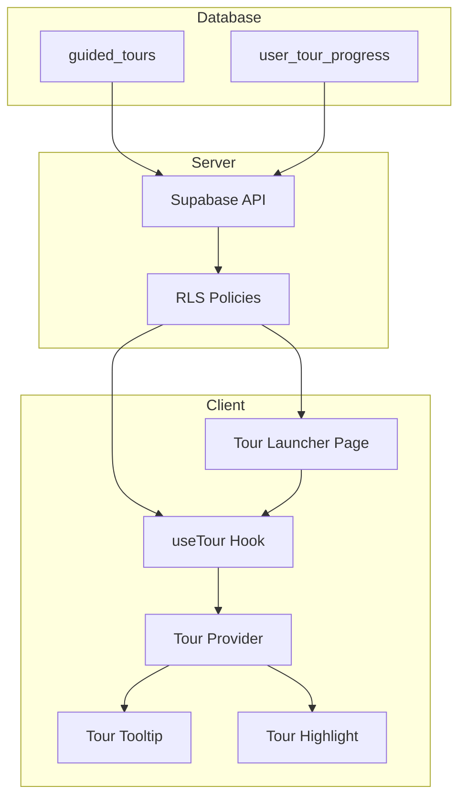

# Design Document: Guided Tours System (v0.37)

## Overview

The Guided Tours system provides interactive step-by-step tutorials that walk users through key workflows in Gama ERP. The system uses tooltips positioned near target elements, visual highlighting, and navigation controls to guide users through predefined sequences of instructional steps.

The architecture follows a client-server model where tour definitions are stored in the database and rendered client-side using React components. Progress is persisted to enable resuming tours across sessions.

## Architecture



### Data Flow

1. User visits Tour Launcher → Fetch available tours filtered by role
2. User starts tour → Create/update progress record, navigate to start_route
3. Tour step renders → Position tooltip, highlight target element
4. User advances → Update progress, optionally navigate to nextRoute
5. Tour completes → Update status to 'completed' with timestamp

## Components and Interfaces

### Database Schema

```sql
-- Tour definitions
CREATE TABLE guided_tours (
    id UUID PRIMARY KEY DEFAULT gen_random_uuid(),
    tour_code VARCHAR(50) UNIQUE NOT NULL,
    tour_name VARCHAR(200) NOT NULL,
    description TEXT,
    applicable_roles TEXT[] DEFAULT '{}',
    start_route VARCHAR(200) NOT NULL,
    steps JSONB NOT NULL DEFAULT '[]',
    estimated_minutes INTEGER DEFAULT 5,
    is_active BOOLEAN DEFAULT TRUE,
    display_order INTEGER DEFAULT 0,
    created_at TIMESTAMPTZ DEFAULT NOW()
);

-- User progress tracking
CREATE TABLE user_tour_progress (
    id UUID PRIMARY KEY DEFAULT gen_random_uuid(),
    user_id UUID NOT NULL REFERENCES user_profiles(id),
    tour_id UUID NOT NULL REFERENCES guided_tours(id),
    status VARCHAR(20) DEFAULT 'not_started',
    current_step INTEGER DEFAULT 0,
    started_at TIMESTAMPTZ,
    completed_at TIMESTAMPTZ,
    UNIQUE(user_id, tour_id)
);

CREATE INDEX idx_tour_progress_user ON user_tour_progress(user_id);
```

### TypeScript Interfaces

```typescript
// types/guided-tours.ts

interface TourStep {
  target: string;           // CSS selector for target element
  title: string;            // Step title
  content: string;          // Step description/instructions
  placement: 'top' | 'bottom' | 'left' | 'right';
  action?: 'click' | 'input' | 'wait';  // Optional action hint
  nextRoute?: string;       // Optional route to navigate to
}

interface GuidedTour {
  id: string;
  tourCode: string;
  tourName: string;
  description: string | null;
  applicableRoles: string[];
  startRoute: string;
  steps: TourStep[];
  estimatedMinutes: number;
  isActive: boolean;
  displayOrder: number;
}

type TourStatus = 'not_started' | 'in_progress' | 'completed' | 'skipped';

interface TourProgress {
  id: string;
  tourId: string;
  status: TourStatus;
  currentStep: number;
  startedAt: string | null;
  completedAt: string | null;
}

interface TourWithProgress {
  tour: GuidedTour;
  progress: TourProgress | null;
}
```

### React Components

```
components/
  guided-tours/
    index.ts                    # Barrel exports
    tour-provider.tsx           # Context provider for active tour
    tour-tooltip.tsx            # Floating tooltip component
    tour-highlight.tsx          # Element highlight overlay
    tour-launcher-page.tsx      # /help/tours page content
    tour-card.tsx               # Individual tour card in launcher
    tour-navigation.tsx         # Back/Skip/Next buttons
```

### Component Hierarchy

```
TourProvider (context)
├── TourHighlight (overlay)
└── TourTooltip
    ├── StepIndicator (e.g., "Step 2 of 6")
    ├── StepContent (title + description)
    └── TourNavigation (Back, Skip, Next)
```

### Utility Functions

```typescript
// lib/guided-tours-utils.ts

// Fetch tours available for a user's role
async function getAvailableTours(userId: string): Promise<TourWithProgress[]>

// Start a tour (create/update progress)
async function startTour(userId: string, tourId: string): Promise<TourStep[]>

// Advance to next step
async function advanceTourStep(
  userId: string, 
  tourId: string
): Promise<{ step: TourStep | null; isComplete: boolean }>

// Go back to previous step
async function goBackTourStep(
  userId: string, 
  tourId: string
): Promise<TourStep | null>

// Skip/abandon tour
async function skipTour(userId: string, tourId: string): Promise<void>

// Get tour by code
async function getTourByCode(tourCode: string): Promise<GuidedTour | null>
```

### React Hook

```typescript
// hooks/use-tour.ts

interface UseTourReturn {
  isActive: boolean;
  currentStep: TourStep | null;
  stepIndex: number;
  totalSteps: number;
  tourName: string;
  start: () => Promise<void>;
  next: () => Promise<void>;
  back: () => Promise<void>;
  skip: () => Promise<void>;
}

function useTour(tourCode: string): UseTourReturn
```

## Data Models

### Tour Step JSON Structure

```json
{
  "target": ".customer-select",
  "title": "Select Customer",
  "content": "Choose an existing customer from the dropdown or click 'New Customer' to add one.",
  "placement": "right",
  "action": "click",
  "nextRoute": null
}
```

### Default Tours Data

| Tour Code | Name | Roles | Start Route | Steps |
|-----------|------|-------|-------------|-------|
| dashboard_tour | Dashboard Overview | all | /dashboard | 4 |
| quotation_tour | Creating a Quotation | owner, admin, sales | /quotations | 6 |
| invoice_tour | Managing Invoices | owner, admin, finance | /finance/invoices | 4 |
| bkk_tour | Cash Disbursement (BKK) | owner, admin, ops, finance | /finance/bkk | 5 |

### Progress Status Transitions

```
not_started → in_progress (on start)
in_progress → completed (on finish last step)
in_progress → skipped (on skip)
skipped → in_progress (on restart)
completed → in_progress (on restart)
```

## Correctness Properties

*A property is a characteristic or behavior that should hold true across all valid executions of a system—essentially, a formal statement about what the system should do. Properties serve as the bridge between human-readable specifications and machine-verifiable correctness guarantees.*

### Property 1: Role-Based Tour Filtering

*For any* user with a given role and any list of tours returned by `getAvailableTours`, every tour in the list SHALL either have the user's role in its `applicable_roles` array OR have an empty `applicable_roles` array, AND no tour SHALL have `is_active=false`.

**Validates: Requirements 3.1, 7.1, 7.2, 7.3**

### Property 2: Tour Ordering Consistency

*For any* list of tours returned by `getAvailableTours`, the tours SHALL be sorted in ascending order by their `display_order` field.

**Validates: Requirements 3.6**

### Property 3: Tour Data Completeness

*For any* `TourWithProgress` object returned by the system, the tour SHALL contain non-null values for: `tourName`, `startRoute`, and `steps` array, AND each step SHALL contain non-null values for: `target`, `title`, `content`, and `placement`.

**Validates: Requirements 3.2, 4.3**

### Property 4: Navigation Button Visibility Rules

*For any* active tour step at index N in a tour with T total steps:
- The "Back" button SHALL be visible if and only if N > 0
- The "Skip Tour" button SHALL always be visible
- The "Next" button SHALL be visible if N < T-1
- The "Finish" button SHALL be visible if N = T-1

**Validates: Requirements 4.4**

### Property 5: Step Advancement Increments Progress

*For any* tour with progress at step N (where N < total_steps - 1), calling `advanceTourStep` SHALL result in `current_step` being N+1 in the progress record.

**Validates: Requirements 5.1, 6.2**

### Property 6: Step Back Decrements Progress

*For any* tour with progress at step N (where N > 0), calling `goBackTourStep` SHALL result in `current_step` being N-1 in the progress record.

**Validates: Requirements 5.2**

### Property 7: Status Transitions

*For any* tour:
- Starting a tour SHALL set status to 'in_progress' and set `started_at` to a non-null timestamp
- Skipping a tour SHALL set status to 'skipped'
- Completing the final step SHALL set status to 'completed' and set `completed_at` to a non-null timestamp

**Validates: Requirements 5.3, 5.4, 6.1**

### Property 8: Resume From Saved Step

*For any* tour with status 'in_progress' and `current_step` = N, when a user continues the tour, the system SHALL start displaying from step N (not step 0).

**Validates: Requirements 6.4**

## Error Handling

### Missing Target Element

When a tour step's target CSS selector does not match any element on the page:
1. Log a warning to the console
2. Attempt to skip to the next step automatically
3. If no more steps, complete the tour
4. Display a subtle notification to the user that a step was skipped

### Database Errors

- **Fetch failures**: Display error message, allow retry
- **Progress save failures**: Queue for retry, continue tour locally
- **Tour not found**: Redirect to tour launcher with error message

### Navigation Errors

- **Route navigation fails**: Stay on current page, show error
- **Invalid step index**: Reset to step 0 or last valid step

## Testing Strategy

### Unit Tests

Unit tests will cover:
- Tour data transformation functions (DB row to TypeScript interface)
- Navigation button visibility logic
- Step index boundary checks
- Role filtering logic
- Display order sorting

### Property-Based Tests

Property-based tests will use `fast-check` library with minimum 100 iterations per test.

Each property test will be tagged with:
- **Feature: guided-tours, Property N: [property description]**

Properties to implement:
1. Role-based filtering always returns valid tours for the role
2. Tour ordering is always sorted by display_order
3. Tour data always contains required fields
4. Navigation buttons follow visibility rules
5. Step advancement always increments by 1
6. Step back always decrements by 1
7. Status transitions follow defined rules
8. Resume always starts from saved step

### Integration Tests

- Tour launcher page renders correctly
- Starting a tour creates progress record
- Completing a tour updates status
- Cross-route navigation works correctly

### Test File Structure

```
__tests__/
  guided-tours-utils.test.ts          # Unit tests
  guided-tours-utils.property.test.ts # Property-based tests
  guided-tours-integration.test.ts    # Integration tests
```

