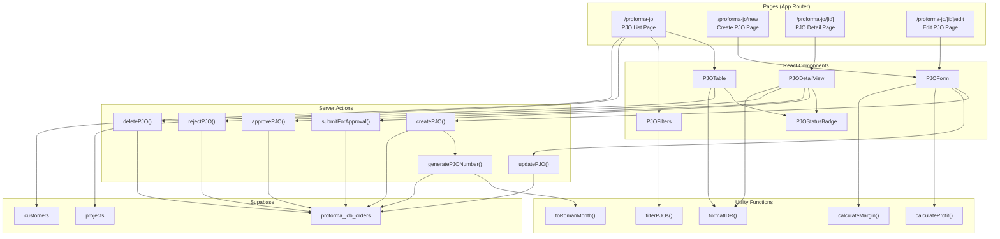

# Design Document: PJO (Proforma Job Order) Module

## Overview

This design document outlines the implementation of the Proforma Job Order (PJO) module for Gama ERP. The module enables users to create, view, edit, and manage quotations/cost estimates before actual work begins. It includes an approval workflow where draft PJOs can be submitted for manager approval, and approved PJOs can later be converted to Job Orders.

The implementation follows existing patterns established in the Customer and Project modules, using Next.js App Router with Server Components, Server Actions for mutations, and shadcn/ui components for the UI.

## Architecture



## Components and Interfaces

### Page Components

#### 1. PJO List Page (`/proforma-jo/page.tsx`)
- Server Component that fetches PJOs with related project and customer data
- Renders `PJOListClient` with data

#### 2. PJO List Client (`/proforma-jo/pjo-list-client.tsx`)
- Client Component managing filter state
- Renders `PJOTable` and `PJOFilters`
- Handles delete confirmation dialog

#### 3. Create PJO Page (`/proforma-jo/new/page.tsx`)
- Server Component that fetches projects for dropdown
- Renders `PJOForm` in create mode
- Accepts optional `project_id` query param for pre-selection

#### 4. PJO Detail Page (`/proforma-jo/[id]/page.tsx`)
- Server Component that fetches single PJO with relations
- Renders `PJODetailView` with action buttons based on status

#### 5. Edit PJO Page (`/proforma-jo/[id]/edit/page.tsx`)
- Server Component that fetches PJO for editing
- Renders `PJOForm` in edit mode
- Redirects if PJO is not in draft status

### UI Components

#### 1. PJOTable (`/components/pjo/pjo-table.tsx`)
```typescript
interface PJOTableProps {
  pjos: PJOWithRelations[]
  onDelete: (pjo: PJOWithRelations) => void
}
```

#### 2. PJOForm (`/components/pjo/pjo-form.tsx`)
```typescript
interface PJOFormProps {
  projects: ProjectWithCustomer[]
  pjo?: PJO | null
  preselectedProjectId?: string
  mode: 'create' | 'edit'
}
```

#### 3. PJODetailView (`/components/pjo/pjo-detail-view.tsx`)
```typescript
interface PJODetailViewProps {
  pjo: PJOWithRelations
  canApprove: boolean
}
```

#### 4. PJOFilters (`/components/pjo/pjo-filters.tsx`)
```typescript
interface PJOFiltersProps {
  statusFilter: string
  dateFrom: Date | null
  dateTo: Date | null
  onStatusChange: (status: string) => void
  onDateFromChange: (date: Date | null) => void
  onDateToChange: (date: Date | null) => void
}
```

#### 5. PJOStatusBadge (`/components/ui/pjo-status-badge.tsx`)
```typescript
type PJOStatus = 'draft' | 'pending_approval' | 'approved' | 'rejected'

interface PJOStatusBadgeProps {
  status: PJOStatus
}
```

### Server Actions (`/app/(main)/proforma-jo/actions.ts`)

```typescript
// Create new PJO with auto-generated number
async function createPJO(data: PJOFormData): Promise<{ error?: string; id?: string }>

// Update existing PJO (draft only)
async function updatePJO(id: string, data: PJOFormData): Promise<{ error?: string }>

// Soft delete PJO (draft only)
async function deletePJO(id: string): Promise<{ error?: string }>

// Change status from draft to pending_approval
async function submitForApproval(id: string): Promise<{ error?: string }>

// Change status from pending_approval to approved
async function approvePJO(id: string): Promise<{ error?: string }>

// Change status from pending_approval to rejected
async function rejectPJO(id: string, reason: string): Promise<{ error?: string }>
```

### Utility Functions (`/lib/pjo-utils.ts`)

```typescript
// Format number as Indonesian Rupiah
function formatIDR(amount: number): string

// Calculate profit from revenue and expenses
function calculateProfit(revenue: number, expenses: number): number

// Calculate margin percentage
function calculateMargin(revenue: number, expenses: number): number

// Convert month number to Roman numeral
function toRomanMonth(month: number): string

// Generate next PJO number for current month
async function generatePJONumber(): Promise<string>

// Filter PJOs by status and date range
function filterPJOs(
  pjos: PJOWithRelations[],
  statusFilter: string | null,
  dateFrom: Date | null,
  dateTo: Date | null
): PJOWithRelations[]
```

## Data Models

### Database Schema Update

The existing `proforma_job_orders` table needs to be updated with additional columns:

```sql
ALTER TABLE proforma_job_orders ADD COLUMN IF NOT EXISTS jo_date DATE;
ALTER TABLE proforma_job_orders ADD COLUMN IF NOT EXISTS commodity TEXT;
ALTER TABLE proforma_job_orders ADD COLUMN IF NOT EXISTS quantity DECIMAL(15,2);
ALTER TABLE proforma_job_orders ADD COLUMN IF NOT EXISTS quantity_unit TEXT;
ALTER TABLE proforma_job_orders ADD COLUMN IF NOT EXISTS pol TEXT;
ALTER TABLE proforma_job_orders ADD COLUMN IF NOT EXISTS pod TEXT;
ALTER TABLE proforma_job_orders ADD COLUMN IF NOT EXISTS etd DATE;
ALTER TABLE proforma_job_orders ADD COLUMN IF NOT EXISTS eta DATE;
ALTER TABLE proforma_job_orders ADD COLUMN IF NOT EXISTS carrier_type TEXT;
ALTER TABLE proforma_job_orders ADD COLUMN IF NOT EXISTS total_revenue DECIMAL(15,2) DEFAULT 0;
ALTER TABLE proforma_job_orders ADD COLUMN IF NOT EXISTS total_expenses DECIMAL(15,2) DEFAULT 0;
ALTER TABLE proforma_job_orders ADD COLUMN IF NOT EXISTS profit DECIMAL(15,2) DEFAULT 0;
ALTER TABLE proforma_job_orders ADD COLUMN IF NOT EXISTS notes TEXT;
ALTER TABLE proforma_job_orders ADD COLUMN IF NOT EXISTS created_by UUID REFERENCES auth.users(id);
ALTER TABLE proforma_job_orders ADD COLUMN IF NOT EXISTS approved_by UUID REFERENCES auth.users(id);
ALTER TABLE proforma_job_orders ADD COLUMN IF NOT EXISTS approved_at TIMESTAMP WITH TIME ZONE;
ALTER TABLE proforma_job_orders ADD COLUMN IF NOT EXISTS rejection_reason TEXT;
ALTER TABLE proforma_job_orders ADD COLUMN IF NOT EXISTS is_active BOOLEAN DEFAULT true;
```

### TypeScript Types

```typescript
// PJO Status type
type PJOStatus = 'draft' | 'pending_approval' | 'approved' | 'rejected'

// Quantity unit options
type QuantityUnit = 'TRIP' | 'TRIPS' | 'LOT' | 'CASE'

// Carrier type options
type CarrierType = 'FUSO' | 'TRAILER 20FT' | 'TRAILER 40FT'

// Extended PJO type with all new fields
interface PJO {
  id: string
  pjo_number: string
  project_id: string
  customer_id: string
  status: PJOStatus
  jo_date: string
  commodity: string | null
  quantity: number | null
  quantity_unit: QuantityUnit | null
  pol: string | null
  pod: string | null
  etd: string | null
  eta: string | null
  carrier_type: CarrierType | null
  total_revenue: number
  total_expenses: number
  profit: number
  notes: string | null
  created_by: string | null
  approved_by: string | null
  approved_at: string | null
  rejection_reason: string | null
  is_active: boolean
  created_at: string
  updated_at: string
}

// PJO with related data for display
interface PJOWithRelations extends PJO {
  projects: {
    id: string
    name: string
    customers: {
      id: string
      name: string
    }
  }
}

// Form data for create/edit
interface PJOFormData {
  project_id: string
  jo_date: string
  commodity: string
  quantity: number
  quantity_unit: QuantityUnit
  pol: string
  pod: string
  etd: string
  eta: string
  carrier_type: CarrierType
  total_revenue: number
  total_expenses: number
  notes: string
}
```

## Correctness Properties

*A property is a characteristic or behavior that should hold true across all valid executions of a system-essentially, a formal statement about what the system should do. Properties serve as the bridge between human-readable specifications and machine-verifiable correctness guarantees.*

Based on the prework analysis, the following correctness properties have been identified:

### Property 1: IDR Currency Formatting
*For any* non-negative number, the `formatIDR` function SHALL return a string starting with "Rp " followed by the number formatted with period separators for thousands (e.g., 30000000 → "Rp 30.000.000").
**Validates: Requirements 1.3**

### Property 2: PJO List Ordering
*For any* list of PJOs returned from the database, the list SHALL be ordered by `created_at` in descending order (newest first).
**Validates: Requirements 1.1**

### Property 3: PJO Filtering
*For any* list of PJOs and any combination of status filter and date range filter, the filtered result SHALL contain only PJOs that match ALL applied filter criteria (status matches AND jo_date is within range).
**Validates: Requirements 2.1, 2.2, 2.3**

### Property 4: Profit Calculation
*For any* revenue and expenses values, the `calculateProfit` function SHALL return exactly `revenue - expenses`.
**Validates: Requirements 3.5**

### Property 5: Margin Calculation
*For any* revenue and expenses values where revenue is greater than zero, the `calculateMargin` function SHALL return exactly `(profit / revenue) * 100` where profit equals `revenue - expenses`.
**Validates: Requirements 3.6**

### Property 6: PJO Number Format
*For any* generated PJO number, it SHALL match the pattern `NNNN/CARGO/MM/YYYY` where NNNN is a 4-digit zero-padded sequence, MM is a Roman numeral (I-XII), and YYYY is a 4-digit year.
**Validates: Requirements 4.1, 4.2**

### Property 7: Month to Roman Numeral Conversion
*For any* month number from 1 to 12, the `toRomanMonth` function SHALL return the correct Roman numeral representation (1→I, 2→II, 3→III, 4→IV, 5→V, 6→VI, 7→VII, 8→VIII, 9→IX, 10→X, 11→XI, 12→XII).
**Validates: Requirements 4.4**

### Property 8: Status Transition Validity
*For any* PJO status transition, the following rules SHALL hold:
- draft → pending_approval (via submitForApproval)
- pending_approval → approved (via approvePJO)
- pending_approval → rejected (via rejectPJO)
- No other transitions are valid
**Validates: Requirements 7.2, 8.2, 8.3**

### Property 9: PJO Status Badge Colors
*For any* PJO status, the badge color SHALL be: draft→gray, pending_approval→yellow, approved→green, rejected→red.
**Validates: Requirements 9.1, 9.2, 9.3, 9.4**

## Error Handling

### Form Validation Errors
- Required field validation using Zod schema
- Email format validation (if applicable)
- Numeric range validation for quantities and amounts
- Date validation (ETD should be before or equal to ETA)
- Display inline error messages below form fields

### Server Action Errors
- Database connection errors: Display generic error toast
- Constraint violations: Display specific error message
- Authorization errors: Redirect to login or show permission denied
- Not found errors: Display 404 page

### Status Transition Errors
- Invalid transition attempts: Display error toast explaining valid transitions
- Concurrent modification: Refresh page and show conflict message

## Testing Strategy

### Dual Testing Approach

This module uses both unit tests and property-based tests:
- **Unit tests**: Verify specific examples, edge cases, and integration points
- **Property-based tests**: Verify universal properties hold across all valid inputs

### Property-Based Testing Framework
- Use **fast-check** library for property-based testing in TypeScript
- Configure minimum 100 iterations per property test
- Tag each property test with the corresponding correctness property reference

### Unit Tests

1. **Component Tests**
   - PJOTable renders correct columns and data
   - PJOForm validates required fields
   - PJOStatusBadge displays correct colors
   - PJOFilters updates filter state correctly

2. **Integration Tests**
   - Create PJO flow with auto-generated number
   - Edit PJO updates database correctly
   - Delete PJO soft-deletes record
   - Approval workflow transitions status correctly

### Property-Based Tests

Each correctness property (1-9) will have a corresponding property-based test:

1. **formatIDR property test**: Generate random non-negative numbers, verify output format
2. **List ordering property test**: Generate random PJO lists, verify descending order
3. **Filtering property test**: Generate random PJOs and filters, verify filter logic
4. **Profit calculation property test**: Generate random revenue/expenses, verify calculation
5. **Margin calculation property test**: Generate random revenue/expenses (revenue > 0), verify calculation
6. **PJO number format property test**: Generate PJO numbers, verify regex pattern match
7. **Roman numeral property test**: Generate months 1-12, verify correct Roman numeral
8. **Status transition property test**: Generate status transitions, verify validity
9. **Status badge color property test**: Generate statuses, verify correct color mapping

### Test File Structure
```
gama-erp/__tests__/
├── pjo.test.tsx           # Component and integration tests
└── pjo-utils.test.ts      # Utility function unit tests and property tests
```
