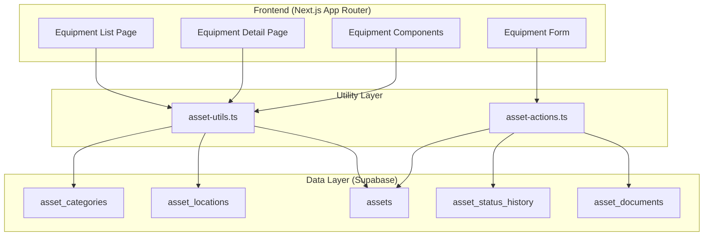
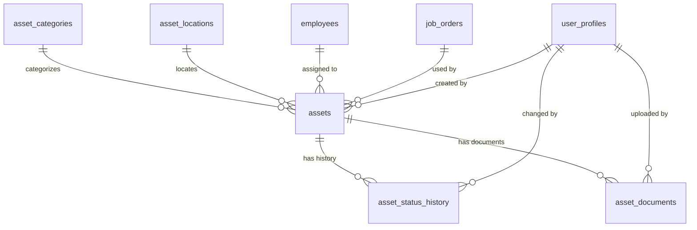

# Design Document: Equipment Asset Registry

## Overview

The Equipment Asset Registry module provides comprehensive tracking for PT. Gama's company-owned equipment and assets. This includes trucks, trailers, cranes, forklifts, and support equipment. The module enables:

- Asset registration with auto-generated codes
- Status tracking with full history
- Document management with expiry alerts
- Depreciation tracking for financial reporting
- Role-based access control

This design follows existing patterns in the codebase (vendors, employees modules) for consistency.

## Architecture



## Components and Interfaces

### Type Definitions (`types/assets.ts`)

```typescript
// Asset status types
export type AssetStatus = 'active' | 'maintenance' | 'repair' | 'idle' | 'disposed' | 'sold';

// Depreciation method types
export type DepreciationMethod = 'straight_line' | 'declining_balance' | 'units_of_production';

// Document type for assets
export type AssetDocumentType = 
  | 'registration' 
  | 'insurance' 
  | 'kir' 
  | 'permit' 
  | 'purchase' 
  | 'manual' 
  | 'photo' 
  | 'other';

// Asset category interface
export interface AssetCategory {
  id: string;
  category_code: string;
  category_name: string;
  description: string | null;
  default_useful_life_years: number;
  default_depreciation_method: DepreciationMethod;
  default_total_units: number | null;
  parent_category_id: string | null;
  is_active: boolean;
  display_order: number;
  created_at: string;
}

// Asset location interface
export interface AssetLocation {
  id: string;
  location_code: string;
  location_name: string;
  address: string | null;
  city: string | null;
  is_active: boolean;
  created_at: string;
}

// Main asset interface
export interface Asset {
  id: string;
  asset_code: string;
  asset_name: string;
  description: string | null;
  category_id: string;
  // Vehicle-specific
  registration_number: string | null;
  vin_number: string | null;
  engine_number: string | null;
  chassis_number: string | null;
  // Specifications
  brand: string | null;
  model: string | null;
  year_manufactured: number | null;
  color: string | null;
  // Capacity
  capacity_tons: number | null;
  capacity_cbm: number | null;
  axle_configuration: string | null;
  // Dimensions
  length_m: number | null;
  width_m: number | null;
  height_m: number | null;
  weight_kg: number | null;
  // Financial
  purchase_date: string | null;
  purchase_price: number | null;
  purchase_vendor: string | null;
  purchase_invoice: string | null;
  // Depreciation
  useful_life_years: number | null;
  salvage_value: number;
  depreciation_method: DepreciationMethod;
  depreciation_start_date: string | null;
  total_expected_units: number | null;
  current_units: number;
  accumulated_depreciation: number;
  book_value: number | null;
  // Location & Status
  current_location_id: string | null;
  status: AssetStatus;
  // Assignment
  assigned_to_employee_id: string | null;
  assigned_to_job_id: string | null;
  // Insurance
  insurance_policy_number: string | null;
  insurance_provider: string | null;
  insurance_expiry_date: string | null;
  insurance_value: number | null;
  // Registration/Permits
  registration_expiry_date: string | null;
  kir_expiry_date: string | null;
  // Documents & Photos (JSONB)
  documents: AssetDocumentJson[];
  photos: AssetPhotoJson[];
  notes: string | null;
  created_by: string | null;
  created_at: string;
  updated_at: string;
}

// Asset with relations for display
export interface AssetWithRelations extends Asset {
  category: AssetCategory | null;
  location: AssetLocation | null;
  assigned_employee: { full_name: string; employee_code: string } | null;
  assigned_job: { jo_number: string } | null;
}

// Asset status history
export interface AssetStatusHistory {
  id: string;
  asset_id: string;
  previous_status: AssetStatus | null;
  new_status: AssetStatus;
  previous_location_id: string | null;
  new_location_id: string | null;
  reason: string | null;
  notes: string | null;
  changed_by: string | null;
  changed_at: string;
}

// Asset document record
export interface AssetDocument {
  id: string;
  asset_id: string;
  document_type: AssetDocumentType;
  document_name: string;
  document_url: string | null;
  issue_date: string | null;
  expiry_date: string | null;
  reminder_days: number;
  notes: string | null;
  uploaded_by: string | null;
  uploaded_at: string;
}

// Document expiry status
export type DocumentExpiryStatus = 'valid' | 'expiring_soon' | 'expired' | 'no_expiry';

// Expiring document view
export interface ExpiringDocument {
  id: string;
  asset_id: string;
  asset_code: string;
  asset_name: string;
  registration_number: string | null;
  document_type: AssetDocumentType;
  document_name: string;
  expiry_date: string;
  days_until_expiry: number;
  status: DocumentExpiryStatus;
}

// Asset summary by category
export interface AssetCategorySummary {
  category_name: string;
  total_count: number;
  active_count: number;
  maintenance_count: number;
  idle_count: number;
  total_purchase_value: number;
  total_book_value: number;
}

// Asset summary stats for dashboard
export interface AssetSummaryStats {
  total: number;
  active: number;
  maintenance: number;
  idle: number;
  totalBookValue: number;
  expiringDocuments: number;
}

// Filter state
export interface AssetFilterState {
  search: string;
  categoryId: string | 'all';
  status: AssetStatus | 'all';
  locationId: string | 'all';
}

// Form data for create/update
export interface AssetFormData {
  asset_name: string;
  description?: string;
  category_id: string;
  registration_number?: string;
  vin_number?: string;
  engine_number?: string;
  chassis_number?: string;
  brand?: string;
  model?: string;
  year_manufactured?: number;
  color?: string;
  capacity_tons?: number;
  capacity_cbm?: number;
  axle_configuration?: string;
  length_m?: number;
  width_m?: number;
  height_m?: number;
  weight_kg?: number;
  purchase_date?: string;
  purchase_price?: number;
  purchase_vendor?: string;
  purchase_invoice?: string;
  useful_life_years?: number;
  salvage_value?: number;
  depreciation_method?: DepreciationMethod;
  current_location_id?: string;
  insurance_policy_number?: string;
  insurance_provider?: string;
  insurance_expiry_date?: string;
  insurance_value?: number;
  registration_expiry_date?: string;
  kir_expiry_date?: string;
  notes?: string;
}

// Status change form data
export interface StatusChangeFormData {
  new_status: AssetStatus;
  reason: string;
  new_location_id?: string;
  notes?: string;
}

// Document form data
export interface AssetDocumentFormData {
  document_type: AssetDocumentType;
  document_name: string;
  issue_date?: string;
  expiry_date?: string;
  reminder_days?: number;
  notes?: string;
}

// JSONB types for inline storage
export interface AssetDocumentJson {
  type: string;
  name: string;
  url: string;
  expiry_date: string | null;
}

export interface AssetPhotoJson {
  url: string;
  caption: string | null;
  is_primary: boolean;
}
```

### Utility Functions (`lib/asset-utils.ts`)

```typescript
// Status options for dropdowns
export const ASSET_STATUSES: { value: AssetStatus; label: string }[] = [
  { value: 'active', label: 'Active' },
  { value: 'maintenance', label: 'Maintenance' },
  { value: 'repair', label: 'Repair' },
  { value: 'idle', label: 'Idle' },
  { value: 'disposed', label: 'Disposed' },
  { value: 'sold', label: 'Sold' },
];

// Depreciation method options
export const DEPRECIATION_METHODS: { value: DepreciationMethod; label: string }[] = [
  { value: 'straight_line', label: 'Straight Line' },
  { value: 'declining_balance', label: 'Declining Balance' },
  { value: 'units_of_production', label: 'Units of Production' },
];

// Document type options
export const ASSET_DOCUMENT_TYPES: { value: AssetDocumentType; label: string }[] = [
  { value: 'registration', label: 'Registration (STNK)' },
  { value: 'insurance', label: 'Insurance' },
  { value: 'kir', label: 'KIR Inspection' },
  { value: 'permit', label: 'Permit' },
  { value: 'purchase', label: 'Purchase Document' },
  { value: 'manual', label: 'Manual' },
  { value: 'photo', label: 'Photo' },
  { value: 'other', label: 'Other' },
];

// Get status label
export function getAssetStatusLabel(status: AssetStatus): string;

// Get depreciation method label
export function getDepreciationMethodLabel(method: DepreciationMethod): string;

// Get document type label
export function getAssetDocumentTypeLabel(type: AssetDocumentType): string;

// Validate asset status
export function isValidAssetStatus(status: string): status is AssetStatus;

// Validate depreciation method
export function isValidDepreciationMethod(method: string): method is DepreciationMethod;

// Validate document type
export function isValidAssetDocumentType(type: string): type is AssetDocumentType;

// Calculate asset summary stats
export function calculateAssetSummaryStats(
  assets: Asset[],
  expiringDocsCount: number
): AssetSummaryStats;

// Filter assets by search term
export function filterAssetsBySearch<T extends { asset_code: string; asset_name: string; registration_number: string | null }>(
  assets: T[],
  search: string
): T[];

// Get document expiry status
export function getDocumentExpiryStatus(
  expiryDate: string | null,
  reminderDays?: number
): DocumentExpiryStatus;

// Check if document is expired
export function isDocumentExpired(expiryDate: string | null): boolean;

// Check if document is expiring soon
export function isDocumentExpiringSoon(
  expiryDate: string | null,
  reminderDays?: number
): boolean;

// Calculate days until expiry
export function calculateDaysUntilExpiry(expiryDate: string): number;

// Format currency (Indonesian Rupiah)
export function formatAssetCurrency(amount: number | null): string;

// Format date for display
export function formatAssetDate(dateString: string | null): string;

// Calculate asset age in years
export function calculateAssetAge(purchaseDate: string): number;

// Calculate straight line depreciation
export function calculateStraightLineDepreciation(
  purchasePrice: number,
  salvageValue: number,
  usefulLifeYears: number,
  yearsElapsed: number
): { annualDepreciation: number; accumulatedDepreciation: number; bookValue: number };

// Validate asset code format
export function isValidAssetCode(code: string): boolean;

// Get status badge variant
export function getAssetStatusBadgeVariant(status: AssetStatus): 'default' | 'secondary' | 'destructive' | 'outline';
```

### Server Actions (`lib/asset-actions.ts`)

```typescript
'use server'

// Create a new asset
export async function createAsset(data: AssetFormData): Promise<{ success: boolean; asset?: Asset; error?: string }>;

// Update an existing asset
export async function updateAsset(id: string, data: Partial<AssetFormData>): Promise<{ success: boolean; error?: string }>;

// Change asset status
export async function changeAssetStatus(
  assetId: string,
  data: StatusChangeFormData
): Promise<{ success: boolean; error?: string }>;

// Delete/dispose asset
export async function disposeAsset(
  assetId: string,
  reason: string
): Promise<{ success: boolean; error?: string }>;

// Upload asset document
export async function uploadAssetDocument(
  assetId: string,
  file: File,
  data: AssetDocumentFormData
): Promise<{ success: boolean; document?: AssetDocument; error?: string }>;

// Delete asset document
export async function deleteAssetDocument(
  documentId: string
): Promise<{ success: boolean; error?: string }>;

// Get assets with filters
export async function getAssets(
  filters: AssetFilterState
): Promise<AssetWithRelations[]>;

// Get single asset by ID
export async function getAssetById(id: string): Promise<AssetWithRelations | null>;

// Get asset categories
export async function getAssetCategories(): Promise<AssetCategory[]>;

// Get asset locations
export async function getAssetLocations(): Promise<AssetLocation[]>;

// Get asset status history
export async function getAssetStatusHistory(assetId: string): Promise<AssetStatusHistory[]>;

// Get asset documents
export async function getAssetDocuments(assetId: string): Promise<AssetDocument[]>;

// Get expiring documents
export async function getExpiringDocuments(daysAhead?: number): Promise<ExpiringDocument[]>;

// Get asset summary by category
export async function getAssetCategorySummary(): Promise<AssetCategorySummary[]>;
```

### React Components

```
components/equipment/
├── asset-table.tsx           # Main asset list table
├── asset-filters.tsx         # Filter controls (category, status, location, search)
├── asset-summary-cards.tsx   # Summary statistics cards
├── asset-form.tsx            # Create/edit asset form
├── asset-detail-view.tsx     # Asset detail page content
├── asset-status-badge.tsx    # Status badge component
├── asset-status-dialog.tsx   # Change status dialog
├── asset-document-list.tsx   # Document list with expiry indicators
├── asset-document-form.tsx   # Upload document form
├── asset-photo-gallery.tsx   # Photo gallery component
├── expiring-documents-list.tsx # List of expiring documents
└── index.ts                  # Barrel exports
```

## Data Models

### Database Schema

The database schema follows the specification provided, with these key tables:

1. **asset_categories** - Equipment classification with depreciation defaults
2. **asset_locations** - Physical locations for asset tracking
3. **assets** - Main asset registry with all specifications
4. **asset_status_history** - Audit trail for status changes
5. **asset_documents** - Document attachments with expiry tracking

### Key Relationships



## Correctness Properties

*A property is a characteristic or behavior that should hold true across all valid executions of a system—essentially, a formal statement about what the system should do. Properties serve as the bridge between human-readable specifications and machine-verifiable correctness guarantees.*

### Property 1: Asset Code Generation Format

*For any* asset created with a valid category, the generated asset code SHALL follow the pattern `{CATEGORY_CODE}-{NNNN}` where CATEGORY_CODE is the category's code and NNNN is a zero-padded sequential number.

**Validates: Requirements 3.1**

### Property 2: Asset Creation Invariants

*For any* newly created asset:
- If purchase_price is provided, book_value SHALL equal purchase_price
- status SHALL be 'active'
- A status history entry SHALL exist with new_status = 'active'

**Validates: Requirements 3.3, 3.4, 3.5**

### Property 3: Mandatory Field Validation

*For any* asset creation attempt, if category_id or asset_name is missing or empty, the creation SHALL fail with a validation error.

**Validates: Requirements 3.2**

### Property 4: Category Display Order

*For any* list of categories returned by getAssetCategories(), the categories SHALL be sorted in ascending order by display_order.

**Validates: Requirements 1.2**

### Property 5: Location Change History

*For any* asset status change that includes a location change, the status history entry SHALL contain both previous_location_id and new_location_id.

**Validates: Requirements 2.2**

### Property 6: Filter Correctness

*For any* filter combination (categoryId, status, locationId, search) applied to the asset list:
- If categoryId is specified, all returned assets SHALL have that category_id
- If status is specified, all returned assets SHALL have that status
- If locationId is specified, all returned assets SHALL have that current_location_id
- If search is specified, all returned assets SHALL have asset_code, asset_name, or registration_number containing the search term (case-insensitive)

**Validates: Requirements 4.2, 4.3, 4.4, 4.5**

### Property 7: Disposed/Sold Asset Exclusion

*For any* default asset list query (without explicit status filter), assets with status 'disposed' or 'sold' SHALL NOT be included in the results.

**Validates: Requirements 4.8**

### Property 8: Asset Summary Calculation

*For any* set of assets (excluding disposed/sold), the summary statistics SHALL correctly calculate:
- total = count of all assets
- active = count where status = 'active'
- maintenance = count where status = 'maintenance'
- idle = count where status = 'idle'
- totalBookValue = sum of all book_value fields

**Validates: Requirements 4.1, 11.1**

### Property 9: Valid Status Values

*For any* status value assigned to an asset or used in a status change, it SHALL be one of: 'active', 'maintenance', 'repair', 'idle', 'disposed', 'sold'.

**Validates: Requirements 6.1**

### Property 10: Status Change Logging

*For any* status change operation:
- A reason SHALL be required (non-empty string)
- A status history entry SHALL be created with: previous_status, new_status, reason, changed_at (timestamp), changed_by (user ID)

**Validates: Requirements 6.2, 6.3**

### Property 11: Asset Code Immutability

*For any* asset update operation, the asset_code field SHALL remain unchanged from its original value.

**Validates: Requirements 7.2**

### Property 12: Update Timestamp Refresh

*For any* asset update operation, the updated_at timestamp SHALL be set to a value greater than or equal to the previous updated_at value.

**Validates: Requirements 7.3**

### Property 13: Valid Depreciation Methods

*For any* depreciation_method value assigned to an asset, it SHALL be one of: 'straight_line', 'declining_balance', 'units_of_production'.

**Validates: Requirements 8.1**

### Property 14: Straight Line Depreciation Calculation

*For any* asset with depreciation_method = 'straight_line', purchase_price > 0, useful_life_years > 0, and salvage_value >= 0:
- annual_depreciation = (purchase_price - salvage_value) / useful_life_years
- accumulated_depreciation = annual_depreciation * years_elapsed (capped at purchase_price - salvage_value)
- book_value = purchase_price - accumulated_depreciation

**Validates: Requirements 8.4**

### Property 15: Valid Document Types

*For any* document_type value assigned to an asset document, it SHALL be one of: 'registration', 'insurance', 'kir', 'permit', 'purchase', 'manual', 'photo', 'other'.

**Validates: Requirements 9.1**

### Property 16: Document Expiry Status Calculation

*For any* document with an expiry_date:
- If expiry_date < current_date, status SHALL be 'expired'
- If expiry_date <= current_date + reminder_days, status SHALL be 'expiring_soon'
- Otherwise, status SHALL be 'valid'

**Validates: Requirements 10.1**

### Property 17: Expiring Documents Filter

*For any* query of expiring documents, all returned documents SHALL have status = 'expired' OR status = 'expiring_soon'.

**Validates: Requirements 10.3**

### Property 18: Role-Based Access Control

*For any* user with a specific role attempting an asset operation:
- View assets: Owner, Admin, Manager, Ops, Finance, Equipment roles SHALL have access
- Create asset: Only Owner, Admin, Manager, Equipment roles SHALL have access
- Edit asset: Only Owner, Admin, Manager, Equipment roles SHALL have access
- Change status: Owner, Admin, Manager, Ops, Equipment roles SHALL have access
- View financials: Only Owner, Admin, Manager, Finance roles SHALL have access
- Dispose/Delete: Only Owner, Admin roles SHALL have access
- Upload documents: Owner, Admin, Manager, Ops, Equipment roles SHALL have access

**Validates: Requirements 12.1, 12.2, 12.3, 12.4, 12.5, 12.6, 12.7**

## Error Handling

### Validation Errors

| Error Code | Condition | User Message |
|------------|-----------|--------------|
| ASSET_NAME_REQUIRED | asset_name is empty | "Asset name is required" |
| CATEGORY_REQUIRED | category_id is empty | "Category is required" |
| INVALID_STATUS | status not in valid list | "Invalid asset status" |
| INVALID_DEPRECIATION_METHOD | method not in valid list | "Invalid depreciation method" |
| INVALID_DOCUMENT_TYPE | type not in valid list | "Invalid document type" |
| STATUS_REASON_REQUIRED | reason empty on status change | "Reason is required for status change" |
| ASSET_NOT_FOUND | asset ID doesn't exist | "Asset not found" |
| PERMISSION_DENIED | user lacks required permission | "You don't have permission to perform this action" |

### Database Errors

| Error Type | Handling |
|------------|----------|
| Unique constraint violation | Return user-friendly message about duplicate |
| Foreign key violation | Return message about invalid reference |
| Connection error | Retry with exponential backoff, then show error |

## Testing Strategy

### Unit Tests

Unit tests will cover:
- Utility functions (formatters, validators, calculators)
- Filter logic
- Summary calculations
- Depreciation calculations
- Document expiry status determination

### Property-Based Tests

Property-based tests will validate the correctness properties defined above using fast-check library with minimum 100 iterations per property:

1. **Asset Code Format** - Generate random categories and verify code format
2. **Creation Invariants** - Generate random asset data and verify initial state
3. **Filter Correctness** - Generate random assets and filters, verify results
4. **Summary Calculation** - Generate random asset sets, verify aggregations
5. **Status Validation** - Generate random strings, verify only valid statuses accepted
6. **Depreciation Calculation** - Generate random financial values, verify calculations
7. **Document Expiry Status** - Generate random dates, verify status determination
8. **Role Permissions** - Generate random role/action combinations, verify access

### Integration Tests

Integration tests will cover:
- Full CRUD operations through server actions
- Status change workflow with history logging
- Document upload and retrieval
- Filter combinations with database queries

### Test Configuration

- Framework: Vitest
- Property testing: fast-check
- Minimum iterations: 100 per property test
- Tag format: `Feature: equipment-asset-registry, Property N: {property_text}`
