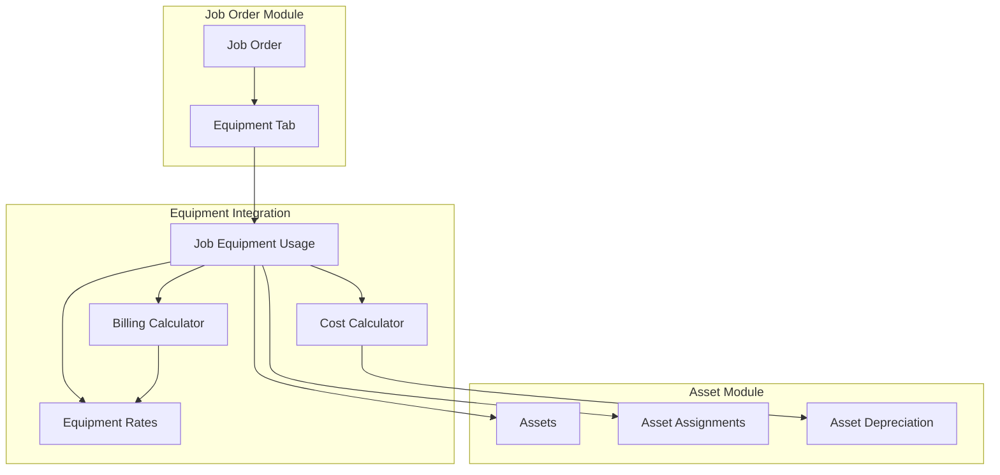

# Design Document: v0.45 Equipment - Job Integration

## Overview

This feature integrates equipment assignment with job orders, enabling comprehensive tracking of which equipment was used for each job and calculating equipment costs per job. It builds upon the existing asset management infrastructure (v0.41-v0.44) and connects equipment utilization directly to job profitability.

The system will:
- Track equipment usage per job with meter readings and usage periods
- Calculate equipment costs including depreciation, fuel, maintenance, and operator costs
- Manage equipment rates for billing purposes
- Integrate equipment costs and billing into job profitability calculations

## Architecture



## Components and Interfaces

### Database Schema

#### job_equipment_usage Table

```sql
CREATE TABLE job_equipment_usage (
  id UUID PRIMARY KEY DEFAULT gen_random_uuid(),
  job_order_id UUID NOT NULL REFERENCES job_orders(id),
  asset_id UUID NOT NULL REFERENCES assets(id),
  assignment_id UUID REFERENCES asset_assignments(id),
  
  -- Usage period
  usage_start DATE NOT NULL,
  usage_end DATE,
  usage_days INTEGER GENERATED ALWAYS AS (
    COALESCE(usage_end, CURRENT_DATE) - usage_start + 1
  ) STORED,
  
  -- Meter readings
  start_km INTEGER,
  end_km INTEGER,
  km_used INTEGER GENERATED ALWAYS AS (end_km - start_km) STORED,
  start_hours DECIMAL(10,2),
  end_hours DECIMAL(10,2),
  hours_used DECIMAL(10,2) GENERATED ALWAYS AS (end_hours - start_hours) STORED,
  
  -- Costs allocated to this job
  depreciation_cost DECIMAL(15,2) DEFAULT 0,
  fuel_cost DECIMAL(15,2) DEFAULT 0,
  maintenance_cost DECIMAL(15,2) DEFAULT 0,
  operator_cost DECIMAL(15,2) DEFAULT 0,
  total_cost DECIMAL(15,2) GENERATED ALWAYS AS (
    depreciation_cost + fuel_cost + maintenance_cost + operator_cost
  ) STORED,
  
  -- Billing
  daily_rate DECIMAL(15,2),
  rate_type VARCHAR(20) DEFAULT 'actual',
  is_billable BOOLEAN DEFAULT TRUE,
  billing_amount DECIMAL(15,2),
  
  notes TEXT,
  created_by UUID REFERENCES user_profiles(id),
  created_at TIMESTAMPTZ DEFAULT NOW(),
  updated_at TIMESTAMPTZ DEFAULT NOW(),
  
  UNIQUE(job_order_id, asset_id, usage_start)
);
```

#### equipment_rates Table

```sql
CREATE TABLE equipment_rates (
  id UUID PRIMARY KEY DEFAULT gen_random_uuid(),
  asset_id UUID REFERENCES assets(id),
  category_id UUID REFERENCES asset_categories(id),
  rate_type VARCHAR(30) NOT NULL, -- 'daily', 'hourly', 'per_km', 'per_trip'
  rate_amount DECIMAL(15,2) NOT NULL,
  min_days INTEGER,
  includes_operator BOOLEAN DEFAULT FALSE,
  includes_fuel BOOLEAN DEFAULT FALSE,
  effective_from DATE NOT NULL,
  effective_to DATE,
  is_active BOOLEAN DEFAULT TRUE,
  created_at TIMESTAMPTZ DEFAULT NOW()
);
```

#### job_orders Table Update

```sql
ALTER TABLE job_orders
ADD COLUMN IF NOT EXISTS equipment_cost DECIMAL(15,2) DEFAULT 0;
```

### TypeScript Interfaces

```typescript
// types/job-equipment.ts

export type RateType = 'daily' | 'hourly' | 'per_km' | 'per_trip';
export type UsageRateType = 'actual' | 'daily' | 'hourly' | 'per_km';

export interface JobEquipmentUsage {
  id: string;
  jobOrderId: string;
  assetId: string;
  assignmentId?: string;
  usageStart: string;
  usageEnd?: string;
  usageDays: number;
  startKm?: number;
  endKm?: number;
  kmUsed?: number;
  startHours?: number;
  endHours?: number;
  hoursUsed?: number;
  depreciationCost: number;
  fuelCost: number;
  maintenanceCost: number;
  operatorCost: number;
  totalCost: number;
  dailyRate?: number;
  rateType: UsageRateType;
  isBillable: boolean;
  billingAmount?: number;
  notes?: string;
  createdBy?: string;
  createdAt: string;
  updatedAt: string;
  // Joined fields
  asset?: {
    assetCode: string;
    assetName: string;
    registrationNumber?: string;
    bookValue?: number;
    usefulLifeYears?: number;
  };
}

export interface EquipmentRate {
  id: string;
  assetId?: string;
  categoryId?: string;
  rateType: RateType;
  rateAmount: number;
  minDays?: number;
  includesOperator: boolean;
  includesFuel: boolean;
  effectiveFrom: string;
  effectiveTo?: string;
  isActive: boolean;
  createdAt: string;
}

export interface JobEquipmentSummary {
  jobOrderId: string;
  joNumber: string;
  customerName: string;
  equipmentCount: number;
  totalEquipmentDays: number;
  totalKm: number;
  totalEquipmentCost: number;
  totalBilling: number;
}

export interface AddEquipmentInput {
  jobOrderId: string;
  assetId: string;
  usageStart: string;
  startKm?: number;
  startHours?: number;
  dailyRate?: number;
  notes?: string;
}

export interface CompleteEquipmentUsageInput {
  usageId: string;
  usageEnd: string;
  endKm?: number;
  endHours?: number;
  fuelCost?: number;
  operatorCost?: number;
  maintenanceCost?: number;
  billingAmount?: number;
}

export interface EquipmentCostSummary {
  totalEquipmentCost: number;
  totalBilling: number;
  equipmentMargin: number;
  equipmentMarginPercent: number;
}
```

### Core Functions

```typescript
// lib/job-equipment-utils.ts

/**
 * Calculate usage days between two dates (inclusive)
 */
export function calculateUsageDays(
  usageStart: string,
  usageEnd: string | null
): number;

/**
 * Calculate meter usage (km or hours)
 */
export function calculateMeterUsage(
  startValue: number | null,
  endValue: number | null
): number | null;

/**
 * Calculate depreciation cost for equipment usage
 */
export function calculateDepreciationCost(
  bookValue: number,
  usefulLifeYears: number,
  usageDays: number
): number;

/**
 * Calculate total equipment cost
 */
export function calculateTotalCost(
  depreciationCost: number,
  fuelCost: number,
  maintenanceCost: number,
  operatorCost: number
): number;

/**
 * Calculate billing amount based on rate type
 */
export function calculateBillingAmount(
  rateType: RateType,
  rateAmount: number,
  usageDays: number,
  hoursUsed: number | null,
  kmUsed: number | null
): number;

/**
 * Calculate equipment margin
 */
export function calculateEquipmentMargin(
  billingAmount: number,
  totalCost: number
): { margin: number; marginPercent: number };

/**
 * Validate equipment usage input
 */
export function validateEquipmentUsageInput(
  input: AddEquipmentInput
): ValidationResult;

/**
 * Validate meter readings
 */
export function validateMeterReadings(
  startKm: number | null,
  endKm: number | null,
  startHours: number | null,
  endHours: number | null
): ValidationResult;

/**
 * Validate usage dates
 */
export function validateUsageDates(
  usageStart: string,
  usageEnd: string | null
): ValidationResult;
```

### Server Actions

```typescript
// lib/job-equipment-actions.ts

/**
 * Add equipment to a job order
 */
export async function addEquipmentToJob(
  input: AddEquipmentInput
): Promise<JobEquipmentUsage>;

/**
 * Complete equipment usage with end readings and costs
 */
export async function completeEquipmentUsage(
  input: CompleteEquipmentUsageInput
): Promise<void>;

/**
 * Get equipment usage for a job
 */
export async function getJobEquipmentUsage(
  jobOrderId: string
): Promise<JobEquipmentUsage[]>;

/**
 * Get equipment rate for an asset
 */
export async function getEquipmentRate(
  assetId: string,
  rateType: RateType
): Promise<number | null>;

/**
 * Update job order equipment cost
 */
export async function updateJobEquipmentCost(
  jobOrderId: string
): Promise<void>;

/**
 * Get job equipment summary
 */
export async function getJobEquipmentSummary(
  jobOrderId: string
): Promise<JobEquipmentSummary>;
```

## Data Models

### Database Row Types

```typescript
export interface JobEquipmentUsageRow {
  id: string;
  job_order_id: string;
  asset_id: string;
  assignment_id: string | null;
  usage_start: string;
  usage_end: string | null;
  usage_days: number;
  start_km: number | null;
  end_km: number | null;
  km_used: number | null;
  start_hours: number | null;
  end_hours: number | null;
  hours_used: number | null;
  depreciation_cost: number;
  fuel_cost: number;
  maintenance_cost: number;
  operator_cost: number;
  total_cost: number;
  daily_rate: number | null;
  rate_type: string;
  is_billable: boolean;
  billing_amount: number | null;
  notes: string | null;
  created_by: string | null;
  created_at: string;
  updated_at: string;
}

export interface EquipmentRateRow {
  id: string;
  asset_id: string | null;
  category_id: string | null;
  rate_type: string;
  rate_amount: number;
  min_days: number | null;
  includes_operator: boolean;
  includes_fuel: boolean;
  effective_from: string;
  effective_to: string | null;
  is_active: boolean;
  created_at: string;
}
```

### Transform Functions

```typescript
export function transformJobEquipmentUsageRow(
  row: JobEquipmentUsageRow
): JobEquipmentUsage;

export function transformEquipmentRateRow(
  row: EquipmentRateRow
): EquipmentRate;
```

## Correctness Properties

*A property is a characteristic or behavior that should hold true across all valid executions of a system-essentially, a formal statement about what the system should do. Properties serve as the bridge between human-readable specifications and machine-verifiable correctness guarantees.*

### Property 1: Usage Days Calculation

*For any* valid usage start date and usage end date (where end >= start), the calculated usage_days SHALL equal (end_date - start_date + 1).

**Validates: Requirements 1.4**

### Property 2: Meter Usage Calculation

*For any* valid meter readings where end_km >= start_km and end_hours >= start_hours, km_used SHALL equal (end_km - start_km) and hours_used SHALL equal (end_hours - start_hours).

**Validates: Requirements 1.5**

### Property 3: Depreciation Cost Calculation

*For any* asset with book_value > 0 and useful_life_years > 0, and usage_days > 0, the depreciation_cost SHALL equal (book_value / (useful_life_years * 365)) * usage_days.

**Validates: Requirements 2.1**

### Property 4: Total Cost Calculation

*For any* equipment usage record, total_cost SHALL equal the sum of depreciation_cost, fuel_cost, maintenance_cost, and operator_cost.

**Validates: Requirements 2.5**

### Property 5: Rate Lookup Priority

*For any* asset with both an asset-specific rate and a category rate for the same rate_type, the rate lookup SHALL return the asset-specific rate.

**Validates: Requirements 3.1, 3.5**

### Property 6: Billing Calculation by Rate Type

*For any* equipment usage with a configured rate:
- If rate_type is 'daily', billing_amount SHALL equal daily_rate * usage_days
- If rate_type is 'hourly', billing_amount SHALL equal hourly_rate * hours_used
- If rate_type is 'per_km', billing_amount SHALL equal per_km_rate * km_used

**Validates: Requirements 4.1, 4.2, 4.3**

### Property 7: Equipment Margin Calculation

*For any* equipment usage with billing_amount and total_cost, equipment_margin SHALL equal (billing_amount - total_cost) and margin_percent SHALL equal ((billing_amount - total_cost) / billing_amount) * 100 when billing_amount > 0.

**Validates: Requirements 7.3, 7.4**

### Property 8: Meter Reading Validation

*For any* meter reading update, the system SHALL reject updates where end_km < start_km or end_hours < start_hours.

**Validates: Requirements 8.4, 8.5**

### Property 9: Usage Date Validation

*For any* equipment usage completion, the system SHALL reject updates where usage_end < usage_start.

**Validates: Requirements 8.3**

### Property 10: Uniqueness Constraint

*For any* attempt to add equipment to a job, the system SHALL reject duplicates with the same (job_order_id, asset_id, usage_start) combination.

**Validates: Requirements 8.6**

## Error Handling

### Validation Errors

| Error Code | Description | Resolution |
|------------|-------------|------------|
| INVALID_ASSET | Asset ID does not exist or is not active | Verify asset exists and is available |
| INVALID_JOB | Job order ID does not exist | Verify job order exists |
| MISSING_START_DATE | Usage start date is required | Provide usage_start date |
| INVALID_DATE_RANGE | End date is before start date | Ensure end >= start |
| INVALID_KM_READING | End km is less than start km | Verify meter readings |
| INVALID_HOURS_READING | End hours is less than start hours | Verify hour meter readings |
| DUPLICATE_USAGE | Equipment already assigned for this date | Use different start date or edit existing |

### Business Logic Errors

| Error Code | Description | Resolution |
|------------|-------------|------------|
| ASSET_NOT_AVAILABLE | Asset is not in 'active' status | Change asset status or select different asset |
| NO_RATE_CONFIGURED | No rate found for asset or category | Configure equipment rate |
| USAGE_ALREADY_COMPLETED | Cannot modify completed usage | Create new usage record |

## Testing Strategy

### Unit Tests

Unit tests will verify specific examples and edge cases:

- Empty/null input handling
- Boundary conditions (zero values, maximum values)
- Date edge cases (same day usage, year boundaries)
- Rate lookup with missing data

### Property-Based Tests

Property-based tests will use fast-check to verify universal properties:

- **Minimum 100 iterations per property test**
- Each test tagged with: **Feature: v0.45-equipment-job-integration, Property N: [property_text]**

Testing framework: **Vitest with fast-check**

Property tests will cover:
1. Usage days calculation correctness
2. Meter usage calculation correctness
3. Depreciation cost formula accuracy
4. Total cost summation
5. Rate lookup priority
6. Billing calculation by rate type
7. Margin calculation accuracy
8. Validation rejection of invalid inputs

### Integration Tests

Integration tests will verify:
- Database constraints (unique, foreign keys)
- Trigger/function execution
- End-to-end flow from adding equipment to cost calculation
