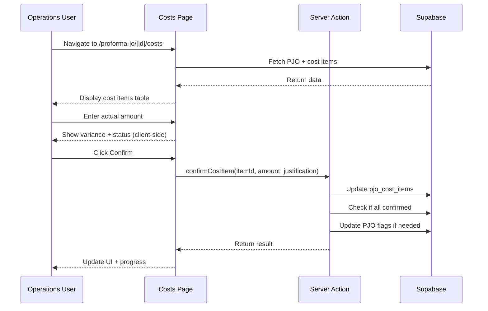

# Design Document: v0.5 - Operations Actual Cost Entry

## Overview

This feature adds a dedicated page for Operations to enter actual costs against approved PJO budgets. The system implements budget control with warnings at 90% threshold, requires justification for exceeded items, tracks confirmation progress, and enables Job Order conversion when all costs are confirmed.

## Architecture

### Page Structure

```
/app/(main)/proforma-jo/[id]/costs/
├── page.tsx          # Server component - fetches PJO and cost items
└── costs-client.tsx  # Client component - interactive cost entry form
```

### Data Flow



## Components and Interfaces

### Server Components

#### `CostsPage` (page.tsx)
- Fetches PJO data with project/customer relations
- Fetches all cost items for the PJO
- Validates PJO status (must be approved)
- Passes data to client component

### Client Components

#### `CostsClient` (costs-client.tsx)
Main container component managing state and interactions.

Props:
```typescript
interface CostsClientProps {
  pjo: PJOWithRelations
  costItems: PJOCostItem[]
  canEdit: boolean  // Based on user role and PJO status
}
```

#### `CostItemRow`
Individual row component for each cost item.

Props:
```typescript
interface CostItemRowProps {
  item: PJOCostItem
  onConfirm: (itemId: string, amount: number, justification?: string) => Promise<void>
  disabled: boolean
}
```

State:
- `actualAmount: number | null` - Current input value
- `justification: string` - Justification text for exceeded items
- `isConfirming: boolean` - Loading state during confirmation

#### `ProgressIndicator`
Shows confirmation progress.

Props:
```typescript
interface ProgressIndicatorProps {
  confirmed: number
  total: number
  allConfirmed: boolean
  hasOverruns: boolean
}
```

#### `BudgetWarning`
Displays warning/error messages for budget status.

Props:
```typescript
interface BudgetWarningProps {
  status: CostItemStatus
  variance: number
  variancePct: number
  estimatedAmount: number
}
```

### Server Actions

#### `confirmCostItem`
```typescript
async function confirmCostItem(
  itemId: string,
  actualAmount: number,
  justification?: string
): Promise<{ success: boolean; error?: string }>
```

#### `checkAllCostsConfirmed`
```typescript
async function checkAllCostsConfirmed(
  pjoId: string
): Promise<{ allConfirmed: boolean; hasOverruns: boolean }>
```

## Data Models

### Existing Tables (No Changes)

#### `pjo_cost_items`
```sql
-- Already exists with these fields:
id, pjo_id, category, description, estimated_amount,
actual_amount, variance, variance_pct, status,
estimated_by, confirmed_by, confirmed_at, justification, notes
```

#### `proforma_job_orders`
```sql
-- Already has these fields:
all_costs_confirmed, has_cost_overruns, total_cost_actual
```

### Status Calculation Logic

```typescript
function calculateCostStatus(
  estimated: number,
  actual: number
): { status: CostItemStatus; variance: number; variancePct: number } {
  const variance = actual - estimated
  const variancePct = (variance / estimated) * 100
  
  let status: CostItemStatus
  if (actual <= estimated * 0.9) {
    status = 'confirmed'
  } else if (actual <= estimated) {
    status = 'at_risk'
  } else {
    status = 'exceeded'
  }
  
  return { status, variance, variancePct }
}
```

### Type Definitions

```typescript
// Already defined in types/database.ts
type CostItemStatus = 'estimated' | 'confirmed' | 'at_risk' | 'exceeded'

interface CostItemWithCalculations extends PJOCostItem {
  calculatedVariance: number
  calculatedVariancePct: number
  calculatedStatus: CostItemStatus
}
```


## Correctness Properties

*A property is a characteristic or behavior that should hold true across all valid executions of a system-essentially, a formal statement about what the system should do. Properties serve as the bridge between human-readable specifications and machine-verifiable correctness guarantees.*

### Property 1: Status Calculation

*For any* estimated amount > 0 and actual amount ≥ 0, the calculated status SHALL be:
- "confirmed" when actual ≤ 90% of estimated
- "at_risk" when actual > 90% of estimated AND actual ≤ estimated
- "exceeded" when actual > estimated

**Validates: Requirements 4.1, 4.3, 5.1, 10.2**

### Property 2: Variance Calculation

*For any* estimated amount and actual amount, the variance SHALL equal (actual - estimated) and variance percentage SHALL equal ((actual - estimated) / estimated) * 100

**Validates: Requirements 2.4, 3.2, 4.2**

### Property 3: Justification Validation

*For any* cost item where actual > estimated:
- If justification is empty or less than 10 characters, confirmation SHALL be blocked
- If justification is 10+ characters, confirmation SHALL be allowed

**Validates: Requirements 5.3, 5.4, 6.2**

### Property 4: Edit Permission

*For any* user and PJO combination, editing SHALL be allowed if and only if:
- User role is "ops" OR "admin"
- AND PJO status is "approved"
- AND PJO has not been converted to Job Order (converted_to_jo is false)

**Validates: Requirements 9.1, 9.2, 9.3, 9.4**

### Property 5: Progress Calculation

*For any* list of cost items, the confirmed count SHALL equal the number of items where actual_amount is not null and confirmed_at is not null

**Validates: Requirements 7.1**

### Property 6: Total Cost Calculation

*For any* list of confirmed cost items, total_cost_actual SHALL equal the sum of all actual_amount values

**Validates: Requirements 10.4**

### Property 7: Has Overruns Flag

*For any* list of cost items, has_cost_overruns SHALL be true if and only if at least one item has status "exceeded"

**Validates: Requirements 10.5**

### Property 8: Currency Formatting

*For any* numeric amount, the formatted IDR string SHALL match the pattern "Rp X.XXX.XXX" with period separators for thousands

**Validates: Requirements 2.2**

## Error Handling

### User Errors

| Error | Handling |
|-------|----------|
| Actual amount empty | Show inline validation message, disable Confirm button |
| Actual amount negative | Show inline validation message, disable Confirm button |
| Justification too short (exceeded item) | Show character count, disable Confirm button |
| Unauthorized access | Redirect to PJO detail page with error toast |

### System Errors

| Error | Handling |
|-------|----------|
| PJO not found | Show 404 page |
| Database update fails | Show error toast, keep form state for retry |
| Network error | Show error toast with retry option |

### Edge Cases

| Case | Handling |
|------|----------|
| PJO with no cost items | Show empty state message |
| All items already confirmed | Show read-only view with success message |
| Concurrent edit by another user | Optimistic update with conflict resolution on save |

## Testing Strategy

### Property-Based Testing Library

**Library**: fast-check (TypeScript)

### Unit Tests

1. **Status calculation function**
   - Test boundary conditions (exactly 90%, exactly 100%)
   - Test with various estimated/actual combinations

2. **Variance calculation function**
   - Test positive and negative variances
   - Test zero variance case

3. **Edit permission logic**
   - Test all role combinations
   - Test all PJO status combinations

4. **Progress calculation**
   - Test empty list
   - Test partially confirmed
   - Test fully confirmed

### Property-Based Tests

Each correctness property will have a corresponding property-based test:

1. **Property 1 Test**: Generate random estimated (> 0) and actual (≥ 0) amounts, verify status matches formula
2. **Property 2 Test**: Generate random amounts, verify variance calculation
3. **Property 3 Test**: Generate exceeded items with various justification lengths, verify validation
4. **Property 4 Test**: Generate random user roles, PJO statuses, and conversion states, verify edit permission
5. **Property 5 Test**: Generate random cost item lists with various confirmation states, verify count
6. **Property 6 Test**: Generate random confirmed cost items, verify sum
7. **Property 7 Test**: Generate random cost item lists with various statuses, verify flag
8. **Property 8 Test**: Generate random numeric amounts, verify IDR format pattern

### Integration Tests

1. **Confirm cost item flow**
   - Enter actual amount → Click Confirm → Verify database update

2. **All costs confirmed flow**
   - Confirm all items → Verify PJO flags updated → Verify Create JO button enabled

3. **Access control**
   - Test page access with different user roles
