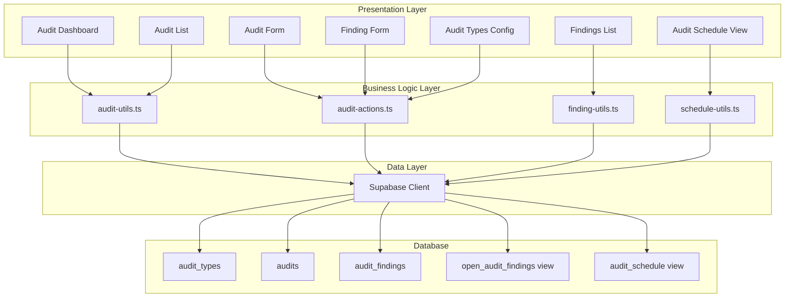

# Design Document: HSE Audit & Inspection

## Overview

The HSE Audit & Inspection module provides a comprehensive system for managing safety audits and inspections within the Gama ERP platform. It enables HSE officers to configure audit types with customizable checklists, schedule recurring inspections, conduct audits with evidence capture, document findings with severity classification, and track corrective actions to verified closure.

The module integrates with existing HSE infrastructure (incidents, safety documents, PPE, training) and connects to assets, job orders, and employee records for comprehensive safety management.

## Architecture



## Components and Interfaces

### Database Tables

#### audit_types
Stores audit/inspection type configurations with checklist templates.

```typescript
interface AuditType {
  id: string;
  type_code: string;
  type_name: string;
  description: string | null;
  category: AuditCategory;
  frequency_days: number | null;
  checklist_template: ChecklistTemplate;
  is_active: boolean;
  created_at: string;
}

type AuditCategory = 
  | 'safety_audit'
  | 'workplace_inspection'
  | 'vehicle_inspection'
  | 'equipment_inspection'
  | 'environmental_audit';

interface ChecklistTemplate {
  sections: ChecklistSection[];
}

interface ChecklistSection {
  name: string;
  items: ChecklistItem[];
}

interface ChecklistItem {
  question: string;
  type: 'yes_no' | 'rating' | 'text' | 'select';
  options?: string[];
  weight: number;
  required: boolean;
}
```

#### audits
Stores conducted audits and inspections.

```typescript
interface Audit {
  id: string;
  audit_number: string;
  audit_type_id: string;
  scheduled_date: string | null;
  conducted_date: string | null;
  location: string | null;
  department_id: string | null;
  asset_id: string | null;
  job_order_id: string | null;
  auditor_id: string | null;
  auditor_name: string | null;
  checklist_responses: ChecklistResponse[];
  overall_score: number | null;
  overall_rating: AuditRating | null;
  summary: string | null;
  critical_findings: number;
  major_findings: number;
  minor_findings: number;
  observations: number;
  status: AuditStatus;
  completed_at: string | null;
  photos: string[];
  documents: string[];
  created_by: string | null;
  created_at: string;
}

type AuditStatus = 'scheduled' | 'in_progress' | 'completed' | 'cancelled';
type AuditRating = 'pass' | 'conditional_pass' | 'fail';

interface ChecklistResponse {
  section: string;
  item_index: number;
  question: string;
  response: string | boolean | number;
  notes: string | null;
  finding_created: boolean;
}
```

#### audit_findings
Stores findings discovered during audits.

```typescript
interface AuditFinding {
  id: string;
  audit_id: string;
  finding_number: number;
  severity: FindingSeverity;
  category: string | null;
  finding_description: string;
  location_detail: string | null;
  photos: string[];
  risk_level: RiskLevel | null;
  potential_consequence: string | null;
  corrective_action: string | null;
  responsible_id: string | null;
  due_date: string | null;
  status: FindingStatus;
  closed_by: string | null;
  closed_at: string | null;
  closure_evidence: string | null;
  verified_by: string | null;
  verified_at: string | null;
  created_at: string;
}

type FindingSeverity = 'critical' | 'major' | 'minor' | 'observation';
type FindingStatus = 'open' | 'in_progress' | 'closed' | 'verified';
type RiskLevel = 'high' | 'medium' | 'low';
```

### Utility Functions

#### lib/audit-utils.ts

```typescript
// Score calculation
function calculateAuditScore(
  template: ChecklistTemplate,
  responses: ChecklistResponse[]
): number;

function determineAuditRating(score: number): AuditRating;

// Scheduling
function calculateNextDueDate(
  lastConducted: Date | null,
  frequencyDays: number
): Date;

function isAuditOverdue(
  scheduledDate: Date,
  currentDate: Date
): boolean;

function getAuditsDueSoon(
  audits: AuditScheduleItem[],
  daysAhead: number
): AuditScheduleItem[];

// Findings
function sortFindingsBySeverity(
  findings: AuditFinding[]
): AuditFinding[];

function calculateDaysOverdue(
  dueDate: Date,
  currentDate: Date
): number;

function countFindingsBySeverity(
  findings: AuditFinding[]
): FindingCounts;

// Dashboard metrics
function calculateDashboardMetrics(
  audits: Audit[],
  findings: AuditFinding[],
  schedule: AuditScheduleItem[]
): AuditDashboardMetrics;

// Validation
function validateAuditType(auditType: Partial<AuditType>): ValidationResult;
function validateAudit(audit: Partial<Audit>): ValidationResult;
function validateFinding(finding: Partial<AuditFinding>): ValidationResult;
```

#### lib/audit-actions.ts

```typescript
// Audit Type CRUD
async function createAuditType(data: CreateAuditTypeInput): Promise<AuditType>;
async function updateAuditType(id: string, data: UpdateAuditTypeInput): Promise<AuditType>;
async function deactivateAuditType(id: string): Promise<void>;

// Audit CRUD
async function createAudit(data: CreateAuditInput): Promise<Audit>;
async function updateAudit(id: string, data: UpdateAuditInput): Promise<Audit>;
async function completeAudit(id: string, data: CompleteAuditInput): Promise<Audit>;
async function cancelAudit(id: string): Promise<void>;

// Finding CRUD
async function createFinding(data: CreateFindingInput): Promise<AuditFinding>;
async function updateFinding(id: string, data: UpdateFindingInput): Promise<AuditFinding>;
async function closeFinding(id: string, data: CloseFindingInput): Promise<AuditFinding>;
async function verifyFinding(id: string): Promise<AuditFinding>;

// Queries
async function getAuditSchedule(): Promise<AuditScheduleItem[]>;
async function getOpenFindings(): Promise<OpenFindingView[]>;
async function getAuditDashboardData(): Promise<AuditDashboardData>;
```

### React Components

#### Dashboard Components

```typescript
// components/hse/audits/audit-dashboard.tsx
interface AuditDashboardProps {
  metrics: AuditDashboardMetrics;
  upcomingAudits: AuditScheduleItem[];
  criticalFindings: OpenFindingView[];
}

// components/hse/audits/audit-summary-cards.tsx
interface AuditSummaryCardsProps {
  dueSoonCount: number;
  openFindingsCount: number;
  criticalFindingsCount: number;
  averageScore: number;
}

// components/hse/audits/upcoming-audits-list.tsx
interface UpcomingAuditsListProps {
  audits: AuditScheduleItem[];
  onStartAudit: (auditTypeId: string) => void;
}

// components/hse/audits/critical-findings-list.tsx
interface CriticalFindingsListProps {
  findings: OpenFindingView[];
  onViewFinding: (id: string) => void;
  onMarkComplete: (id: string) => void;
}
```

#### Audit Management Components

```typescript
// components/hse/audits/audit-list.tsx
interface AuditListProps {
  audits: Audit[];
  onView: (id: string) => void;
  onEdit: (id: string) => void;
}

// components/hse/audits/audit-form.tsx
interface AuditFormProps {
  auditType: AuditType;
  audit?: Audit;
  onSubmit: (data: AuditFormData) => void;
  onCancel: () => void;
}

// components/hse/audits/checklist-form.tsx
interface ChecklistFormProps {
  template: ChecklistTemplate;
  responses: ChecklistResponse[];
  onResponseChange: (response: ChecklistResponse) => void;
  onAddFinding: (itemIndex: number, section: string) => void;
}

// components/hse/audits/audit-detail-view.tsx
interface AuditDetailViewProps {
  audit: Audit;
  auditType: AuditType;
  findings: AuditFinding[];
}
```

#### Finding Components

```typescript
// components/hse/audits/finding-list.tsx
interface FindingListProps {
  findings: AuditFinding[];
  onView: (id: string) => void;
  onClose: (id: string) => void;
}

// components/hse/audits/finding-form.tsx
interface FindingFormProps {
  auditId: string;
  finding?: AuditFinding;
  employees: Employee[];
  onSubmit: (data: FindingFormData) => void;
  onCancel: () => void;
}

// components/hse/audits/finding-closure-dialog.tsx
interface FindingClosureDialogProps {
  finding: AuditFinding;
  onClose: (evidence: string) => void;
  onCancel: () => void;
}
```

#### Configuration Components

```typescript
// components/hse/audits/audit-type-form.tsx
interface AuditTypeFormProps {
  auditType?: AuditType;
  onSubmit: (data: AuditTypeFormData) => void;
  onCancel: () => void;
}

// components/hse/audits/checklist-template-editor.tsx
interface ChecklistTemplateEditorProps {
  template: ChecklistTemplate;
  onChange: (template: ChecklistTemplate) => void;
}

// components/hse/audits/audit-schedule-view.tsx
interface AuditScheduleViewProps {
  schedule: AuditScheduleItem[];
  onScheduleAudit: (auditTypeId: string, date: Date) => void;
}
```

## Data Models

### Dashboard Metrics

```typescript
interface AuditDashboardMetrics {
  dueSoonCount: number;
  openFindingsCount: number;
  criticalFindingsCount: number;
  averageScoreMTD: number;
  overdueAuditsCount: number;
}

interface AuditScheduleItem {
  audit_type_id: string;
  type_code: string;
  type_name: string;
  frequency_days: number;
  last_conducted: string | null;
  next_due: string;
  is_overdue: boolean;
}

interface OpenFindingView {
  id: string;
  audit_id: string;
  audit_number: string;
  audit_type: string;
  finding_number: number;
  severity: FindingSeverity;
  finding_description: string;
  location: string | null;
  responsible_name: string | null;
  due_date: string | null;
  days_overdue: number;
  status: FindingStatus;
}
```

### Form Data Types

```typescript
interface CreateAuditInput {
  audit_type_id: string;
  scheduled_date?: string;
  location?: string;
  department_id?: string;
  asset_id?: string;
  job_order_id?: string;
  auditor_id?: string;
  auditor_name?: string;
}

interface CompleteAuditInput {
  checklist_responses: ChecklistResponse[];
  summary?: string;
  photos?: string[];
  documents?: string[];
}

interface CreateFindingInput {
  audit_id: string;
  severity: FindingSeverity;
  category?: string;
  finding_description: string;
  location_detail?: string;
  photos?: string[];
  risk_level?: RiskLevel;
  potential_consequence?: string;
  corrective_action?: string;
  responsible_id?: string;
  due_date?: string;
}

interface CloseFindingInput {
  closure_evidence: string;
}
```

### Validation Types

```typescript
interface ValidationResult {
  valid: boolean;
  errors: ValidationError[];
}

interface ValidationError {
  field: string;
  message: string;
}

interface FindingCounts {
  critical: number;
  major: number;
  minor: number;
  observation: number;
  total: number;
}
```

## Correctness Properties

*A property is a characteristic or behavior that should hold true across all valid executions of a system-essentially, a formal statement about what the system should do. Properties serve as the bridge between human-readable specifications and machine-verifiable correctness guarantees.*


### Property 1: Audit Type Creation Preserves Fields

*For any* valid audit type input with type_code, type_name, description, and category, creating the audit type SHALL produce an object containing all provided fields with their original values.

**Validates: Requirements 1.1**

### Property 2: Audit Type Code Uniqueness

*For any* two audit type creation attempts with the same type_code, the second attempt SHALL be rejected with a validation error.

**Validates: Requirements 1.2**

### Property 3: Category Validation

*For any* audit type creation with a category value, the system SHALL accept only values from the set {safety_audit, workplace_inspection, vehicle_inspection, equipment_inspection, environmental_audit} and reject all others.

**Validates: Requirements 1.3**

### Property 4: Checklist Template Structure Validation

*For any* checklist template, the system SHALL accept templates with valid structure (sections containing items with question, type, weight, required) and reject malformed templates.

**Validates: Requirements 1.5**

### Property 5: Audit Type Deactivation

*For any* active audit type, deactivating it SHALL set is_active to false, and the type SHALL be excluded from the list of active audit types.

**Validates: Requirements 1.6**

### Property 6: Next Due Date Calculation

*For any* audit type with frequency_days and a last_conducted date, the calculated next_due date SHALL equal last_conducted plus frequency_days.

**Validates: Requirements 2.1**

### Property 7: Due Soon Audit Identification

*For any* set of scheduled audits and a reference date, audits with next_due within the specified days-ahead window SHALL be included in the "due soon" list, and audits outside this window SHALL be excluded.

**Validates: Requirements 2.4, 6.1**

### Property 8: Audit Number Format

*For any* newly created audit, the generated audit_number SHALL match the pattern AUD-YYYY-NNNNN where YYYY is the current year and NNNNN is a zero-padded sequence number.

**Validates: Requirements 3.1**

### Property 9: Audit Score Calculation

*For any* completed checklist with weighted items and responses, the calculated overall_score SHALL be a percentage (0-100) representing the weighted sum of positive responses divided by total possible weight.

**Validates: Requirements 3.5**

### Property 10: Audit Rating Determination

*For any* audit score, the overall_rating SHALL be determined as: 'pass' for scores >= 80, 'conditional_pass' for scores >= 60 and < 80, 'fail' for scores < 60.

**Validates: Requirements 3.6**

### Property 11: Audit Completion State

*For any* audit that is completed, the status SHALL be 'completed' and completed_at SHALL be a non-null timestamp.

**Validates: Requirements 3.9**

### Property 12: Finding Severity Validation

*For any* finding creation, the system SHALL require a severity value from the set {critical, major, minor, observation} and reject findings without valid severity.

**Validates: Requirements 4.1**

### Property 13: Finding Count Increment

*For any* finding created with a given severity, the parent audit's corresponding severity count (critical_findings, major_findings, minor_findings, or observations) SHALL be incremented by exactly 1.

**Validates: Requirements 4.6**

### Property 14: Finding Sort Order

*For any* list of findings, sorting by severity then due_date SHALL produce a list where critical findings appear before major, major before minor, minor before observations, and within each severity, earlier due dates appear first.

**Validates: Requirements 4.7**

### Property 15: Finding Closure Requirements

*For any* finding closure attempt, the system SHALL require non-empty closure_evidence and reject closure attempts without it.

**Validates: Requirements 5.2**

### Property 16: Finding Closure Metadata

*For any* finding that is closed, closed_by SHALL be set to the closing user's ID and closed_at SHALL be a non-null timestamp.

**Validates: Requirements 5.3**

### Property 17: Finding Verification Metadata

*For any* finding that is verified, verified_by SHALL be set to the verifying user's ID and verified_at SHALL be a non-null timestamp.

**Validates: Requirements 5.5**

### Property 18: Overdue Days Calculation

*For any* finding with a due_date that is before the current date and status not in {closed, verified}, days_overdue SHALL equal the number of days between due_date and current_date.

**Validates: Requirements 5.6**

### Property 19: Open Findings Identification

*For any* set of findings, the open findings view SHALL include exactly those findings with status NOT in {closed, verified} and exclude all others.

**Validates: Requirements 5.7, 6.2**

### Property 20: Critical Findings Count

*For any* set of findings, the critical findings count SHALL equal the number of findings with severity='critical' AND status NOT in {closed, verified}.

**Validates: Requirements 6.3**

### Property 21: Average Score Calculation

*For any* set of completed audits within a date range, the average score SHALL equal the sum of all overall_score values divided by the count of audits.

**Validates: Requirements 6.4**

### Property 22: Critical and Major Findings Filter

*For any* set of open findings, filtering for critical and major SHALL include exactly those findings with severity in {critical, major} and exclude minor and observation findings.

**Validates: Requirements 6.6**

### Property 23: Audit List Filtering

*For any* set of audits and filter criteria (type, status, date range, location), the filtered list SHALL include exactly those audits matching ALL specified criteria.

**Validates: Requirements 7.1**

### Property 24: Finding List Filtering

*For any* set of findings and filter criteria (severity, status, responsible person), the filtered list SHALL include exactly those findings matching ALL specified criteria.

**Validates: Requirements 7.3**

## Error Handling

### Validation Errors

| Error Code | Condition | User Message |
|------------|-----------|--------------|
| `AUDIT_TYPE_CODE_EXISTS` | Duplicate type_code | "An audit type with this code already exists" |
| `INVALID_CATEGORY` | Invalid category value | "Invalid audit category" |
| `INVALID_CHECKLIST_TEMPLATE` | Malformed template JSON | "Invalid checklist template structure" |
| `AUDIT_TYPE_NOT_FOUND` | Referenced audit type doesn't exist | "Audit type not found" |
| `AUDIT_NOT_FOUND` | Referenced audit doesn't exist | "Audit not found" |
| `FINDING_NOT_FOUND` | Referenced finding doesn't exist | "Finding not found" |
| `INVALID_SEVERITY` | Invalid severity value | "Invalid finding severity" |
| `CLOSURE_EVIDENCE_REQUIRED` | Missing closure evidence | "Closure evidence is required" |
| `CANNOT_VERIFY_OWN_CLOSURE` | Same user trying to verify | "Cannot verify your own closure" |

### State Transition Errors

| Error Code | Condition | User Message |
|------------|-----------|--------------|
| `AUDIT_ALREADY_COMPLETED` | Trying to modify completed audit | "Cannot modify a completed audit" |
| `AUDIT_CANCELLED` | Trying to modify cancelled audit | "Cannot modify a cancelled audit" |
| `FINDING_ALREADY_CLOSED` | Trying to close closed finding | "Finding is already closed" |
| `FINDING_NOT_CLOSED` | Trying to verify open finding | "Finding must be closed before verification" |

### Database Errors

| Error Code | Condition | User Message |
|------------|-----------|--------------|
| `DB_CONNECTION_ERROR` | Database unavailable | "Unable to connect to database" |
| `CONSTRAINT_VIOLATION` | Foreign key or unique constraint | "Data integrity error" |

## Testing Strategy

### Unit Tests

Unit tests will cover:
- Validation functions for audit types, audits, and findings
- Score calculation with various response combinations
- Rating determination at boundary values
- Date calculations for scheduling and overdue detection
- Sorting algorithms for findings
- Filter functions for lists and views

### Property-Based Tests

Property-based tests will use `fast-check` library with minimum 100 iterations per property.

Each property test will be tagged with:
- **Feature: hse-audit-inspection, Property {number}: {property_text}**

Key property tests:
1. Score calculation produces values in [0, 100] range
2. Rating determination is consistent with score thresholds
3. Sorting maintains severity order invariant
4. Filtering produces subsets of original data
5. Count calculations match manual enumeration
6. Date arithmetic is reversible (round-trip)

### Integration Tests

Integration tests will verify:
- Complete audit workflow from creation to completion
- Finding lifecycle from creation through verification
- Dashboard metrics accuracy with real data
- View queries return expected data shapes

### Test Data Generators

```typescript
// Generators for property-based testing
const auditTypeGenerator = fc.record({
  type_code: fc.string({ minLength: 1, maxLength: 30 }),
  type_name: fc.string({ minLength: 1, maxLength: 100 }),
  category: fc.constantFrom(
    'safety_audit', 'workplace_inspection', 
    'vehicle_inspection', 'equipment_inspection', 
    'environmental_audit'
  ),
  frequency_days: fc.option(fc.integer({ min: 1, max: 365 })),
});

const findingSeverityGenerator = fc.constantFrom(
  'critical', 'major', 'minor', 'observation'
);

const findingGenerator = fc.record({
  severity: findingSeverityGenerator,
  finding_description: fc.string({ minLength: 1 }),
  due_date: fc.date(),
  status: fc.constantFrom('open', 'in_progress', 'closed', 'verified'),
});

const checklistResponseGenerator = fc.record({
  response: fc.oneof(fc.boolean(), fc.integer({ min: 1, max: 5 })),
  weight: fc.integer({ min: 1, max: 10 }),
});
```
