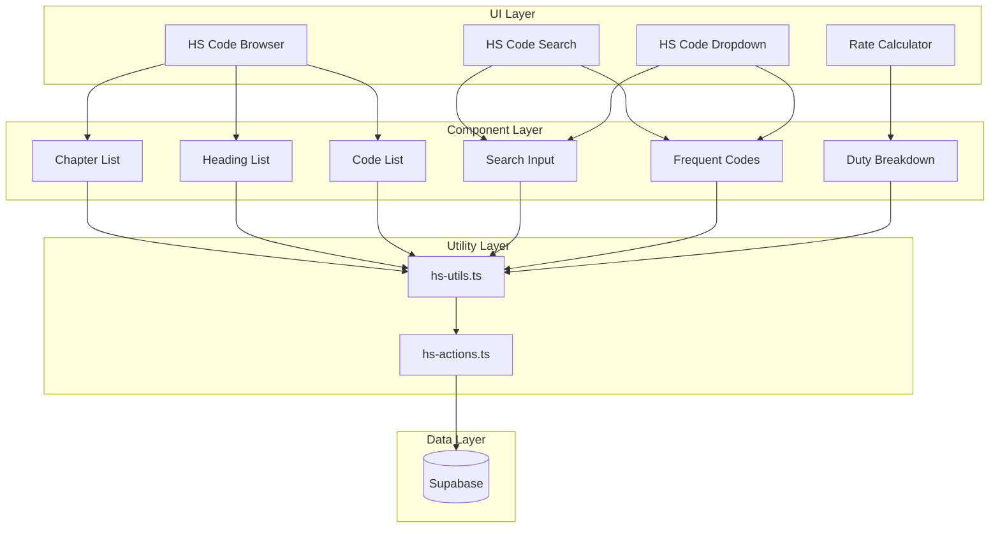

# Design Document: HS Code Management

## Overview

The HS Code Management module provides a comprehensive database of Harmonized System codes for customs classification in Gama ERP. It enables users to search, browse, and select HS codes for import/export documentation (PIB/PEB), with automatic duty rate calculation and restriction warnings.

The module consists of:
- Hierarchical HS code database (chapters → headings → codes)
- Multi-language search (English/Indonesian) with relevance ranking
- Preferential rate management by FTA with date validity
- Duty calculator with itemized breakdown
- User search history for frequently used code suggestions
- Reusable dropdown component for PIB/PEB integration

## Architecture



## Components and Interfaces

### Core Utility Functions (lib/hs-utils.ts)

```typescript
// Search HS codes by code prefix or description
function searchHSCodes(
  query: string,
  limit?: number
): Promise<HSCodeSearchResult[]>

// Get duty rates for an HS code
function getHSCodeRates(hsCode: string): Promise<HSCodeRates>

// Get preferential rate for specific FTA
function getPreferentialRate(
  hsCode: string,
  ftaCode: FTACode
): Promise<number | null>

// Calculate total duties
function calculateDuties(
  hsCode: string,
  cifValue: number,
  ftaCode?: FTACode
): Promise<DutyCalculation>

// Get frequently used HS codes for user
function getFrequentHSCodes(
  userId: string,
  limit?: number
): Promise<HSCode[]>

// Get chapters list
function getHSChapters(): Promise<HSChapter[]>

// Get headings for a chapter
function getHSHeadings(chapterId: string): Promise<HSHeading[]>

// Get HS codes for a heading
function getHSCodesForHeading(headingId: string): Promise<HSCode[]>

// Calculate relevance score for search ranking
function calculateRelevance(query: string, description: string): number
```

### Server Actions (lib/hs-actions.ts)

```typescript
// Log search selection for history
async function logHSCodeSearch(
  searchTerm: string,
  selectedHSCode: string
): Promise<void>

// Create new HS code (admin only)
async function createHSCode(data: HSCodeInput): Promise<HSCode>

// Update HS code (admin only)
async function updateHSCode(
  id: string,
  data: Partial<HSCodeInput>
): Promise<HSCode>

// Deactivate HS code (soft delete)
async function deactivateHSCode(id: string): Promise<void>

// Create/update preferential rate
async function upsertPreferentialRate(
  data: PreferentialRateInput
): Promise<HSPreferentialRate>
```

### UI Components

| Component | Purpose | Location |
|-----------|---------|----------|
| HSCodeSearch | Searchable input with results dropdown | components/hs-codes/hs-code-search.tsx |
| HSCodeBrowser | Hierarchical chapter/heading/code browser | components/hs-codes/hs-code-browser.tsx |
| HSCodeDropdown | Reusable dropdown for PIB/PEB forms | components/hs-codes/hs-code-dropdown.tsx |
| RateCalculator | Duty calculation with breakdown | components/hs-codes/rate-calculator.tsx |
| ChapterList | List of HS chapters | components/hs-codes/chapter-list.tsx |
| HeadingList | List of headings in a chapter | components/hs-codes/heading-list.tsx |
| HSCodeList | List of HS codes in a heading | components/hs-codes/hs-code-list.tsx |
| DutyBreakdown | Itemized duty display | components/hs-codes/duty-breakdown.tsx |
| RestrictionBadge | Warning badge for restricted codes | components/hs-codes/restriction-badge.tsx |
| FrequentCodesList | User's frequently used codes | components/hs-codes/frequent-codes-list.tsx |

## Data Models

### Database Schema

```sql
-- HS Code chapters (2 digits)
CREATE TABLE hs_chapters (
  id UUID PRIMARY KEY DEFAULT gen_random_uuid(),
  chapter_code VARCHAR(2) UNIQUE NOT NULL,
  chapter_name VARCHAR(500) NOT NULL,
  chapter_name_id VARCHAR(500),
  section_number INTEGER,
  section_name VARCHAR(500),
  created_at TIMESTAMPTZ DEFAULT NOW()
);

-- HS Code headings (4 digits)
CREATE TABLE hs_headings (
  id UUID PRIMARY KEY DEFAULT gen_random_uuid(),
  heading_code VARCHAR(4) UNIQUE NOT NULL,
  chapter_id UUID REFERENCES hs_chapters(id),
  heading_name VARCHAR(500) NOT NULL,
  heading_name_id VARCHAR(500),
  created_at TIMESTAMPTZ DEFAULT NOW()
);

-- HS Code full (8-10 digits Indonesian BTKI)
CREATE TABLE hs_codes (
  id UUID PRIMARY KEY DEFAULT gen_random_uuid(),
  hs_code VARCHAR(12) UNIQUE NOT NULL,
  heading_id UUID REFERENCES hs_headings(id),
  description VARCHAR(1000) NOT NULL,
  description_id VARCHAR(1000),
  statistical_unit VARCHAR(20),
  mfn_rate DECIMAL(5,2) DEFAULT 0,
  ppn_rate DECIMAL(5,2) DEFAULT 11,
  ppnbm_rate DECIMAL(5,2) DEFAULT 0,
  pph_import_rate DECIMAL(5,2) DEFAULT 2.5,
  has_restrictions BOOLEAN DEFAULT FALSE,
  restriction_type VARCHAR(100),
  issuing_authority VARCHAR(200),
  has_export_restrictions BOOLEAN DEFAULT FALSE,
  export_restriction_type VARCHAR(100),
  is_active BOOLEAN DEFAULT TRUE,
  created_at TIMESTAMPTZ DEFAULT NOW(),
  updated_at TIMESTAMPTZ DEFAULT NOW()
);

-- HS Code preferential rates by FTA
CREATE TABLE hs_preferential_rates (
  id UUID PRIMARY KEY DEFAULT gen_random_uuid(),
  hs_code_id UUID NOT NULL REFERENCES hs_codes(id),
  fta_code VARCHAR(20) NOT NULL,
  preferential_rate DECIMAL(5,2),
  effective_from DATE,
  effective_to DATE,
  requires_coo BOOLEAN DEFAULT TRUE,
  UNIQUE(hs_code_id, fta_code)
);

-- HS Code search history
CREATE TABLE hs_code_search_history (
  id UUID PRIMARY KEY DEFAULT gen_random_uuid(),
  user_id UUID REFERENCES user_profiles(id),
  search_term VARCHAR(200),
  selected_hs_code VARCHAR(12),
  searched_at TIMESTAMPTZ DEFAULT NOW()
);

-- Indexes for search performance
CREATE INDEX idx_hs_codes_code ON hs_codes(hs_code);
CREATE INDEX idx_hs_codes_description ON hs_codes 
  USING gin(to_tsvector('english', description));
CREATE INDEX idx_hs_codes_description_id ON hs_codes 
  USING gin(to_tsvector('indonesian', description_id));
CREATE INDEX idx_hs_headings_code ON hs_headings(heading_code);
CREATE INDEX idx_hs_search_history_user ON hs_code_search_history(user_id);
```

### TypeScript Types (types/hs-codes.ts)

```typescript
export type FTACode = 
  | 'ATIGA'    // ASEAN Trade in Goods Agreement
  | 'ACFTA'    // ASEAN-China FTA
  | 'AKFTA'    // ASEAN-Korea FTA
  | 'AJCEP'    // ASEAN-Japan Comprehensive Economic Partnership
  | 'AANZFTA'  // ASEAN-Australia-New Zealand FTA
  | 'IJEPA';   // Indonesia-Japan Economic Partnership Agreement

export interface HSChapter {
  id: string;
  chapterCode: string;
  chapterName: string;
  chapterNameId?: string;
  sectionNumber?: number;
  sectionName?: string;
  createdAt: string;
}

export interface HSHeading {
  id: string;
  headingCode: string;
  chapterId: string;
  headingName: string;
  headingNameId?: string;
  chapter?: HSChapter;
  createdAt: string;
}

export interface HSCode {
  id: string;
  hsCode: string;
  headingId: string;
  description: string;
  descriptionId?: string;
  statisticalUnit?: string;
  mfnRate: number;
  ppnRate: number;
  ppnbmRate: number;
  pphImportRate: number;
  hasRestrictions: boolean;
  restrictionType?: string;
  issuingAuthority?: string;
  hasExportRestrictions: boolean;
  exportRestrictionType?: string;
  isActive: boolean;
  heading?: HSHeading;
  createdAt: string;
  updatedAt: string;
}

export interface HSCodeSearchResult extends HSCode {
  relevanceScore: number;
  chapterName?: string;
}

export interface HSCodeRates {
  bmRate: number;      // Import duty (MFN)
  ppnRate: number;     // VAT
  ppnbmRate: number;   // Luxury goods tax
  pphRate: number;     // Income tax on import
  hasRestrictions: boolean;
  restrictionType?: string;
}

export interface HSPreferentialRate {
  id: string;
  hsCodeId: string;
  ftaCode: FTACode;
  preferentialRate: number;
  effectiveFrom?: string;
  effectiveTo?: string;
  requiresCoo: boolean;
}

export interface DutyCalculation {
  cifValue: number;
  bmRate: number;
  bmAmount: number;
  ppnBase: number;
  ppnRate: number;
  ppnAmount: number;
  ppnbmRate: number;
  ppnbmAmount: number;
  pphBase: number;
  pphRate: number;
  pphAmount: number;
  totalDuties: number;
  usedPreferentialRate: boolean;
  ftaCode?: FTACode;
}

export interface HSCodeSearchHistory {
  id: string;
  userId: string;
  searchTerm: string;
  selectedHsCode: string;
  searchedAt: string;
}

export interface HSCodeInput {
  hsCode: string;
  headingId: string;
  description: string;
  descriptionId?: string;
  statisticalUnit?: string;
  mfnRate?: number;
  ppnRate?: number;
  ppnbmRate?: number;
  pphImportRate?: number;
  hasRestrictions?: boolean;
  restrictionType?: string;
  issuingAuthority?: string;
  hasExportRestrictions?: boolean;
  exportRestrictionType?: string;
}

export interface PreferentialRateInput {
  hsCodeId: string;
  ftaCode: FTACode;
  preferentialRate: number;
  effectiveFrom?: string;
  effectiveTo?: string;
  requiresCoo?: boolean;
}
```


## Correctness Properties

*A property is a characteristic or behavior that should hold true across all valid executions of a system—essentially, a formal statement about what the system should do. Properties serve as the bridge between human-readable specifications and machine-verifiable correctness guarantees.*

### Property 1: HS Code Hierarchy Validation

*For any* HS code in the system, the code must be 8-12 digits, have a valid heading reference, and the heading must have a valid chapter reference. The first 2 digits of the HS code must match the chapter code, and the first 4 digits must match the heading code.

**Validates: Requirements 1.1, 1.2, 1.3, 1.5**

### Property 2: Default Rate Values

*For any* HS code created without explicit PPN or PPh rates, the system shall assign default values of 11% for PPN and 2.5% for PPh Import.

**Validates: Requirements 2.2, 2.4**

### Property 3: Rate Retrieval Completeness

*For any* HS code, when rates are retrieved via getHSCodeRates, the result must contain all rate fields (bmRate, ppnRate, ppnbmRate, pphRate) and restriction information.

**Validates: Requirements 2.5**

### Property 4: Preferential Rate Date Validity

*For any* preferential rate query, the system shall only return rates where the current date falls within the effective date range (effectiveFrom <= today <= effectiveTo or effectiveTo is null).

**Validates: Requirements 3.5**

### Property 5: FTA Code Validation

*For any* preferential rate, the FTA code must be one of the valid codes: ATIGA, ACFTA, AKFTA, AJCEP, AANZFTA, or IJEPA.

**Validates: Requirements 3.2**

### Property 6: Restriction Data Consistency

*For any* HS code with hasRestrictions=true, the restrictionType field must be non-empty. Similarly, for any HS code with hasExportRestrictions=true, the exportRestrictionType field must be non-empty.

**Validates: Requirements 4.1, 4.2, 4.3, 4.4**

### Property 7: Numeric Search Returns Code Prefix Matches

*For any* search query consisting only of digits, all returned HS codes must have their hsCode field starting with the query string.

**Validates: Requirements 5.1**

### Property 8: Text Search Matches Descriptions

*For any* search query containing non-digit characters, all returned HS codes must have either description or descriptionId containing the query string (case-insensitive).

**Validates: Requirements 5.2**

### Property 9: Search Results Ordered by Relevance

*For any* text search query, the returned results must be sorted by relevanceScore in descending order.

**Validates: Requirements 5.3**

### Property 10: Search Result Limit Enforcement

*For any* search query with a specified limit, the number of returned results must not exceed the limit.

**Validates: Requirements 5.5**

### Property 11: Active-Only Search Results

*For any* search query, all returned HS codes must have isActive=true. Deactivated codes must never appear in search results.

**Validates: Requirements 1.6, 5.6**

### Property 12: Search History Logging Correctness

*For any* logged search, the search history record must contain the correct userId, searchTerm, and selectedHsCode, and the selectedHsCode must be a valid HS code in the system.

**Validates: Requirements 6.1, 6.2**

### Property 13: Frequency Calculation Correctness

*For any* user, the frequently used codes returned must be ordered by frequency (most frequent first), calculated from the user's last 100 searches, and limited to the specified count.

**Validates: Requirements 6.3, 6.4, 6.5**

### Property 14: Hierarchical Browsing Correctness

*For any* chapter, getHSHeadings must return only headings where chapterId matches. *For any* heading, getHSCodesForHeading must return only codes where headingId matches.

**Validates: Requirements 7.2, 7.3**

### Property 15: Duty Calculation Formula Correctness

*For any* HS code and CIF value, the duty calculation must satisfy:
- BM = CIF × bmRate
- PPN = (CIF + BM) × ppnRate
- PPnBM = (CIF + BM) × ppnbmRate
- PPh = (CIF + BM + PPN + PPnBM) × pphRate
- Total = BM + PPN + PPnBM + PPh

When a preferential rate is specified and valid, bmRate must use the preferential rate instead of MFN rate.

**Validates: Requirements 8.1, 8.2, 8.3, 8.4, 8.5, 8.6, 8.7**

## Error Handling

| Error Scenario | Handling Strategy |
|----------------|-------------------|
| HS code not found | Return null/empty result, display "No results found" message |
| Invalid HS code format | Validate format before database query, show validation error |
| Invalid FTA code | Reject with validation error listing valid FTA codes |
| Database connection error | Show error toast, allow retry |
| Search timeout | Return partial results with warning, suggest narrowing search |
| Duplicate HS code creation | Return database constraint error, show "Code already exists" |
| Invalid preferential rate dates | Validate effectiveFrom <= effectiveTo, reject if invalid |
| Missing required fields | Client-side validation before submission |
| Unauthorized access | Check permissions, redirect to appropriate page |

## Testing Strategy

### Testing Framework

- **Unit Tests**: Vitest for utility function testing
- **Property-Based Tests**: fast-check for property-based testing
- **Component Tests**: React Testing Library for UI components

### Unit Tests

Unit tests will cover:
- Individual utility functions with specific inputs
- Edge cases (empty strings, boundary values, null handling)
- Error conditions and validation logic
- Database query result transformation

### Property-Based Tests

Property-based tests will validate the correctness properties defined above using fast-check:

```typescript
// Example property test structure
import { fc } from 'fast-check';

// Property 15: Duty Calculation Formula Correctness
describe('Duty Calculation', () => {
  it('should calculate duties correctly for all valid inputs', () => {
    fc.assert(
      fc.property(
        fc.double({ min: 0, max: 1000000, noNaN: true }),  // CIF value
        fc.double({ min: 0, max: 100, noNaN: true }),      // BM rate
        fc.double({ min: 0, max: 100, noNaN: true }),      // PPN rate
        fc.double({ min: 0, max: 100, noNaN: true }),      // PPnBM rate
        fc.double({ min: 0, max: 100, noNaN: true }),      // PPh rate
        (cif, bmRate, ppnRate, ppnbmRate, pphRate) => {
          const result = calculateDutiesFromRates(cif, bmRate, ppnRate, ppnbmRate, pphRate);
          
          const expectedBm = cif * (bmRate / 100);
          const expectedPpn = (cif + expectedBm) * (ppnRate / 100);
          const expectedPpnbm = (cif + expectedBm) * (ppnbmRate / 100);
          const expectedPph = (cif + expectedBm + expectedPpn + expectedPpnbm) * (pphRate / 100);
          const expectedTotal = expectedBm + expectedPpn + expectedPpnbm + expectedPph;
          
          expect(result.bmAmount).toBeCloseTo(expectedBm, 2);
          expect(result.ppnAmount).toBeCloseTo(expectedPpn, 2);
          expect(result.ppnbmAmount).toBeCloseTo(expectedPpnbm, 2);
          expect(result.pphAmount).toBeCloseTo(expectedPph, 2);
          expect(result.totalDuties).toBeCloseTo(expectedTotal, 2);
        }
      ),
      { numRuns: 100 }
    );
  });
});
```

### Test Configuration

- Minimum 100 iterations per property test
- Each property test must reference its design document property
- Tag format: **Feature: hs-code-management, Property {number}: {property_text}**

### Test File Structure

```
__tests__/
  hs-utils.test.ts           # Unit tests for utility functions
  hs-utils.property.test.ts  # Property-based tests
  hs-actions.test.ts         # Server action tests
```
