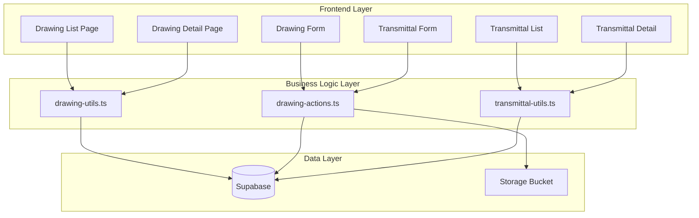
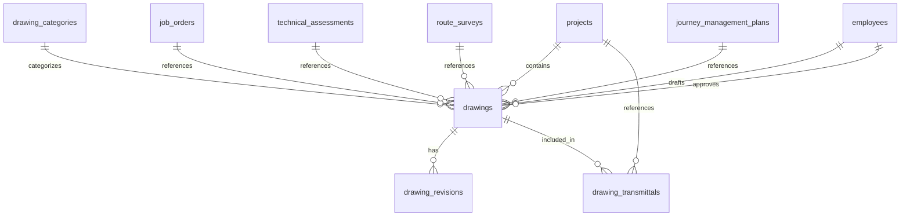
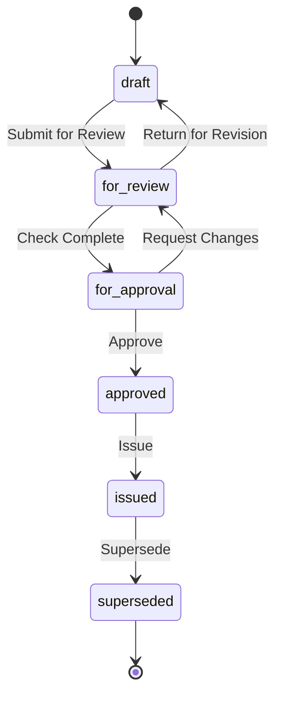

# Design Document: Engineering Drawing Management

## Overview

The Engineering Drawing Management module provides a comprehensive system for managing technical drawings in heavy-haul logistics projects. It enables engineers to upload, track, revise, and distribute CAD files and PDFs through formal approval workflows.

The system integrates with existing Gama ERP modules including Projects, Job Orders, Technical Assessments, Route Surveys, and Journey Management Plans.

## Architecture



## Components and Interfaces

### TypeScript Types (`types/drawing.ts`)

```typescript
// Drawing category type
export interface DrawingCategory {
  id: string;
  category_code: string;
  category_name: string;
  description: string | null;
  numbering_prefix: string | null;
  is_active: boolean;
  display_order: number;
  created_at: string;
}

// Drawing status type
export type DrawingStatus = 
  | 'draft' 
  | 'for_review' 
  | 'for_approval' 
  | 'approved' 
  | 'issued' 
  | 'superseded';

// Drawing file type
export type DrawingFileType = 'dwg' | 'pdf' | 'dxf';

// Change reason type
export type ChangeReason = 
  | 'initial' 
  | 'client_request' 
  | 'design_change' 
  | 'correction' 
  | 'as_built';

// Transmittal purpose type
export type TransmittalPurpose = 
  | 'for_approval' 
  | 'for_construction' 
  | 'for_information' 
  | 'for_review' 
  | 'as_built';

// Transmittal status type
export type TransmittalStatus = 'draft' | 'sent' | 'acknowledged';

// Distribution list item
export interface DistributionItem {
  name: string;
  company: string;
  email: string;
  copies: number;
}

// Main drawing interface
export interface Drawing {
  id: string;
  drawing_number: string;
  category_id: string;
  project_id: string | null;
  job_order_id: string | null;
  assessment_id: string | null;
  route_survey_id: string | null;
  jmp_id: string | null;
  title: string;
  description: string | null;
  scale: string | null;
  paper_size: string;
  current_revision: string;
  revision_count: number;
  file_url: string | null;
  file_type: DrawingFileType | null;
  file_size_kb: number | null;
  thumbnail_url: string | null;
  status: DrawingStatus;
  drafted_by: string | null;
  drafted_at: string | null;
  checked_by: string | null;
  checked_at: string | null;
  approved_by: string | null;
  approved_at: string | null;
  issued_by: string | null;
  issued_at: string | null;
  distribution_list: DistributionItem[];
  notes: string | null;
  created_by: string | null;
  created_at: string;
  updated_at: string;
}

// Drawing with joined data
export interface DrawingWithDetails extends Drawing {
  category?: DrawingCategory;
  project?: { project_number: string; project_name: string };
  drafted_by_employee?: { full_name: string };
  approved_by_employee?: { full_name: string };
}

// Drawing revision interface
export interface DrawingRevision {
  id: string;
  drawing_id: string;
  revision_number: string;
  revision_date: string;
  change_description: string;
  change_reason: ChangeReason | null;
  file_url: string | null;
  drafted_by: string | null;
  checked_by: string | null;
  approved_by: string | null;
  is_current: boolean;
  created_at: string;
}

// Transmittal drawing item
export interface TransmittalDrawingItem {
  drawing_id: string;
  drawing_number: string;
  title: string;
  revision: string;
  copies: number;
}

// Drawing transmittal interface
export interface DrawingTransmittal {
  id: string;
  transmittal_number: string;
  recipient_company: string;
  recipient_name: string | null;
  recipient_email: string | null;
  purpose: TransmittalPurpose;
  project_id: string | null;
  job_order_id: string | null;
  drawings: TransmittalDrawingItem[];
  cover_letter: string | null;
  status: TransmittalStatus;
  sent_at: string | null;
  sent_by: string | null;
  acknowledged_at: string | null;
  notes: string | null;
  created_at: string;
}

// Form input types
export interface DrawingFormInput {
  category_id: string;
  project_id?: string;
  job_order_id?: string;
  assessment_id?: string;
  route_survey_id?: string;
  jmp_id?: string;
  title: string;
  description?: string;
  scale?: string;
  paper_size?: string;
}

export interface RevisionFormInput {
  change_description: string;
  change_reason?: ChangeReason;
}

export interface TransmittalFormInput {
  recipient_company: string;
  recipient_name?: string;
  recipient_email?: string;
  purpose: TransmittalPurpose;
  project_id?: string;
  job_order_id?: string;
  drawings: TransmittalDrawingItem[];
  cover_letter?: string;
  notes?: string;
}

// Filter types
export interface DrawingFilters {
  search?: string;
  category_id?: string;
  project_id?: string;
  status?: DrawingStatus;
}
```

### Utility Functions (`lib/drawing-utils.ts`)

```typescript
// Generate drawing number: {PREFIX}-{YEAR}-{SEQ}
function generateDrawingNumber(prefix: string, sequence: number): string

// Get next revision letter (A -> B -> C, etc.)
function getNextRevision(currentRevision: string): string

// Generate transmittal number: TR-{YEAR}-{SEQ}
function generateTransmittalNumber(sequence: number): string

// Validate file type
function isValidDrawingFileType(filename: string): boolean

// Get file extension
function getFileExtension(filename: string): DrawingFileType | null

// Format file size for display
function formatFileSize(sizeKb: number): string

// Get status badge color
function getStatusColor(status: DrawingStatus): string

// Get purpose display label
function getPurposeLabel(purpose: TransmittalPurpose): string

// Filter drawings by criteria
function filterDrawings(
  drawings: DrawingWithDetails[], 
  filters: DrawingFilters
): DrawingWithDetails[]

// Sort drawings by drawing number
function sortDrawingsByNumber(drawings: DrawingWithDetails[]): DrawingWithDetails[]

// Validate drawing form input
function validateDrawingInput(input: DrawingFormInput): ValidationResult

// Validate revision input
function validateRevisionInput(input: RevisionFormInput): ValidationResult

// Validate transmittal input
function validateTransmittalInput(input: TransmittalFormInput): ValidationResult

// Check if status transition is valid
function isValidStatusTransition(
  currentStatus: DrawingStatus, 
  newStatus: DrawingStatus
): boolean

// Get allowed next statuses
function getAllowedNextStatuses(currentStatus: DrawingStatus): DrawingStatus[]
```

### Server Actions (`lib/drawing-actions.ts`)

```typescript
// Drawing CRUD
async function createDrawing(input: DrawingFormInput, file?: File): Promise<ActionResult<Drawing>>
async function updateDrawing(id: string, input: Partial<DrawingFormInput>): Promise<ActionResult<Drawing>>
async function deleteDrawing(id: string): Promise<ActionResult<void>>
async function uploadDrawingFile(drawingId: string, file: File): Promise<ActionResult<string>>

// Revision management
async function createRevision(
  drawingId: string, 
  input: RevisionFormInput, 
  file?: File
): Promise<ActionResult<DrawingRevision>>

// Workflow actions
async function submitForReview(drawingId: string): Promise<ActionResult<Drawing>>
async function submitForApproval(drawingId: string): Promise<ActionResult<Drawing>>
async function approveDrawing(drawingId: string): Promise<ActionResult<Drawing>>
async function issueDrawing(drawingId: string): Promise<ActionResult<Drawing>>
async function supersedeDrawing(drawingId: string): Promise<ActionResult<Drawing>>

// Transmittal CRUD
async function createTransmittal(input: TransmittalFormInput): Promise<ActionResult<DrawingTransmittal>>
async function sendTransmittal(id: string): Promise<ActionResult<DrawingTransmittal>>
async function acknowledgeTransmittal(id: string): Promise<ActionResult<DrawingTransmittal>>

// Queries
async function getDrawings(filters?: DrawingFilters): Promise<DrawingWithDetails[]>
async function getDrawingById(id: string): Promise<DrawingWithDetails | null>
async function getDrawingRevisions(drawingId: string): Promise<DrawingRevision[]>
async function getCategories(): Promise<DrawingCategory[]>
async function getTransmittals(projectId?: string): Promise<DrawingTransmittal[]>
async function getTransmittalById(id: string): Promise<DrawingTransmittal | null>
```

### React Components

```
components/drawings/
├── drawing-list.tsx           # Main drawing register list
├── drawing-status-cards.tsx   # Status summary cards
├── drawing-form.tsx           # Create/edit drawing form
├── drawing-detail-view.tsx    # Drawing detail with tabs
├── revision-history.tsx       # Revision history table
├── revision-form.tsx          # Create revision dialog
├── workflow-actions.tsx       # Approval workflow buttons
├── file-upload.tsx            # Drawing file upload component
├── transmittal-list.tsx       # Transmittal list view
├── transmittal-form.tsx       # Create transmittal form
├── transmittal-detail.tsx     # Transmittal detail view
└── drawing-selector.tsx       # Multi-select drawings for transmittal
```

## Data Models

### Database Schema

The module uses four main tables:

1. **drawing_categories** - Classification of drawing types
2. **drawings** - Main drawing register with metadata and workflow
3. **drawing_revisions** - Version history for each drawing
4. **drawing_transmittals** - Distribution tracking

### Entity Relationships



### Status Workflow




## Correctness Properties

*A property is a characteristic or behavior that should hold true across all valid executions of a system—essentially, a formal statement about what the system should do. Properties serve as the bridge between human-readable specifications and machine-verifiable correctness guarantees.*

### Property 1: Drawing Number Format and Uniqueness

*For any* drawing created with a category prefix, the generated drawing number SHALL follow the format `{PREFIX}-{YEAR}-{NNNN}` and be unique across all drawings.

**Validates: Requirements 2.1**

### Property 2: File Type Validation

*For any* file upload attempt, the system SHALL accept only files with extensions `.dwg`, `.pdf`, or `.dxf` (case-insensitive), and reject all other file types.

**Validates: Requirements 2.2**

### Property 3: Drawing Input Validation

*For any* drawing creation attempt, the system SHALL reject inputs where title is empty/whitespace or category_id is missing.

**Validates: Requirements 2.3**

### Property 4: Revision Number Sequence

*For any* current revision letter, the next revision SHALL be the subsequent letter in the alphabet (A→B, B→C, ..., Z→AA).

**Validates: Requirements 3.2**

### Property 5: Single Current Revision Invariant

*For any* drawing with revisions, exactly one revision SHALL have `is_current = true` at any point in time.

**Validates: Requirements 3.6**

### Property 6: Revision Creation Archives Previous

*For any* new revision created on a drawing, the previously current revision SHALL have `is_current = false` after the operation.

**Validates: Requirements 3.3**

### Property 7: Revision Requires Change Description

*For any* revision creation attempt, the system SHALL reject inputs where change_description is empty or whitespace-only.

**Validates: Requirements 3.1**

### Property 8: Valid Status Transitions

*For any* status transition attempt, the system SHALL only allow transitions that follow the defined workflow: draft→for_review→for_approval→approved→issued→superseded, with allowed returns for_review→draft and for_approval→for_review.

**Validates: Requirements 4.1**

### Property 9: Workflow Transitions Record Actor and Timestamp

*For any* workflow status transition (submit for review, check, approve, issue), the system SHALL record the actor ID and a non-null timestamp in the corresponding fields.

**Validates: Requirements 4.2, 4.3, 4.4, 4.5**

### Property 10: Superseded Drawings Excluded from Register

*For any* drawing with status 'superseded', it SHALL NOT appear in the active drawing register query results.

**Validates: Requirements 4.6, 7.1**

### Property 11: Transmittal Number Format

*For any* transmittal created, the generated transmittal number SHALL follow the format `TR-{YEAR}-{NNNN}` and be unique.

**Validates: Requirements 5.1**

### Property 12: Transmittal Input Validation

*For any* transmittal creation attempt, the system SHALL reject inputs where recipient_company is empty or purpose is not one of the valid enum values.

**Validates: Requirements 5.2, 5.3**

### Property 13: Filter Results Match Criteria

*For any* filter applied to the drawing list (by project_id, category_id, or status), all returned drawings SHALL match the specified filter criteria.

**Validates: Requirements 6.1, 6.2, 6.3, 6.4**

### Property 14: Drawings Sorted by Number

*For any* list of drawings returned by the sort function, the drawings SHALL be ordered by drawing_number in ascending alphanumeric order.

**Validates: Requirements 7.5**

## Error Handling

### Validation Errors

| Error Code | Description | User Message |
|------------|-------------|--------------|
| `INVALID_TITLE` | Title is empty or whitespace | "Drawing title is required" |
| `INVALID_CATEGORY` | Category not selected | "Please select a drawing category" |
| `INVALID_FILE_TYPE` | Unsupported file extension | "Only DWG, PDF, and DXF files are supported" |
| `INVALID_REVISION_DESC` | Empty change description | "Change description is required for new revisions" |
| `INVALID_TRANSITION` | Invalid status transition | "Cannot transition from {current} to {target}" |
| `INVALID_RECIPIENT` | Missing recipient company | "Recipient company is required" |
| `INVALID_PURPOSE` | Invalid transmittal purpose | "Please select a valid transmittal purpose" |

### Database Errors

| Error Code | Description | Recovery |
|------------|-------------|----------|
| `DUPLICATE_NUMBER` | Drawing/transmittal number exists | Retry with new sequence |
| `FK_VIOLATION` | Referenced entity not found | Validate references before save |
| `UPLOAD_FAILED` | File storage error | Retry upload, check file size |

### Workflow Errors

| Error Code | Description | User Message |
|------------|-------------|--------------|
| `UNAUTHORIZED_TRANSITION` | User lacks permission | "You don't have permission to perform this action" |
| `MISSING_FILE` | Drawing has no file for issue | "Please upload a drawing file before issuing" |

## Testing Strategy

### Property-Based Testing

The module will use **fast-check** for property-based testing with minimum 100 iterations per property.

Property tests will be located in `__tests__/drawing-utils.property.test.ts`.

Each test will be tagged with the format: **Feature: engineering-drawing-management, Property N: {property_text}**

### Unit Tests

Unit tests will cover:
- Specific examples of valid/invalid inputs
- Edge cases (empty strings, boundary values)
- Error condition handling
- Integration points between components

Unit tests will be located in `__tests__/drawing-utils.test.ts` and `__tests__/drawing-actions.test.ts`.

### Test Coverage Matrix

| Property | Test Type | File |
|----------|-----------|------|
| P1: Drawing Number Format | Property | drawing-utils.property.test.ts |
| P2: File Type Validation | Property | drawing-utils.property.test.ts |
| P3: Drawing Input Validation | Property | drawing-utils.property.test.ts |
| P4: Revision Number Sequence | Property | drawing-utils.property.test.ts |
| P5: Single Current Revision | Property | drawing-utils.property.test.ts |
| P6: Revision Archives Previous | Property | drawing-utils.property.test.ts |
| P7: Revision Requires Description | Property | drawing-utils.property.test.ts |
| P8: Valid Status Transitions | Property | drawing-utils.property.test.ts |
| P9: Workflow Records Actor | Property | drawing-utils.property.test.ts |
| P10: Superseded Excluded | Property | drawing-utils.property.test.ts |
| P11: Transmittal Number Format | Property | drawing-utils.property.test.ts |
| P12: Transmittal Validation | Property | drawing-utils.property.test.ts |
| P13: Filter Results Match | Property | drawing-utils.property.test.ts |
| P14: Drawings Sorted | Property | drawing-utils.property.test.ts |
