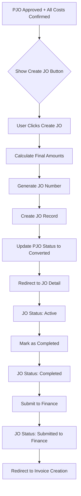

# Design Document: v0.6 - Job Order Creation from Completed PJO

## Overview

This feature implements the conversion of approved PJOs with confirmed costs into Job Orders. It provides a one-click conversion process that calculates final financial amounts, creates the JO record, updates the PJO status, and enables the JO workflow through completion to finance submission.

## Architecture

### System Flow



### Data Flow

```
PJO (approved, all_costs_confirmed=true)
    │
    ├── pjo_revenue_items[] ──► sum(subtotal) ──► final_revenue
    │
    └── pjo_cost_items[] ──► sum(actual_amount) ──► final_cost
                                                        │
                                                        ▼
                                            final_profit = revenue - cost
                                            final_margin = profit / revenue * 100
                                                        │
                                                        ▼
                                                  job_orders (new)
                                                        │
                                                        ▼
                                            PJO.status = 'converted'
                                            PJO.job_order_id = jo.id
```

## Components and Interfaces

### Server Actions

#### `createJobOrderFromPJO(pjoId: string)`
Creates a Job Order from an approved PJO with all costs confirmed.

```typescript
interface CreateJOResult {
  success: boolean
  jobOrder?: JobOrder
  error?: string
}

async function createJobOrderFromPJO(pjoId: string): Promise<CreateJOResult>
```

#### `updateJOStatus(joId: string, newStatus: JOStatus)`
Updates the status of a Job Order following the workflow rules.

```typescript
type JOStatus = 'active' | 'completed' | 'submitted_to_finance'

interface UpdateStatusResult {
  success: boolean
  error?: string
}

async function updateJOStatus(joId: string, newStatus: JOStatus): Promise<UpdateStatusResult>
```

#### `submitJOToFinance(joId: string)`
Submits a completed JO to finance, recording timestamp and user.

```typescript
interface SubmitResult {
  success: boolean
  error?: string
}

async function submitJOToFinance(joId: string): Promise<SubmitResult>
```

### Utility Functions

#### `canCreateJobOrder(pjo: PJO): boolean`
Determines if a PJO is ready for JO conversion.

#### `calculateJOFinancials(revenueItems: PJORevenueItem[], costItems: PJOCostItem[]): JOFinancials`
Calculates final revenue, cost, profit, and margin.

#### `getAvailableJOActions(status: JOStatus): JOAction[]`
Returns available actions based on current JO status.

#### `canTransitionJOStatus(currentStatus: JOStatus, newStatus: JOStatus): boolean`
Validates if a status transition is allowed.

### React Components

#### `CreateJobOrderButton`
Prominent button shown on PJO detail when ready for conversion.

```typescript
interface CreateJobOrderButtonProps {
  pjoId: string
  isReady: boolean
  existingJoId?: string
}
```

#### `JobOrderList`
Table component for /job-orders page.

```typescript
interface JobOrderListProps {
  jobOrders: JobOrderWithRelations[]
}
```

#### `JobOrderDetail`
Detail view component for /job-orders/[id] page.

```typescript
interface JobOrderDetailProps {
  jobOrder: JobOrderWithRelations
  revenueItems: PJORevenueItem[]
  costItems: PJOCostItem[]
  canEdit: boolean
}
```

#### `JOStatusActions`
Action buttons based on JO status.

```typescript
interface JOStatusActionsProps {
  joId: string
  status: JOStatus
  canEdit: boolean
  onStatusChange: () => void
}
```

## Data Models

### JobOrder (Extended)

The existing `job_orders` table already has the required fields:

| Field | Type | Description |
|-------|------|-------------|
| id | uuid | Primary key |
| jo_number | text | Unique JO number (JO-NNNN/CARGO/MM/YYYY) |
| pjo_id | uuid | Reference to source PJO |
| customer_id | uuid | Customer reference |
| project_id | uuid | Project reference |
| description | text | JO description |
| status | text | active, completed, submitted_to_finance, invoiced, closed |
| final_revenue | numeric | Sum of revenue items |
| final_cost | numeric | Sum of actual cost amounts |
| converted_from_pjo_at | timestamp | When converted from PJO |
| completed_at | timestamp | When marked completed |
| submitted_to_finance_at | timestamp | When submitted to finance |
| submitted_by | uuid | User who submitted |

### JOFinancials Interface

```typescript
interface JOFinancials {
  finalRevenue: number
  finalCost: number
  finalProfit: number
  finalMargin: number
}
```

### JOWithRelations Interface

```typescript
interface JOWithRelations extends JobOrder {
  proforma_job_orders?: ProformaJobOrder & {
    pjo_revenue_items?: PJORevenueItem[]
    pjo_cost_items?: PJOCostItem[]
  }
  projects?: Project
  customers?: Customer
}
```

## Correctness Properties

*A property is a characteristic or behavior that should hold true across all valid executions of a system-essentially, a formal statement about what the system should do. Properties serve as the bridge between human-readable specifications and machine-verifiable correctness guarantees.*

### Property 1: JO Creation Readiness
*For any* PJO, the "Create Job Order" button should be visible if and only if status is "approved" AND all_costs_confirmed is true AND converted_to_jo is false.
**Validates: Requirements 1.1, 1.2, 1.3, 1.4**

### Property 2: Final Revenue Calculation
*For any* set of revenue items with positive subtotals, final_revenue should equal the sum of all subtotals.
**Validates: Requirements 2.1**

### Property 3: Final Cost Calculation
*For any* set of cost items with actual_amount values, final_cost should equal the sum of all actual_amount values.
**Validates: Requirements 2.2**

### Property 4: Profit and Margin Calculation
*For any* final_revenue and final_cost values where final_revenue > 0, final_profit should equal (final_revenue - final_cost) and final_margin should equal (final_profit / final_revenue × 100). When final_revenue is 0, final_margin should be 0.
**Validates: Requirements 2.3, 2.4, 2.5**

### Property 5: JO Number Format
*For any* sequence number and date, the generated JO number should match the pattern "JO-NNNN/CARGO/MM/YYYY" where NNNN is zero-padded sequence and MM is Roman numeral month.
**Validates: Requirements 2.6**

### Property 6: PJO Field Copy
*For any* PJO with shipment details, the created JO should have matching values for commodity, quantity, quantity_unit, pol, pod, etd, eta, and carrier_type.
**Validates: Requirements 2.7**

### Property 7: JO Status Actions
*For any* JO status, "Mark as Completed" should be available only when status is "active", and "Submit to Finance" should be available only when status is "completed".
**Validates: Requirements 6.2, 6.4, 6.5, 6.6**

### Property 8: Status Transition Validation
*For any* JO with status "submitted_to_finance", transitions back to "completed" or "active" should be rejected.
**Validates: Requirements 7.6**

### Property 9: Margin Formatting
*For any* margin value, the formatted output should show exactly one decimal place with a percent sign.
**Validates: Requirements 4.4**

### Property 10: JO Access Control
*For any* user role and JO, editing actions should be allowed only for users with role "admin" or "manager".
**Validates: Requirements 8.1, 8.2, 8.3, 8.4, 8.5**

## Error Handling

### Conversion Errors

| Error | Cause | User Message |
|-------|-------|--------------|
| PJO_NOT_FOUND | Invalid PJO ID | "PJO not found" |
| PJO_NOT_APPROVED | Status is not "approved" | "PJO must be approved before conversion" |
| COSTS_NOT_CONFIRMED | all_costs_confirmed is false | "All costs must be confirmed before conversion" |
| ALREADY_CONVERTED | converted_to_jo is true | "This PJO has already been converted to a Job Order" |
| JO_NUMBER_GENERATION_FAILED | Sequence generation error | "Failed to generate JO number. Please try again." |
| DATABASE_ERROR | Transaction failed | "An error occurred. Please try again." |

### Status Transition Errors

| Error | Cause | User Message |
|-------|-------|--------------|
| INVALID_TRANSITION | Disallowed status change | "Cannot change status from {current} to {new}" |
| JO_NOT_FOUND | Invalid JO ID | "Job Order not found" |
| UNAUTHORIZED | User lacks permission | "You don't have permission to perform this action" |

## Testing Strategy

### Property-Based Testing

Use `fast-check` library for property-based tests. Each property test should run a minimum of 100 iterations.

**Test File:** `__tests__/jo-utils.test.ts`

Properties to test:
1. `canCreateJobOrder` returns true only for approved PJOs with all costs confirmed
2. `calculateFinalRevenue` correctly sums revenue item subtotals
3. `calculateFinalCost` correctly sums cost item actual amounts
4. `calculateJOFinancials` produces correct profit and margin
5. `generateJONumber` produces correctly formatted numbers
6. `getAvailableJOActions` returns correct actions for each status
7. `canTransitionJOStatus` correctly validates transitions
8. `formatMargin` produces correctly formatted percentages
9. `canEditJO` correctly checks role permissions

### Unit Tests

**Test File:** `__tests__/jo-creation.test.ts`

- Test JO creation flow with valid PJO
- Test JO creation rejection for non-approved PJO
- Test JO creation rejection for unconfirmed costs
- Test status transitions (active → completed → submitted_to_finance)
- Test invalid status transitions are rejected

### Integration Tests

- Test full conversion flow from PJO to JO
- Test PJO status update after conversion
- Test JO detail page data loading
- Test JO list page filtering and sorting
