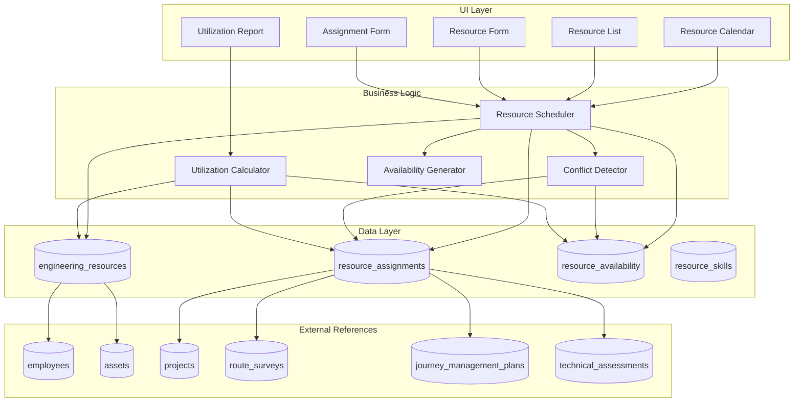

# Design Document: Engineering Resource Scheduling

## Overview

The Engineering Resource Scheduling module provides a comprehensive system for managing and scheduling engineering resources in Gama ERP. It enables engineering managers to track personnel, equipment, tools, and vehicles, assign them to projects and engineering activities, visualize availability through calendar views, and monitor utilization metrics.

The system integrates with existing modules:
- **Employees module** for personnel resources
- **Assets module** for equipment resources
- **Projects, Route Surveys, JMPs, and Technical Assessments** as assignment targets

## Architecture



## Components and Interfaces

### 1. Resource Scheduler (`lib/resource-scheduling-utils.ts`)

Core utility functions for resource management:

```typescript
// Resource code generation
function generateResourceCode(type: ResourceType): string

// Resource CRUD operations
function validateResourceInput(input: ResourceInput): ValidationResult
function filterResources(resources: Resource[], filters: ResourceFilters): Resource[]
function sortResources(resources: Resource[], sortBy: ResourceSortField): Resource[]

// Assignment operations
function validateAssignmentInput(input: AssignmentInput): ValidationResult
function calculatePlannedHours(startDate: Date, endDate: Date, dailyCapacity: number): number
function getAssignmentsByResource(resourceId: string, dateRange: DateRange): Assignment[]
function getAssignmentsByTarget(targetType: AssignmentTarget, targetId: string): Assignment[]
```

### 2. Conflict Detector (`lib/resource-scheduling-utils.ts`)

Functions for detecting scheduling conflicts:

```typescript
// Conflict detection
function detectConflicts(
  resourceId: string, 
  startDate: Date, 
  endDate: Date, 
  excludeAssignmentId?: string
): ConflictResult

function checkAvailability(
  resourceId: string, 
  date: Date
): AvailabilityStatus

function detectOverAllocation(
  resourceId: string, 
  date: Date, 
  additionalHours: number
): OverAllocationResult
```

### 3. Utilization Calculator (`lib/resource-scheduling-utils.ts`)

Functions for computing utilization metrics:

```typescript
// Utilization calculations
function calculateUtilization(
  assignedHours: number, 
  availableHours: number
): number

function getWeeklyUtilization(
  resourceId: string, 
  weekStart: Date
): WeeklyUtilization

function getResourceUtilizationReport(
  filters: UtilizationFilters
): UtilizationReport[]

function aggregateUtilizationByType(
  resources: Resource[], 
  dateRange: DateRange
): TypeUtilization[]
```

### 4. Availability Generator (`lib/resource-scheduling-utils.ts`)

Functions for managing availability:

```typescript
// Availability management
function generateAvailabilityCalendar(
  resourceId: string, 
  dateRange: DateRange
): DayAvailability[]

function markUnavailable(
  resourceId: string, 
  dates: Date[], 
  type: UnavailabilityType, 
  notes?: string
): void

function getRemainingHours(
  resourceId: string, 
  date: Date
): number

function syncLeaveToAvailability(
  employeeId: string
): void
```

### 5. Server Actions (`lib/resource-scheduling-actions.ts`)

```typescript
// Resources
async function getResources(filters?: ResourceFilters): Promise<Resource[]>
async function getResourceById(id: string): Promise<ResourceWithDetails>
async function createResource(input: ResourceInput): Promise<Resource>
async function updateResource(id: string, input: ResourceInput): Promise<Resource>
async function deleteResource(id: string): Promise<void>

// Assignments
async function getAssignments(filters?: AssignmentFilters): Promise<Assignment[]>
async function getAssignmentById(id: string): Promise<AssignmentWithDetails>
async function createAssignment(input: AssignmentInput): Promise<Assignment>
async function updateAssignment(id: string, input: AssignmentInput): Promise<Assignment>
async function deleteAssignment(id: string): Promise<void>
async function updateAssignmentStatus(id: string, status: AssignmentStatus): Promise<Assignment>
async function recordActualHours(id: string, actualHours: number): Promise<Assignment>

// Availability
async function getAvailability(resourceId: string, dateRange: DateRange): Promise<DayAvailability[]>
async function setUnavailability(input: UnavailabilityInput): Promise<void>
async function removeUnavailability(resourceId: string, date: Date): Promise<void>

// Skills
async function getSkills(): Promise<Skill[]>
async function createSkill(input: SkillInput): Promise<Skill>

// Calendar
async function getCalendarData(dateRange: DateRange, filters?: CalendarFilters): Promise<CalendarData>

// Utilization
async function getUtilizationReport(filters: UtilizationFilters): Promise<UtilizationReport>
```

### 6. UI Components (`components/resource-scheduling/`)

| Component | Purpose |
|-----------|---------|
| `resource-list.tsx` | Tabular list of resources with filters |
| `resource-form.tsx` | Create/edit resource form |
| `resource-detail.tsx` | Resource detail view with assignments |
| `assignment-form.tsx` | Create/edit assignment dialog |
| `assignment-list.tsx` | List of assignments for a resource/target |
| `resource-calendar.tsx` | Main calendar view component |
| `calendar-cell.tsx` | Individual calendar cell with assignment display |
| `calendar-header.tsx` | Calendar navigation and filters |
| `availability-form.tsx` | Mark unavailability dialog |
| `conflict-dialog.tsx` | Display conflict warnings |
| `utilization-chart.tsx` | Utilization visualization |
| `utilization-report.tsx` | Detailed utilization report |
| `skill-selector.tsx` | Multi-select for skills |

## Data Models

### TypeScript Types (`types/resource-scheduling.ts`)

```typescript
// Enums
export type ResourceType = 'personnel' | 'equipment' | 'tool' | 'vehicle';
export type AssignmentStatus = 'scheduled' | 'in_progress' | 'completed' | 'cancelled';
export type UnavailabilityType = 'leave' | 'training' | 'maintenance' | 'holiday' | 'other';
export type AssignmentTargetType = 'project' | 'job_order' | 'assessment' | 'route_survey' | 'jmp';
export type CapacityUnit = 'hours' | 'days';
export type SkillCategory = 'engineering' | 'design' | 'field' | 'operation';

// Core Types
export interface EngineeringResource {
  id: string;
  resource_type: ResourceType;
  resource_code: string;
  resource_name: string;
  description?: string;
  employee_id?: string;
  asset_id?: string;
  skills: string[];
  certifications: Certification[];
  capacity_unit?: CapacityUnit;
  daily_capacity: number;
  hourly_rate?: number;
  daily_rate?: number;
  is_available: boolean;
  unavailable_reason?: string;
  unavailable_until?: string;
  base_location?: string;
  is_active: boolean;
  created_at: string;
  updated_at: string;
}

export interface ResourceWithDetails extends EngineeringResource {
  employee?: Employee;
  asset?: Asset;
  skill_details?: Skill[];
  current_assignments?: ResourceAssignment[];
}

export interface Certification {
  name: string;
  issued_date?: string;
  expiry_date?: string;
  issuing_body?: string;
}

export interface ResourceAssignment {
  id: string;
  resource_id: string;
  project_id?: string;
  job_order_id?: string;
  assessment_id?: string;
  route_survey_id?: string;
  jmp_id?: string;
  task_description?: string;
  start_date: string;
  end_date: string;
  start_time?: string;
  end_time?: string;
  planned_hours?: number;
  actual_hours?: number;
  work_location?: string;
  status: AssignmentStatus;
  notes?: string;
  assigned_by?: string;
  created_at: string;
  updated_at: string;
}

export interface AssignmentWithDetails extends ResourceAssignment {
  resource?: EngineeringResource;
  project?: Project;
  job_order?: JobOrder;
  assessment?: TechnicalAssessment;
  route_survey?: RouteSurvey;
  jmp?: JourneyManagementPlan;
  assigned_by_user?: UserProfile;
}

export interface ResourceAvailability {
  id: string;
  resource_id: string;
  date: string;
  is_available: boolean;
  available_hours: number;
  unavailability_type?: UnavailabilityType;
  notes?: string;
}

export interface ResourceSkill {
  id: string;
  skill_code: string;
  skill_name: string;
  skill_category?: SkillCategory;
  is_active: boolean;
  created_at: string;
}

// Input Types
export interface ResourceInput {
  resource_type: ResourceType;
  resource_name: string;
  description?: string;
  employee_id?: string;
  asset_id?: string;
  skills?: string[];
  certifications?: Certification[];
  capacity_unit?: CapacityUnit;
  daily_capacity?: number;
  hourly_rate?: number;
  daily_rate?: number;
  base_location?: string;
}

export interface AssignmentInput {
  resource_id: string;
  target_type: AssignmentTargetType;
  target_id: string;
  task_description?: string;
  start_date: string;
  end_date: string;
  start_time?: string;
  end_time?: string;
  planned_hours?: number;
  work_location?: string;
  notes?: string;
}

export interface UnavailabilityInput {
  resource_id: string;
  dates: string[];
  unavailability_type: UnavailabilityType;
  notes?: string;
}

// Filter Types
export interface ResourceFilters {
  resource_type?: ResourceType;
  is_available?: boolean;
  skills?: string[];
  search?: string;
}

export interface AssignmentFilters {
  resource_id?: string;
  target_type?: AssignmentTargetType;
  target_id?: string;
  status?: AssignmentStatus;
  date_from?: string;
  date_to?: string;
}

export interface CalendarFilters {
  resource_types?: ResourceType[];
  skills?: string[];
  resource_ids?: string[];
}

export interface UtilizationFilters {
  date_from: string;
  date_to: string;
  resource_type?: ResourceType;
  resource_ids?: string[];
}

// Calendar Types
export interface CalendarData {
  resources: ResourceWithDetails[];
  dates: string[];
  cells: CalendarCell[][];
}

export interface CalendarCell {
  resource_id: string;
  date: string;
  is_available: boolean;
  available_hours: number;
  assigned_hours: number;
  remaining_hours: number;
  assignments: ResourceAssignment[];
  unavailability_type?: UnavailabilityType;
}

export interface DayAvailability {
  date: string;
  is_available: boolean;
  available_hours: number;
  assigned_hours: number;
  remaining_hours: number;
  unavailability_type?: UnavailabilityType;
  assignments: ResourceAssignment[];
}

// Utilization Types
export interface WeeklyUtilization {
  week_start: string;
  planned_hours: number;
  actual_hours: number;
  available_hours: number;
  utilization_percentage: number;
}

export interface UtilizationReport {
  resource_id: string;
  resource_code: string;
  resource_name: string;
  resource_type: ResourceType;
  total_planned_hours: number;
  total_actual_hours: number;
  total_available_hours: number;
  utilization_percentage: number;
  weekly_breakdown: WeeklyUtilization[];
}

export interface TypeUtilization {
  resource_type: ResourceType;
  resource_count: number;
  total_planned_hours: number;
  total_available_hours: number;
  average_utilization: number;
}

// Conflict Types
export interface ConflictResult {
  has_conflict: boolean;
  conflicts: ConflictDetail[];
}

export interface ConflictDetail {
  type: 'assignment' | 'unavailability';
  date: string;
  assignment?: ResourceAssignment;
  unavailability_type?: UnavailabilityType;
  message: string;
}

export interface OverAllocationResult {
  is_over_allocated: boolean;
  date: string;
  available_hours: number;
  assigned_hours: number;
  requested_hours: number;
  excess_hours: number;
}

export interface AvailabilityStatus {
  is_available: boolean;
  available_hours: number;
  assigned_hours: number;
  remaining_hours: number;
  unavailability_type?: UnavailabilityType;
  unavailability_notes?: string;
}

// Validation Types
export interface ValidationResult {
  isValid: boolean;
  errors: ValidationError[];
}

export interface ValidationError {
  field: string;
  message: string;
}
```

### Database Schema

The database schema follows the provided SQL structure with these tables:

1. **engineering_resources** - Core resource registry
2. **resource_assignments** - Assignment records linking resources to targets
3. **resource_availability** - Daily availability overrides
4. **resource_skills** - Master skill list

Views:
- **resource_utilization** - Aggregated utilization by week
- **resource_calendar** - 30-day calendar view with availability


## Correctness Properties

*A property is a characteristic or behavior that should hold true across all valid executions of a system—essentially, a formal statement about what the system should do. Properties serve as the bridge between human-readable specifications and machine-verifiable correctness guarantees.*

### Property 1: Resource Creation Stores Required Fields

*For any* valid resource input with type, name, and capacity, creating the resource SHALL result in a stored resource containing all provided fields with the correct values.

**Validates: Requirements 1.1**

### Property 2: Resource-Entity Linking by Type

*For any* personnel resource with an employee_id, the resource SHALL be linked to that employee. *For any* equipment resource with an asset_id, the resource SHALL be linked to that asset. The link type must match the resource type.

**Validates: Requirements 1.2, 1.3**

### Property 3: Skills and Certifications Round-Trip

*For any* resource with skills and certifications arrays, storing and then retrieving the resource SHALL return equivalent skills and certifications data.

**Validates: Requirements 1.4**

### Property 4: Unavailability Recording

*For any* resource marked as unavailable with a reason and return date, the resource record SHALL contain the unavailable_reason and unavailable_until fields with the provided values.

**Validates: Requirements 1.5**

### Property 5: Resource Code Uniqueness

*For any* set of resources of the same type, all generated resource codes SHALL be unique within that type.

**Validates: Requirements 1.6**

### Property 6: Resource Filtering Correctness

*For any* list of resources and filter criteria (type, availability, skills), the filtered result SHALL contain only resources matching ALL specified criteria.

**Validates: Requirements 1.7**

### Property 7: Assignment Validation

*For any* assignment input, validation SHALL fail if resource_id, target (project/survey/JMP/assessment), start_date, or end_date is missing.

**Validates: Requirements 2.1**

### Property 8: Planned Hours Calculation

*For any* assignment with start_date, end_date, and resource daily_capacity, the planned_hours SHALL equal the number of working days multiplied by daily_capacity.

**Validates: Requirements 2.2**

### Property 9: Assignment Overlap Detection

*For any* resource with an existing assignment, creating a new assignment with overlapping dates SHALL be detected as a conflict.

**Validates: Requirements 2.3, 6.1**

### Property 10: Unavailability Blocks Assignment

*For any* resource marked unavailable on a date, attempting to create an assignment including that date SHALL be detected as a conflict with the unavailability reason included.

**Validates: Requirements 2.4**

### Property 11: Valid Assignment Status Transitions

*For any* assignment, the status SHALL only be one of: 'scheduled', 'in_progress', 'completed', or 'cancelled'.

**Validates: Requirements 2.5**

### Property 12: Non-Overlapping Assignments Allowed

*For any* resource, multiple assignments with non-overlapping date ranges SHALL all be accepted without conflicts.

**Validates: Requirements 2.7**

### Property 13: Calendar Cell Unavailability Type

*For any* calendar cell where the resource is unavailable, the cell SHALL include the unavailability_type (leave, training, maintenance, holiday, or other).

**Validates: Requirements 3.3**

### Property 14: Remaining Hours Formula

*For any* calendar cell, remaining_hours SHALL equal available_hours minus assigned_hours.

**Validates: Requirements 3.6**

### Property 15: Calendar Filtering

*For any* calendar data request with resource type or skills filters, the returned resources SHALL match all specified filter criteria.

**Validates: Requirements 3.7**

### Property 16: Unavailability Input Validation

*For any* unavailability input, validation SHALL fail if resource_id, date, or unavailability_type is missing.

**Validates: Requirements 4.1**

### Property 17: Bulk Unavailability Date Range

*For any* date range marked as unavailable, an unavailability record SHALL be created for each date in the range.

**Validates: Requirements 4.4**

### Property 18: Unavailability Conflict Detection

*For any* resource with existing assignments, marking dates as unavailable SHALL detect and report all affected assignments.

**Validates: Requirements 4.5**

### Property 19: Valid Unavailability Types

*For any* unavailability record, the type SHALL be one of: 'leave', 'training', 'maintenance', 'holiday', or 'other'.

**Validates: Requirements 4.6**

### Property 20: Utilization Percentage Calculation

*For any* assigned_hours and available_hours where available_hours > 0, utilization_percentage SHALL equal (assigned_hours / available_hours) × 100. When utilization > 100%, it SHALL be flagged as over-allocated.

**Validates: Requirements 5.1, 5.2**

### Property 21: Weekly Utilization Aggregation

*For any* set of assignments within a week, the weekly utilization SHALL correctly sum planned_hours and actual_hours for that week.

**Validates: Requirements 5.3**

### Property 22: Utilization by Resource Type

*For any* utilization report, resources SHALL be correctly grouped by resource_type with aggregated metrics per type.

**Validates: Requirements 5.4**

### Property 23: Utilization Report Filtering

*For any* utilization report with date range and resource type filters, the results SHALL only include data matching the filter criteria.

**Validates: Requirements 5.5**

### Property 24: Planned vs Actual Hours Comparison

*For any* completed assignment, the utilization report SHALL include both planned_hours and actual_hours values.

**Validates: Requirements 5.6**

### Property 25: Conflict Details Include Assignment Info

*For any* detected assignment conflict, the conflict result SHALL include the conflicting assignment's details (id, dates, task description).

**Validates: Requirements 6.2**

### Property 26: Availability Considers Both Sources

*For any* availability check, the result SHALL consider both existing assignments AND unavailability records for the resource on that date.

**Validates: Requirements 6.3**

### Property 27: Capacity Exceeded Warning

*For any* assignment that would cause total assigned hours to exceed daily_capacity, the system SHALL detect and warn about over-allocation.

**Validates: Requirements 6.4**

### Property 28: Skill Data Structure

*For any* skill in the master list, it SHALL have a skill_code, skill_name, and skill_category.

**Validates: Requirements 7.1**

### Property 29: Skill-Based Resource Filtering

*For any* resource search with required skills, all returned resources SHALL have ALL the required skills in their skills array.

**Validates: Requirements 7.3**

### Property 30: Certification Expiry Status

*For any* certification with an expiry_date, the system SHALL correctly compute whether it is expired (expiry_date < current_date), expiring_soon (within 30 days), or valid.

**Validates: Requirements 7.4**

## Error Handling

### Resource Errors

| Error Code | Condition | User Message |
|------------|-----------|--------------|
| `RESOURCE_NOT_FOUND` | Resource ID doesn't exist | "Resource not found" |
| `DUPLICATE_RESOURCE_CODE` | Resource code already exists | "Resource code already in use" |
| `INVALID_RESOURCE_TYPE` | Invalid resource type value | "Invalid resource type" |
| `EMPLOYEE_NOT_FOUND` | Employee ID doesn't exist | "Employee not found" |
| `ASSET_NOT_FOUND` | Asset ID doesn't exist | "Asset not found" |
| `RESOURCE_TYPE_MISMATCH` | Personnel without employee or equipment without asset | "Resource type requires linked entity" |

### Assignment Errors

| Error Code | Condition | User Message |
|------------|-----------|--------------|
| `ASSIGNMENT_NOT_FOUND` | Assignment ID doesn't exist | "Assignment not found" |
| `INVALID_DATE_RANGE` | End date before start date | "End date must be after start date" |
| `RESOURCE_UNAVAILABLE` | Resource unavailable on requested dates | "Resource is unavailable: {reason}" |
| `ASSIGNMENT_CONFLICT` | Overlapping assignment exists | "Resource already assigned during this period" |
| `OVER_ALLOCATION` | Would exceed daily capacity | "Assignment would exceed resource capacity" |
| `INVALID_TARGET` | No valid target specified | "Assignment must have a project, survey, JMP, or assessment" |
| `INVALID_STATUS` | Invalid status value | "Invalid assignment status" |

### Availability Errors

| Error Code | Condition | User Message |
|------------|-----------|--------------|
| `INVALID_UNAVAILABILITY_TYPE` | Invalid type value | "Invalid unavailability type" |
| `UNAVAILABILITY_CONFLICT` | Existing assignments on date | "Cannot mark unavailable: {count} assignments affected" |

## Testing Strategy

### Property-Based Testing

The module will use **fast-check** for property-based testing with minimum 100 iterations per property.

**Test File**: `__tests__/resource-scheduling-utils.property.test.ts`

Each property test will be tagged with:
```typescript
// Feature: engineering-resource-scheduling, Property N: {property_text}
```

### Generators

```typescript
// Resource generators
const resourceTypeGen = fc.constantFrom('personnel', 'equipment', 'tool', 'vehicle');
const assignmentStatusGen = fc.constantFrom('scheduled', 'in_progress', 'completed', 'cancelled');
const unavailabilityTypeGen = fc.constantFrom('leave', 'training', 'maintenance', 'holiday', 'other');

const resourceInputGen = fc.record({
  resource_type: resourceTypeGen,
  resource_name: fc.string({ minLength: 1, maxLength: 200 }),
  description: fc.option(fc.string({ maxLength: 500 })),
  daily_capacity: fc.float({ min: 1, max: 24, noNaN: true }),
  skills: fc.array(fc.string({ minLength: 1, maxLength: 30 }), { maxLength: 10 }),
  certifications: fc.array(certificationGen, { maxLength: 5 })
});

const dateRangeGen = fc.tuple(
  fc.date({ min: new Date('2025-01-01'), max: new Date('2025-12-31') }),
  fc.integer({ min: 1, max: 30 })
).map(([start, days]) => ({
  start_date: start,
  end_date: new Date(start.getTime() + days * 24 * 60 * 60 * 1000)
}));

const assignmentInputGen = fc.record({
  resource_id: fc.uuid(),
  target_type: fc.constantFrom('project', 'job_order', 'assessment', 'route_survey', 'jmp'),
  target_id: fc.uuid(),
  start_date: fc.date({ min: new Date('2025-01-01'), max: new Date('2025-12-31') }),
  end_date: fc.date({ min: new Date('2025-01-01'), max: new Date('2025-12-31') }),
  planned_hours: fc.option(fc.float({ min: 1, max: 100, noNaN: true })),
  task_description: fc.option(fc.string({ maxLength: 500 }))
});
```

### Unit Tests

Unit tests will cover:
- Specific examples for resource creation
- Edge cases for date calculations (weekends, holidays)
- Integration scenarios for leave/maintenance sync
- Default skills verification

**Test File**: `__tests__/resource-scheduling-utils.test.ts`

### Test Coverage Goals

| Area | Property Tests | Unit Tests |
|------|---------------|------------|
| Resource CRUD | Properties 1-6 | Edge cases, validation |
| Assignments | Properties 7-12 | Status transitions |
| Calendar | Properties 13-15 | Date range generation |
| Availability | Properties 16-19 | Bulk operations |
| Utilization | Properties 20-24 | Aggregation accuracy |
| Conflicts | Properties 25-27 | Complex scenarios |
| Skills | Properties 28-30 | Default data |
