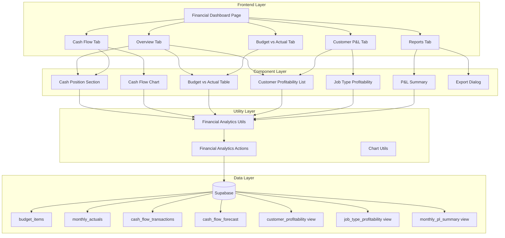

# Design Document: Financial Analytics Module (v0.62)

## Overview

The Financial Analytics module extends the Executive Dashboard with comprehensive financial analysis capabilities. It provides cash flow tracking, budget vs actual analysis, and profitability reports to support executive decision-making at PT. Gama Intisamudera.

The module integrates with existing job orders, invoices, and payment data to provide real-time financial insights. It follows the established patterns from v0.61 Executive Dashboard KPI module.

## Architecture



## Components and Interfaces

### Page Component

**File:** `app/(main)/dashboard/executive/finance/page.tsx`

```typescript
// Server component that fetches initial data
export default async function FinancialAnalyticsPage() {
  const initialData = await fetchFinancialAnalyticsData();
  return <FinancialAnalyticsClient initialData={initialData} />;
}
```

### Client Component

**File:** `app/(main)/dashboard/executive/finance/financial-analytics-client.tsx`

```typescript
interface FinancialAnalyticsClientProps {
  initialData: FinancialAnalyticsData;
}

interface FinancialAnalyticsData {
  cashPosition: CashPosition;
  budgetVsActual: BudgetVsActualItem[];
  customerProfitability: CustomerProfitability[];
  jobTypeProfitability: JobTypeProfitability[];
  monthlyPL: MonthlyPLSummary[];
  cashFlowTransactions: CashFlowTransaction[];
  cashFlowForecast: CashFlowForecast[];
}
```

### Tab Components

1. **OverviewTab** - Summary view with key metrics
2. **CashFlowTab** - Cash position and flow chart
3. **BudgetVsActualTab** - Budget comparison table
4. **CustomerPLTab** - Customer and job type profitability
5. **ReportsTab** - P&L summary and export options

### Shared Components

**File:** `components/financial-analytics/cash-position-card.tsx`

```typescript
interface CashPositionCardProps {
  currentBalance: number;
  netCashFlowMTD: number;
  inflows: number;
  outflows: number;
}
```

**File:** `components/financial-analytics/cash-flow-chart.tsx`

```typescript
interface CashFlowChartProps {
  transactions: CashFlowTransaction[];
  forecasts: CashFlowForecast[];
  dateRange: { start: Date; end: Date };
}
```

**File:** `components/financial-analytics/budget-vs-actual-table.tsx`

```typescript
interface BudgetVsActualTableProps {
  items: BudgetVsActualItem[];
  period: { year: number; month: number };
}
```

**File:** `components/financial-analytics/customer-profitability-table.tsx`

```typescript
interface CustomerProfitabilityTableProps {
  customers: CustomerProfitability[];
  sortBy: 'revenue' | 'profit' | 'margin';
  limit?: number;
}
```

**File:** `components/financial-analytics/job-type-profitability-table.tsx`

```typescript
interface JobTypeProfitabilityTableProps {
  jobTypes: JobTypeProfitability[];
}
```

## Data Models

### TypeScript Types

**File:** `types/financial-analytics.ts`

```typescript
// Budget Categories
export type BudgetCategory = 
  | 'revenue' 
  | 'direct_cost' 
  | 'overhead' 
  | 'salary' 
  | 'equipment' 
  | 'other';

// Cash Flow Types
export type CashFlowType = 'inflow' | 'outflow';

export type InflowCategory = 
  | 'customer_payment' 
  | 'loan' 
  | 'other_income';

export type OutflowCategory = 
  | 'vendor_payment' 
  | 'salary' 
  | 'tax' 
  | 'loan_repayment' 
  | 'capex' 
  | 'other_expense';

export type CashFlowCategory = InflowCategory | OutflowCategory;

// Budget Item
export interface BudgetItem {
  id: string;
  budget_year: number;
  budget_month: number;
  category: BudgetCategory;
  subcategory: string | null;
  description: string;
  budget_amount: number;
  department: string | null;
  project_id: string | null;
  notes: string | null;
  created_by: string | null;
  created_at: string;
}

// Monthly Actual
export interface MonthlyActual {
  id: string;
  actual_year: number;
  actual_month: number;
  category: BudgetCategory;
  subcategory: string | null;
  actual_amount: number;
  department: string | null;
  last_updated: string;
}

// Cash Flow Transaction
export interface CashFlowTransaction {
  id: string;
  transaction_date: string;
  flow_type: CashFlowType;
  category: CashFlowCategory;
  description: string | null;
  amount: number;
  invoice_id: string | null;
  bkk_id: string | null;
  bkm_id: string | null;
  bank_account: string | null;
  created_at: string;
}

// Cash Flow Forecast
export interface CashFlowForecast {
  id: string;
  forecast_date: string;
  flow_type: CashFlowType;
  category: CashFlowCategory;
  description: string | null;
  expected_amount: number;
  probability_percentage: number;
  weighted_amount: number | null;
  invoice_id: string | null;
  recurring_item: boolean;
  notes: string | null;
  created_at: string;
}

// Customer Profitability (from view)
export interface CustomerProfitability {
  customer_id: string;
  customer_name: string;
  total_jobs: number;
  total_revenue: number;
  total_cost: number;
  total_profit: number;
  profit_margin_pct: number;
  avg_job_revenue: number;
  ytd_revenue: number;
  ytd_profit: number;
}

// Job Type Profitability (from view)
export interface JobTypeProfitability {
  cargo_type: string;
  total_jobs: number;
  total_revenue: number;
  total_cost: number;
  total_profit: number;
  profit_margin_pct: number;
  avg_job_revenue: number;
}

// Monthly P&L Summary (from view)
export interface MonthlyPLSummary {
  month: string;
  revenue: number;
  direct_cost: number;
  gross_profit: number;
  gross_margin_pct: number;
}

// Budget vs Actual Item (computed)
export interface BudgetVsActualItem {
  category: BudgetCategory;
  subcategory: string | null;
  description: string;
  budget_amount: number;
  actual_amount: number;
  variance: number;
  variance_pct: number;
  status: 'favorable' | 'unfavorable' | 'warning' | 'neutral';
}

// Cash Position (computed)
export interface CashPosition {
  current_balance: number;
  net_cash_flow_mtd: number;
  total_inflows_mtd: number;
  total_outflows_mtd: number;
  forecast_30_days: number;
  forecast_60_days: number;
  forecast_90_days: number;
}

// Chart Data Types
export interface CashFlowChartData {
  date: string;
  actual_balance: number | null;
  forecast_balance: number | null;
  inflows: number;
  outflows: number;
}

export interface RevenueTrendData {
  month: string;
  revenue: number;
  cost: number;
  profit: number;
}

export interface CostBreakdownData {
  category: string;
  amount: number;
  percentage: number;
}
```

### Database Schema

```sql
-- Budget items table
CREATE TABLE budget_items (
  id UUID PRIMARY KEY DEFAULT gen_random_uuid(),
  budget_year INTEGER NOT NULL,
  budget_month INTEGER NOT NULL,
  category VARCHAR(50) NOT NULL,
  subcategory VARCHAR(100),
  description VARCHAR(200) NOT NULL,
  budget_amount DECIMAL(18,2) NOT NULL,
  department VARCHAR(50),
  project_id UUID REFERENCES projects(id),
  notes TEXT,
  created_by UUID REFERENCES user_profiles(id),
  created_at TIMESTAMPTZ DEFAULT NOW(),
  UNIQUE(budget_year, budget_month, category, subcategory, department)
);

-- Monthly actuals table
CREATE TABLE monthly_actuals (
  id UUID PRIMARY KEY DEFAULT gen_random_uuid(),
  actual_year INTEGER NOT NULL,
  actual_month INTEGER NOT NULL,
  category VARCHAR(50) NOT NULL,
  subcategory VARCHAR(100),
  actual_amount DECIMAL(18,2) NOT NULL,
  department VARCHAR(50),
  last_updated TIMESTAMPTZ DEFAULT NOW(),
  UNIQUE(actual_year, actual_month, category, subcategory, department)
);

-- Cash flow transactions table
CREATE TABLE cash_flow_transactions (
  id UUID PRIMARY KEY DEFAULT gen_random_uuid(),
  transaction_date DATE NOT NULL,
  flow_type VARCHAR(20) NOT NULL,
  category VARCHAR(50) NOT NULL,
  description VARCHAR(200),
  amount DECIMAL(18,2) NOT NULL,
  invoice_id UUID REFERENCES invoices(id),
  bkk_id UUID,
  bkm_id UUID,
  bank_account VARCHAR(100),
  created_at TIMESTAMPTZ DEFAULT NOW()
);

-- Cash flow forecast table
CREATE TABLE cash_flow_forecast (
  id UUID PRIMARY KEY DEFAULT gen_random_uuid(),
  forecast_date DATE NOT NULL,
  flow_type VARCHAR(20) NOT NULL,
  category VARCHAR(50) NOT NULL,
  description VARCHAR(200),
  expected_amount DECIMAL(18,2) NOT NULL,
  probability_percentage INTEGER DEFAULT 100,
  weighted_amount DECIMAL(18,2),
  invoice_id UUID REFERENCES invoices(id),
  recurring_item BOOLEAN DEFAULT FALSE,
  notes TEXT,
  created_at TIMESTAMPTZ DEFAULT NOW()
);

-- Indexes
CREATE INDEX idx_budget_items_period ON budget_items(budget_year, budget_month);
CREATE INDEX idx_monthly_actuals_period ON monthly_actuals(actual_year, actual_month);
CREATE INDEX idx_cash_flow_date ON cash_flow_transactions(transaction_date);
CREATE INDEX idx_cash_flow_forecast_date ON cash_flow_forecast(forecast_date);
```

### Utility Functions

**File:** `lib/financial-analytics-utils.ts`

```typescript
// Calculate variance between budget and actual
export function calculateVariance(
  budget: number, 
  actual: number
): { variance: number; variance_pct: number } {
  const variance = budget - actual;
  const variance_pct = budget !== 0 ? (variance / budget) * 100 : 0;
  return { variance, variance_pct };
}

// Determine variance status
export function getVarianceStatus(
  category: BudgetCategory,
  variance_pct: number
): 'favorable' | 'unfavorable' | 'warning' | 'neutral' {
  const isRevenueCategory = category === 'revenue';
  
  if (isRevenueCategory) {
    // For revenue: positive variance (actual > budget) is favorable
    if (variance_pct < -10) return 'warning';
    if (variance_pct < 0) return 'unfavorable';
    return 'favorable';
  } else {
    // For costs: positive variance (actual < budget) is favorable
    if (variance_pct < -10) return 'warning';
    if (variance_pct < 0) return 'unfavorable';
    return 'favorable';
  }
}

// Calculate weighted forecast amount
export function calculateWeightedAmount(
  expected_amount: number,
  probability_percentage: number
): number {
  return expected_amount * (probability_percentage / 100);
}

// Calculate profit margin percentage
export function calculateProfitMargin(
  revenue: number, 
  cost: number
): number {
  if (revenue === 0) return 0;
  return ((revenue - cost) / revenue) * 100;
}

// Aggregate cash flow by date for chart
export function aggregateCashFlowByDate(
  transactions: CashFlowTransaction[],
  forecasts: CashFlowForecast[],
  startDate: Date,
  endDate: Date
): CashFlowChartData[] {
  // Implementation aggregates transactions and forecasts by date
}

// Calculate cash position
export function calculateCashPosition(
  transactions: CashFlowTransaction[],
  forecasts: CashFlowForecast[],
  currentDate: Date
): CashPosition {
  // Implementation calculates current balance and forecasts
}

// Group budget vs actual items
export function groupBudgetVsActual(
  budgetItems: BudgetItem[],
  actualItems: MonthlyActual[]
): BudgetVsActualItem[] {
  // Implementation matches budget items with actuals
}
```

### Server Actions

**File:** `lib/financial-analytics-actions.ts`

```typescript
'use server'

// Fetch all financial analytics data
export async function fetchFinancialAnalyticsData(
  year: number,
  month: number
): Promise<FinancialAnalyticsData> {
  // Fetches all data needed for the dashboard
}

// Create budget item
export async function createBudgetItem(
  data: Omit<BudgetItem, 'id' | 'created_at'>
): Promise<{ success: boolean; error?: string; data?: BudgetItem }> {
  // Creates a new budget item
}

// Update budget item
export async function updateBudgetItem(
  id: string,
  data: Partial<BudgetItem>
): Promise<{ success: boolean; error?: string }> {
  // Updates an existing budget item
}

// Create cash flow transaction
export async function createCashFlowTransaction(
  data: Omit<CashFlowTransaction, 'id' | 'created_at'>
): Promise<{ success: boolean; error?: string; data?: CashFlowTransaction }> {
  // Creates a new cash flow transaction
}

// Create cash flow forecast
export async function createCashFlowForecast(
  data: Omit<CashFlowForecast, 'id' | 'created_at' | 'weighted_amount'>
): Promise<{ success: boolean; error?: string; data?: CashFlowForecast }> {
  // Creates a new forecast with calculated weighted amount
}

// Fetch customer profitability
export async function fetchCustomerProfitability(): Promise<CustomerProfitability[]> {
  // Fetches from customer_profitability view
}

// Fetch job type profitability
export async function fetchJobTypeProfitability(): Promise<JobTypeProfitability[]> {
  // Fetches from job_type_profitability view
}

// Fetch monthly P&L summary
export async function fetchMonthlyPLSummary(): Promise<MonthlyPLSummary[]> {
  // Fetches from monthly_pl_summary view
}

// Export financial report
export async function exportFinancialReport(
  format: 'pdf' | 'excel',
  reportType: string,
  dateRange: { year: number; month: number }
): Promise<{ success: boolean; url?: string; error?: string }> {
  // Generates and returns export file
}
```


## Correctness Properties

*A property is a characteristic or behavior that should hold true across all valid executions of a system—essentially, a formal statement about what the system should do. Properties serve as the bridge between human-readable specifications and machine-verifiable correctness guarantees.*

### Property 1: Unique Constraint Enforcement

*For any* two budget items or monthly actuals with the same (year, month, category, subcategory, department) combination, the system should reject the second insertion and return an error.

**Validates: Requirements 1.6, 4.5**

### Property 2: Cash Flow Transaction Recording

*For any* valid cash flow transaction with flow_type, category, and amount, when recorded, the transaction should be retrievable with the same values.

**Validates: Requirements 2.2**

### Property 3: Cash Flow Category Validation

*For any* cash flow transaction, if flow_type is 'inflow', the category must be one of ['customer_payment', 'loan', 'other_income']; if flow_type is 'outflow', the category must be one of ['vendor_payment', 'salary', 'tax', 'loan_repayment', 'capex', 'other_expense'].

**Validates: Requirements 2.3, 2.4**

### Property 4: Net Cash Flow Calculation

*For any* set of cash flow transactions in a period, the net cash flow should equal the sum of all inflow amounts minus the sum of all outflow amounts.

**Validates: Requirements 2.5**

### Property 5: Weighted Amount Calculation

*For any* cash flow forecast with expected_amount E and probability_percentage P, the weighted_amount should equal E * (P / 100).

**Validates: Requirements 3.2**

### Property 6: Budget Category Validation

*For any* budget item, the category must be one of ['revenue', 'direct_cost', 'overhead', 'salary', 'equipment', 'other'].

**Validates: Requirements 4.2**

### Property 7: Variance Calculation

*For any* budget amount B and actual amount A, the variance should equal (B - A) and the variance percentage should equal ((B - A) / B) * 100 when B is non-zero.

**Validates: Requirements 5.2, 5.3**

### Property 8: Variance Status Determination

*For any* budget vs actual comparison:
- For cost categories: if actual < budget, status is 'favorable'; if actual > budget by more than 10%, status is 'warning'; otherwise 'unfavorable'
- For revenue category: if actual > budget, status is 'favorable'; if actual < budget by more than 10%, status is 'warning'; otherwise 'unfavorable'

**Validates: Requirements 5.4, 5.5**

### Property 9: Gross Profit Calculation

*For any* set of revenue R and direct costs C, gross profit should equal (R - C) and gross margin percentage should equal ((R - C) / R) * 100 when R is non-zero.

**Validates: Requirements 5.7**

### Property 10: Customer Ranking by Profitability

*For any* list of customers with profitability data, the list should be sorted in descending order by total_profit (or total_revenue as specified).

**Validates: Requirements 6.1**

### Property 11: Profit Margin Calculation

*For any* entity with revenue R and cost C, the profit margin percentage should equal ((R - C) / R) * 100 when R is non-zero, and 0 when R is zero.

**Validates: Requirements 6.3**

### Property 12: Average Job Revenue Calculation

*For any* entity with total_revenue R and total_jobs J, the average job revenue should equal R / J when J is non-zero.

**Validates: Requirements 6.5, 7.3**

### Property 13: YTD Aggregation

*For any* customer's YTD values, the aggregation should only include jobs completed within the current calendar year (from January 1st to current date).

**Validates: Requirements 6.4**

### Property 14: Profit Margin Indicator

*For any* profit margin percentage M, if M > 20, the status should be 'positive'; otherwise 'neutral'.

**Validates: Requirements 6.6**

### Property 15: Date Filter Data Refresh

*For any* selected period (year, month), all displayed data should only include records matching that period.

**Validates: Requirements 11.2**

## Error Handling

### Database Errors

| Error Scenario | Handling Strategy |
|----------------|-------------------|
| Duplicate budget item | Return error with message "Budget item already exists for this period/category/department" |
| Invalid category | Return validation error with list of valid categories |
| Foreign key violation | Return error with message indicating the referenced entity doesn't exist |
| Connection timeout | Retry up to 3 times, then show user-friendly error message |

### Calculation Errors

| Error Scenario | Handling Strategy |
|----------------|-------------------|
| Division by zero (variance %) | Return 0 and mark as 'neutral' status |
| Division by zero (profit margin) | Return 0% margin |
| Negative amounts | Allow for adjustments/corrections, display with appropriate formatting |
| Missing data | Show "N/A" or 0 with tooltip explaining data unavailability |

### UI Errors

| Error Scenario | Handling Strategy |
|----------------|-------------------|
| Chart rendering failure | Show fallback table view with data |
| Export generation failure | Show error toast with retry option |
| Data loading timeout | Show skeleton loader, then error state with refresh button |

## Testing Strategy

### Unit Tests

Unit tests will verify specific examples and edge cases:

1. **Utility function tests** (`__tests__/financial-analytics-utils.test.ts`)
   - Test variance calculation with known values
   - Test weighted amount calculation
   - Test profit margin calculation with edge cases (zero revenue)
   - Test variance status determination for different scenarios

2. **Component tests**
   - Test that tables render correct columns
   - Test that charts receive properly formatted data
   - Test export dialog functionality

### Property-Based Tests

Property-based tests will use `fast-check` library to verify universal properties:

**File:** `__tests__/financial-analytics-utils.property.test.ts`

Each property test will:
- Run minimum 100 iterations
- Generate random valid inputs
- Verify the property holds for all generated inputs
- Tag with feature and property reference

```typescript
// Example property test structure
describe('Financial Analytics Properties', () => {
  it('Property 7: Variance Calculation', () => {
    fc.assert(
      fc.property(
        fc.float({ min: 0, max: 1000000000 }),
        fc.float({ min: 0, max: 1000000000 }),
        (budget, actual) => {
          const result = calculateVariance(budget, actual);
          expect(result.variance).toBeCloseTo(budget - actual);
          if (budget !== 0) {
            expect(result.variance_pct).toBeCloseTo(((budget - actual) / budget) * 100);
          }
        }
      ),
      { numRuns: 100 }
    );
  });
});
```

### Integration Tests

Integration tests will verify:
- Database operations (CRUD for all tables)
- View queries return expected structure
- Server actions work end-to-end
- Export functionality generates valid files
