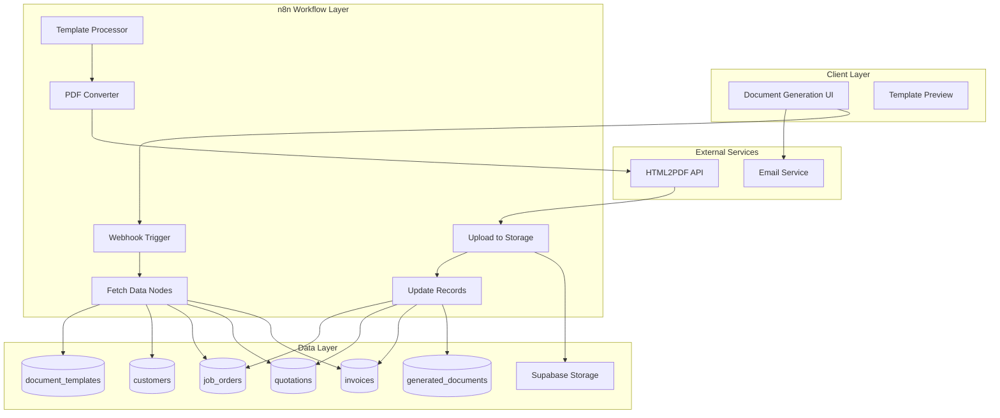

# Design Document

## Overview

The n8n Document Generation module automates the creation of professional PDF documents (invoices, quotations, delivery notes, contracts, certificates) using n8n workflows. The system uses HTML templates with Mustache-style variable substitution, converts rendered HTML to PDF via external API, and stores generated documents in Supabase storage with full tracking and history.

## Architecture



## Components and Interfaces

### 1. Template Manager

Handles CRUD operations for document templates.

```typescript
interface DocumentTemplate {
  id: string;
  template_code: string;
  template_name: string;
  document_type: DocumentType;
  html_template: string;
  css_styles: string | null;
  page_size: 'A4' | 'Letter' | 'Legal';
  orientation: 'portrait' | 'landscape';
  margins: MarginSettings;
  header_html: string | null;
  footer_html: string | null;
  include_letterhead: boolean;
  available_variables: string[];
  is_active: boolean;
  created_at: string;
}

type DocumentType = 'invoice' | 'quotation' | 'contract' | 'certificate' | 'report' | 'packing_list' | 'delivery_note';

interface MarginSettings {
  top: number;
  right: number;
  bottom: number;
  left: number;
}

// Template Manager Functions
function createTemplate(template: Omit<DocumentTemplate, 'id' | 'created_at'>): Promise<DocumentTemplate>;
function updateTemplate(id: string, updates: Partial<DocumentTemplate>): Promise<DocumentTemplate>;
function getTemplate(id: string): Promise<DocumentTemplate | null>;
function getTemplateByCode(code: string): Promise<DocumentTemplate | null>;
function listTemplates(filters?: { document_type?: DocumentType; is_active?: boolean }): Promise<DocumentTemplate[]>;
function deleteTemplate(id: string): Promise<void>;
```

### 2. Variable Processor

Processes templates with variable substitution and loop handling.

```typescript
interface VariableContext {
  [key: string]: string | number | boolean | null | VariableContext | VariableContext[];
}

interface ProcessedTemplate {
  html: string;
  variables_used: string[];
}

// Variable Processor Functions
function processTemplate(template: string, context: VariableContext): ProcessedTemplate;
function extractVariables(template: string): string[];
function substituteVariable(template: string, name: string, value: string): string;
function processLoop(template: string, loopName: string, items: VariableContext[]): string;
function injectLetterhead(html: string, letterheadHtml: string): string;
```

### 3. PDF Converter

Converts rendered HTML to PDF using external API.

```typescript
interface PDFOptions {
  page_size: 'A4' | 'Letter' | 'Legal';
  orientation: 'portrait' | 'landscape';
  margins: MarginSettings;
  header_html?: string;
  footer_html?: string;
}

interface PDFResult {
  success: boolean;
  pdf_buffer?: Buffer;
  error?: string;
}

// PDF Converter Functions
function convertToPDF(html: string, options: PDFOptions): Promise<PDFResult>;
function validatePDFOptions(options: PDFOptions): boolean;
```

### 4. Storage Manager

Handles file uploads to Supabase storage.

```typescript
interface UploadResult {
  success: boolean;
  file_url?: string;
  file_name?: string;
  file_size_kb?: number;
  error?: string;
}

interface StoragePath {
  bucket: string;
  path: string;
  filename: string;
}

// Storage Manager Functions
function uploadDocument(pdf: Buffer, documentType: DocumentType, documentNumber: string): Promise<UploadResult>;
function buildStoragePath(documentType: DocumentType, documentNumber: string): StoragePath;
function getPublicUrl(bucket: string, path: string): string;
function deleteDocument(fileUrl: string): Promise<boolean>;
```

### 5. Document Generator

Orchestrates the document generation process.

```typescript
interface GeneratedDocument {
  id: string;
  template_id: string;
  document_type: DocumentType;
  document_number: string | null;
  entity_type: string;
  entity_id: string;
  file_url: string;
  file_name: string;
  file_size_kb: number;
  generated_at: string;
  generated_by: string;
  variables_data: VariableContext;
  sent_to_email: string | null;
  sent_at: string | null;
  created_at: string;
}

interface GenerationRequest {
  template_code: string;
  entity_type: string;
  entity_id: string;
  user_id: string;
}

interface GenerationResult {
  success: boolean;
  document?: GeneratedDocument;
  file_url?: string;
  error?: string;
}

// Document Generator Functions
function generateDocument(request: GenerationRequest): Promise<GenerationResult>;
function generateInvoice(invoiceId: string, userId: string): Promise<GenerationResult>;
function generateQuotation(quotationId: string, userId: string): Promise<GenerationResult>;
function generateDeliveryNote(joId: string, userId: string): Promise<GenerationResult>;
function getGenerationHistory(filters: { entity_type?: string; entity_id?: string; document_type?: DocumentType; from_date?: string; to_date?: string }): Promise<GeneratedDocument[]>;
```

### 6. Email Sender

Handles document delivery via email.

```typescript
interface EmailRequest {
  to: string[];
  subject: string;
  body: string;
  attachment_url: string;
  attachment_name: string;
}

interface EmailResult {
  success: boolean;
  sent_at?: string;
  error?: string;
}

// Email Sender Functions
function sendDocumentEmail(documentId: string, emailRequest: EmailRequest): Promise<EmailResult>;
function updateDocumentEmailStatus(documentId: string, email: string, sentAt: string): Promise<void>;
```

## Data Models

### Database Schema

```sql
-- Document templates table
CREATE TABLE document_templates (
  id UUID PRIMARY KEY DEFAULT gen_random_uuid(),
  template_code VARCHAR(50) UNIQUE NOT NULL,
  template_name VARCHAR(100) NOT NULL,
  document_type VARCHAR(50) NOT NULL CHECK (document_type IN ('invoice', 'quotation', 'contract', 'certificate', 'report', 'packing_list', 'delivery_note')),
  html_template TEXT NOT NULL,
  css_styles TEXT,
  page_size VARCHAR(10) DEFAULT 'A4' CHECK (page_size IN ('A4', 'Letter', 'Legal')),
  orientation VARCHAR(20) DEFAULT 'portrait' CHECK (orientation IN ('portrait', 'landscape')),
  margins JSONB DEFAULT '{"top": 20, "right": 20, "bottom": 20, "left": 20}',
  header_html TEXT,
  footer_html TEXT,
  include_letterhead BOOLEAN DEFAULT TRUE,
  available_variables JSONB DEFAULT '[]',
  is_active BOOLEAN DEFAULT TRUE,
  created_at TIMESTAMPTZ DEFAULT NOW()
);

-- Generated documents table
CREATE TABLE generated_documents (
  id UUID PRIMARY KEY DEFAULT gen_random_uuid(),
  template_id UUID REFERENCES document_templates(id),
  document_type VARCHAR(50) NOT NULL,
  document_number VARCHAR(50),
  entity_type VARCHAR(50),
  entity_id UUID,
  file_url VARCHAR(500),
  file_name VARCHAR(200),
  file_size_kb INTEGER,
  generated_at TIMESTAMPTZ DEFAULT NOW(),
  generated_by UUID REFERENCES user_profiles(id),
  variables_data JSONB,
  sent_to_email VARCHAR(200),
  sent_at TIMESTAMPTZ,
  created_at TIMESTAMPTZ DEFAULT NOW()
);

-- Indexes
CREATE INDEX idx_document_templates_type ON document_templates(document_type);
CREATE INDEX idx_document_templates_code ON document_templates(template_code);
CREATE INDEX idx_document_templates_active ON document_templates(is_active);
CREATE INDEX idx_generated_documents_entity ON generated_documents(entity_type, entity_id);
CREATE INDEX idx_generated_documents_type ON generated_documents(document_type);
CREATE INDEX idx_generated_documents_date ON generated_documents(generated_at);

-- RLS Policies
ALTER TABLE document_templates ENABLE ROW LEVEL SECURITY;
ALTER TABLE generated_documents ENABLE ROW LEVEL SECURITY;

CREATE POLICY "Templates viewable by authenticated users" ON document_templates
  FOR SELECT TO authenticated USING (true);

CREATE POLICY "Templates manageable by admins" ON document_templates
  FOR ALL TO authenticated USING (
    EXISTS (SELECT 1 FROM user_profiles WHERE id = auth.uid() AND role IN ('admin', 'super_admin'))
  );

CREATE POLICY "Generated documents viewable by authenticated users" ON generated_documents
  FOR SELECT TO authenticated USING (true);

CREATE POLICY "Generated documents insertable by authenticated users" ON generated_documents
  FOR INSERT TO authenticated WITH CHECK (true);

CREATE POLICY "Generated documents updatable by owner or admin" ON generated_documents
  FOR UPDATE TO authenticated USING (
    generated_by = auth.uid() OR
    EXISTS (SELECT 1 FROM user_profiles WHERE id = auth.uid() AND role IN ('admin', 'super_admin'))
  );
```

### Default Templates

```sql
-- Standard Invoice Template
INSERT INTO document_templates (template_code, template_name, document_type, html_template, css_styles, available_variables) VALUES
('INV_STANDARD', 'Standard Invoice', 'invoice', 
'<!DOCTYPE html>
<html>
<head><style>{{styles}}</style></head>
<body>
{{letterhead}}
<h1>INVOICE</h1>
<div class="invoice-header">
  <p><strong>Invoice #:</strong> {{invoice_number}}</p>
  <p><strong>Date:</strong> {{invoice_date}}</p>
  <p><strong>Due Date:</strong> {{due_date}}</p>
</div>
<div class="bill-to">
  <p><strong>Bill To:</strong></p>
  <p>{{customer_name}}</p>
  <p>{{customer_address}}</p>
</div>
<table class="items-table">
  <thead>
    <tr><th>Description</th><th>Qty</th><th>Unit Price</th><th>Amount</th></tr>
  </thead>
  <tbody>
    {{#items}}
    <tr>
      <td>{{description}}</td>
      <td>{{quantity}}</td>
      <td>Rp {{unit_price}}</td>
      <td>Rp {{amount}}</td>
    </tr>
    {{/items}}
  </tbody>
</table>
<div class="totals">
  <p><strong>Subtotal:</strong> Rp {{subtotal}}</p>
  <p><strong>Tax (11%):</strong> Rp {{tax_amount}}</p>
  <p class="total"><strong>Total:</strong> Rp {{total_amount}}</p>
</div>
</body>
</html>',
'body { font-family: Arial, sans-serif; padding: 20px; }
.invoice-header { margin-bottom: 20px; }
.bill-to { margin-bottom: 20px; }
.items-table { width: 100%; border-collapse: collapse; margin-bottom: 20px; }
.items-table th, .items-table td { border: 1px solid #ddd; padding: 8px; text-align: left; }
.items-table th { background-color: #f5f5f5; }
.totals { text-align: right; }
.total { font-size: 18px; color: #333; }',
'["invoice_number", "invoice_date", "due_date", "customer_name", "customer_address", "items", "subtotal", "tax_amount", "total_amount"]'::jsonb);

-- Standard Quotation Template
INSERT INTO document_templates (template_code, template_name, document_type, html_template, css_styles, available_variables) VALUES
('QUOTE_STANDARD', 'Standard Quotation', 'quotation',
'<!DOCTYPE html>
<html>
<head><style>{{styles}}</style></head>
<body>
{{letterhead}}
<h1>QUOTATION</h1>
<div class="quote-header">
  <p><strong>Quotation #:</strong> {{quotation_number}}</p>
  <p><strong>Date:</strong> {{quotation_date}}</p>
  <p><strong>Valid Until:</strong> {{valid_until}}</p>
</div>
<div class="customer">
  <p><strong>To:</strong></p>
  <p>{{customer_name}}</p>
  <p>{{customer_address}}</p>
</div>
<h2>Scope of Work</h2>
<p>{{scope}}</p>
<h2>Price Breakdown</h2>
<table class="items-table">
  <thead>
    <tr><th>Description</th><th>Amount</th></tr>
  </thead>
  <tbody>
    {{#items}}
    <tr>
      <td>{{description}}</td>
      <td>Rp {{amount}}</td>
    </tr>
    {{/items}}
  </tbody>
</table>
<p class="total"><strong>Total:</strong> Rp {{total_amount}}</p>
<h2>Terms & Conditions</h2>
<p>{{terms}}</p>
</body>
</html>',
'body { font-family: Arial, sans-serif; padding: 20px; }
.quote-header { margin-bottom: 20px; }
.customer { margin-bottom: 20px; }
.items-table { width: 100%; border-collapse: collapse; margin-bottom: 20px; }
.items-table th, .items-table td { border: 1px solid #ddd; padding: 8px; }
.total { font-size: 18px; font-weight: bold; }',
'["quotation_number", "quotation_date", "valid_until", "customer_name", "customer_address", "scope", "items", "total_amount", "terms"]'::jsonb);

-- Delivery Note Template
INSERT INTO document_templates (template_code, template_name, document_type, html_template, css_styles, available_variables) VALUES
('DN_STANDARD', 'Standard Delivery Note', 'delivery_note',
'<!DOCTYPE html>
<html>
<head><style>{{styles}}</style></head>
<body>
{{letterhead}}
<h1>DELIVERY NOTE</h1>
<div class="dn-header">
  <p><strong>DN #:</strong> {{dn_number}}</p>
  <p><strong>Job Order:</strong> {{jo_number}}</p>
  <p><strong>Date:</strong> {{delivery_date}}</p>
</div>
<div class="route">
  <p><strong>From:</strong> {{origin}}</p>
  <p><strong>To:</strong> {{destination}}</p>
</div>
<h2>Items Delivered</h2>
<table class="items-table">
  <thead>
    <tr><th>Description</th><th>Qty</th><th>Condition</th></tr>
  </thead>
  <tbody>
    {{#items}}
    <tr>
      <td>{{description}}</td>
      <td>{{quantity}}</td>
      <td>{{condition}}</td>
    </tr>
    {{/items}}
  </tbody>
</table>
<div class="signature">
  <p>Received by: _________________________</p>
  <p>Name: _________________________</p>
  <p>Date: _________________________</p>
</div>
</body>
</html>',
'body { font-family: Arial, sans-serif; padding: 20px; }
.dn-header { margin-bottom: 20px; }
.route { margin-bottom: 20px; }
.items-table { width: 100%; border-collapse: collapse; margin-bottom: 30px; }
.items-table th, .items-table td { border: 1px solid #ddd; padding: 8px; }
.signature { margin-top: 50px; }',
'["dn_number", "jo_number", "delivery_date", "origin", "destination", "items"]'::jsonb);
```


## Correctness Properties

*A property is a characteristic or behavior that should hold true across all valid executions of a system—essentially, a formal statement about what the system should do. Properties serve as the bridge between human-readable specifications and machine-verifiable correctness guarantees.*

### Property 1: Template Code Uniqueness

*For any* two document templates in the system, if they have the same template_code, the second creation attempt SHALL be rejected with a uniqueness constraint error.

**Validates: Requirements 1.1**

### Property 2: Template HTML Validation

*For any* template creation or update attempt where html_template is empty or contains only whitespace, the operation SHALL be rejected with a validation error.

**Validates: Requirements 1.2**

### Property 3: Document Type Validation

*For any* template creation or update attempt, the document_type SHALL be one of the valid types (invoice, quotation, contract, certificate, report, packing_list, delivery_note), and invalid types SHALL be rejected.

**Validates: Requirements 1.3**

### Property 4: Template Round-Trip Consistency

*For any* valid document template that is created and then retrieved, all properties (html_template, css_styles, page_size, orientation, margins, header_html, footer_html, include_letterhead, available_variables) SHALL match the original values.

**Validates: Requirements 1.4, 1.5**

### Property 5: Template Filtering Correctness

*For any* list of templates and any document_type filter, all returned templates SHALL have a document_type matching the filter, and no templates with non-matching types SHALL be included.

**Validates: Requirements 1.6**

### Property 6: Variable Substitution Completeness

*For any* template containing {{variable_name}} placeholders and any variable context, after processing: (a) all placeholders with matching context values SHALL be replaced with those values, and (b) all placeholders without matching context values SHALL be replaced with empty strings.

**Validates: Requirements 2.1, 2.2**

### Property 7: Loop Processing Correctness

*For any* template containing {{#items}}...{{/items}} loop constructs and any array of N items in the context, the processed output SHALL contain exactly N rendered instances of the loop content, each with the corresponding item's values substituted.

**Validates: Requirements 2.3, 2.4**

### Property 8: HTML Structure Preservation

*For any* valid HTML template and any variable context, the processed output SHALL maintain valid HTML structure (all opened tags are closed, nesting is preserved).

**Validates: Requirements 2.5**

### Property 9: Letterhead Injection Correctness

*For any* template containing {{letterhead}} placeholder where include_letterhead is true, the processed output SHALL contain the company letterhead HTML in place of the placeholder. When include_letterhead is false, the placeholder SHALL be replaced with empty string.

**Validates: Requirements 2.6**

### Property 10: PDF Conversion Error Handling

*For any* PDF conversion that fails (invalid HTML, service unavailable, etc.), the converter SHALL return a result with success=false and a non-empty error message describing the failure.

**Validates: Requirements 3.6**

### Property 11: Storage Path Structure

*For any* document upload, the storage path SHALL follow the pattern {document_type}/{YYYY}/{MM}/{filename} where YYYY is the 4-digit year and MM is the 2-digit month of generation.

**Validates: Requirements 4.2**

### Property 12: Generated Document Record Completeness

*For any* successfully generated document, the generated_documents record SHALL contain: non-null template_id, document_type, entity_type, entity_id, file_url, file_name, file_size_kb > 0, generated_at timestamp, generated_by user ID, and variables_data JSON.

**Validates: Requirements 4.3, 4.4, 4.5**

### Property 13: Storage URL Validity

*For any* successfully uploaded document, the returned file_url SHALL be a valid URL that can be used to retrieve the document.

**Validates: Requirements 4.6**

### Property 14: Invoice Data Completeness

*For any* invoice document generation, the variables_data SHALL contain: invoice_number, invoice_date, customer_name, customer_address, items array with all line items, subtotal, tax_amount, and total_amount.

**Validates: Requirements 5.1, 5.2, 5.3**

### Property 15: Invoice Calculation Correctness

*For any* set of invoice line items, the calculated subtotal SHALL equal the sum of all item amounts, tax_amount SHALL equal subtotal × 0.11, and total_amount SHALL equal subtotal + tax_amount.

**Validates: Requirements 5.4**

### Property 16: Source Record Update

*For any* successfully generated invoice or quotation document, the source record (invoices or quotations table) SHALL be updated with the pdf_url of the generated document.

**Validates: Requirements 5.5, 6.5**

### Property 17: Incomplete Data Validation

*For any* document generation request where required source data is missing (e.g., invoice without customer, quotation without items), the generator SHALL return an error with success=false and descriptive error message.

**Validates: Requirements 5.6**

### Property 18: Quotation Data Completeness

*For any* quotation document generation, the variables_data SHALL contain: quotation_number, quotation_date, valid_until, customer_name, scope, items array with all revenue items, total_amount, and terms.

**Validates: Requirements 6.1, 6.2, 6.3, 6.4**

### Property 19: Delivery Note Data Completeness

*For any* delivery note generation, the variables_data SHALL contain: dn_number, jo_number, delivery_date, origin, destination, and items array with description, quantity, and condition for each item.

**Validates: Requirements 7.1, 7.2, 7.3**

### Property 20: Email Send Tracking

*For any* successful document email send, the generated_documents record SHALL be updated with sent_to_email containing the recipient address and sent_at containing the send timestamp.

**Validates: Requirements 8.2**

### Property 21: Email Error Handling

*For any* failed email delivery attempt, the system SHALL return success=false with a descriptive error message, and the sent_to_email and sent_at fields SHALL remain null.

**Validates: Requirements 8.3**

### Property 22: Multi-Recipient Email Support

*For any* email send request with multiple recipient addresses, all recipients SHALL receive the document, and sent_to_email SHALL contain all recipient addresses.

**Validates: Requirements 8.4**

### Property 23: Document History Filtering

*For any* document history query with filters (entity_type, entity_id, document_type, date range), all returned documents SHALL match ALL specified filter criteria, and no documents outside the criteria SHALL be included.

**Validates: Requirements 9.1, 9.2, 9.3**

### Property 24: Document History Data Completeness

*For any* document history listing, each returned document SHALL include template_name (from joined template), generated_at timestamp, and generated_by user information.

**Validates: Requirements 9.4**

## Error Handling

### Template Errors

| Error Code | Condition | Response |
|------------|-----------|----------|
| TEMPLATE_NOT_FOUND | Template code doesn't exist | 404 with message |
| TEMPLATE_INACTIVE | Template is_active = false | 400 with message |
| TEMPLATE_VALIDATION | Empty html_template | 400 with validation details |
| DUPLICATE_CODE | template_code already exists | 409 with message |

### Generation Errors

| Error Code | Condition | Response |
|------------|-----------|----------|
| ENTITY_NOT_FOUND | Source entity doesn't exist | 404 with entity type and ID |
| INCOMPLETE_DATA | Required fields missing | 400 with list of missing fields |
| PDF_CONVERSION_FAILED | HTML2PDF API error | 500 with API error message |
| STORAGE_UPLOAD_FAILED | Supabase storage error | 500 with storage error |

### Email Errors

| Error Code | Condition | Response |
|------------|-----------|----------|
| INVALID_EMAIL | Email format invalid | 400 with invalid addresses |
| EMAIL_SEND_FAILED | Email service error | 500 with service error |
| DOCUMENT_NOT_FOUND | Document ID doesn't exist | 404 with message |

## Testing Strategy

### Unit Tests

Unit tests will cover:
- Template validation logic (empty HTML, invalid document types)
- Variable extraction from templates
- Variable substitution logic
- Loop processing logic
- Storage path construction
- Calculation functions (subtotal, tax, total)
- Filter query building

### Property-Based Tests

Property-based tests will use `fast-check` library with minimum 100 iterations per property:

1. **Template CRUD Properties** (Properties 1-5)
   - Generate random templates and verify uniqueness, validation, round-trip
   
2. **Variable Processing Properties** (Properties 6-9)
   - Generate random templates and contexts, verify substitution correctness
   
3. **Document Generation Properties** (Properties 12-19)
   - Generate random entity data, verify record completeness
   
4. **Filtering Properties** (Property 23)
   - Generate random documents and filters, verify filter correctness

### Integration Tests

Integration tests will cover:
- End-to-end invoice generation flow
- End-to-end quotation generation flow
- End-to-end delivery note generation flow
- Email sending with attachments
- Supabase storage upload/download

### Test Configuration

```typescript
// vitest.config.ts additions
export default defineConfig({
  test: {
    // Property tests need more time
    testTimeout: 30000,
    // Ensure fast-check runs sufficient iterations
    setupFiles: ['./vitest.setup.ts'],
  },
});
```

Each property test must be annotated with:
```typescript
// Feature: n8n-document-generation, Property N: [Property Title]
// Validates: Requirements X.Y
```
