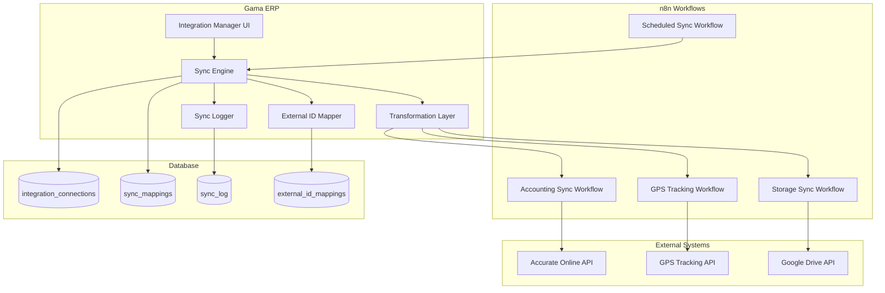

# Design Document: n8n External Integrations

## Overview

This design implements a comprehensive external integration framework for Gama ERP, enabling bidirectional data synchronization with accounting software (Accurate Online), GPS tracking systems, and cloud storage providers (Google Drive). The system uses n8n workflows for orchestration and provides robust error handling, retry logic, and audit logging.

## Architecture



## Components and Interfaces

### 1. Integration Connection Manager

```typescript
interface IntegrationConnection {
  id: string;
  connection_code: string;
  connection_name: string;
  integration_type: IntegrationType;
  provider: Provider;
  credentials: EncryptedCredentials;
  config: ConnectionConfig;
  is_active: boolean;
  last_sync_at: Date | null;
  last_error: string | null;
  access_token?: string;
  refresh_token?: string;
  token_expires_at?: Date;
  created_by: string;
  created_at: Date;
}

type IntegrationType = 'accounting' | 'tracking' | 'email' | 'storage' | 'messaging' | 'custom';

type Provider = 'accurate' | 'jurnal' | 'xero' | 'google_sheets' | 'whatsapp' | 
                'telegram' | 'slack' | 'google_drive' | 'dropbox';

interface ConnectionConfig {
  base_url?: string;
  sync_invoices?: boolean;
  sync_payments?: boolean;
  sync_customers?: boolean;
  update_interval?: number;
  folder_id?: string;
  auto_backup?: boolean;
}
```

### 2. Sync Mapping Configuration

```typescript
interface SyncMapping {
  id: string;
  connection_id: string;
  local_table: string;
  remote_entity: string;
  field_mappings: FieldMapping[];
  sync_direction: SyncDirection;
  sync_frequency: SyncFrequency;
  filter_conditions: FilterCondition[] | null;
  is_active: boolean;
  created_at: Date;
}

interface FieldMapping {
  local_field: string;
  remote_field: string;
  transform?: TransformFunction;
}

type TransformFunction = 'date_format' | 'currency_format' | 'uppercase' | 'lowercase' | 'custom';
type SyncDirection = 'push' | 'pull' | 'bidirectional';
type SyncFrequency = 'realtime' | 'hourly' | 'daily' | 'manual';

interface FilterCondition {
  field: string;
  operator: 'eq' | 'neq' | 'gt' | 'lt' | 'gte' | 'lte' | 'in' | 'contains';
  value: unknown;
}
```

### 3. Sync Engine

```typescript
interface SyncEngine {
  executePush(mapping: SyncMapping, records: Record<string, unknown>[]): Promise<SyncResult>;
  executePull(mapping: SyncMapping): Promise<SyncResult>;
  executeFullSync(connectionId: string): Promise<SyncResult>;
  retryFailed(syncLogId: string): Promise<SyncResult>;
}

interface SyncResult {
  sync_log_id: string;
  status: SyncStatus;
  records_processed: number;
  records_created: number;
  records_updated: number;
  records_failed: number;
  error_details?: SyncError[];
}

type SyncStatus = 'running' | 'completed' | 'failed' | 'partial';

interface SyncError {
  record_id: string;
  error_code: string;
  error_message: string;
  timestamp: Date;
}
```

### 4. External ID Mapper

```typescript
interface ExternalIdMapping {
  id: string;
  connection_id: string;
  local_table: string;
  local_id: string;
  external_id: string;
  external_data: Record<string, unknown> | null;
  synced_at: Date;
}

interface ExternalIdMapper {
  getExternalId(connectionId: string, localTable: string, localId: string): Promise<string | null>;
  createMapping(mapping: Omit<ExternalIdMapping, 'id' | 'synced_at'>): Promise<ExternalIdMapping>;
  updateMapping(id: string, externalData: Record<string, unknown>): Promise<ExternalIdMapping>;
  deleteMapping(id: string): Promise<void>;
}
```

### 5. Data Transformers

```typescript
// Invoice to Accurate Online format
interface AccurateInvoice {
  transDate: string;
  transNo: string;
  customerNo: string;
  detailItem: AccurateLineItem[];
  totalAmount: number;
}

interface AccurateLineItem {
  itemNo: string;
  quantity: number;
  unitPrice: number;
}

function transformInvoiceToAccurate(invoice: Invoice): AccurateInvoice {
  return {
    transDate: formatDate(invoice.invoice_date, 'yyyy-MM-dd'),
    transNo: invoice.invoice_number,
    customerNo: invoice.customer_code,
    detailItem: invoice.items.map(item => ({
      itemNo: item.item_code,
      quantity: item.quantity,
      unitPrice: item.unit_price
    })),
    totalAmount: invoice.total_amount
  };
}
```

### 6. Sync Logger

```typescript
interface SyncLog {
  id: string;
  connection_id: string;
  mapping_id: string | null;
  sync_type: 'push' | 'pull' | 'full_sync';
  started_at: Date;
  completed_at: Date | null;
  records_processed: number;
  records_created: number;
  records_updated: number;
  records_failed: number;
  status: SyncStatus;
  error_details: SyncError[] | null;
  created_at: Date;
}

interface SyncLogger {
  startSync(connectionId: string, mappingId: string | null, syncType: string): Promise<SyncLog>;
  updateProgress(logId: string, progress: Partial<SyncLog>): Promise<void>;
  completeSync(logId: string, result: SyncResult): Promise<void>;
  failSync(logId: string, errors: SyncError[]): Promise<void>;
}
```

## Data Models

### Database Schema

```sql
-- Integration connections
CREATE TABLE integration_connections (
  id UUID PRIMARY KEY DEFAULT gen_random_uuid(),
  connection_code VARCHAR(50) UNIQUE NOT NULL,
  connection_name VARCHAR(100) NOT NULL,
  integration_type VARCHAR(50) NOT NULL,
  provider VARCHAR(50) NOT NULL,
  credentials JSONB,
  config JSONB DEFAULT '{}',
  is_active BOOLEAN DEFAULT TRUE,
  last_sync_at TIMESTAMPTZ,
  last_error TEXT,
  access_token TEXT,
  refresh_token TEXT,
  token_expires_at TIMESTAMPTZ,
  created_by UUID REFERENCES user_profiles(id),
  created_at TIMESTAMPTZ DEFAULT NOW()
);

-- Sync mappings
CREATE TABLE sync_mappings (
  id UUID PRIMARY KEY DEFAULT gen_random_uuid(),
  connection_id UUID NOT NULL REFERENCES integration_connections(id),
  local_table VARCHAR(100) NOT NULL,
  remote_entity VARCHAR(100) NOT NULL,
  field_mappings JSONB NOT NULL,
  sync_direction VARCHAR(20) DEFAULT 'push',
  sync_frequency VARCHAR(20) DEFAULT 'realtime',
  filter_conditions JSONB,
  is_active BOOLEAN DEFAULT TRUE,
  created_at TIMESTAMPTZ DEFAULT NOW()
);

-- Sync log
CREATE TABLE sync_log (
  id UUID PRIMARY KEY DEFAULT gen_random_uuid(),
  connection_id UUID NOT NULL REFERENCES integration_connections(id),
  mapping_id UUID REFERENCES sync_mappings(id),
  sync_type VARCHAR(20) NOT NULL,
  started_at TIMESTAMPTZ DEFAULT NOW(),
  completed_at TIMESTAMPTZ,
  records_processed INTEGER DEFAULT 0,
  records_created INTEGER DEFAULT 0,
  records_updated INTEGER DEFAULT 0,
  records_failed INTEGER DEFAULT 0,
  status VARCHAR(20) DEFAULT 'running',
  error_details JSONB,
  created_at TIMESTAMPTZ DEFAULT NOW()
);

-- External ID mappings
CREATE TABLE external_id_mappings (
  id UUID PRIMARY KEY DEFAULT gen_random_uuid(),
  connection_id UUID NOT NULL REFERENCES integration_connections(id),
  local_table VARCHAR(100) NOT NULL,
  local_id UUID NOT NULL,
  external_id VARCHAR(200) NOT NULL,
  external_data JSONB,
  synced_at TIMESTAMPTZ DEFAULT NOW(),
  UNIQUE(connection_id, local_table, local_id)
);

-- Indexes
CREATE INDEX idx_integration_connections_type ON integration_connections(integration_type);
CREATE INDEX idx_sync_mappings_connection ON sync_mappings(connection_id);
CREATE INDEX idx_sync_log_connection ON sync_log(connection_id);
CREATE INDEX idx_sync_log_status ON sync_log(status);
CREATE INDEX idx_sync_log_started_at ON sync_log(started_at);
CREATE INDEX idx_external_id_mappings_lookup ON external_id_mappings(connection_id, local_table, local_id);
```

## Correctness Properties

*A property is a characteristic or behavior that should hold true across all valid executions of a system—essentially, a formal statement about what the system should do. Properties serve as the bridge between human-readable specifications and machine-verifiable correctness guarantees.*

### Property 1: Connection Data Persistence

*For any* valid integration connection with connection_code, connection_name, integration_type, provider, and credentials, creating the connection and then retrieving it SHALL return all fields with identical values.

**Validates: Requirements 1.1, 1.2, 1.4, 1.5**

### Property 2: Enum Value Validation

*For any* integration_type value, it SHALL be accepted if and only if it is one of: 'accounting', 'tracking', 'email', 'storage', 'messaging', 'custom'. *For any* provider value, it SHALL be accepted if and only if it is in the allowed provider list. *For any* sync_direction, it SHALL be one of: 'push', 'pull', 'bidirectional'. *For any* sync_frequency, it SHALL be one of: 'realtime', 'hourly', 'daily', 'manual'.

**Validates: Requirements 1.6, 1.7, 2.3, 2.4**

### Property 3: Sync Mapping Persistence

*For any* valid sync mapping with local_table, remote_entity, and field_mappings array, creating the mapping and then retrieving it SHALL return all fields including field_mappings with local_field, remote_field, and optional transform preserved.

**Validates: Requirements 2.1, 2.2**

### Property 4: Filter Application

*For any* sync mapping with filter_conditions, the records returned for synchronization SHALL only include records that satisfy all filter conditions. *For any* deactivated sync mapping, it SHALL be excluded from sync operations.

**Validates: Requirements 2.5, 2.6**

### Property 5: Invoice Transformation Round-Trip

*For any* valid Gama ERP invoice, transforming it to Accurate Online format SHALL produce an object containing transDate (formatted date), transNo (invoice_number), customerNo (customer_code), detailItem array (with itemNo, quantity, unitPrice for each item), and totalAmount. The transformation SHALL be deterministic.

**Validates: Requirements 3.2**

### Property 6: External ID Mapping Lifecycle

*For any* record synced to an external system, if no external_id_mapping exists, a new mapping SHALL be created. If a mapping exists, the sync operation SHALL be an update. The combination (connection_id, local_table, local_id) SHALL be unique. When external_data is provided, it SHALL be stored. The synced_at timestamp SHALL be set to current time on create or update.

**Validates: Requirements 3.5, 3.6, 7.1, 7.2, 7.3, 7.4, 7.5**

### Property 7: Location Data Handling

*For any* valid GPS location data received, the corresponding asset's location SHALL be updated. Location history SHALL include timestamp. When speed and heading are provided, they SHALL be stored with the location. Connection failures SHALL be logged with error details.

**Validates: Requirements 4.2, 4.3, 4.4, 4.5**

### Property 8: Folder Structure Generation

*For any* document with a local folder path, the generated Google Drive path SHALL match the local organization structure. Synced documents SHALL include sync_status and external_file_link fields.

**Validates: Requirements 5.3, 5.5**

### Property 9: Sync Log State Machine

*For any* sync operation, starting SHALL create a sync_log with status 'running'. Completion SHALL update status to 'completed' with records_processed, records_created, records_updated, records_failed counts. Failure SHALL set status to 'failed' with error_details. Partial failure (some records succeed, some fail) SHALL set status to 'partial'.

**Validates: Requirements 6.3, 6.4, 6.5, 6.6**

### Property 10: Sync Log Completeness

*For any* sync log entry, it SHALL contain sync_type, started_at, completed_at (when finished), and status. Details SHALL include records_processed, records_created, records_updated, records_failed. Failed syncs SHALL include error_details. Filtering by connection_id, status, or date range SHALL return only matching logs.

**Validates: Requirements 8.1, 8.2, 8.3, 8.4**

### Property 11: Retry Logic

*For any* sync operation that fails due to network error, retry SHALL occur up to 3 times with exponential backoff (delays increasing). Individual record failures SHALL not stop batch processing. Expired OAuth tokens SHALL trigger refresh attempt. Failed token refresh SHALL mark connection as requiring re-authentication.

**Validates: Requirements 9.1, 9.2, 9.3, 9.4**

## Error Handling

### Connection Errors

| Error Type | Handling Strategy |
|------------|-------------------|
| Network timeout | Retry with exponential backoff (1s, 2s, 4s) |
| Authentication failure | Attempt token refresh, then mark for re-auth |
| Rate limiting | Respect Retry-After header, queue remaining |
| Invalid credentials | Log error, deactivate connection |

### Sync Errors

| Error Type | Handling Strategy |
|------------|-------------------|
| Record validation failure | Log error, continue with next record |
| Duplicate external ID | Update existing record |
| Missing required field | Skip record, log error |
| External API error | Retry up to 3 times, then fail record |

### Error Response Format

```typescript
interface IntegrationError {
  code: string;
  message: string;
  connection_id: string;
  record_id?: string;
  timestamp: Date;
  retryable: boolean;
  retry_count: number;
}
```

## Testing Strategy

### Unit Tests

- Connection CRUD operations
- Sync mapping validation
- Data transformation functions
- Filter condition evaluation
- External ID mapping operations
- Sync log state transitions

### Property-Based Tests

Using fast-check for TypeScript property-based testing:

1. **Connection persistence**: Generate random valid connections, verify round-trip
2. **Enum validation**: Generate random strings, verify only valid enums accepted
3. **Mapping persistence**: Generate random mappings, verify field preservation
4. **Filter application**: Generate records and filters, verify correct filtering
5. **Invoice transformation**: Generate invoices, verify output format
6. **External ID lifecycle**: Generate sync sequences, verify mapping behavior
7. **Sync log states**: Generate sync operations, verify state machine
8. **Retry logic**: Generate failure sequences, verify backoff pattern

### Integration Tests

- End-to-end sync with mock external APIs
- OAuth token refresh flow
- Scheduled sync execution
- Error recovery scenarios

### Test Configuration

```typescript
// Property test configuration
const propertyTestConfig = {
  numRuns: 100,
  seed: Date.now(),
  verbose: true
};
```
