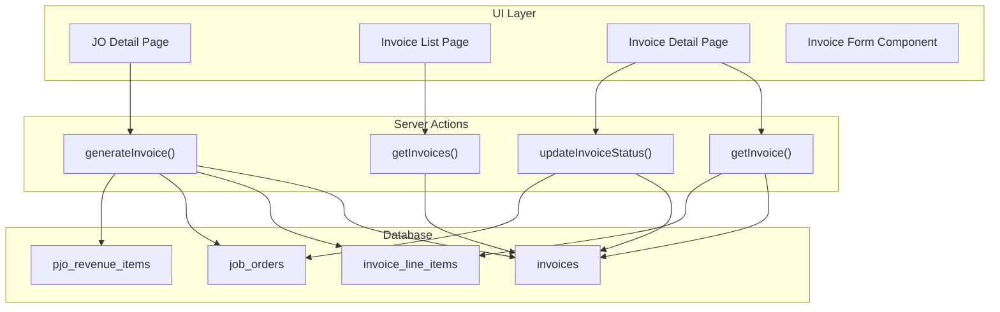
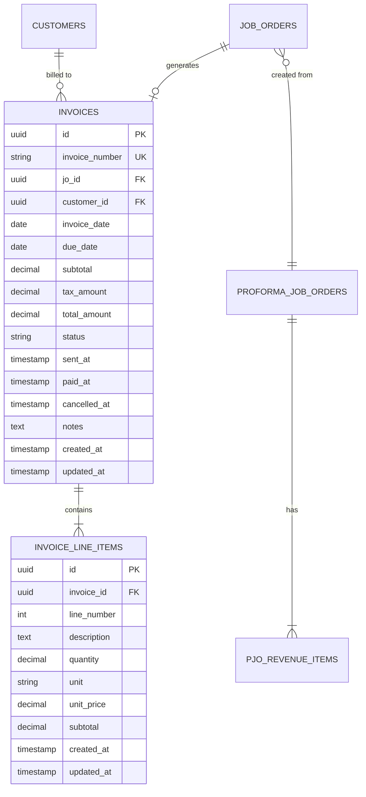
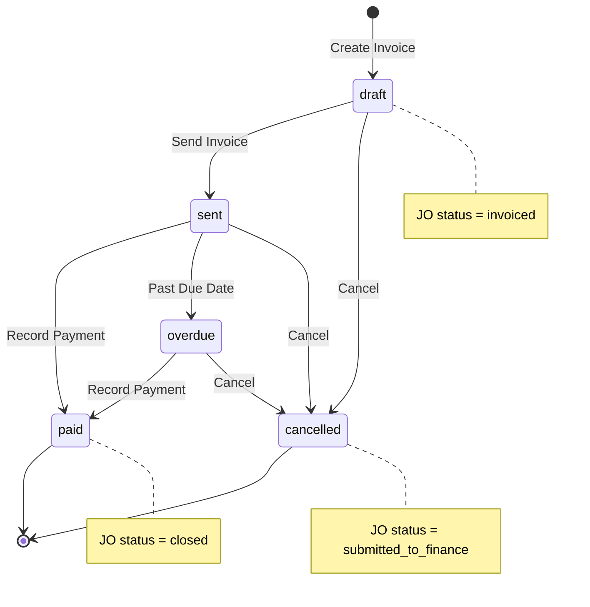

# Design Document: Invoice from Job Order

## Overview

The Invoice from JO feature enables administration staff to generate invoices from completed Job Orders that have been submitted to finance. The system automatically copies revenue line items from the source PJO, calculates VAT at 11%, and tracks the invoice through its lifecycle from draft to paid.

Key capabilities:
- Auto-generate sequential invoice numbers (INV-YYYY-NNNN format)
- Copy PJO revenue items as invoice line items
- Calculate subtotal, VAT (11%), and grand total
- Manage invoice status workflow (draft → sent → paid/overdue)
- Update JO status based on invoice lifecycle events
- Filter and search invoices

## Architecture

The feature follows the existing Next.js App Router architecture with Server Actions for data mutations.



## Components and Interfaces

### Database Schema

#### invoices table (update existing)

```sql
ALTER TABLE invoices ADD COLUMN IF NOT EXISTS invoice_date DATE;
ALTER TABLE invoices ADD COLUMN IF NOT EXISTS sent_at TIMESTAMPTZ;
ALTER TABLE invoices ADD COLUMN IF NOT EXISTS paid_at TIMESTAMPTZ;
ALTER TABLE invoices ADD COLUMN IF NOT EXISTS cancelled_at TIMESTAMPTZ;
ALTER TABLE invoices ADD COLUMN IF NOT EXISTS notes TEXT;

-- Rename columns for clarity
ALTER TABLE invoices RENAME COLUMN amount TO subtotal;
-- tax_amount and total_amount already exist
```

#### invoice_line_items table (new)

```sql
CREATE TABLE invoice_line_items (
    id UUID PRIMARY KEY DEFAULT gen_random_uuid(),
    invoice_id UUID NOT NULL REFERENCES invoices(id) ON DELETE CASCADE,
    line_number INTEGER NOT NULL,
    description TEXT NOT NULL,
    quantity DECIMAL(10,2) NOT NULL DEFAULT 1,
    unit VARCHAR(20),
    unit_price DECIMAL(15,2) NOT NULL,
    subtotal DECIMAL(15,2) GENERATED ALWAYS AS (quantity * unit_price) STORED,
    created_at TIMESTAMPTZ DEFAULT NOW(),
    updated_at TIMESTAMPTZ DEFAULT NOW(),
    UNIQUE(invoice_id, line_number)
);

-- RLS Policy
ALTER TABLE invoice_line_items ENABLE ROW LEVEL SECURITY;
CREATE POLICY "Allow all for authenticated users" ON invoice_line_items
    FOR ALL TO authenticated USING (true) WITH CHECK (true);
```

### TypeScript Interfaces

```typescript
// types/database.ts additions

export type InvoiceStatus = 'draft' | 'sent' | 'paid' | 'overdue' | 'cancelled'

export interface InvoiceLineItem {
  id: string
  invoice_id: string
  line_number: number
  description: string
  quantity: number
  unit: string | null
  unit_price: number
  subtotal: number
  created_at: string
  updated_at: string
}

export interface InvoiceExtended {
  id: string
  invoice_number: string
  jo_id: string
  customer_id: string
  invoice_date: string
  due_date: string
  subtotal: number
  tax_amount: number
  total_amount: number
  status: InvoiceStatus
  sent_at: string | null
  paid_at: string | null
  cancelled_at: string | null
  notes: string | null
  created_at: string
  updated_at: string
}

export interface InvoiceWithRelations extends InvoiceExtended {
  customers: {
    id: string
    name: string
    email: string
    address: string | null
  }
  job_orders: {
    id: string
    jo_number: string
    pjo_id: string | null
  }
  invoice_line_items?: InvoiceLineItem[]
}

export interface InvoiceFormData {
  jo_id: string
  customer_id: string
  invoice_date: string
  due_date: string
  line_items: {
    description: string
    quantity: number
    unit: string
    unit_price: number
  }[]
  notes?: string
}
```

### React Components

#### InvoiceTable (`components/invoices/invoice-table.tsx`)
- Displays list of invoices with sorting and filtering
- Columns: Invoice #, Customer, JO #, Subtotal, VAT, Total, Due Date, Status
- Click row to navigate to detail page

#### InvoiceDetailView (`components/invoices/invoice-detail-view.tsx`)
- Shows full invoice information
- Displays line items table
- Shows financial summary (subtotal, VAT, total)
- Action buttons for status transitions

#### InvoiceForm (`components/invoices/invoice-form.tsx`)
- Pre-populated form for creating invoice from JO
- Editable line items with add/remove capability
- Auto-calculating totals
- Date pickers for invoice_date and due_date

#### InvoiceStatusBadge (`components/ui/invoice-status-badge.tsx`)
- Visual status indicator with appropriate colors
- draft: gray, sent: blue, paid: green, overdue: red, cancelled: gray

#### InvoiceFilters (`components/invoices/invoice-filters.tsx`)
- Status filter dropdown
- Search input for invoice number and customer name

### Server Actions

#### `app/(main)/invoices/actions.ts`

```typescript
// Generate next invoice number
async function generateInvoiceNumber(): Promise<string>

// Create invoice from JO
async function createInvoice(data: InvoiceFormData): Promise<{ data?: Invoice; error?: string }>

// Get all invoices with relations
async function getInvoices(filters?: InvoiceFilters): Promise<InvoiceWithRelations[]>

// Get single invoice with line items
async function getInvoice(id: string): Promise<InvoiceWithRelations | null>

// Update invoice status
async function updateInvoiceStatus(
  id: string, 
  status: InvoiceStatus
): Promise<{ error?: string }>

// Get invoice data for JO (pre-fill)
async function getInvoiceDataFromJO(joId: string): Promise<InvoiceFormData | null>
```

### Utility Functions

#### `lib/invoice-utils.ts`

```typescript
// Calculate invoice totals
function calculateInvoiceTotals(lineItems: LineItem[]): {
  subtotal: number
  vatAmount: number
  grandTotal: number
}

// VAT rate constant
const VAT_RATE = 0.11

// Format invoice number
function formatInvoiceNumber(year: number, sequence: number): string

// Check if invoice is overdue
function isInvoiceOverdue(dueDate: string, status: InvoiceStatus): boolean
```

## Data Models

### Entity Relationship Diagram



### Invoice Status State Machine




## Correctness Properties

*A property is a characteristic or behavior that should hold true across all valid executions of a system-essentially, a formal statement about what the system should do. Properties serve as the bridge between human-readable specifications and machine-verifiable correctness guarantees.*

Based on the acceptance criteria analysis, the following correctness properties must be validated:

### Property 1: Invoice Number Sequential Generation

*For any* sequence of invoice creations within the same year, the generated invoice numbers SHALL be sequential and follow the format INV-YYYY-NNNN where NNNN increments by 1 for each new invoice.

**Validates: Requirements 1.3**

### Property 2: JO Status Validation

*For any* Job Order with status not equal to "submitted_to_finance", attempting to generate an invoice SHALL be rejected with an error.

**Validates: Requirements 1.6**

### Property 3: Revenue Items Complete Copy

*For any* set of PJO revenue items, when generating an invoice, the resulting invoice_line_items SHALL contain exactly the same number of items, and each item SHALL preserve the description, quantity, unit, and unit_price values from the source.

**Validates: Requirements 2.1, 2.2**

### Property 4: Line Item Sequential Numbering

*For any* set of copied revenue items, the resulting invoice_line_items SHALL have line_number values that form a contiguous sequence starting from 1.

**Validates: Requirements 2.3**

### Property 5: Line Item Subtotal Calculation

*For any* invoice line item, the subtotal SHALL equal quantity multiplied by unit_price.

**Validates: Requirements 2.4**

### Property 6: Invoice Total Calculations

*For any* invoice with line items:
- subtotal SHALL equal the sum of all line item subtotals
- vat_amount SHALL equal subtotal multiplied by 0.11
- grand_total SHALL equal subtotal plus vat_amount

**Validates: Requirements 3.1, 3.2, 3.3, 3.4, 3.5**

### Property 7: Invoice Creation Updates JO

*For any* successfully created invoice, the linked Job Order status SHALL be "invoiced" and the invoice's jo_id SHALL reference the source JO.

**Validates: Requirements 4.3, 4.4**

### Property 8: Invoice Status Transitions

*For any* invoice:
- Only "draft" status invoices can transition to "sent"
- Only "sent" or "overdue" status invoices can transition to "paid"
- Only "sent" status invoices past their due_date can transition to "overdue"
- "draft", "sent", or "overdue" status invoices can transition to "cancelled"

**Validates: Requirements 7.1, 7.2, 7.5**

### Property 9: Payment Updates JO to Closed

*For any* invoice marked as "paid", the linked Job Order status SHALL be updated to "closed".

**Validates: Requirements 7.3**

### Property 10: Cancellation Reverts JO Status

*For any* cancelled invoice, the linked Job Order status SHALL be reverted to "submitted_to_finance".

**Validates: Requirements 7.4**

### Property 11: Status Filter Correctness

*For any* status filter applied to the invoice list, all returned invoices SHALL have a status matching the filter value.

**Validates: Requirements 8.1**

### Property 12: Invoice List Ordering

*For any* list of invoices returned, they SHALL be sorted by created_at in descending order (newest first).

**Validates: Requirements 5.2**

### Property 13: Monetary Value Round-Trip

*For any* monetary value stored in the database, serializing then deserializing SHALL produce an equivalent value (within DECIMAL(15,2) precision).

**Validates: Requirements 9.3, 9.4**

## Error Handling

### Validation Errors

| Error Condition | Error Message | HTTP Status |
|----------------|---------------|-------------|
| JO not found | "Job Order not found" | 404 |
| JO status not submitted_to_finance | "Only Job Orders submitted to finance can be invoiced" | 400 |
| Invoice not found | "Invoice not found" | 404 |
| Invalid status transition | "Cannot transition from {current} to {target}" | 400 |
| Missing required fields | "Required field {field} is missing" | 400 |
| Invalid due date (past) | "Due date cannot be in the past" | 400 |

### Database Errors

- Connection failures: Retry with exponential backoff, show user-friendly error
- Constraint violations: Log error, show specific validation message
- Transaction failures: Rollback all changes, notify user

### Concurrent Modification

- Use optimistic locking via updated_at timestamp
- If conflict detected, reload data and prompt user to retry

## Testing Strategy

### Property-Based Testing

The project will use **fast-check** for property-based testing in TypeScript/JavaScript.

Configuration:
- Minimum 100 iterations per property test
- Seed logging for reproducibility
- Shrinking enabled for minimal failing examples

Each property test must:
1. Be tagged with the format: `**Feature: invoice-from-jo, Property {number}: {property_text}**`
2. Reference the specific requirement it validates
3. Generate diverse inputs covering edge cases

### Unit Tests

Unit tests will cover:
- Invoice number generation function
- VAT calculation function
- Status transition validation
- Date calculations (due date default)
- IDR formatting

### Integration Tests

Integration tests will verify:
- Full invoice creation flow from JO
- Status transition workflows
- Database persistence and retrieval
- JO status synchronization

### Test Data Generators

For property-based tests, create generators for:
- Valid invoice line items (positive quantities, prices)
- Invoice status values
- Date ranges (past, present, future)
- Monetary values (within DECIMAL(15,2) range)
