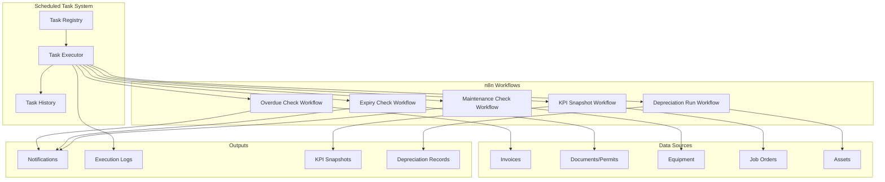

# Design Document: n8n Scheduled Tasks

## Overview

This design document describes the implementation of scheduled automation tasks for the Gama ERP system. The feature enables automated daily operations including overdue invoice checks, document expiry monitoring, maintenance reminders, weekly KPI snapshots, and monthly depreciation calculations. Tasks are managed through a registry with cron-based scheduling and comprehensive execution tracking.

## Architecture



## Components and Interfaces

### 1. Scheduled Task Registry

```typescript
interface ScheduledTask {
  id: string;
  task_code: string;
  task_name: string;
  description: string | null;
  cron_expression: string;
  timezone: string;
  n8n_workflow_id: string | null;
  webhook_url: string | null;
  task_parameters: Record<string, unknown>;
  is_active: boolean;
  last_run_at: string | null;
  last_run_status: ExecutionStatus | null;
  last_run_duration_ms: number | null;
  next_run_at: string | null;
  created_at: string;
}

type ExecutionStatus = 'running' | 'completed' | 'failed' | 'timeout';
type TriggerType = 'schedule' | 'manual' | 'retry';
```

### 2. Task Execution History

```typescript
interface TaskExecution {
  id: string;
  task_id: string;
  started_at: string;
  completed_at: string | null;
  status: ExecutionStatus;
  records_processed: number | null;
  result_summary: Record<string, unknown> | null;
  error_message: string | null;
  execution_time_ms: number | null;
  triggered_by: TriggerType;
  created_at: string;
}
```

### 3. Scheduled Task Utilities

```typescript
// lib/scheduled-task-utils.ts

// Task registry operations
function getScheduledTasks(activeOnly?: boolean): Promise<ScheduledTask[]>;
function getScheduledTaskByCode(taskCode: string): Promise<ScheduledTask | null>;
function updateTaskStatus(taskId: string, isActive: boolean): Promise<void>;
function calculateNextRun(cronExpression: string, timezone: string): Date;

// Execution operations
function createTaskExecution(taskId: string, triggeredBy: TriggerType): Promise<TaskExecution>;
function updateTaskExecution(executionId: string, updates: Partial<TaskExecution>): Promise<void>;
function getTaskExecutions(taskId: string, filters?: ExecutionFilters): Promise<TaskExecution[]>;

// Manual trigger
function triggerTaskManually(taskCode: string): Promise<{ executionId: string }>;

// Cron utilities
function parseCronExpression(cron: string): CronParts;
function isValidCronExpression(cron: string): boolean;
function getNextRunTime(cron: string, timezone: string, fromDate?: Date): Date;
```

### 4. Overdue Invoice Check Utilities

```typescript
// lib/overdue-check-utils.ts

type OverdueSeverity = 'critical' | 'high' | 'medium' | 'low';

interface OverdueInvoice {
  id: string;
  invoice_number: string;
  customer_name: string;
  amount: number;
  due_date: string;
  days_overdue: number;
  severity: OverdueSeverity;
}

interface OverdueCheckResult {
  critical: OverdueInvoice[];
  high: OverdueInvoice[];
  medium: OverdueInvoice[];
  low: OverdueInvoice[];
  total_count: number;
  total_amount: number;
}

function getOverdueInvoices(): Promise<OverdueInvoice[]>;
function classifyOverdueSeverity(daysOverdue: number): OverdueSeverity;
function groupOverdueInvoices(invoices: OverdueInvoice[]): OverdueCheckResult;
function updateInvoiceToOverdue(invoiceId: string): Promise<void>;
function createFollowUpTask(invoice: OverdueInvoice): Promise<void>;
```

### 5. Expiry Check Utilities

```typescript
// lib/expiry-check-utils.ts

type ExpiryUrgency = 'expired' | 'expiring_this_week' | 'expiring_this_month';
type ExpiryItemType = 'document' | 'permit' | 'certification';

interface ExpiringItem {
  id: string;
  item_type: ExpiryItemType;
  name: string;
  expiry_date: string;
  days_until_expiry: number;
  urgency: ExpiryUrgency;
  responsible_user_id: string;
}

interface ExpiryCheckResult {
  expired: ExpiringItem[];
  expiring_this_week: ExpiringItem[];
  expiring_this_month: ExpiringItem[];
  total_count: number;
}

function getExpiringDocuments(withinDays: number): Promise<ExpiringItem[]>;
function getExpiringPermits(withinDays: number): Promise<ExpiringItem[]>;
function getExpiringCertifications(withinDays: number): Promise<ExpiringItem[]>;
function classifyExpiryUrgency(daysUntilExpiry: number): ExpiryUrgency;
function groupExpiringItems(items: ExpiringItem[]): ExpiryCheckResult;
```

### 6. Maintenance Check Utilities

```typescript
// lib/maintenance-check-utils.ts

type MaintenancePriority = 'critical' | 'high' | 'normal';

interface MaintenanceItem {
  id: string;
  equipment_id: string;
  equipment_name: string;
  maintenance_type: string;
  due_date: string;
  days_until_due: number;
  is_overdue: boolean;
  priority: MaintenancePriority;
}

interface MaintenanceCheckResult {
  overdue: MaintenanceItem[];
  upcoming: MaintenanceItem[];
  equipment_count: number;
  maintenance_items_found: number;
}

function getUpcomingMaintenance(withinDays: number): Promise<MaintenanceItem[]>;
function getOverdueMaintenance(): Promise<MaintenanceItem[]>;
function classifyMaintenancePriority(item: MaintenanceItem): MaintenancePriority;
function groupMaintenanceItems(items: MaintenanceItem[]): MaintenanceCheckResult;
```

### 7. KPI Snapshot Utilities

```typescript
// lib/kpi-snapshot-utils.ts

interface KPISnapshot {
  id: string;
  week_number: number;
  year: number;
  snapshot_date: string;
  revenue_metrics: RevenueMetrics;
  operational_metrics: OperationalMetrics;
  financial_metrics: FinancialMetrics;
  created_at: string;
}

interface RevenueMetrics {
  total_revenue: number;
  revenue_by_customer: Record<string, number>;
  revenue_by_service: Record<string, number>;
}

interface OperationalMetrics {
  jobs_completed: number;
  on_time_delivery_rate: number;
  average_job_duration_days: number;
}

interface FinancialMetrics {
  ar_aging_current: number;
  ar_aging_30_days: number;
  ar_aging_60_days: number;
  ar_aging_90_plus: number;
  collection_rate: number;
}

interface KPITrend {
  metric_name: string;
  current_value: number;
  previous_value: number;
  change_percent: number;
  trend: 'up' | 'down' | 'stable';
}

function captureKPISnapshot(weekNumber: number, year: number): Promise<KPISnapshot>;
function calculateRevenueMetrics(startDate: Date, endDate: Date): Promise<RevenueMetrics>;
function calculateOperationalMetrics(startDate: Date, endDate: Date): Promise<OperationalMetrics>;
function calculateFinancialMetrics(): Promise<FinancialMetrics>;
function calculateWeekOverWeekTrends(current: KPISnapshot, previous: KPISnapshot): KPITrend[];
function getHistoricalKPIData(weeks: number): Promise<KPISnapshot[]>;
```

### 8. Depreciation Run Utilities

```typescript
// lib/depreciation-run-utils.ts

type DepreciationMethod = 'straight_line' | 'declining_balance';

interface DepreciableAsset {
  id: string;
  asset_code: string;
  asset_name: string;
  purchase_cost: number;
  salvage_value: number;
  useful_life_months: number;
  depreciation_method: DepreciationMethod;
  book_value: number;
  accumulated_depreciation: number;
}

interface DepreciationRecord {
  id: string;
  asset_id: string;
  period_date: string;
  depreciation_amount: number;
  book_value_before: number;
  book_value_after: number;
  method_used: DepreciationMethod;
  created_at: string;
}

interface DepreciationRunResult {
  assets_processed: number;
  assets_skipped: number;
  total_depreciation_amount: number;
  records_created: DepreciationRecord[];
}

function getDepreciableAssets(): Promise<DepreciableAsset[]>;
function calculateDepreciation(asset: DepreciableAsset): number;
function calculateStraightLineDepreciation(asset: DepreciableAsset): number;
function calculateDecliningBalanceDepreciation(asset: DepreciableAsset): number;
function isFullyDepreciated(asset: DepreciableAsset): boolean;
function createDepreciationRecord(asset: DepreciableAsset, amount: number): Promise<DepreciationRecord>;
function updateAssetBookValue(assetId: string, newBookValue: number): Promise<void>;
function runMonthlyDepreciation(): Promise<DepreciationRunResult>;
```

## Data Models

### Database Schema

```sql
-- Scheduled tasks registry
CREATE TABLE scheduled_tasks (
  id UUID PRIMARY KEY DEFAULT gen_random_uuid(),
  task_code VARCHAR(50) UNIQUE NOT NULL,
  task_name VARCHAR(100) NOT NULL,
  description TEXT,
  cron_expression VARCHAR(50) NOT NULL,
  timezone VARCHAR(50) DEFAULT 'Asia/Jakarta',
  n8n_workflow_id VARCHAR(50),
  webhook_url VARCHAR(500),
  task_parameters JSONB DEFAULT '{}',
  is_active BOOLEAN DEFAULT TRUE,
  last_run_at TIMESTAMPTZ,
  last_run_status VARCHAR(20),
  last_run_duration_ms INTEGER,
  next_run_at TIMESTAMPTZ,
  created_at TIMESTAMPTZ DEFAULT NOW()
);

-- Task execution history
CREATE TABLE task_executions (
  id UUID PRIMARY KEY DEFAULT gen_random_uuid(),
  task_id UUID NOT NULL REFERENCES scheduled_tasks(id),
  started_at TIMESTAMPTZ DEFAULT NOW(),
  completed_at TIMESTAMPTZ,
  status VARCHAR(20) DEFAULT 'running',
  records_processed INTEGER,
  result_summary JSONB,
  error_message TEXT,
  execution_time_ms INTEGER,
  triggered_by VARCHAR(30) DEFAULT 'schedule',
  created_at TIMESTAMPTZ DEFAULT NOW()
);

-- KPI snapshots for historical tracking
CREATE TABLE kpi_snapshots (
  id UUID PRIMARY KEY DEFAULT gen_random_uuid(),
  week_number INTEGER NOT NULL,
  year INTEGER NOT NULL,
  snapshot_date DATE NOT NULL,
  revenue_metrics JSONB NOT NULL,
  operational_metrics JSONB NOT NULL,
  financial_metrics JSONB NOT NULL,
  created_at TIMESTAMPTZ DEFAULT NOW(),
  UNIQUE(week_number, year)
);

-- Indexes
CREATE INDEX idx_scheduled_tasks_active ON scheduled_tasks(is_active);
CREATE INDEX idx_scheduled_tasks_next_run ON scheduled_tasks(next_run_at);
CREATE INDEX idx_task_executions_task ON task_executions(task_id);
CREATE INDEX idx_task_executions_status ON task_executions(status);
CREATE INDEX idx_task_executions_started ON task_executions(started_at);
CREATE INDEX idx_kpi_snapshots_year_week ON kpi_snapshots(year, week_number);
```

### Default Scheduled Tasks

```sql
INSERT INTO scheduled_tasks (task_code, task_name, cron_expression, description) VALUES
('DAILY_OVERDUE_CHECK', 'Daily Overdue Invoice Check', '0 8 * * *',
 'Check for overdue invoices and send reminders'),
('DAILY_EXPIRY_CHECK', 'Daily Document Expiry Check', '0 7 * * *',
 'Check for expiring documents, permits, and certifications'),
('DAILY_MAINTENANCE_CHECK', 'Daily Maintenance Due Check', '0 6 * * *',
 'Check for upcoming and overdue maintenance items'),
('WEEKLY_KPI_SNAPSHOT', 'Weekly KPI Snapshot', '0 0 * * 1',
 'Take weekly snapshot of all KPIs'),
('MONTHLY_DEPRECIATION', 'Monthly Depreciation Run', '0 1 1 * *',
 'Run monthly depreciation calculation for all assets'),
('DAILY_BACKUP', 'Daily Database Backup', '0 2 * * *',
 'Create daily backup of critical data'),
('HOURLY_GPS_SYNC', 'Hourly GPS Location Sync', '0 * * * *',
 'Sync GPS locations for active jobs'),
('DAILY_REPORT_GENERATION', 'Daily Report Generation', '0 5 * * *',
 'Generate daily operational reports');
```

## Correctness Properties

*A property is a characteristic or behavior that should hold true across all valid executions of a system—essentially, a formal statement about what the system should do. Properties serve as the bridge between human-readable specifications and machine-verifiable correctness guarantees.*

### Property 1: Task Data Integrity

*For any* scheduled task created with valid parameters, retrieving that task SHALL return all stored fields (task_code, task_name, cron_expression, timezone, task_parameters) with values matching the original input.

**Validates: Requirements 1.1, 1.4, 1.5, 1.6**

### Property 2: Task Code Uniqueness

*For any* two scheduled tasks in the registry, their task_code values SHALL be different.

**Validates: Requirements 1.2**

### Property 3: Next Run Calculation

*For any* valid cron expression and timezone, the calculated next_run_at SHALL be a timestamp in the future relative to the current time.

**Validates: Requirements 1.7**

### Property 4: Active Task Filtering

*For any* query requesting active tasks only, the result set SHALL contain only tasks where is_active equals true.

**Validates: Requirements 1.8**

### Property 5: Execution Record Completeness

*For any* task execution that completes (success or failure), the execution record SHALL contain: task_id, started_at, completed_at, status, triggered_by, and execution_time_ms where execution_time_ms equals the difference between completed_at and started_at in milliseconds.

**Validates: Requirements 2.1, 2.3, 2.4, 2.5, 2.6**

### Property 6: Execution Status Transitions

*For any* task execution, the status SHALL only transition from 'running' to one of: 'completed', 'failed', or 'timeout'. No other transitions are valid.

**Validates: Requirements 2.2**

### Property 7: Execution History Filtering

*For any* query with task_id, status, or date range filters, the result set SHALL contain only executions matching all specified filter criteria.

**Validates: Requirements 2.7**

### Property 8: Overdue Invoice Classification

*For any* invoice with days_overdue > 0, the severity classification SHALL be: 'critical' if days_overdue > 60, 'high' if days_overdue > 30, 'medium' if days_overdue > 14, 'low' otherwise.

**Validates: Requirements 3.2, 3.3**

### Property 9: Overdue Status Update

*For any* invoice identified as overdue (due_date < today and status in ['sent', 'partial']), after processing the invoice status SHALL be 'overdue'.

**Validates: Requirements 3.4**

### Property 10: Expiry Detection and Classification

*For any* document, permit, or certification with expiry_date within 30 days of today, the item SHALL be identified as expiring with urgency: 'expired' if expiry_date < today, 'expiring_this_week' if expiry_date <= today + 7 days, 'expiring_this_month' otherwise.

**Validates: Requirements 4.2, 4.3, 4.4, 4.6**

### Property 11: Maintenance Detection and Prioritization

*For any* equipment with maintenance due_date within 7 days or overdue, the item SHALL be identified with priority: 'critical' if overdue, 'high' if due within 3 days, 'normal' otherwise.

**Validates: Requirements 5.2, 5.3, 5.5**

### Property 12: KPI Snapshot Completeness

*For any* KPI snapshot captured, the record SHALL contain: week_number, year, revenue_metrics (with total_revenue), operational_metrics (with jobs_completed, on_time_delivery_rate), and financial_metrics (with ar_aging values and collection_rate).

**Validates: Requirements 6.2, 6.3, 6.4, 6.5**

### Property 13: Week-over-Week Trend Calculation

*For any* two consecutive KPI snapshots, the trend calculation SHALL produce change_percent equal to ((current_value - previous_value) / previous_value) * 100, with trend 'up' if positive, 'down' if negative, 'stable' if zero.

**Validates: Requirements 6.6**

### Property 14: Depreciation Calculation Correctness

*For any* depreciable asset with book_value > 0, the calculated depreciation SHALL be: (purchase_cost - salvage_value) / useful_life_months for straight_line method, or book_value * (2 / useful_life_months) for declining_balance method, capped at (book_value - salvage_value).

**Validates: Requirements 7.2, 7.3**

### Property 15: Book Value Update Invariant

*For any* asset after depreciation processing, the new book_value SHALL equal the previous book_value minus the depreciation_amount, and SHALL never be less than salvage_value.

**Validates: Requirements 7.4**

### Property 16: Fully Depreciated Asset Skip

*For any* asset where book_value equals salvage_value (fully depreciated), the depreciation run SHALL skip the asset and not create a depreciation record.

**Validates: Requirements 7.6**

### Property 17: Manual Trigger Validation

*For any* manual trigger request, if the task_code does not exist or is_active is false, the system SHALL reject the request with an appropriate error.

**Validates: Requirements 8.1**

### Property 18: Manual Trigger Schedule Preservation

*For any* manual task execution, the task's next_run_at SHALL remain unchanged after the execution completes.

**Validates: Requirements 8.4**

### Property 19: Task Activation State Management

*For any* task, toggling is_active to false SHALL cause the task to be skipped during scheduled execution, and toggling to true SHALL recalculate next_run_at.

**Validates: Requirements 9.1, 9.2, 9.3**

### Property 20: Execution Failure Isolation

*For any* task execution that fails, other scheduled tasks SHALL continue to execute normally without being affected by the failure.

**Validates: Requirements 11.4**

## Error Handling

### Task Execution Errors

| Error Type | Handling Strategy |
|------------|-------------------|
| Task not found | Return 404 error, log attempt |
| Task inactive | Return 400 error for manual trigger |
| Webhook timeout | Set status to 'timeout', log error |
| Webhook failure | Set status to 'failed', store error_message |
| Database error | Retry with exponential backoff, alert on repeated failure |
| Invalid cron | Reject task creation/update with validation error |

### Execution Timeout Handling

```typescript
const TASK_TIMEOUT_MS = 5 * 60 * 1000; // 5 minutes

async function executeWithTimeout(taskId: string, executionFn: () => Promise<void>): Promise<void> {
  const timeoutPromise = new Promise<never>((_, reject) => {
    setTimeout(() => reject(new Error('Task execution timeout')), TASK_TIMEOUT_MS);
  });
  
  try {
    await Promise.race([executionFn(), timeoutPromise]);
  } catch (error) {
    if (error.message === 'Task execution timeout') {
      await updateTaskExecution(taskId, { status: 'timeout' });
    }
    throw error;
  }
}
```

### Failure Notification

```typescript
async function handleTaskFailure(task: ScheduledTask, error: Error): Promise<void> {
  // Log the failure
  console.error(`Task ${task.task_code} failed:`, error);
  
  // Send alert to system administrators
  await sendNotification({
    template_code: 'TASK_EXECUTION_FAILED',
    recipient_role: 'super_admin',
    data: {
      task_code: task.task_code,
      task_name: task.task_name,
      error_message: error.message,
      timestamp: new Date().toISOString()
    }
  });
}
```

## Testing Strategy

### Unit Tests

Unit tests will verify specific examples and edge cases:

1. **Cron Expression Parsing**: Test valid and invalid cron expressions
2. **Severity Classification**: Test boundary values (14, 15, 30, 31, 60, 61 days)
3. **Urgency Classification**: Test expired, this week, this month boundaries
4. **Depreciation Calculations**: Test both methods with known values
5. **Default Tasks**: Verify all 8 default tasks exist with correct cron expressions

### Property-Based Tests

Property-based tests will use **fast-check** library with minimum 100 iterations per test.

Each property test will be tagged with:
- **Feature: n8n-scheduled-tasks, Property {number}: {property_text}**

Tests will cover:
1. Task data round-trip integrity
2. Uniqueness constraints
3. Classification logic across all valid inputs
4. Calculation correctness for depreciation
5. State transition validity
6. Filter correctness

### Integration Tests

1. **End-to-end task execution**: Create task → trigger → verify execution record
2. **Overdue check workflow**: Create overdue invoices → run check → verify status updates
3. **KPI snapshot workflow**: Generate data → capture snapshot → verify metrics
4. **Depreciation workflow**: Create assets → run depreciation → verify book values

### Test Configuration

```typescript
// vitest.config.ts additions
export default defineConfig({
  test: {
    // Property tests need more time due to 100+ iterations
    testTimeout: 30000,
  }
});
```
