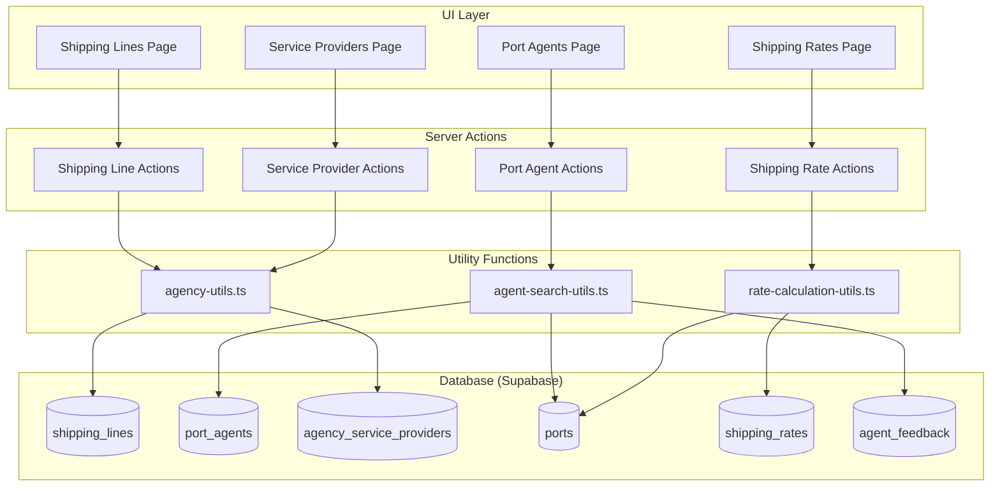

# Design Document: Agency - Shipping Line & Agent Management

## Overview

The Agency Management module provides a centralized system for managing relationships with shipping lines, port agents, and service providers in Gama ERP. This module enables the logistics team to:

1. Maintain a database of shipping line partners with contact information, services, and credit terms
2. Track port agents at various locations for customs clearance and handling services
3. Manage general service providers (trucking, warehousing, surveyors, etc.)
4. Reference standardized port data using UN/LOCODE
5. Manage and compare shipping rates between ports
6. Search for best rates and agents for quotation preparation

The module integrates with the existing quotation workflow to provide rate lookups and agent recommendations.

## Architecture



## Components and Interfaces

### UI Components

#### 1. Shipping Lines List (`/agency/shipping-lines`)
```typescript
// components/agency/shipping-lines-list.tsx
interface ShippingLinesListProps {
  initialData: ShippingLine[];
}

// Features:
// - Card-based list showing shipping line details
// - Preferred status indicator (star icon)
// - Service badges (FCL, LCL, Breakbulk, etc.)
// - Rating display with stars
// - Credit limit and terms display
// - Filter by preferred status
// - Search by name/code
```

#### 2. Shipping Line Form (`/agency/shipping-lines/new`, `/agency/shipping-lines/[id]/edit`)
```typescript
// components/agency/shipping-line-form.tsx
interface ShippingLineFormProps {
  shippingLine?: ShippingLine;
  onSubmit: (data: ShippingLineFormData) => Promise<void>;
}

// Sections:
// - Basic Info (code, name, website)
// - Head Office (address, country)
// - Local Representative (name, address, phone, email)
// - Contacts (dynamic array)
// - Services Offered (multi-select)
// - Routes Served (dynamic array)
// - Commercial Terms (payment terms, credit limit, credit days)
// - Rating & Status (rating, preferred, active)
```

#### 3. Port Agents List (`/agency/port-agents`)
```typescript
// components/agency/port-agents-list.tsx
interface PortAgentsListProps {
  initialData: PortAgent[];
  ports: Port[];
}

// Features:
// - Grouped by country
// - Card grid layout per country
// - Service badges
// - Rating display
// - Filter by port, services, country
// - Search by name/code
```

#### 4. Port Agent Form
```typescript
// components/agency/port-agent-form.tsx
interface PortAgentFormProps {
  portAgent?: PortAgent;
  ports: Port[];
  onSubmit: (data: PortAgentFormData) => Promise<void>;
}

// Sections:
// - Basic Info (code, name)
// - Port Location (port selection, country)
// - Contact Details (address, phone, email, website)
// - Contacts (dynamic array)
// - Services (multi-select)
// - Licenses (customs, PPJK, others)
// - Commercial (payment terms, currency)
// - Bank Details (name, account, SWIFT)
// - Rating & Status
```

#### 5. Service Providers List (`/agency/service-providers`)
```typescript
// components/agency/service-providers-list.tsx
interface ServiceProvidersListProps {
  initialData: ServiceProvider[];
}

// Features:
// - Filter by provider type
// - Card-based list
// - Coverage area display
// - Service rates display
// - Rating and preferred status
```

#### 6. Shipping Rates Page (`/agency/shipping-rates`)
```typescript
// components/agency/shipping-rates-search.tsx
interface ShippingRatesSearchProps {
  ports: Port[];
  shippingLines: ShippingLine[];
}

// Features:
// - Origin/Destination port selection
// - Container type filter
// - Shipping line filter
// - Results table with rate comparison
// - Best rate highlight
// - Validity period display
```

### Server Actions

```typescript
// app/actions/agency-actions.ts

// Shipping Lines
export async function createShippingLine(data: ShippingLineFormData): Promise<ActionResult<ShippingLine>>;
export async function updateShippingLine(id: string, data: ShippingLineFormData): Promise<ActionResult<ShippingLine>>;
export async function deleteShippingLine(id: string): Promise<ActionResult<void>>;
export async function toggleShippingLinePreferred(id: string): Promise<ActionResult<ShippingLine>>;

// Port Agents
export async function createPortAgent(data: PortAgentFormData): Promise<ActionResult<PortAgent>>;
export async function updatePortAgent(id: string, data: PortAgentFormData): Promise<ActionResult<PortAgent>>;
export async function deletePortAgent(id: string): Promise<ActionResult<void>>;
export async function submitAgentRating(agentId: string, rating: number, feedback?: string): Promise<ActionResult<void>>;

// Service Providers
export async function createServiceProvider(data: ServiceProviderFormData): Promise<ActionResult<ServiceProvider>>;
export async function updateServiceProvider(id: string, data: ServiceProviderFormData): Promise<ActionResult<ServiceProvider>>;
export async function deleteServiceProvider(id: string): Promise<ActionResult<void>>;

// Shipping Rates
export async function createShippingRate(data: ShippingRateFormData): Promise<ActionResult<ShippingRate>>;
export async function updateShippingRate(id: string, data: ShippingRateFormData): Promise<ActionResult<ShippingRate>>;
export async function deleteShippingRate(id: string): Promise<ActionResult<void>>;
```

### Utility Functions

```typescript
// lib/agency-utils.ts

// Code generation
export function generateShippingLineCode(lineName: string): string;
export function generateAgentCode(agentName: string, portCode: string): string;
export function generateProviderCode(providerName: string, providerType: string): string;

// Validation
export function validateShippingLine(data: ShippingLineFormData): ValidationResult;
export function validatePortAgent(data: PortAgentFormData): ValidationResult;
export function validateServiceProvider(data: ServiceProviderFormData): ValidationResult;
export function validateShippingRate(data: ShippingRateFormData): ValidationResult;

// Statistics
export function calculateShippingLineStats(lines: ShippingLine[]): ShippingLineStats;
export function calculatePortAgentStats(agents: PortAgent[]): PortAgentStats;
```

```typescript
// lib/rate-calculation-utils.ts

export interface FreightCostResult {
  oceanFreight: number;
  surcharges: number;
  total: number;
  currency: string;
}

export function calculateTotalFreightCost(
  rate: ShippingRate,
  quantity: number
): FreightCostResult;

export function calculateTotalRate(
  oceanFreight: number,
  baf: number,
  caf: number,
  pss: number,
  ens: number,
  otherSurcharges: number[]
): number;

export function isRateValid(rate: ShippingRate, date?: Date): boolean;
```

```typescript
// lib/agent-search-utils.ts

export interface RateSearchParams {
  originPort: string;
  destinationPort: string;
  containerType?: string;
  shippingLineId?: string;
}

export interface BestRateResult {
  rate: ShippingRate;
  alternatives: ShippingRate[];
}

export function searchShippingRates(params: RateSearchParams): Promise<ShippingRate[]>;
export function findBestRate(
  originPort: string,
  destinationPort: string,
  containerType: string
): Promise<BestRateResult>;
export function getPortAgents(portCode: string): Promise<PortAgent[]>;
export function filterAgentsByServices(agents: PortAgent[], services: string[]): PortAgent[];
```

## Data Models

### TypeScript Types

```typescript
// types/agency.ts

export interface ShippingLine {
  id: string;
  lineCode: string;
  lineName: string;
  headOfficeAddress?: string;
  headOfficeCountry?: string;
  website?: string;
  bookingPortalUrl?: string;
  trackingUrl?: string;
  localAgentName?: string;
  localAgentAddress?: string;
  localAgentPhone?: string;
  localAgentEmail?: string;
  contacts: ShippingLineContact[];
  servicesOffered: ServiceType[];
  routesServed: RouteInfo[];
  paymentTerms?: string;
  creditLimit?: number;
  creditDays?: number;
  serviceRating?: number;
  reliabilityScore?: number;
  isPreferred: boolean;
  isActive: boolean;
  notes?: string;
  createdAt: string;
  updatedAt: string;
}

export interface ShippingLineContact {
  name: string;
  role: string;
  phone?: string;
  email?: string;
  notes?: string;
}

export type ServiceType = 'fcl' | 'lcl' | 'breakbulk' | 'project_cargo' | 'reefer';

export interface RouteInfo {
  originPort: string;
  destinationPort: string;
  frequency?: string;
  transitDays?: number;
}

export interface PortAgent {
  id: string;
  agentCode: string;
  agentName: string;
  portId?: string;
  portName: string;
  portCountry: string;
  address?: string;
  phone?: string;
  email?: string;
  website?: string;
  contacts: AgentContact[];
  services: PortAgentService[];
  customsLicense?: string;
  ppjkLicense?: string;
  otherLicenses: string[];
  paymentTerms?: string;
  currency: string;
  bankName?: string;
  bankAccount?: string;
  bankSwift?: string;
  serviceRating?: number;
  responseTimeHours?: number;
  isPreferred: boolean;
  isActive: boolean;
  notes?: string;
  createdAt: string;
  updatedAt: string;
}

export interface AgentContact {
  name: string;
  role: string;
  phone?: string;
  email?: string;
  notes?: string;
}

export type PortAgentService = 
  | 'customs_clearance' 
  | 'stevedoring' 
  | 'warehousing' 
  | 'trucking' 
  | 'documentation' 
  | 'port_charges' 
  | 'container_handling';

export interface ServiceProvider {
  id: string;
  providerCode: string;
  providerName: string;
  providerType: ProviderType;
  city?: string;
  province?: string;
  country: string;
  address?: string;
  phone?: string;
  email?: string;
  contacts: ProviderContact[];
  servicesDetail: ServiceDetail[];
  coverageAreas: CoverageArea[];
  paymentTerms?: string;
  npwp?: string;
  siup?: string;
  documents: ProviderDocument[];
  serviceRating?: number;
  isPreferred: boolean;
  isActive: boolean;
  notes?: string;
  createdAt: string;
  updatedAt: string;
}

export type ProviderType = 
  | 'trucking' 
  | 'warehousing' 
  | 'surveyor' 
  | 'insurance' 
  | 'fumigation' 
  | 'lashing' 
  | 'crane_rental' 
  | 'escort';

export interface ProviderContact {
  name: string;
  role: string;
  phone?: string;
  email?: string;
  notes?: string;
}

export interface ServiceDetail {
  service: string;
  unit: string;
  rate: number;
  currency: string;
  notes?: string;
}

export interface CoverageArea {
  city: string;
  province: string;
  notes?: string;
}

export interface ProviderDocument {
  name: string;
  number?: string;
  expiryDate?: string;
}

export interface Port {
  id: string;
  portCode: string;
  portName: string;
  countryCode: string;
  countryName: string;
  portType: PortType;
  city?: string;
  latitude?: number;
  longitude?: number;
  timezone?: string;
  hasContainerTerminal: boolean;
  hasBreakbulkFacility: boolean;
  hasRoRo: boolean;
  maxDraftM?: number;
  maxVesselLoaM?: number;
  primaryAgentId?: string;
  isActive: boolean;
  createdAt: string;
}

export type PortType = 'seaport' | 'airport' | 'inland' | 'multimodal';

export interface ShippingRate {
  id: string;
  shippingLineId: string;
  originPortId: string;
  destinationPortId: string;
  containerType: ContainerType;
  oceanFreight: number;
  currency: string;
  baf: number;
  caf: number;
  pss: number;
  ens: number;
  otherSurcharges: SurchargeItem[];
  totalRate: number;
  transitDays?: number;
  frequency?: string;
  validFrom: string;
  validTo: string;
  terms: ShippingTerms;
  notes?: string;
  isActive: boolean;
  createdAt: string;
  // Joined fields
  shippingLine?: ShippingLine;
  originPort?: Port;
  destinationPort?: Port;
}

export type ContainerType = '20GP' | '40GP' | '40HC' | '20OT' | '40OT' | '20FR' | '40FR' | 'BREAKBULK';

export type ShippingTerms = 'CY-CY' | 'CY-Door' | 'Door-CY' | 'Door-Door';

export interface SurchargeItem {
  name: string;
  amount: number;
  currency: string;
}

export interface AgentFeedback {
  id: string;
  agentId: string;
  rating: number;
  feedback?: string;
  createdBy: string;
  createdAt: string;
}

// Statistics types
export interface ShippingLineStats {
  totalLines: number;
  preferredCount: number;
  averageRating: number;
  totalCreditLimit: number;
}

export interface PortAgentStats {
  totalAgents: number;
  preferredCount: number;
  averageRating: number;
  countriesCount: number;
}

// Form data types
export interface ShippingLineFormData {
  lineCode?: string;
  lineName: string;
  headOfficeAddress?: string;
  headOfficeCountry?: string;
  website?: string;
  bookingPortalUrl?: string;
  trackingUrl?: string;
  localAgentName?: string;
  localAgentAddress?: string;
  localAgentPhone?: string;
  localAgentEmail?: string;
  contacts: ShippingLineContact[];
  servicesOffered: ServiceType[];
  routesServed: RouteInfo[];
  paymentTerms?: string;
  creditLimit?: number;
  creditDays?: number;
  serviceRating?: number;
  isPreferred: boolean;
  notes?: string;
}

export interface PortAgentFormData {
  agentCode?: string;
  agentName: string;
  portId?: string;
  portName: string;
  portCountry: string;
  address?: string;
  phone?: string;
  email?: string;
  website?: string;
  contacts: AgentContact[];
  services: PortAgentService[];
  customsLicense?: string;
  ppjkLicense?: string;
  otherLicenses: string[];
  paymentTerms?: string;
  currency: string;
  bankName?: string;
  bankAccount?: string;
  bankSwift?: string;
  serviceRating?: number;
  isPreferred: boolean;
  notes?: string;
}

export interface ServiceProviderFormData {
  providerCode?: string;
  providerName: string;
  providerType: ProviderType;
  city?: string;
  province?: string;
  country: string;
  address?: string;
  phone?: string;
  email?: string;
  contacts: ProviderContact[];
  servicesDetail: ServiceDetail[];
  coverageAreas: CoverageArea[];
  paymentTerms?: string;
  npwp?: string;
  siup?: string;
  documents: ProviderDocument[];
  serviceRating?: number;
  isPreferred: boolean;
  notes?: string;
}

export interface ShippingRateFormData {
  shippingLineId: string;
  originPortId: string;
  destinationPortId: string;
  containerType: ContainerType;
  oceanFreight: number;
  currency: string;
  baf?: number;
  caf?: number;
  pss?: number;
  ens?: number;
  otherSurcharges?: SurchargeItem[];
  transitDays?: number;
  frequency?: string;
  validFrom: string;
  validTo: string;
  terms: ShippingTerms;
  notes?: string;
}

// Validation result
export interface ValidationResult {
  isValid: boolean;
  errors: ValidationError[];
}

export interface ValidationError {
  field: string;
  message: string;
}
```

### Database Schema

The database schema follows the SQL provided in the requirements, with the following key tables:

1. **shipping_lines** - Shipping line partners with contacts, services, and credit terms
2. **port_agents** - Port agents with services, licenses, and bank details
3. **agency_service_providers** - General service providers (trucking, warehousing, etc.)
4. **ports** - Port reference data with UN/LOCODE
5. **shipping_rates** - Freight rates between ports with surcharges and validity
6. **agent_feedback** - Rating feedback history for agents


## Correctness Properties

*A property is a characteristic or behavior that should hold true across all valid executions of a system—essentially, a formal statement about what the system should do. Properties serve as the bridge between human-readable specifications and machine-verifiable correctness guarantees.*

Based on the prework analysis, the following correctness properties have been identified. Properties have been consolidated where multiple acceptance criteria test similar behaviors.

### Property 1: Unique Code Generation

*For any* entity creation (shipping line, port agent, or service provider), the generated code SHALL be unique across all existing entities of that type.

**Validates: Requirements 1.1, 2.1, 3.1**

### Property 2: Active Record Filtering

*For any* query for active records, the result SHALL exclude all records where is_active is false, and for shipping rates, SHALL also exclude records where the current date is outside the valid_from to valid_to range.

**Validates: Requirements 1.5, 5.2, 5.7**

### Property 3: Enum Value Validation

*For any* entity with enum fields (services_offered, port_agent_services, port_type, container_type, shipping_terms), the system SHALL only accept values from the defined valid set and reject any invalid values.

**Validates: Requirements 1.7, 2.5, 4.4, 5.3, 5.6**

### Property 4: Total Rate Calculation

*For any* shipping rate, the total_rate SHALL equal the sum of ocean_freight plus all surcharges (baf + caf + pss + ens + sum of other_surcharges).

**Validates: Requirements 5.5**

### Property 5: Freight Cost Calculation with Quantity

*For any* shipping rate and positive quantity, the calculated freight cost SHALL have:
- oceanFreight equal to rate.oceanFreight × quantity
- surcharges equal to (rate.baf + rate.caf + rate.pss + rate.ens) × quantity
- total equal to oceanFreight + surcharges
- currency equal to rate.currency

**Validates: Requirements 9.1, 9.2, 9.3, 9.4**

### Property 6: Rate Search Ordering

*For any* rate search result set, the rates SHALL be ordered by total_rate in ascending order (lowest rate first).

**Validates: Requirements 6.4**

### Property 7: Agent Search Ordering

*For any* agent search result set, the agents SHALL be ordered by is_preferred (true first) then by service_rating (highest first).

**Validates: Requirements 7.2**

### Property 8: Best Rate Selection

*For any* call to findBestRate with valid parameters, the returned rate SHALL be the one with the lowest total_rate among all active rates matching the route and container type, and alternatives SHALL contain up to 3 additional rates in ascending order of total_rate.

**Validates: Requirements 6.6**

### Property 9: Rating Average Calculation

*For any* sequence of ratings submitted for an agent, the service_rating SHALL equal the arithmetic mean of all submitted ratings, rounded to 2 decimal places.

**Validates: Requirements 8.1**

### Property 10: Rating Range Validation

*For any* rating value, the system SHALL only accept values between 1.0 and 5.0 inclusive, and reject values outside this range.

**Validates: Requirements 8.2**

### Property 11: Statistics Calculation Accuracy

*For any* collection of shipping lines, the calculated statistics SHALL have:
- totalLines equal to the count of active shipping lines
- preferredCount equal to the count of active shipping lines where is_preferred is true
- averageRating equal to the arithmetic mean of service_rating across all active shipping lines with a rating
- totalCreditLimit equal to the sum of credit_limit across all active shipping lines

**Validates: Requirements 10.1, 10.2, 10.3, 10.4**

### Property 12: Filter Accuracy

*For any* filter applied to a list (by container_type, shipping_line_id, provider_type, or services), all returned records SHALL match the filter criteria, and no matching records SHALL be excluded.

**Validates: Requirements 3.2, 6.2, 6.3, 7.4**

### Property 13: Port Agent Grouping by Country

*For any* list of port agents grouped by country, each group SHALL contain only agents from that country, and all agents SHALL appear in exactly one group.

**Validates: Requirements 2.2**

### Property 14: Route Search Matching

*For any* rate search by origin and destination port, all returned rates SHALL have matching origin_port and destination_port (by code or name match), and no matching active rates SHALL be excluded.

**Validates: Requirements 6.1, 7.1**

## Error Handling

### Validation Errors

| Error Type | Condition | Response |
|------------|-----------|----------|
| Missing Required Field | Required field is null/empty | Return validation error with field name |
| Invalid Enum Value | Value not in allowed set | Return validation error with valid options |
| Invalid Rating Range | Rating < 1.0 or > 5.0 | Return validation error with valid range |
| Duplicate Code | Generated code already exists | Regenerate with suffix or return error |
| Invalid Date Range | valid_from > valid_to | Return validation error |
| Invalid Port Reference | Port ID doesn't exist | Return validation error |
| Invalid Shipping Line Reference | Shipping line ID doesn't exist | Return validation error |

### Database Errors

| Error Type | Condition | Response |
|------------|-----------|----------|
| Foreign Key Violation | Referenced record doesn't exist | Return user-friendly error message |
| Unique Constraint Violation | Duplicate code/key | Return error suggesting alternative |
| Connection Error | Database unavailable | Return service unavailable error |

### Business Logic Errors

| Error Type | Condition | Response |
|------------|-----------|----------|
| No Rates Found | Search returns empty | Return empty array with message |
| No Agents Found | Port has no agents | Return empty array with message |
| Expired Rate | Rate validity has passed | Exclude from results silently |

## Testing Strategy

### Property-Based Testing

Property-based tests will be implemented using **fast-check** library for TypeScript. Each correctness property will have a corresponding property test with minimum 100 iterations.

```typescript
// Test file: __tests__/agency-utils.property.test.ts

// Property 1: Unique Code Generation
// Tag: Feature: v0.71-agency-shipping-line-agent-management, Property 1: Unique Code Generation

// Property 4: Total Rate Calculation
// Tag: Feature: v0.71-agency-shipping-line-agent-management, Property 4: Total Rate Calculation

// Property 5: Freight Cost Calculation
// Tag: Feature: v0.71-agency-shipping-line-agent-management, Property 5: Freight Cost Calculation with Quantity

// etc.
```

### Unit Tests

Unit tests will cover:
- Specific examples for each CRUD operation
- Edge cases (empty arrays, null values, boundary values)
- Error conditions (invalid inputs, missing required fields)
- Integration points between components

### Test Coverage Goals

| Component | Unit Tests | Property Tests |
|-----------|------------|----------------|
| agency-utils.ts | Code generation, validation | Properties 1, 3 |
| rate-calculation-utils.ts | Calculation examples | Properties 4, 5 |
| agent-search-utils.ts | Search examples | Properties 6, 7, 8, 12, 14 |
| Statistics functions | Stat examples | Property 11 |
| Rating functions | Rating examples | Properties 9, 10 |
| Filtering functions | Filter examples | Properties 2, 12, 13 |
