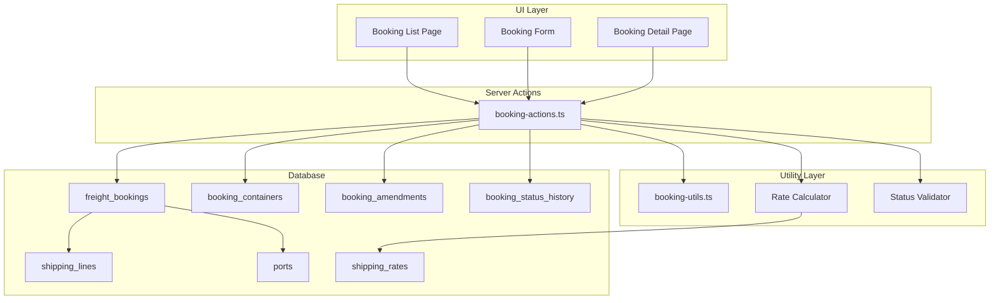

# Design Document

## Overview

The Agency Booking Management module provides a comprehensive system for managing freight bookings with shipping lines. It enables users to create booking requests, track containers, manage amendments, and monitor booking status throughout the shipping lifecycle. The module integrates with the existing v0.71 Agency infrastructure (shipping lines, ports, rates) and links to job orders and quotations.

## Architecture



## Components and Interfaces

### 1. Booking Form Component

```typescript
// components/agency/booking-form.tsx
interface BookingFormProps {
  booking?: FreightBooking;
  jobOrders: JobOrder[];
  quotations: Quotation[];
  shippingLines: ShippingLine[];
  ports: Port[];
  onSubmit: (data: BookingFormData) => Promise<void>;
  onSaveDraft: (data: BookingFormData) => Promise<void>;
}
```

The form is organized into tabs:
- **Booking Details**: Shipping line, ports, vessel, schedule
- **Cargo**: Commodity type, description, containers
- **Parties**: Shipper, consignee, notify party
- **Documents**: Attached documents and notes

### 2. Container Manager Component

```typescript
// components/agency/container-manager.tsx
interface ContainerManagerProps {
  containers: BookingContainer[];
  onChange: (containers: BookingContainer[]) => void;
  readOnly?: boolean;
}
```

Features:
- Add/remove containers
- Edit container details (type, number, seal, weight)
- Display totals (count, weight)
- Validate container data

### 3. Rate Lookup Component

```typescript
// components/agency/rate-lookup.tsx
interface RateLookupProps {
  originPortId: string;
  destinationPortId: string;
  containers: BookingContainer[];
  onRateSelect: (rate: ShippingRate, calculation: FreightCalculation) => void;
}
```

### 4. Amendment Dialog Component

```typescript
// components/agency/amendment-dialog.tsx
interface AmendmentDialogProps {
  bookingId: string;
  currentValues: Partial<FreightBooking>;
  onSubmit: (amendment: AmendmentFormData) => Promise<void>;
}
```

### 5. Status History Component

```typescript
// components/agency/booking-status-history.tsx
interface StatusHistoryProps {
  history: BookingStatusHistory[];
}
```

## Data Models

### FreightBooking

```typescript
interface FreightBooking {
  id: string;
  bookingNumber: string;
  
  // Relations
  jobOrderId?: string;
  quotationId?: string;
  customerId?: string;
  shippingLineId: string;
  carrierBookingNumber?: string;
  
  // Route
  originPortId: string;
  destinationPortId: string;
  
  // Vessel
  vesselName?: string;
  voyageNumber?: string;
  
  // Schedule
  etd?: string;
  eta?: string;
  cutoffDate?: string;
  cutoffTime?: string;
  siCutoff?: string;
  
  // Cargo
  cargoDescription: string;
  hsCode?: string;
  commodityType: CommodityType;
  containerType?: ContainerType;
  containerQuantity?: number;
  packagesCount?: number;
  grossWeightKg?: number;
  volumeCbm?: number;
  cargoLengthM?: number;
  cargoWidthM?: number;
  cargoHeightM?: number;
  
  // Parties
  shipperName?: string;
  shipperAddress?: string;
  consigneeName?: string;
  consigneeAddress?: string;
  notifyParty?: string;
  notifyAddress?: string;
  
  // Terms
  incoterm?: Incoterm;
  freightTerms: FreightTerms;
  
  // Rates
  freightRate?: number;
  freightCurrency: string;
  totalFreight?: number;
  
  // Status
  status: BookingStatus;
  confirmedAt?: string;
  
  // Additional
  specialRequirements?: string;
  dangerousGoods?: DangerousGoodsInfo;
  documents?: BookingDocument[];
  notes?: string;
  
  createdBy?: string;
  createdAt: string;
  updatedAt: string;
}

type BookingStatus = 'draft' | 'requested' | 'confirmed' | 'amended' | 'cancelled' | 'shipped' | 'completed';
type CommodityType = 'general' | 'dangerous' | 'reefer' | 'oversized' | 'project';
type Incoterm = 'FOB' | 'CIF' | 'CFR' | 'EXW' | 'DDP' | 'DAP' | 'FCA';
type FreightTerms = 'prepaid' | 'collect';

interface DangerousGoodsInfo {
  unNumber: string;
  class: string;
  packingGroup?: string;
  properShippingName: string;
}

interface BookingDocument {
  name: string;
  url: string;
  uploadedAt: string;
}
```

### BookingContainer

```typescript
interface BookingContainer {
  id: string;
  bookingId: string;
  containerNumber?: string;
  containerType: ContainerType;
  sealNumber?: string;
  packagesCount?: number;
  packageType?: string;
  grossWeightKg?: number;
  cargoDescription?: string;
  cargoDimensions?: CargoDimensions;
  status: ContainerStatus;
  currentLocation?: string;
  createdAt: string;
}

type ContainerStatus = 'empty' | 'stuffing' | 'full' | 'shipped' | 'delivered';

interface CargoDimensions {
  lengthM: number;
  widthM: number;
  heightM: number;
}
```

### BookingAmendment

```typescript
interface BookingAmendment {
  id: string;
  bookingId: string;
  amendmentNumber: number;
  amendmentType: AmendmentType;
  description: string;
  oldValues: Record<string, unknown>;
  newValues: Record<string, unknown>;
  status: AmendmentStatus;
  requestedBy?: string;
  requestedAt: string;
  approvedBy?: string;
  approvedAt?: string;
  notes?: string;
}

type AmendmentType = 'schedule_change' | 'quantity_change' | 'vessel_change' | 'rate_change' | 'consignee_change' | 'other';
type AmendmentStatus = 'requested' | 'approved' | 'rejected';
```

### BookingStatusHistory

```typescript
interface BookingStatusHistory {
  id: string;
  bookingId: string;
  oldStatus?: BookingStatus;
  newStatus: BookingStatus;
  changedBy?: string;
  changedAt: string;
  notes?: string;
}
```

### FreightCalculation

```typescript
interface FreightCalculation {
  containers: ContainerFreight[];
  totalFreight: number;
  currency: string;
}

interface ContainerFreight {
  containerType: ContainerType;
  quantity: number;
  ratePerUnit: number;
  subtotal: number;
}
```

## Server Actions

```typescript
// app/actions/booking-actions.ts

// Booking CRUD
async function createBooking(data: BookingFormData): Promise<ActionResult<FreightBooking>>
async function updateBooking(id: string, data: BookingFormData): Promise<ActionResult<FreightBooking>>
async function getBooking(id: string): Promise<FreightBooking | null>
async function getBookings(filters?: BookingFilters): Promise<FreightBooking[]>
async function deleteBooking(id: string): Promise<ActionResult<void>>

// Status management
async function submitBookingRequest(id: string): Promise<ActionResult<FreightBooking>>
async function confirmBooking(id: string, carrierBookingNumber?: string): Promise<ActionResult<FreightBooking>>
async function cancelBooking(id: string, reason?: string): Promise<ActionResult<FreightBooking>>
async function markAsShipped(id: string): Promise<ActionResult<FreightBooking>>
async function completeBooking(id: string): Promise<ActionResult<FreightBooking>>

// Container management
async function addContainer(bookingId: string, container: ContainerFormData): Promise<ActionResult<BookingContainer>>
async function updateContainer(id: string, data: ContainerFormData): Promise<ActionResult<BookingContainer>>
async function removeContainer(id: string): Promise<ActionResult<void>>
async function getBookingContainers(bookingId: string): Promise<BookingContainer[]>

// Amendments
async function requestAmendment(bookingId: string, data: AmendmentFormData): Promise<ActionResult<BookingAmendment>>
async function approveAmendment(id: string): Promise<ActionResult<BookingAmendment>>
async function rejectAmendment(id: string, reason?: string): Promise<ActionResult<BookingAmendment>>
async function getBookingAmendments(bookingId: string): Promise<BookingAmendment[]>

// Rate lookup
async function lookupRates(params: RateLookupParams): Promise<ShippingRate[]>
async function calculateFreight(rates: ShippingRate[], containers: BookingContainer[]): Promise<FreightCalculation>

// Status history
async function getStatusHistory(bookingId: string): Promise<BookingStatusHistory[]>
```

## Utility Functions

```typescript
// lib/booking-utils.ts

// Validation
function validateBookingForSubmission(booking: FreightBooking): ValidationResult
function validateContainerData(container: BookingContainer): ValidationResult
function validateDangerousGoods(dg: DangerousGoodsInfo): ValidationResult

// Status transitions
function isValidStatusTransition(from: BookingStatus, to: BookingStatus): boolean
function getNextValidStatuses(current: BookingStatus): BookingStatus[]

// Calculations
function calculateTotalWeight(containers: BookingContainer[]): number
function calculateTotalContainers(containers: BookingContainer[]): number
function calculateFreightTotal(containers: BookingContainer[], rates: Map<ContainerType, number>): number

// Cutoff warnings
function getCutoffWarningLevel(cutoffDate: string): 'none' | 'warning' | 'alert'
function getDaysUntilCutoff(cutoffDate: string): number

// Formatting
function formatBookingNumber(number: string): string
function formatContainerSummary(containers: BookingContainer[]): string

// Amendment helpers
function getNextAmendmentNumber(amendments: BookingAmendment[]): number
function extractChangedFields(oldValues: Record<string, unknown>, newValues: Record<string, unknown>): string[]
```

## Correctness Properties

*A property is a characteristic or behavior that should hold true across all valid executions of a system—essentially, a formal statement about what the system should do. Properties serve as the bridge between human-readable specifications and machine-verifiable correctness guarantees.*

### Property 1: Booking Number Format Validation

*For any* generated booking number, it SHALL match the pattern `BKG-YYYY-NNNNN` where YYYY is a 4-digit year and NNNNN is a 5-digit zero-padded sequence number.

**Validates: Requirements 1.1**

### Property 2: Status Transition Validation

*For any* booking status transition attempt, the transition SHALL only succeed if it follows the valid state machine: draft→requested→confirmed→amended→shipped→completed, with cancelled being reachable from any non-terminal state.

**Validates: Requirements 4.6**

### Property 3: Container Total Calculations

*For any* list of containers in a booking, the calculated total weight SHALL equal the sum of individual container weights, and the total count SHALL equal the number of containers in the list.

**Validates: Requirements 2.3, 2.4**

### Property 4: Freight Calculation Accuracy

*For any* set of containers and their corresponding rates, the total freight SHALL equal the sum of (quantity × rate) for each container type, and subtotals per container type SHALL sum to the grand total.

**Validates: Requirements 3.3, 3.4**

### Property 5: Cutoff Warning Levels

*For any* cutoff date, the warning level SHALL be 'alert' if the date has passed, 'warning' if within 3 days, and 'none' otherwise.

**Validates: Requirements 7.3, 7.4**

### Property 6: Booking Submission Validation

*For any* booking submitted for request, validation SHALL fail if: cargo description is empty, commodity type is missing, shipper/consignee info is missing, or (for containerized cargo) no containers exist, or (for dangerous goods) DG details are missing.

**Validates: Requirements 1.5, 1.7, 2.5, 6.5, 8.1, 8.4**

### Property 7: Amendment Change Tracking

*For any* approved amendment, the booking's affected fields SHALL be updated to match the amendment's newValues, and the amendment record SHALL preserve both oldValues and newValues for audit.

**Validates: Requirements 5.4, 5.5, 5.6, 5.7**

### Property 8: Booking Filter Accuracy

*For any* filter criteria applied to a booking list, the returned bookings SHALL all satisfy the filter conditions (status match, shipping line match, date range inclusion, search term match).

**Validates: Requirements 9.2, 9.3, 9.4, 9.5, 9.6**

## Error Handling

### Validation Errors

| Error Code | Description | User Message |
|------------|-------------|--------------|
| `BOOKING_INVALID_STATUS_TRANSITION` | Invalid status change attempted | "Cannot change status from {from} to {to}" |
| `BOOKING_MISSING_REQUIRED_FIELDS` | Required fields missing for submission | "Please fill in all required fields: {fields}" |
| `BOOKING_INVALID_DATES` | ETD before cutoff or invalid date range | "ETD must be after cutoff date" |
| `BOOKING_NO_CONTAINERS` | Containerized booking without containers | "At least one container is required" |
| `BOOKING_MISSING_DG_INFO` | Dangerous goods without DG details | "Dangerous goods details are required for hazardous cargo" |
| `BOOKING_CANCELLED` | Attempt to modify cancelled booking | "Cannot modify a cancelled booking" |

### Database Errors

| Error Code | Description | Recovery |
|------------|-------------|----------|
| `BOOKING_NOT_FOUND` | Booking ID doesn't exist | Show "Booking not found" message |
| `BOOKING_NUMBER_CONFLICT` | Duplicate booking number (rare) | Retry with new sequence |
| `FOREIGN_KEY_VIOLATION` | Invalid shipping line/port reference | Validate references before save |

### Rate Lookup Errors

| Error Code | Description | User Message |
|------------|-------------|--------------|
| `NO_RATES_FOUND` | No matching rates for route/container | "No rates available for this route. Please contact shipping line." |
| `RATE_EXPIRED` | Selected rate has expired | "This rate has expired. Please select a current rate." |

## Testing Strategy

### Unit Tests

Unit tests will cover:
- Booking number format validation
- Status transition logic
- Container total calculations
- Freight calculations
- Cutoff warning level determination
- Validation functions for booking submission
- Amendment change detection

### Property-Based Tests

Property-based tests will use `fast-check` library with minimum 100 iterations per property:

1. **Booking Number Format** - Generate random booking numbers and verify format
2. **Status Transitions** - Generate random status pairs and verify valid/invalid transitions
3. **Container Totals** - Generate random container lists and verify total calculations
4. **Freight Calculations** - Generate random containers/rates and verify calculation accuracy
5. **Cutoff Warnings** - Generate random dates and verify warning level logic
6. **Submission Validation** - Generate random booking data and verify validation rules
7. **Amendment Tracking** - Generate random amendments and verify change application
8. **Filter Accuracy** - Generate random bookings and filters, verify filter results

### Integration Tests

Integration tests will cover:
- Full booking creation flow
- Status workflow from draft to completed
- Amendment request and approval flow
- Rate lookup and application
- Container management operations

## File Structure

```
app/
  (main)/
    agency/
      bookings/
        page.tsx                    # Booking list page
        bookings-client.tsx         # Client component for list
        new/
          page.tsx                  # New booking page
          new-booking-client.tsx    # Client component for form
        [id]/
          page.tsx                  # Booking detail page
          booking-detail.tsx        # Detail client component
          edit/
            page.tsx                # Edit booking page
            edit-booking-client.tsx # Edit client component
  actions/
    booking-actions.ts              # Server actions for bookings

components/
  agency/
    booking-form.tsx                # Main booking form
    booking-card.tsx                # Booking card for list
    booking-summary-cards.tsx       # Summary statistics
    container-manager.tsx           # Container management
    rate-lookup.tsx                 # Rate lookup component
    amendment-dialog.tsx            # Amendment request dialog
    booking-status-history.tsx      # Status history display
    booking-status-badge.tsx        # Status badge component

lib/
  booking-utils.ts                  # Utility functions

types/
  agency.ts                         # Extended with booking types

__tests__/
  booking-utils.test.ts             # Unit tests
  booking-utils.property.test.ts    # Property-based tests
```

