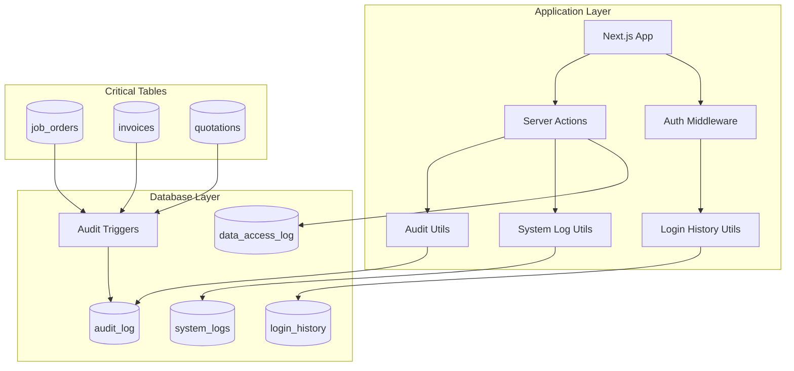
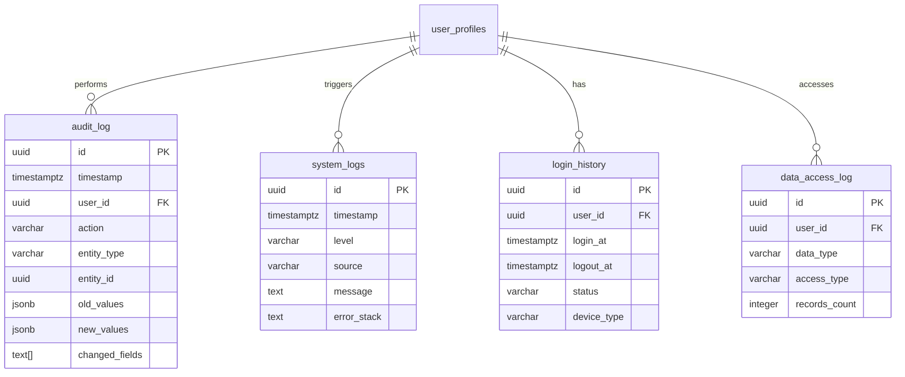

# Design Document: System Audit & Logging

## Overview

This design document describes the architecture and implementation of a comprehensive audit logging and system activity tracking module for Gama ERP. The module provides four distinct logging capabilities: audit logs for business entity changes, system logs for application events, login history for authentication tracking, and data access logs for compliance monitoring.

The design leverages PostgreSQL triggers for automatic audit capture, Supabase for storage and querying, and a utility-based architecture for consistent logging across the application.

## Architecture



## Components and Interfaces

### 1. Database Tables

#### audit_log Table
```sql
CREATE TABLE audit_log (
  id UUID PRIMARY KEY DEFAULT gen_random_uuid(),
  timestamp TIMESTAMPTZ NOT NULL DEFAULT NOW(),
  user_id UUID REFERENCES user_profiles(id),
  user_email VARCHAR(200),
  user_role VARCHAR(50),
  action VARCHAR(50) NOT NULL,
  module VARCHAR(50) NOT NULL,
  entity_type VARCHAR(100) NOT NULL,
  entity_id UUID,
  entity_reference VARCHAR(100),
  description TEXT,
  old_values JSONB,
  new_values JSONB,
  changed_fields TEXT[],
  ip_address INET,
  user_agent TEXT,
  session_id VARCHAR(100),
  request_method VARCHAR(10),
  request_path VARCHAR(500),
  status VARCHAR(20) DEFAULT 'success',
  error_message TEXT,
  metadata JSONB DEFAULT '{}'
);
```

#### system_logs Table
```sql
CREATE TABLE system_logs (
  id UUID PRIMARY KEY DEFAULT gen_random_uuid(),
  timestamp TIMESTAMPTZ NOT NULL DEFAULT NOW(),
  level VARCHAR(20) NOT NULL,
  source VARCHAR(100) NOT NULL,
  message TEXT NOT NULL,
  module VARCHAR(50),
  function_name VARCHAR(200),
  error_type VARCHAR(200),
  error_stack TEXT,
  request_id VARCHAR(100),
  user_id UUID,
  data JSONB DEFAULT '{}'
);
```

#### login_history Table
```sql
CREATE TABLE login_history (
  id UUID PRIMARY KEY DEFAULT gen_random_uuid(),
  user_id UUID NOT NULL REFERENCES user_profiles(id),
  login_at TIMESTAMPTZ NOT NULL DEFAULT NOW(),
  logout_at TIMESTAMPTZ,
  session_duration_minutes INTEGER,
  login_method VARCHAR(30) DEFAULT 'password',
  ip_address INET,
  user_agent TEXT,
  device_type VARCHAR(30),
  browser VARCHAR(100),
  os VARCHAR(100),
  country VARCHAR(100),
  city VARCHAR(100),
  status VARCHAR(20) DEFAULT 'success',
  failure_reason TEXT
);
```

#### data_access_log Table
```sql
CREATE TABLE data_access_log (
  id UUID PRIMARY KEY DEFAULT gen_random_uuid(),
  timestamp TIMESTAMPTZ NOT NULL DEFAULT NOW(),
  user_id UUID NOT NULL REFERENCES user_profiles(id),
  data_type VARCHAR(50) NOT NULL,
  entity_type VARCHAR(100),
  entity_id UUID,
  access_type VARCHAR(30) NOT NULL,
  reason TEXT,
  ip_address INET,
  records_count INTEGER,
  file_format VARCHAR(20)
);
```

### 2. Audit Trigger Function

```sql
CREATE OR REPLACE FUNCTION audit_trigger_function()
RETURNS TRIGGER AS $$
DECLARE
  v_old_data JSONB;
  v_new_data JSONB;
  v_changed_fields TEXT[];
  v_action VARCHAR(20);
  v_user_id UUID;
BEGIN
  v_user_id := current_setting('app.current_user_id', TRUE)::UUID;
  
  IF TG_OP = 'INSERT' THEN
    v_action := 'create';
    v_new_data := row_to_json(NEW)::JSONB;
  ELSIF TG_OP = 'UPDATE' THEN
    v_action := 'update';
    v_old_data := row_to_json(OLD)::JSONB;
    v_new_data := row_to_json(NEW)::JSONB;
    SELECT ARRAY_AGG(key) INTO v_changed_fields
    FROM jsonb_each(v_new_data) n
    FULL OUTER JOIN jsonb_each(v_old_data) o USING (key)
    WHERE n.value IS DISTINCT FROM o.value;
  ELSIF TG_OP = 'DELETE' THEN
    v_action := 'delete';
    v_old_data := row_to_json(OLD)::JSONB;
  END IF;
  
  INSERT INTO audit_log (
    user_id, action, module, entity_type, entity_id, 
    old_values, new_values, changed_fields
  )
  VALUES (
    v_user_id, v_action, TG_TABLE_SCHEMA, TG_TABLE_NAME, 
    COALESCE(NEW.id, OLD.id), v_old_data, v_new_data, v_changed_fields
  );
  
  RETURN COALESCE(NEW, OLD);
END;
$$ LANGUAGE plpgsql;
```

### 3. Core Utility Interfaces

#### AuditLogEntry Type
```typescript
interface AuditLogEntry {
  id: string;
  timestamp: string;
  user_id: string | null;
  user_email: string | null;
  user_role: string | null;
  action: 'create' | 'update' | 'delete' | 'view' | 'export';
  module: string;
  entity_type: string;
  entity_id: string | null;
  entity_reference: string | null;
  description: string | null;
  old_values: Record<string, unknown> | null;
  new_values: Record<string, unknown> | null;
  changed_fields: string[] | null;
  ip_address: string | null;
  user_agent: string | null;
  session_id: string | null;
  request_method: string | null;
  request_path: string | null;
  status: 'success' | 'failure';
  error_message: string | null;
  metadata: Record<string, unknown>;
}
```

#### SystemLogEntry Type
```typescript
interface SystemLogEntry {
  id: string;
  timestamp: string;
  level: 'error' | 'warn' | 'info' | 'debug';
  source: string;
  message: string;
  module: string | null;
  function_name: string | null;
  error_type: string | null;
  error_stack: string | null;
  request_id: string | null;
  user_id: string | null;
  data: Record<string, unknown>;
}
```

#### LoginHistoryEntry Type
```typescript
interface LoginHistoryEntry {
  id: string;
  user_id: string;
  login_at: string;
  logout_at: string | null;
  session_duration_minutes: number | null;
  login_method: 'password' | 'google' | 'magic_link';
  ip_address: string | null;
  user_agent: string | null;
  device_type: 'desktop' | 'mobile' | 'tablet' | null;
  browser: string | null;
  os: string | null;
  country: string | null;
  city: string | null;
  status: 'success' | 'failed';
  failure_reason: string | null;
}
```

#### DataAccessLogEntry Type
```typescript
interface DataAccessLogEntry {
  id: string;
  timestamp: string;
  user_id: string;
  data_type: string;
  entity_type: string | null;
  entity_id: string | null;
  access_type: 'view' | 'export' | 'bulk_query' | 'download';
  reason: string | null;
  ip_address: string | null;
  records_count: number | null;
  file_format: 'csv' | 'xlsx' | 'pdf' | 'json' | null;
}
```

### 4. Query Filter Interfaces

#### AuditLogFilters Type
```typescript
interface AuditLogFilters {
  user_id?: string;
  user_email?: string;
  user_role?: string;
  entity_type?: string;
  entity_id?: string;
  action?: 'create' | 'update' | 'delete' | 'view' | 'export';
  module?: string;
  status?: 'success' | 'failure';
  start_date?: string;
  end_date?: string;
  limit?: number;
  offset?: number;
}
```

#### LoginHistoryFilters Type
```typescript
interface LoginHistoryFilters {
  user_id?: string;
  status?: 'success' | 'failed';
  login_method?: string;
  start_date?: string;
  end_date?: string;
  limit?: number;
  offset?: number;
}
```

#### SystemLogFilters Type
```typescript
interface SystemLogFilters {
  level?: 'error' | 'warn' | 'info' | 'debug';
  source?: string;
  module?: string;
  search?: string;
  start_date?: string;
  end_date?: string;
  limit?: number;
  offset?: number;
}
```

### 5. Utility Functions

#### audit-utils.ts
```typescript
// Create manual audit log entry
function createAuditLog(entry: Omit<AuditLogEntry, 'id' | 'timestamp'>): Promise<AuditLogEntry>

// Query audit logs with filters
function queryAuditLogs(filters: AuditLogFilters): Promise<{ data: AuditLogEntry[]; count: number }>

// Get audit history for specific entity
function getEntityAuditHistory(entityType: string, entityId: string): Promise<AuditLogEntry[]>

// Calculate changed fields between two objects
function calculateChangedFields(oldValues: Record<string, unknown>, newValues: Record<string, unknown>): string[]

// Format audit log for display
function formatAuditLogDescription(entry: AuditLogEntry): string
```

#### system-log-utils.ts
```typescript
// Log error with stack trace
function logError(source: string, error: Error, context?: Record<string, unknown>): Promise<void>

// Log warning
function logWarn(source: string, message: string, data?: Record<string, unknown>): Promise<void>

// Log info
function logInfo(source: string, message: string, data?: Record<string, unknown>): Promise<void>

// Log debug (only in development)
function logDebug(source: string, message: string, data?: Record<string, unknown>): Promise<void>

// Query system logs
function querySystemLogs(filters: SystemLogFilters): Promise<{ data: SystemLogEntry[]; count: number }>
```

#### login-history-utils.ts
```typescript
// Record login event
function recordLogin(userId: string, details: LoginDetails): Promise<LoginHistoryEntry>

// Record logout event
function recordLogout(userId: string): Promise<void>

// Record failed login attempt
function recordFailedLogin(email: string, reason: string, details: LoginDetails): Promise<void>

// Query login history
function queryLoginHistory(filters: LoginHistoryFilters): Promise<{ data: LoginHistoryEntry[]; count: number }>

// Get session statistics for user
function getSessionStatistics(userId: string): Promise<SessionStatistics>

// Parse user agent string
function parseUserAgent(userAgent: string): { device_type: string; browser: string; os: string }
```

#### data-access-utils.ts
```typescript
// Log data export
function logDataExport(userId: string, dataType: string, format: string, recordCount: number): Promise<void>

// Log sensitive data access
function logDataAccess(userId: string, entityType: string, entityId: string, accessType: string): Promise<void>

// Query data access logs
function queryDataAccessLogs(filters: DataAccessFilters): Promise<{ data: DataAccessLogEntry[]; count: number }>
```

## Data Models

### Entity Relationship Diagram



### Retention Configuration
```typescript
interface RetentionConfig {
  audit_log_days: number;      // Default: 365 days
  system_logs_days: number;    // Default: 90 days
  login_history_days: number;  // Default: 180 days
  data_access_log_days: number; // Default: 365 days
}
```


## Correctness Properties

*A property is a characteristic or behavior that should hold true across all valid executions of a system—essentially, a formal statement about what the system should do. Properties serve as the bridge between human-readable specifications and machine-verifiable correctness guarantees.*

### Property 1: Audit Log Creation Captures Required Fields

*For any* audit log entry created for a CRUD operation, the entry SHALL contain a valid timestamp, action type, entity_type, and when user context is available, the user_id, user_email, and user_role fields SHALL be populated.

**Validates: Requirements 1.1, 1.4**

### Property 2: Changed Fields Calculation Correctness

*For any* two JSON objects representing old and new values, the calculated changed_fields array SHALL contain exactly the keys where the values differ between the two objects, and SHALL not contain any keys where values are identical.

**Validates: Requirements 1.3**

### Property 3: Update Operations Capture Old and New Values

*For any* update operation logged to the audit_log, both old_values and new_values SHALL be valid JSON objects, and the old_values SHALL represent the state before the update while new_values represents the state after.

**Validates: Requirements 1.2**

### Property 4: System Log Error Capture

*For any* error logged via the system logging utility, the resulting log entry SHALL contain the error type (from error.name), the error message (from error.message), and the stack trace (from error.stack) when available.

**Validates: Requirements 2.2, 2.3**

### Property 5: System Log Level Support

*For any* of the four log levels (error, warn, info, debug), the system logging utility SHALL accept and store the log entry with the correct level value.

**Validates: Requirements 2.1**

### Property 6: Login Session Lifecycle

*For any* successful login followed by a logout, the login_history record SHALL have login_at set to the login time, logout_at set to the logout time, and session_duration_minutes SHALL equal the difference between logout_at and login_at in minutes (rounded).

**Validates: Requirements 3.1, 3.2**

### Property 7: User Agent Parsing

*For any* valid user agent string, the parseUserAgent function SHALL extract and return device_type (desktop, mobile, or tablet), browser name, and operating system name.

**Validates: Requirements 3.3**

### Property 8: Failed Login Recording

*For any* failed login attempt, the login_history record SHALL have status set to 'failed' and failure_reason SHALL contain a non-empty description of the failure.

**Validates: Requirements 3.4**

### Property 9: Data Export Logging

*For any* data export operation, the data_access_log entry SHALL contain the data_type, file_format, and records_count, and access_type SHALL be 'export'.

**Validates: Requirements 4.1**

### Property 10: Audit Log Filter Correctness

*For any* combination of audit log filters (user_id, entity_type, entity_id, action, module, date range), all returned entries SHALL match ALL specified filter criteria, and no entries matching the criteria SHALL be excluded.

**Validates: Requirements 5.1, 5.2, 5.3, 5.4, 5.5**

### Property 11: Login History Filter Correctness

*For any* combination of login history filters (user_id, status, login_method, date range), all returned entries SHALL match ALL specified filter criteria.

**Validates: Requirements 6.1, 6.2, 6.3, 6.4**

### Property 12: System Log Filter Correctness

*For any* combination of system log filters (level, source, module, search term, date range), all returned entries SHALL match ALL specified filter criteria, and text search SHALL match entries where the message contains the search term.

**Validates: Requirements 7.1, 7.2, 7.3, 7.4**

### Property 13: Query Results Timestamp Ordering

*For any* query result from audit_log, system_logs, or login_history, the entries SHALL be sorted by timestamp in descending order (most recent first).

**Validates: Requirements 5.6, 7.5**

### Property 14: Session Statistics Calculation

*For any* set of login_history records for a user with non-null session_duration_minutes, the calculated average session duration SHALL equal the sum of all session durations divided by the count of sessions.

**Validates: Requirements 6.5**

### Property 15: Archive Operation Recording

*For any* log archival operation, the system SHALL create a record documenting the archive including the log type, date range archived, and record count.

**Validates: Requirements 8.2, 8.4**

## Error Handling

### Database Errors
- Connection failures: Log to console, return graceful error response
- Constraint violations: Return descriptive error message
- Timeout errors: Retry once, then return timeout error

### Logging Failures
- If audit logging fails, the original operation should NOT be blocked
- System log failures should be caught and logged to console as fallback
- Login history failures should not prevent user authentication

### Query Errors
- Invalid filter parameters: Return validation error with details
- Empty results: Return empty array, not error
- Pagination overflow: Return empty array for out-of-range pages

### Error Response Format
```typescript
interface LoggingError {
  code: string;
  message: string;
  details?: Record<string, unknown>;
}
```

## Testing Strategy

### Unit Tests
- Test utility functions in isolation
- Test filter building logic
- Test user agent parsing
- Test changed fields calculation
- Test session duration calculation

### Property-Based Tests
Property-based testing will be used to verify the correctness properties defined above. Each property test will:
- Generate random valid inputs using fast-check
- Execute the function under test
- Verify the property holds for all generated inputs
- Run minimum 100 iterations per property

**Testing Framework**: Vitest with fast-check for property-based testing

**Test File Naming**: `__tests__/audit-utils.property.test.ts`, `__tests__/login-history-utils.property.test.ts`, etc.

**Property Test Annotation Format**:
```typescript
// Feature: system-audit-logging, Property 2: Changed Fields Calculation Correctness
// Validates: Requirements 1.3
```

### Integration Tests
- Test audit triggers fire correctly on table operations
- Test end-to-end logging flow
- Test query pagination

### Test Data Generation
- Use fast-check arbitraries for generating:
  - Random audit log entries
  - Random user agent strings
  - Random JSON objects for old/new values
  - Random date ranges for filtering
