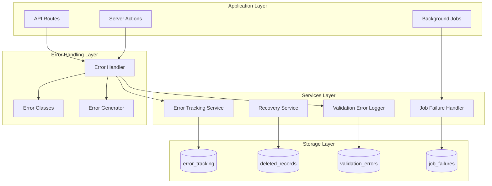

# Design Document

## Overview

The Error Handling & Recovery feature provides a comprehensive system for capturing, tracking, and resolving application errors while enabling data recovery for soft-deleted records. The architecture follows a layered approach with custom error classes, centralized error handling, and dedicated storage for error tracking, deleted records, validation errors, and job failures.

## Architecture



## Components and Interfaces

### 1. Custom Error Classes

```typescript
// lib/error-handling/errors.ts

interface AppError extends Error {
  code: string;
  statusCode: number;
  isOperational: boolean;
  context?: Record<string, unknown>;
}

class ValidationError extends Error implements AppError {
  code = 'VALIDATION_ERROR';
  statusCode = 400;
  isOperational = true;
  
  constructor(
    message: string,
    public field?: string,
    public context?: Record<string, unknown>
  ) {
    super(message);
    this.name = 'ValidationError';
  }
}

class NotFoundError extends Error implements AppError {
  code = 'NOT_FOUND';
  statusCode = 404;
  isOperational = true;
  
  constructor(entity: string, id?: string) {
    super(`${entity}${id ? ` with ID ${id}` : ''} not found`);
    this.name = 'NotFoundError';
  }
}

class AuthorizationError extends Error implements AppError {
  code = 'UNAUTHORIZED';
  statusCode = 403;
  isOperational = true;
  
  constructor(message = 'You do not have permission to perform this action') {
    super(message);
    this.name = 'AuthorizationError';
  }
}

class ConflictError extends Error implements AppError {
  code = 'CONFLICT';
  statusCode = 409;
  isOperational = true;
  
  constructor(message: string, public context?: Record<string, unknown>) {
    super(message);
    this.name = 'ConflictError';
  }
}
```

### 2. Error Handler Interface

```typescript
// lib/error-handling/handler.ts

interface RequestContext {
  module?: string;
  userId?: string;
  sessionId?: string;
  path?: string;
  method?: string;
  body?: Record<string, unknown>;
  params?: Record<string, unknown>;
}

interface ErrorResponse {
  success: false;
  error: {
    code: string;
    message: string;
    field?: string;
    reference?: string;
  };
}

interface SuccessResponse<T> {
  success: true;
  data: T;
}

type ActionResult<T> = SuccessResponse<T> | ErrorResponse;

function handleError(error: Error, context: RequestContext): Promise<ErrorResponse>;
function isOperationalError(error: Error): boolean;
function generateErrorHash(error: Error): string;
function generateErrorCode(): string;
```

### 3. Error Tracking Service Interface

```typescript
// lib/error-handling/tracking.ts

interface TrackErrorParams {
  errorType: string;
  errorMessage: string;
  errorStack?: string;
  errorHash: string;
  module?: string;
  userId?: string;
  sessionId?: string;
  requestPath?: string;
  requestMethod?: string;
  requestBody?: Record<string, unknown>;
  requestParams?: Record<string, unknown>;
}

interface ErrorRecord {
  id: string;
  error_code: string;
  error_hash: string;
  error_type: string;
  error_message: string;
  error_stack?: string;
  module?: string;
  user_id?: string;
  status: 'new' | 'investigating' | 'resolved' | 'ignored';
  occurrence_count: number;
  first_seen_at: string;
  last_seen_at: string;
  resolved_at?: string;
  resolved_by?: string;
  resolution_notes?: string;
}

interface ErrorFilters {
  status?: string;
  module?: string;
  errorType?: string;
  dateFrom?: string;
  dateTo?: string;
}

function trackError(params: TrackErrorParams): Promise<void>;
function getErrors(filters: ErrorFilters): Promise<ErrorRecord[]>;
function updateErrorStatus(
  errorId: string,
  status: string,
  userId: string,
  notes?: string
): Promise<void>;
function getErrorSummary(): Promise<ErrorSummary>;
```

### 4. Recovery Service Interface

```typescript
// lib/error-handling/recovery.ts

interface DeletedRecord {
  id: string;
  source_table: string;
  source_id: string;
  record_data: Record<string, unknown>;
  deleted_at: string;
  deleted_by?: string;
  recovered_at?: string;
  recovered_by?: string;
  purge_after: string;
}

interface DeletedRecordFilters {
  sourceTable?: string;
  dateFrom?: string;
  dateTo?: string;
  recovered?: boolean;
}

function softDeleteWithRecovery(
  table: string,
  id: string,
  userId: string
): Promise<void>;

function recoverDeletedRecord(
  table: string,
  sourceId: string,
  userId: string
): Promise<Record<string, unknown>>;

function getDeletedRecords(filters: DeletedRecordFilters): Promise<DeletedRecord[]>;

function purgeExpiredRecords(): Promise<number>;
```

### 5. Validation Error Logger Interface

```typescript
// lib/error-handling/validation-logger.ts

interface ValidationErrorRecord {
  id: string;
  timestamp: string;
  entity_type: string;
  entity_id?: string;
  field_name: string;
  field_value?: string;
  validation_rule: string;
  error_message: string;
  user_id?: string;
  corrected: boolean;
  corrected_at?: string;
}

interface ValidationErrorFilters {
  entityType?: string;
  fieldName?: string;
  dateFrom?: string;
  dateTo?: string;
}

function logValidationError(params: {
  entityType: string;
  entityId?: string;
  fieldName: string;
  fieldValue?: string;
  validationRule: string;
  errorMessage: string;
  userId?: string;
}): Promise<void>;

function markValidationCorrected(errorId: string): Promise<void>;

function getValidationErrors(filters: ValidationErrorFilters): Promise<ValidationErrorRecord[]>;
```

### 6. Job Failure Handler Interface

```typescript
// lib/error-handling/job-handler.ts

interface JobFailure {
  id: string;
  job_type: string;
  job_id?: string;
  failed_at: string;
  error_message: string;
  error_stack?: string;
  job_data?: Record<string, unknown>;
  retry_count: number;
  max_retries: number;
  next_retry_at?: string;
  status: 'failed' | 'retrying' | 'resolved' | 'abandoned';
  resolved_at?: string;
}

const BASE_RETRY_DELAY_MS = 1000; // 1 second
const DEFAULT_MAX_RETRIES = 3;

function recordJobFailure(params: {
  jobType: string;
  jobId?: string;
  errorMessage: string;
  errorStack?: string;
  jobData?: Record<string, unknown>;
  maxRetries?: number;
}): Promise<JobFailure>;

function scheduleRetry(failureId: string): Promise<void>;

function markJobResolved(failureId: string): Promise<void>;

function getJobsForRetry(): Promise<JobFailure[]>;

function calculateRetryDelay(retryCount: number): number;
```

## Data Models

### Database Schema

```sql
-- Error tracking table
CREATE TABLE error_tracking (
  id UUID PRIMARY KEY DEFAULT gen_random_uuid(),
  error_code VARCHAR(50) NOT NULL,
  error_hash VARCHAR(64),
  timestamp TIMESTAMPTZ NOT NULL DEFAULT NOW(),
  error_type VARCHAR(100) NOT NULL,
  error_message TEXT NOT NULL,
  error_stack TEXT,
  module VARCHAR(50),
  function_name VARCHAR(200),
  user_id UUID REFERENCES user_profiles(id),
  session_id VARCHAR(100),
  request_method VARCHAR(10),
  request_path VARCHAR(500),
  request_body JSONB,
  request_params JSONB,
  environment VARCHAR(20) DEFAULT 'production',
  version VARCHAR(20),
  status VARCHAR(20) DEFAULT 'new',
  resolved_at TIMESTAMPTZ,
  resolved_by UUID REFERENCES user_profiles(id),
  resolution_notes TEXT,
  occurrence_count INTEGER DEFAULT 1,
  first_seen_at TIMESTAMPTZ DEFAULT NOW(),
  last_seen_at TIMESTAMPTZ DEFAULT NOW()
);

-- Deleted records for recovery
CREATE TABLE deleted_records (
  id UUID PRIMARY KEY DEFAULT gen_random_uuid(),
  deleted_at TIMESTAMPTZ NOT NULL DEFAULT NOW(),
  deleted_by UUID REFERENCES user_profiles(id),
  source_table VARCHAR(100) NOT NULL,
  source_id UUID NOT NULL,
  record_data JSONB NOT NULL,
  recovered_at TIMESTAMPTZ,
  recovered_by UUID REFERENCES user_profiles(id),
  purge_after DATE DEFAULT CURRENT_DATE + INTERVAL '90 days'
);

-- Validation errors
CREATE TABLE validation_errors (
  id UUID PRIMARY KEY DEFAULT gen_random_uuid(),
  timestamp TIMESTAMPTZ NOT NULL DEFAULT NOW(),
  entity_type VARCHAR(100) NOT NULL,
  entity_id UUID,
  field_name VARCHAR(100) NOT NULL,
  field_value TEXT,
  validation_rule VARCHAR(100) NOT NULL,
  error_message TEXT NOT NULL,
  user_id UUID REFERENCES user_profiles(id),
  corrected BOOLEAN DEFAULT FALSE,
  corrected_at TIMESTAMPTZ
);

-- Job failures
CREATE TABLE job_failures (
  id UUID PRIMARY KEY DEFAULT gen_random_uuid(),
  job_type VARCHAR(100) NOT NULL,
  job_id VARCHAR(100),
  failed_at TIMESTAMPTZ NOT NULL DEFAULT NOW(),
  error_message TEXT NOT NULL,
  error_stack TEXT,
  job_data JSONB,
  retry_count INTEGER DEFAULT 0,
  max_retries INTEGER DEFAULT 3,
  next_retry_at TIMESTAMPTZ,
  status VARCHAR(20) DEFAULT 'failed',
  resolved_at TIMESTAMPTZ
);

-- Indexes
CREATE INDEX idx_error_tracking_hash ON error_tracking(error_hash);
CREATE INDEX idx_error_tracking_status ON error_tracking(status);
CREATE INDEX idx_error_tracking_timestamp ON error_tracking(timestamp);
CREATE INDEX idx_deleted_records_table ON deleted_records(source_table);
CREATE INDEX idx_deleted_records_purge ON deleted_records(purge_after);
CREATE INDEX idx_deleted_records_source ON deleted_records(source_table, source_id);
CREATE INDEX idx_validation_errors_entity ON validation_errors(entity_type, field_name);
CREATE INDEX idx_job_failures_status ON job_failures(status);
CREATE INDEX idx_job_failures_retry ON job_failures(next_retry_at) WHERE status = 'retrying';
```

### TypeScript Types

```typescript
// types/error-handling.ts

export type ErrorStatus = 'new' | 'investigating' | 'resolved' | 'ignored';
export type JobStatus = 'failed' | 'retrying' | 'resolved' | 'abandoned';

export interface ErrorTracking {
  id: string;
  error_code: string;
  error_hash: string | null;
  timestamp: string;
  error_type: string;
  error_message: string;
  error_stack: string | null;
  module: string | null;
  function_name: string | null;
  user_id: string | null;
  session_id: string | null;
  request_method: string | null;
  request_path: string | null;
  request_body: Record<string, unknown> | null;
  request_params: Record<string, unknown> | null;
  environment: string;
  version: string | null;
  status: ErrorStatus;
  resolved_at: string | null;
  resolved_by: string | null;
  resolution_notes: string | null;
  occurrence_count: number;
  first_seen_at: string;
  last_seen_at: string;
}

export interface DeletedRecord {
  id: string;
  deleted_at: string;
  deleted_by: string | null;
  source_table: string;
  source_id: string;
  record_data: Record<string, unknown>;
  recovered_at: string | null;
  recovered_by: string | null;
  purge_after: string;
}

export interface ValidationError {
  id: string;
  timestamp: string;
  entity_type: string;
  entity_id: string | null;
  field_name: string;
  field_value: string | null;
  validation_rule: string;
  error_message: string;
  user_id: string | null;
  corrected: boolean;
  corrected_at: string | null;
}

export interface JobFailure {
  id: string;
  job_type: string;
  job_id: string | null;
  failed_at: string;
  error_message: string;
  error_stack: string | null;
  job_data: Record<string, unknown> | null;
  retry_count: number;
  max_retries: number;
  next_retry_at: string | null;
  status: JobStatus;
  resolved_at: string | null;
}

export interface ErrorSummary {
  total: number;
  byStatus: Record<ErrorStatus, number>;
  topErrors: Array<{
    error_hash: string;
    error_message: string;
    occurrence_count: number;
  }>;
}
```


## Correctness Properties

*A property is a characteristic or behavior that should hold true across all valid executions of a system—essentially, a formal statement about what the system should do. Properties serve as the bridge between human-readable specifications and machine-verifiable correctness guarantees.*

### Property 1: Error Hash Determinism

*For any* error with the same type, message, and module, generating the error hash multiple times SHALL produce the same hash value.

**Validates: Requirements 1.2**

### Property 2: Error Occurrence Counting

*For any* error that is tracked multiple times with the same hash, the occurrence_count SHALL equal the number of times the error was tracked, and last_seen_at SHALL be updated to the most recent timestamp.

**Validates: Requirements 1.3**

### Property 3: Error Context Storage

*For any* error tracked with user context (user_id, session_id) and request context (method, path, body, params), the stored error record SHALL contain all provided context fields.

**Validates: Requirements 1.4, 1.5**

### Property 4: Error Code Uniqueness

*For any* set of newly tracked errors, each error SHALL have a unique error_code that is different from all other error codes in the system.

**Validates: Requirements 1.6**

### Property 5: Operational Error Messages

*For any* operational error (ValidationError, NotFoundError, AuthorizationError, ConflictError), the error response SHALL contain the appropriate error code and a descriptive message that includes relevant context (field name for validation, entity type for not found, etc.).

**Validates: Requirements 2.1, 2.2, 2.3, 2.4**

### Property 6: Non-Operational Error Safety

*For any* non-operational error (unexpected errors), the error response SHALL NOT contain stack traces or internal error details, and SHALL include a short reference code for support.

**Validates: Requirements 2.5, 2.6**

### Property 7: Error Status Transitions

*For any* error status update, the status SHALL be one of: 'new', 'investigating', 'resolved', 'ignored'. When status is set to 'resolved', the resolved_at timestamp and resolved_by user_id SHALL be recorded.

**Validates: Requirements 3.1, 3.2**

### Property 8: Error Filtering

*For any* error query with filters (status, module, errorType, dateRange), the returned errors SHALL only include records matching all specified filter criteria.

**Validates: Requirements 3.4**

### Property 9: Soft Delete Record Preservation

*For any* record that is soft-deleted, the deleted_records table SHALL contain an entry with the complete record_data as JSON, source_table, source_id, deleted_by, and deleted_at timestamp.

**Validates: Requirements 4.1, 4.2**

### Property 10: Delete-Recover Round Trip

*For any* record that is soft-deleted and then recovered, the recovered record SHALL have is_active set to true, and the deleted_records entry SHALL have recovered_at and recovered_by populated.

**Validates: Requirements 4.3, 4.4**

### Property 11: Purge Date Calculation

*For any* soft-deleted record, the purge_after date SHALL be exactly 90 days from the deletion date.

**Validates: Requirements 4.5**

### Property 12: Validation Error Logging

*For any* validation error logged, the record SHALL contain entity_type, field_name, validation_rule, and error_message. When marked as corrected, the corrected flag SHALL be true and corrected_at SHALL be populated.

**Validates: Requirements 5.1, 5.2, 5.3**

### Property 13: Validation Error Filtering

*For any* validation error query with filters (entityType, fieldName, dateRange), the returned errors SHALL only include records matching all specified filter criteria.

**Validates: Requirements 5.4**

### Property 14: Job Failure Recording

*For any* job failure recorded, the job_failures table SHALL contain job_type, error_message, failed_at timestamp, and optionally job_id and job_data.

**Validates: Requirements 6.1**

### Property 15: Job Retry Scheduling

*For any* job failure where retry_count is less than max_retries, scheduling a retry SHALL increment retry_count, set status to 'retrying', and set next_retry_at to a future timestamp.

**Validates: Requirements 6.2**

### Property 16: Exponential Backoff Calculation

*For any* retry_count value n, the calculated retry delay SHALL equal BASE_DELAY_MS * 2^n (exponential backoff).

**Validates: Requirements 6.3**

### Property 17: Job Abandonment

*For any* job failure where retry_count equals max_retries, attempting to schedule another retry SHALL set status to 'abandoned' instead of 'retrying'.

**Validates: Requirements 6.4**

### Property 18: Job Resolution

*For any* job marked as resolved, the status SHALL be 'resolved' and resolved_at SHALL be populated with the resolution timestamp.

**Validates: Requirements 6.5**

### Property 19: Auto-Purge Execution

*For any* deleted record where purge_after date has passed and recovered_at is null, running the purge job SHALL permanently delete that record. Records with recovered_at populated SHALL NOT be purged.

**Validates: Requirements 8.2, 8.3**

### Property 20: Purge Count Reporting

*For any* execution of the auto-purge job, the function SHALL return the count of records that were purged.

**Validates: Requirements 8.4**

## Error Handling

### Error Categories

| Category | Error Class | HTTP Status | User Message Strategy |
|----------|-------------|-------------|----------------------|
| Validation | ValidationError | 400 | Show field name and validation rule |
| Not Found | NotFoundError | 404 | Show entity type and ID |
| Authorization | AuthorizationError | 403 | Show permission requirement |
| Conflict | ConflictError | 409 | Show conflicting state |
| Internal | Error | 500 | Generic message with reference code |

### Error Response Format

```typescript
// Operational error response
{
  success: false,
  error: {
    code: 'VALIDATION_ERROR',
    message: 'Email address is invalid',
    field: 'email'
  }
}

// Non-operational error response
{
  success: false,
  error: {
    code: 'INTERNAL_ERROR',
    message: 'An unexpected error occurred. Please try again later.',
    reference: 'a1b2c3d4'
  }
}
```

### Recovery Strategies

1. **Transient Failures**: Automatic retry with exponential backoff
2. **Data Corruption**: Restore from deleted_records within 90 days
3. **Validation Failures**: Log for analysis, allow user correction
4. **Authorization Failures**: Log and notify administrators

## Testing Strategy

### Unit Tests

- Test each custom error class instantiation and properties
- Test error hash generation determinism
- Test error code generation uniqueness
- Test exponential backoff calculation
- Test purge date calculation (90 days)

### Property-Based Tests

Property-based testing will be implemented using `fast-check` library. Each property test will run a minimum of 100 iterations.

**Test Configuration:**
```typescript
import * as fc from 'fast-check';

// Minimum 100 iterations per property
const testConfig = { numRuns: 100 };
```

**Properties to Test:**
1. Error hash determinism (Property 1)
2. Error occurrence counting (Property 2)
3. Error context storage (Property 3)
4. Error code uniqueness (Property 4)
5. Operational error messages (Property 5)
6. Non-operational error safety (Property 6)
7. Error status transitions (Property 7)
8. Error filtering (Property 8)
9. Soft delete record preservation (Property 9)
10. Delete-recover round trip (Property 10)
11. Purge date calculation (Property 11)
12. Validation error logging (Property 12)
13. Validation error filtering (Property 13)
14. Job failure recording (Property 14)
15. Job retry scheduling (Property 15)
16. Exponential backoff calculation (Property 16)
17. Job abandonment (Property 17)
18. Job resolution (Property 18)
19. Auto-purge execution (Property 19)
20. Purge count reporting (Property 20)

### Integration Tests

- Test full error tracking flow from error occurrence to storage
- Test soft delete and recovery workflow
- Test job failure and retry workflow
- Test auto-purge job execution
