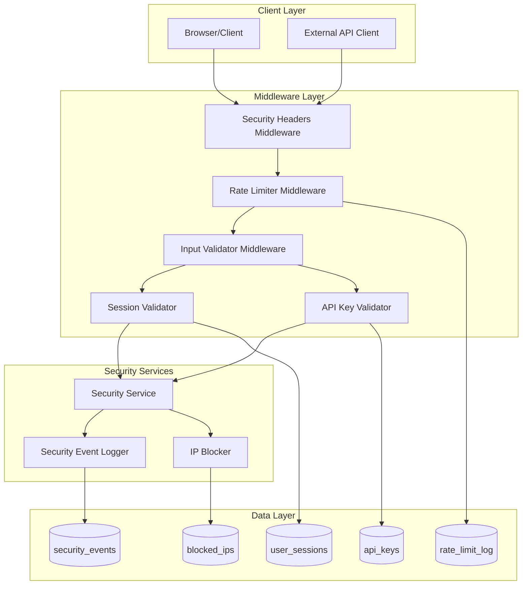

# Design Document: Security Hardening

## Overview

This design document describes the implementation of security hardening features for the Gama ERP system. The security module provides comprehensive protection through input validation, rate limiting, session management, API key management, security event logging, and row-level security policies.

## Architecture



## Components and Interfaces

### 1. Security Middleware (middleware/security.ts)

```typescript
interface SecurityMiddlewareConfig {
  rateLimitEnabled: boolean;
  inputValidationEnabled: boolean;
  securityHeadersEnabled: boolean;
}

interface SecurityMiddleware {
  // Apply all security middleware
  applySecurityMiddleware(request: NextRequest): Promise<NextResponse>;
  
  // Individual middleware functions
  applySecurityHeaders(response: NextResponse): NextResponse;
  checkRateLimit(request: NextRequest): Promise<RateLimitResult>;
  validateInput(request: NextRequest): Promise<ValidationResult>;
}
```

### 2. Rate Limiter (lib/security/rate-limiter.ts)

```typescript
interface RateLimitConfig {
  limit: number;           // Max requests per window
  windowSeconds: number;   // Time window in seconds
  blockDurationSeconds: number; // Duration to block after exceeding
}

interface RateLimitResult {
  allowed: boolean;
  remaining: number;
  resetAt: Date;
  blocked: boolean;
}

interface RateLimiter {
  // Check if request is allowed
  checkRateLimit(
    identifier: string,
    endpoint: string,
    config?: RateLimitConfig
  ): Promise<RateLimitResult>;
  
  // Get rate limit headers
  getRateLimitHeaders(result: RateLimitResult): Record<string, string>;
  
  // Clean up old rate limit entries
  cleanupOldEntries(): Promise<void>;
}
```

### 3. Input Validator (lib/security/input-validator.ts)

```typescript
interface ValidationResult {
  valid: boolean;
  sanitizedValue?: string;
  threats: ThreatDetection[];
}

interface ThreatDetection {
  type: 'sql_injection' | 'xss' | 'path_traversal' | 'command_injection';
  pattern: string;
  severity: 'low' | 'medium' | 'high' | 'critical';
}

interface FileValidationConfig {
  allowedTypes: string[];
  maxSizeBytes: number;
  scanForMalware: boolean;
}

interface InputValidator {
  // Sanitize string input
  sanitizeInput(input: string): string;
  
  // Detect SQL injection patterns
  detectSQLInjection(input: string): boolean;
  
  // Detect XSS patterns
  detectXSS(input: string): boolean;
  
  // Validate and sanitize input
  validateInput(input: string): ValidationResult;
  
  // Validate file upload
  validateFileUpload(file: File, config: FileValidationConfig): Promise<ValidationResult>;
}
```

### 4. Security Event Logger (lib/security/event-logger.ts)

```typescript
type SecurityEventType = 
  | 'brute_force'
  | 'sql_injection_attempt'
  | 'xss_attempt'
  | 'unauthorized_access'
  | 'suspicious_activity'
  | 'account_lockout'
  | 'rate_limit_exceeded'
  | 'invalid_api_key'
  | 'session_hijack_attempt';

type SecuritySeverity = 'low' | 'medium' | 'high' | 'critical';

interface SecurityEvent {
  id: string;
  timestamp: Date;
  eventType: SecurityEventType;
  severity: SecuritySeverity;
  description: string;
  ipAddress?: string;
  userAgent?: string;
  userId?: string;
  requestPath?: string;
  requestMethod?: string;
  payloadSample?: string;
  actionTaken?: string;
  investigated: boolean;
  investigatedBy?: string;
  investigationNotes?: string;
}

interface SecurityEventLogger {
  // Log a security event
  logEvent(params: {
    eventType: SecurityEventType;
    severity: SecuritySeverity;
    description: string;
    ipAddress?: string;
    userAgent?: string;
    userId?: string;
    requestPath?: string;
    payloadSample?: string;
    actionTaken?: string;
  }): Promise<SecurityEvent>;
  
  // Get events by type
  getEventsByType(type: SecurityEventType, limit?: number): Promise<SecurityEvent[]>;
  
  // Get events by severity
  getEventsBySeverity(severity: SecuritySeverity, limit?: number): Promise<SecurityEvent[]>;
  
  // Mark event as investigated
  markInvestigated(eventId: string, userId: string, notes: string): Promise<void>;
  
  // Send alert for critical events
  sendSecurityAlert(event: SecurityEvent): Promise<void>;
}
```

### 5. API Key Manager (lib/security/api-key-manager.ts)

```typescript
interface APIKey {
  id: string;
  keyHash: string;
  keyPrefix: string;
  name: string;
  description?: string;
  userId: string;
  permissions: string[];
  rateLimitPerMinute: number;
  expiresAt?: Date;
  lastUsedAt?: Date;
  usageCount: number;
  isActive: boolean;
  createdAt: Date;
}

interface APIKeyValidationResult {
  valid: boolean;
  userId?: string;
  permissions?: string[];
  rateLimitPerMinute?: number;
}

interface APIKeyManager {
  // Generate a new API key
  generateKey(params: {
    name: string;
    description?: string;
    userId: string;
    permissions: string[];
    rateLimitPerMinute?: number;
    expiresAt?: Date;
  }): Promise<{ key: string; keyData: APIKey }>;
  
  // Validate an API key
  validateKey(keyString: string): Promise<APIKeyValidationResult>;
  
  // Revoke an API key
  revokeKey(keyId: string): Promise<void>;
  
  // List keys for a user
  listUserKeys(userId: string): Promise<APIKey[]>;
  
  // Update key permissions
  updateKeyPermissions(keyId: string, permissions: string[]): Promise<void>;
}
```

### 6. Session Manager (lib/security/session-manager.ts)

```typescript
interface UserSession {
  id: string;
  userId: string;
  sessionTokenHash: string;
  createdAt: Date;
  expiresAt: Date;
  lastActivity: Date;
  ipAddress?: string;
  userAgent?: string;
  deviceFingerprint?: string;
  isActive: boolean;
  terminatedAt?: Date;
  terminatedReason?: string;
}

interface SessionContext {
  ipAddress: string;
  userAgent: string;
  deviceFingerprint?: string;
}

interface SessionManager {
  // Create a new session
  createSession(userId: string, context: SessionContext): Promise<string>;
  
  // Validate a session token
  validateSession(sessionToken: string): Promise<{ valid: boolean; session?: UserSession }>;
  
  // Update session activity
  updateActivity(sessionToken: string): Promise<void>;
  
  // Terminate a session
  terminateSession(sessionToken: string, reason: string): Promise<void>;
  
  // Terminate all sessions for a user
  terminateAllUserSessions(userId: string, reason: string): Promise<void>;
  
  // Get active sessions for a user
  getUserSessions(userId: string): Promise<UserSession[]>;
  
  // Clean up expired sessions
  cleanupExpiredSessions(): Promise<void>;
}
```

### 7. IP Blocker (lib/security/ip-blocker.ts)

```typescript
interface BlockedIP {
  id: string;
  ipAddress: string;
  reason: string;
  blockedAt: Date;
  blockedBy?: string;
  expiresAt?: Date;
  isActive: boolean;
}

interface IPBlocker {
  // Check if IP is blocked
  isBlocked(ipAddress: string): Promise<boolean>;
  
  // Block an IP address
  blockIP(params: {
    ipAddress: string;
    reason: string;
    blockedBy?: string;
    expiresAt?: Date;
  }): Promise<BlockedIP>;
  
  // Unblock an IP address
  unblockIP(ipAddress: string): Promise<void>;
  
  // List blocked IPs
  listBlockedIPs(includeExpired?: boolean): Promise<BlockedIP[]>;
  
  // Clean up expired blocks
  cleanupExpiredBlocks(): Promise<void>;
}
```

## Data Models

### Database Schema

```sql
-- Rate limiting tracking
CREATE TABLE rate_limit_log (
  id UUID PRIMARY KEY DEFAULT gen_random_uuid(),
  identifier VARCHAR(200) NOT NULL,
  endpoint VARCHAR(200) NOT NULL,
  request_count INTEGER DEFAULT 1,
  window_start TIMESTAMPTZ DEFAULT NOW(),
  blocked_until TIMESTAMPTZ,
  UNIQUE(identifier, endpoint, window_start)
);

-- Security events
CREATE TABLE security_events (
  id UUID PRIMARY KEY DEFAULT gen_random_uuid(),
  timestamp TIMESTAMPTZ DEFAULT NOW(),
  event_type VARCHAR(50) NOT NULL,
  severity VARCHAR(20) NOT NULL,
  description TEXT NOT NULL,
  ip_address INET,
  user_agent TEXT,
  user_id UUID REFERENCES user_profiles(id),
  request_path VARCHAR(500),
  request_method VARCHAR(10),
  payload_sample TEXT,
  action_taken VARCHAR(100),
  investigated BOOLEAN DEFAULT FALSE,
  investigated_by UUID REFERENCES user_profiles(id),
  investigation_notes TEXT
);

-- API keys
CREATE TABLE api_keys (
  id UUID PRIMARY KEY DEFAULT gen_random_uuid(),
  key_hash VARCHAR(64) NOT NULL,
  key_prefix VARCHAR(10) NOT NULL,
  name VARCHAR(100) NOT NULL,
  description TEXT,
  user_id UUID REFERENCES user_profiles(id),
  permissions JSONB DEFAULT '[]',
  rate_limit_per_minute INTEGER DEFAULT 60,
  expires_at TIMESTAMPTZ,
  last_used_at TIMESTAMPTZ,
  usage_count INTEGER DEFAULT 0,
  is_active BOOLEAN DEFAULT TRUE,
  created_at TIMESTAMPTZ DEFAULT NOW()
);

-- Blocked IPs
CREATE TABLE blocked_ips (
  id UUID PRIMARY KEY DEFAULT gen_random_uuid(),
  ip_address INET NOT NULL UNIQUE,
  reason TEXT NOT NULL,
  blocked_at TIMESTAMPTZ DEFAULT NOW(),
  blocked_by UUID REFERENCES user_profiles(id),
  expires_at TIMESTAMPTZ,
  is_active BOOLEAN DEFAULT TRUE
);

-- User sessions
CREATE TABLE user_sessions (
  id UUID PRIMARY KEY DEFAULT gen_random_uuid(),
  user_id UUID NOT NULL REFERENCES user_profiles(id),
  session_token_hash VARCHAR(64) NOT NULL,
  created_at TIMESTAMPTZ DEFAULT NOW(),
  expires_at TIMESTAMPTZ NOT NULL,
  last_activity TIMESTAMPTZ DEFAULT NOW(),
  ip_address INET,
  user_agent TEXT,
  device_fingerprint VARCHAR(64),
  is_active BOOLEAN DEFAULT TRUE,
  terminated_at TIMESTAMPTZ,
  terminated_reason VARCHAR(100)
);

-- Indexes
CREATE INDEX idx_rate_limit_identifier ON rate_limit_log(identifier, endpoint);
CREATE INDEX idx_rate_limit_window ON rate_limit_log(window_start);
CREATE INDEX idx_security_events_type ON security_events(event_type);
CREATE INDEX idx_security_events_severity ON security_events(severity);
CREATE INDEX idx_security_events_timestamp ON security_events(timestamp);
CREATE INDEX idx_api_keys_hash ON api_keys(key_hash);
CREATE INDEX idx_api_keys_user ON api_keys(user_id);
CREATE INDEX idx_blocked_ips_address ON blocked_ips(ip_address);
CREATE INDEX idx_user_sessions_user ON user_sessions(user_id);
CREATE INDEX idx_user_sessions_token ON user_sessions(session_token_hash);
CREATE INDEX idx_user_sessions_active ON user_sessions(is_active, expires_at);
```

### TypeScript Types

```typescript
// lib/security/types.ts

export interface RateLimitLog {
  id: string;
  identifier: string;
  endpoint: string;
  request_count: number;
  window_start: string;
  blocked_until: string | null;
}

export interface SecurityEvent {
  id: string;
  timestamp: string;
  event_type: string;
  severity: 'low' | 'medium' | 'high' | 'critical';
  description: string;
  ip_address: string | null;
  user_agent: string | null;
  user_id: string | null;
  request_path: string | null;
  request_method: string | null;
  payload_sample: string | null;
  action_taken: string | null;
  investigated: boolean;
  investigated_by: string | null;
  investigation_notes: string | null;
}

export interface APIKey {
  id: string;
  key_hash: string;
  key_prefix: string;
  name: string;
  description: string | null;
  user_id: string | null;
  permissions: string[];
  rate_limit_per_minute: number;
  expires_at: string | null;
  last_used_at: string | null;
  usage_count: number;
  is_active: boolean;
  created_at: string;
}

export interface BlockedIP {
  id: string;
  ip_address: string;
  reason: string;
  blocked_at: string;
  blocked_by: string | null;
  expires_at: string | null;
  is_active: boolean;
}

export interface UserSession {
  id: string;
  user_id: string;
  session_token_hash: string;
  created_at: string;
  expires_at: string;
  last_activity: string;
  ip_address: string | null;
  user_agent: string | null;
  device_fingerprint: string | null;
  is_active: boolean;
  terminated_at: string | null;
  terminated_reason: string | null;
}
```

## Correctness Properties

*A property is a characteristic or behavior that should hold true across all valid executions of a system-essentially, a formal statement about what the system should do. Properties serve as the bridge between human-readable specifications and machine-verifiable correctness guarantees.*


### Property 1: Rate Limiting Enforcement

*For any* identifier and endpoint combination, when the request count within a time window exceeds the configured limit, subsequent requests SHALL be rejected until the window resets.

**Validates: Requirements 1.1, 1.2**

### Property 2: Rate Limit Headers Consistency

*For any* rate-limited response, the rate limit headers (X-RateLimit-Limit, X-RateLimit-Remaining, X-RateLimit-Reset) SHALL accurately reflect the current rate limit state.

**Validates: Requirements 1.3**

### Property 3: Input Sanitization Preservation

*For any* input string, sanitization SHALL remove all dangerous patterns (SQL injection, XSS) while preserving the semantic meaning of safe content. Specifically, sanitizing a safe string should return an equivalent string.

**Validates: Requirements 2.1, 2.5**

### Property 4: SQL Injection Detection

*For any* input containing known SQL injection patterns (SELECT, INSERT, UPDATE, DELETE, DROP, UNION, --, etc.), the Input_Validator SHALL detect and flag the input as containing SQL injection.

**Validates: Requirements 2.2**

### Property 5: XSS Detection

*For any* input containing known XSS patterns (script tags, javascript: URIs, event handlers), the Input_Validator SHALL detect and flag the input as containing XSS.

**Validates: Requirements 2.3**

### Property 6: Security Event Logging Completeness

*For any* logged security event, the event record SHALL contain all required fields: timestamp, event_type, severity, and description. If source information is provided, it SHALL be captured.

**Validates: Requirements 3.1, 3.2, 3.4**

### Property 7: API Key Round-Trip

*For any* generated API key, validating the key immediately after generation SHALL return valid=true with the correct userId and permissions. The stored key_hash SHALL NOT equal the original key string.

**Validates: Requirements 4.1, 4.2, 4.5**

### Property 8: Expired API Key Rejection

*For any* API key with an expiration date in the past, validation SHALL return valid=false.

**Validates: Requirements 4.6**

### Property 9: Session Token Round-Trip

*For any* created session, validating the session token immediately after creation SHALL return valid=true with the correct session data. The stored session_token_hash SHALL NOT equal the original token.

**Validates: Requirements 5.1, 5.2**

### Property 10: Session Limit Enforcement

*For any* user, when creating a new session that would exceed 5 active sessions, the oldest sessions SHALL be invalidated such that at most 5 sessions remain active.

**Validates: Requirements 5.3**

### Property 11: Expired Session Rejection

*For any* session with an expiration time in the past, validation SHALL return valid=false.

**Validates: Requirements 5.4**

### Property 12: IP Blocking Round-Trip

*For any* blocked IP address, isBlocked() SHALL return true. After unblocking, isBlocked() SHALL return false.

**Validates: Requirements 6.1, 6.2**

### Property 13: Expired Block Automatic Lift

*For any* IP block with an expiration time in the past, isBlocked() SHALL return false.

**Validates: Requirements 6.4**

### Property 14: Role-Based Data Access

*For any* user with a specific role querying data, the results SHALL only include records that the role is authorized to access according to RLS policies.

**Validates: Requirements 7.2, 7.3, 7.4, 7.5**

## Error Handling

### Rate Limiting Errors

| Error Condition | Response | Action |
|----------------|----------|--------|
| Rate limit exceeded | 429 Too Many Requests | Include Retry-After header |
| IP blocked | 403 Forbidden | Log access attempt |
| Database error during check | Allow request | Log error, fail open |

### Input Validation Errors

| Error Condition | Response | Action |
|----------------|----------|--------|
| SQL injection detected | 400 Bad Request | Log security event |
| XSS detected | 400 Bad Request | Log security event |
| Invalid file type | 400 Bad Request | Return allowed types |
| File too large | 413 Payload Too Large | Return max size |

### Session Errors

| Error Condition | Response | Action |
|----------------|----------|--------|
| Invalid session token | 401 Unauthorized | Clear session cookie |
| Expired session | 401 Unauthorized | Redirect to login |
| Session creation failed | 500 Internal Server Error | Log error |

### API Key Errors

| Error Condition | Response | Action |
|----------------|----------|--------|
| Invalid API key | 401 Unauthorized | Log security event |
| Expired API key | 401 Unauthorized | Return expiration info |
| Rate limit exceeded | 429 Too Many Requests | Include key-specific limits |

## Testing Strategy

### Unit Tests

Unit tests will verify specific examples and edge cases:

1. **Input Validator Tests**
   - Test specific SQL injection patterns
   - Test specific XSS patterns
   - Test edge cases (empty strings, unicode)
   - Test file validation with various file types

2. **Rate Limiter Tests**
   - Test boundary conditions (exactly at limit)
   - Test window reset behavior
   - Test concurrent request handling

3. **Session Manager Tests**
   - Test session creation with various contexts
   - Test session expiration edge cases
   - Test concurrent session creation

### Property-Based Tests

Property-based tests will use **fast-check** library to verify universal properties:

1. **Sanitization Properties**
   - Generate random strings with injected patterns
   - Verify dangerous patterns are removed
   - Verify safe content is preserved

2. **Round-Trip Properties**
   - Generate random API keys and verify validation
   - Generate random sessions and verify validation
   - Generate random IP blocks and verify blocking

3. **Enforcement Properties**
   - Generate random request sequences and verify rate limiting
   - Generate random session counts and verify limit enforcement

### Test Configuration

- Minimum 100 iterations per property test
- Each property test tagged with: **Feature: security-hardening, Property {number}: {property_text}**
- Use fast-check for property-based testing in TypeScript
