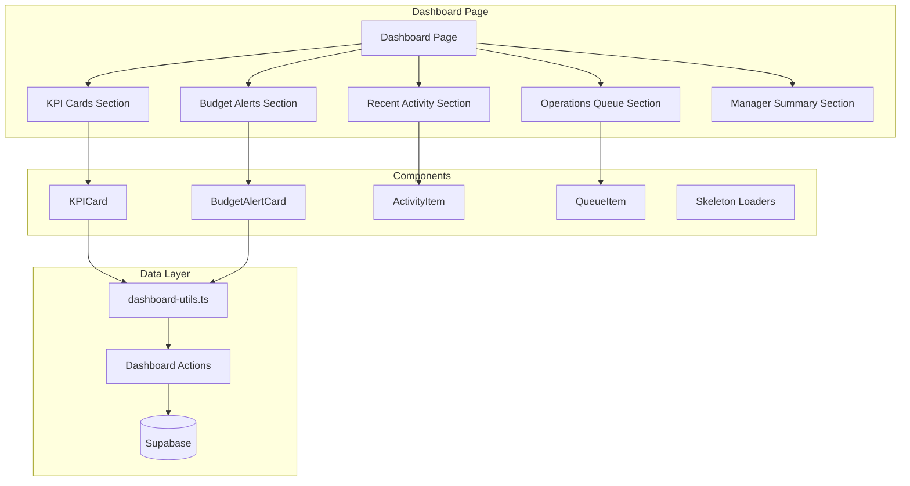

# Design Document: v0.8 - Enhanced Dashboard with Budget Monitoring

## Overview

This feature enhances the existing dashboard with real-time KPI cards, budget health monitoring, recent activity tracking, and an operations queue. The dashboard provides role-based views where admin users see workflow status, managers see comprehensive metrics, and operations users see their pending work queue.

The implementation replaces the current static dashboard with dynamic data fetched from Supabase, using parallel queries for performance and client-side refresh for real-time updates.

## Architecture



## Components and Interfaces

### Page Component

**File:** `app/(main)/dashboard/page.tsx`

Server component that fetches initial data and renders the dashboard layout.

```typescript
interface DashboardPageProps {
  // No props - data fetched server-side
}
```

### KPI Card Component

**File:** `components/dashboard/kpi-card.tsx`

```typescript
interface KPICardProps {
  title: string
  value: string | number
  description: string
  icon: LucideIcon
  href: string
  variant?: 'default' | 'success' | 'warning' | 'danger'
  isLoading?: boolean
}
```

### Budget Alert Card Component

**File:** `components/dashboard/budget-alert-card.tsx`

```typescript
interface BudgetAlertItem {
  id: string
  pjo_number: string
  category: string
  description: string
  estimated_amount: number
  actual_amount: number
  variance: number
  variance_pct: number
}

interface BudgetAlertCardProps {
  alerts: BudgetAlertItem[]
  isLoading?: boolean
}
```

### Recent Activity Component

**File:** `components/dashboard/recent-activity.tsx`

```typescript
interface ActivityItem {
  id: string
  action_type: 'pjo_approved' | 'jo_created' | 'invoice_paid' | 'cost_confirmed'
  document_number: string
  user_name: string
  created_at: string
}

interface RecentActivityProps {
  activities: ActivityItem[]
  isLoading?: boolean
}
```

### Operations Queue Component

**File:** `components/dashboard/operations-queue.tsx`

```typescript
interface QueueItem {
  id: string
  pjo_number: string
  customer_name: string
  costs_confirmed: number
  costs_total: number
}

interface OperationsQueueProps {
  items: QueueItem[]
  isLoading?: boolean
}
```

### Manager Summary Component

**File:** `components/dashboard/manager-summary.tsx`

```typescript
interface ManagerSummaryProps {
  totalRevenue: number
  totalCosts: number
  margin: number
  isLoading?: boolean
}
```

## Data Models

### KPI Data Types

**File:** `types/dashboard.ts`

```typescript
export interface DashboardKPIs {
  awaitingOpsInput: number
  exceededBudgetItems: number
  readyForConversion: number
  outstandingAR: number
}

export interface BudgetAlert {
  id: string
  pjo_id: string
  pjo_number: string
  category: string
  description: string
  estimated_amount: number
  actual_amount: number
  variance: number
  variance_pct: number
  created_at: string
}

export interface ActivityEntry {
  id: string
  action_type: ActivityType
  document_type: 'pjo' | 'jo' | 'invoice'
  document_id: string
  document_number: string
  user_id: string
  user_name: string
  details?: Record<string, unknown>
  created_at: string
}

export type ActivityType = 
  | 'pjo_approved'
  | 'pjo_rejected'
  | 'jo_created'
  | 'jo_completed'
  | 'jo_submitted_to_finance'
  | 'invoice_created'
  | 'invoice_sent'
  | 'invoice_paid'
  | 'cost_confirmed'

export interface OpsQueueItem {
  id: string
  pjo_number: string
  customer_name: string
  project_name: string | null
  commodity: string | null
  costs_confirmed: number
  costs_total: number
  created_at: string
}

export interface ManagerMetrics {
  totalRevenue: number
  totalCosts: number
  totalProfit: number
  margin: number
  activeJOCount: number
}
```

### Database Schema Addition

A new `activity_log` table will track system activities:

```sql
CREATE TABLE activity_log (
  id UUID PRIMARY KEY DEFAULT gen_random_uuid(),
  action_type TEXT NOT NULL,
  document_type TEXT NOT NULL,
  document_id UUID NOT NULL,
  document_number TEXT NOT NULL,
  user_id UUID REFERENCES auth.users(id),
  user_name TEXT NOT NULL,
  details JSONB,
  created_at TIMESTAMPTZ DEFAULT NOW()
);

CREATE INDEX idx_activity_log_created_at ON activity_log(created_at DESC);
CREATE INDEX idx_activity_log_action_type ON activity_log(action_type);

-- RLS Policy
ALTER TABLE activity_log ENABLE ROW LEVEL SECURITY;

CREATE POLICY "Users can view activity log"
  ON activity_log FOR SELECT
  TO authenticated
  USING (true);

CREATE POLICY "System can insert activity log"
  ON activity_log FOR INSERT
  TO authenticated
  WITH CHECK (true);
```

## Correctness Properties

*A property is a characteristic or behavior that should hold true across all valid executions of a system-essentially, a formal statement about what the system should do. Properties serve as the bridge between human-readable specifications and machine-verifiable correctness guarantees.*

### Property 1: KPI Count Calculations

*For any* set of PJOs and cost items in the database, the KPI counts SHALL satisfy:
- `awaitingOpsInput` equals the count of PJOs where `status = 'approved'` AND `all_costs_confirmed = false`
- `exceededBudgetItems` equals the count of cost items where `status = 'exceeded'`
- `readyForConversion` equals the count of PJOs where `status = 'approved'` AND `all_costs_confirmed = true`

**Validates: Requirements 1.2, 1.3, 1.4**

### Property 2: Outstanding AR Sum Calculation

*For any* set of invoices in the database, the `outstandingAR` value SHALL equal the sum of `total_amount` from all invoices where `status` is either `'sent'` or `'overdue'`.

**Validates: Requirements 1.5**

### Property 3: Variance Percentage Calculation

*For any* cost item with `estimated_amount > 0` and `actual_amount >= 0`, the variance percentage SHALL be calculated as `((actual_amount - estimated_amount) / estimated_amount) * 100`.

**Validates: Requirements 2.4**

### Property 4: Activity Message Formatting

*For any* activity entry, the formatted message SHALL contain:
- For `pjo_approved`: the PJO number and approving user name
- For `jo_created`: the source PJO number
- For `invoice_paid`: the invoice number

**Validates: Requirements 3.4, 3.5, 3.6**

### Property 5: Cost Entry Progress Calculation

*For any* PJO with cost items, the progress display SHALL show `X of Y` where:
- `X` equals the count of cost items where `actual_amount IS NOT NULL`
- `Y` equals the total count of cost items for that PJO

**Validates: Requirements 4.4**

### Property 6: Query Result Limits

*For any* query for budget alerts or recent activities, the returned list SHALL contain at most 5 items, ordered by `created_at` descending.

**Validates: Requirements 7.3, 7.4**

### Property 7: Manager Metrics Calculation

*For any* set of active JOs in the current month, the manager metrics SHALL satisfy:
- `totalRevenue` equals the sum of `final_revenue` from all matching JOs
- `totalCosts` equals the sum of `final_cost` from all matching JOs
- `totalProfit` equals `totalRevenue - totalCosts`
- `margin` equals `(totalProfit / totalRevenue) * 100` when `totalRevenue > 0`, otherwise `0`

**Validates: Requirements 6.3**

## Error Handling

| Error Scenario | Handling Strategy |
|----------------|-------------------|
| Database query fails | Display last cached values with stale indicator |
| No data available | Show empty state with helpful message |
| User not authenticated | Redirect to login page |
| Network timeout | Retry with exponential backoff, show error after 3 attempts |
| Invalid role | Show default dashboard without role-specific sections |

## Testing Strategy

### Unit Tests

Unit tests will verify:
- KPI calculation functions with various data scenarios
- Activity message formatting for each action type
- Progress calculation for cost entry
- Variance percentage calculation
- Currency formatting (using existing formatIDR)

### Property-Based Tests

Using `fast-check` library for property-based testing:

1. **KPI Calculations Property Test**
   - Generate random sets of PJOs with various statuses and cost confirmation states
   - Verify count calculations match expected filters

2. **Outstanding AR Property Test**
   - Generate random sets of invoices with various statuses and amounts
   - Verify sum calculation matches expected filter

3. **Variance Calculation Property Test**
   - Generate random estimated and actual amounts
   - Verify variance percentage formula is correctly applied

4. **Progress Calculation Property Test**
   - Generate random cost items with/without actual amounts
   - Verify X/Y counts are accurate

5. **Query Limit Property Test**
   - Generate lists of varying sizes
   - Verify returned results never exceed 5 items

6. **Manager Metrics Property Test**
   - Generate random JOs with revenue and cost values
   - Verify aggregation calculations are correct

### Integration Tests

- Dashboard page renders all sections
- KPI cards link to correct filtered pages
- Role-based sections appear/hide correctly
- Data refresh works without page reload

