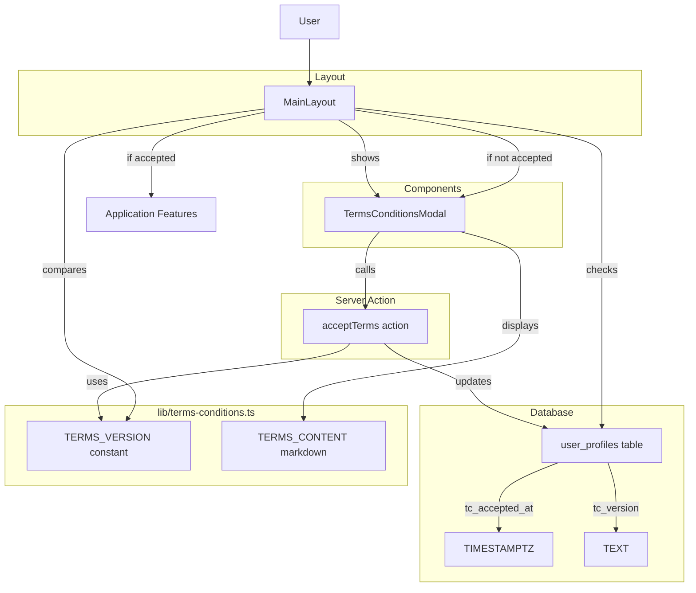

# Design Document: Terms & Conditions System

## Overview

The Terms & Conditions (T&C) system ensures all users accept the current version of terms before accessing GAMA ERP features. The system consists of:

1. Database columns to track acceptance status and version
2. A TypeScript module for T&C content and version management
3. A modal component for displaying and accepting terms
4. A server action for recording acceptance
5. Layout-level integration for enforcement

The design prioritizes legal compliance, user experience, and maintainability.

## Architecture



## Components and Interfaces

### 1. Database Schema Extension

Add two columns to the existing `user_profiles` table:

```sql
ALTER TABLE user_profiles
ADD COLUMN tc_accepted_at TIMESTAMPTZ DEFAULT NULL,
ADD COLUMN tc_version TEXT DEFAULT NULL;
```

### 2. Terms Content Module (lib/terms-conditions.ts)

```typescript
// Version identifier - update this to force re-acceptance
export const TERMS_VERSION = '1.0.0'

// Check if user has accepted current version
export function hasAcceptedCurrentTerms(
  tcAcceptedAt: string | null,
  tcVersion: string | null
): boolean

// Terms content as markdown string
export const TERMS_CONTENT: string
```

### 3. Terms Modal Component (components/terms-conditions-modal.tsx)

```typescript
interface TermsConditionsModalProps {
  isOpen: boolean
  onAccepted: () => void
}

// Uses shadcn/ui Dialog, ScrollArea, Checkbox, Button
// Renders TERMS_CONTENT with react-markdown
// Cannot be dismissed without accepting
```

### 4. Server Action (app/(main)/actions/accept-terms.ts)

```typescript
'use server'

export async function acceptTerms(): Promise<{
  success: boolean
  error?: string
}>
```

### 5. Layout Integration

The `app/(main)/layout.tsx` will:
1. Fetch user's tc_accepted_at and tc_version from user_profiles
2. Compare tc_version with current TERMS_VERSION
3. Render TermsConditionsModal if acceptance is required
4. Block access to children until terms are accepted

## Data Models

### User Profile Extension

```typescript
// Extended user_profiles type
interface UserProfile {
  // ... existing fields
  tc_accepted_at: string | null  // ISO timestamp
  tc_version: string | null      // e.g., "1.0.0"
}
```

### Acceptance Check Result

```typescript
interface TermsAcceptanceStatus {
  needsAcceptance: boolean
  currentVersion: string
  userVersion: string | null
  acceptedAt: string | null
}
```

### Server Action Response

```typescript
interface AcceptTermsResult {
  success: boolean
  error?: string
}
```

## Correctness Properties

*A property is a characteristic or behavior that should hold true across all valid executions of a system—essentially, a formal statement about what the system should do. Properties serve as the bridge between human-readable specifications and machine-verifiable correctness guarantees.*

### Property 1: Version Comparison Consistency

*For any* user profile with tc_version and tc_accepted_at values, the `hasAcceptedCurrentTerms` function SHALL return true if and only if tc_version equals the current TERMS_VERSION and tc_accepted_at is not null.

**Validates: Requirements 2.4, 5.2, 5.3, 5.4**

### Property 2: Accept Button State Tied to Checkbox

*For any* state of the Terms Modal, the Accept button SHALL be enabled if and only if the acceptance checkbox is checked.

**Validates: Requirements 3.3**

### Property 3: Terms Content Contains All Required Sections

*For any* version of TERMS_CONTENT, the content SHALL contain all 10 required section headers: Acceptance of Terms, Authorized Use, User Responsibilities, Data Handling, Prohibited Actions, System Availability, Monitoring, Termination, Updates to Terms, and Contact.

**Validates: Requirements 2.2, 2.3**

## Error Handling

### Authentication Errors

| Scenario | Handling |
|----------|----------|
| User not authenticated when calling acceptTerms | Return `{ success: false, error: 'Not authenticated' }` |
| Session expired during acceptance | Redirect to login page |

### Database Errors

| Scenario | Handling |
|----------|----------|
| Failed to update user_profiles | Return `{ success: false, error: 'Failed to record acceptance' }` |
| Database connection error | Display error toast, allow retry |

### UI Error States

| Scenario | Handling |
|----------|----------|
| acceptTerms returns error | Display error message in modal, keep modal open |
| Network failure | Display "Connection error, please try again" message |

## Testing Strategy

### Unit Tests

1. **hasAcceptedCurrentTerms function**
   - Returns false when tc_accepted_at is null
   - Returns false when tc_version is null
   - Returns false when tc_version doesn't match TERMS_VERSION
   - Returns true when tc_version matches TERMS_VERSION and tc_accepted_at is set

2. **TERMS_CONTENT validation**
   - Contains all 10 required section headers
   - Is valid markdown

3. **TermsConditionsModal component**
   - Renders terms content
   - Accept button disabled by default
   - Accept button enabled when checkbox checked
   - Calls onAccepted callback on successful acceptance
   - Displays error message on failure
   - Cannot be dismissed via backdrop click
   - Has no close button

4. **acceptTerms server action**
   - Returns error when user not authenticated
   - Updates user_profiles on success
   - Returns success response on successful update

### Property-Based Tests

Property tests will use fast-check for TypeScript. Each test runs minimum 100 iterations.

1. **Property 1: Version Comparison Consistency**
   - Generate random tc_version strings and tc_accepted_at timestamps
   - Verify hasAcceptedCurrentTerms returns true only when version matches and timestamp exists
   - Tag: **Feature: v0.85-terms-conditions, Property 1: Version comparison consistency**

2. **Property 2: Accept Button State**
   - Generate random checkbox states (checked/unchecked)
   - Verify button disabled state is inverse of checkbox checked state
   - Tag: **Feature: v0.85-terms-conditions, Property 2: Accept button state tied to checkbox**

3. **Property 3: Terms Content Sections**
   - Verify TERMS_CONTENT contains all required section headers
   - Tag: **Feature: v0.85-terms-conditions, Property 3: Terms content contains all required sections**

### Integration Tests

1. **Layout Integration**
   - User with current tc_version sees no modal
   - User with outdated tc_version sees modal
   - User with null tc_version sees modal
   - After accepting, modal closes and content is accessible

2. **End-to-End Flow**
   - New user sees T&C modal on first access
   - User accepts terms and can access system
   - User's acceptance is recorded in database

