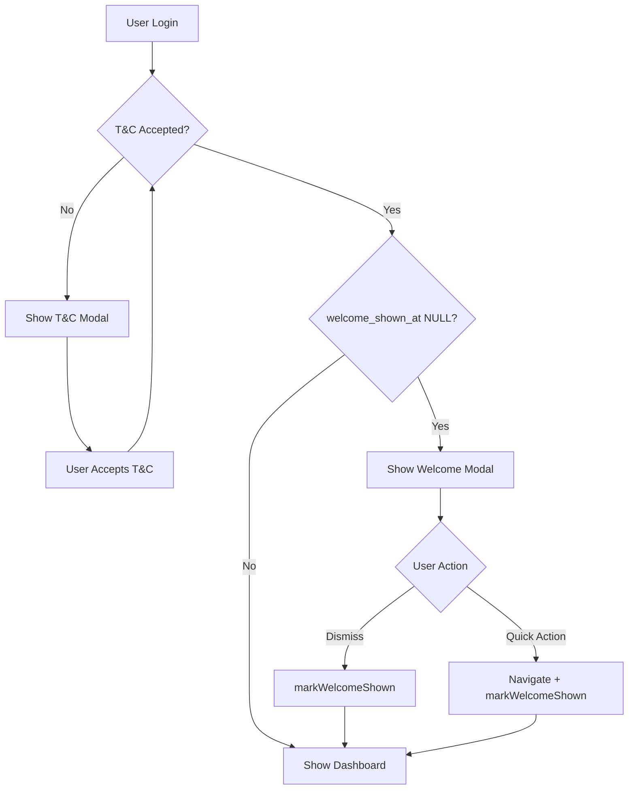
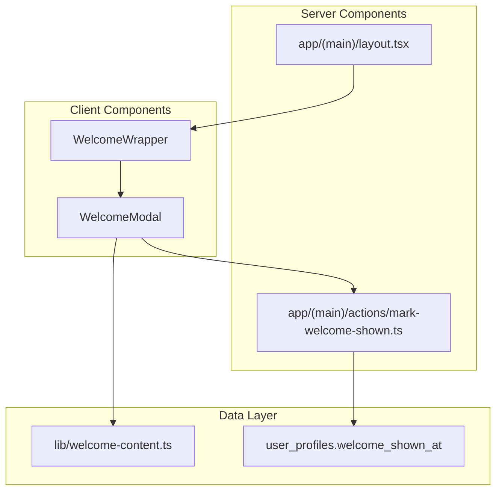

# Design Document: Welcome Flow (v0.86)

## Overview

The Welcome Flow feature provides a role-specific onboarding experience for new GAMA ERP users. After accepting Terms & Conditions, users see a dismissible welcome modal that explains their role capabilities and provides quick action buttons to help them get started. The modal only appears once per user, tracked via a `welcome_shown_at` timestamp in the user_profiles table.

This feature follows the existing T&C modal pattern but with key differences:
- Dismissible (unlike T&C which is non-dismissible)
- Role-specific content
- Quick action buttons for navigation
- Shows after T&C acceptance, not before

## Architecture



### Component Architecture



## Components and Interfaces

### 1. Welcome Content Definition (`lib/welcome-content.ts`)

```typescript
import { UserRole } from '@/types/permissions'

export interface QuickAction {
  label: string
  href: string
  description: string
}

export interface WelcomeContent {
  title: string
  description: string
  quickActions: QuickAction[]
}

export const WELCOME_CONTENT: Record<UserRole, WelcomeContent> = {
  owner: {
    title: 'Selamat Datang di GAMA ERP',
    description: 'Sebagai Owner, Anda memiliki akses penuh ke seluruh sistem...',
    quickActions: [
      { label: 'Executive Dashboard', href: '/dashboard/owner', description: 'Lihat ringkasan bisnis' },
      { label: 'Kelola Pengguna', href: '/settings/users', description: 'Atur akses tim' },
      { label: 'Laporan', href: '/reports', description: 'Analisis performa' },
    ],
  },
  // ... other roles
}

export const DEFAULT_WELCOME_CONTENT: WelcomeContent = {
  title: 'Selamat Datang di GAMA ERP',
  description: 'Sistem ERP untuk manajemen logistik heavy-haul...',
  quickActions: [
    { label: 'Dashboard', href: '/dashboard', description: 'Lihat dashboard Anda' },
    { label: 'Bantuan', href: '/help', description: 'Pelajari cara menggunakan sistem' },
  ],
}

export function getWelcomeContent(role: UserRole): WelcomeContent {
  return WELCOME_CONTENT[role] || DEFAULT_WELCOME_CONTENT
}
```

### 2. Server Action (`app/(main)/actions/mark-welcome-shown.ts`)

```typescript
'use server'

interface MarkWelcomeShownResult {
  success: boolean
  error?: string
}

export async function markWelcomeShown(): Promise<MarkWelcomeShownResult> {
  // 1. Verify authentication
  // 2. Update welcome_shown_at with current timestamp
  // 3. Return success/error result
}
```

### 3. Welcome Modal Component (`components/welcome-modal.tsx`)

```typescript
interface WelcomeModalProps {
  isOpen: boolean
  role: UserRole
  onDismiss: () => void
}

export function WelcomeModal({ isOpen, role, onDismiss }: WelcomeModalProps) {
  // Uses shadcn/ui Dialog component
  // Displays role-specific content from getWelcomeContent(role)
  // Handles dismiss and quick action clicks
}
```

### 4. Welcome Wrapper Component (`components/welcome-wrapper.tsx`)

```typescript
interface WelcomeWrapperProps {
  needsWelcome: boolean
  role: UserRole
  children: React.ReactNode
}

export function WelcomeWrapper({ needsWelcome, role, children }: WelcomeWrapperProps) {
  // Manages modal state
  // Calls markWelcomeShown on dismiss
  // Handles navigation for quick actions
}
```

## Data Models

### Database Schema Change

```sql
-- Migration: Add welcome_shown_at column to user_profiles
ALTER TABLE user_profiles 
ADD COLUMN IF NOT EXISTS welcome_shown_at TIMESTAMPTZ;

-- Comment for documentation
COMMENT ON COLUMN user_profiles.welcome_shown_at IS 
  'Timestamp when user dismissed the welcome modal. NULL means not yet shown.';
```

### TypeScript Types

```typescript
// Addition to types/permissions.ts UserProfile interface
interface UserProfile {
  // ... existing fields
  welcome_shown_at: string | null  // ISO timestamp or null
}
```

### Welcome Content Type Structure

```typescript
// All 15 roles with their content
type RoleWelcomeContent = {
  owner: WelcomeContent
  director: WelcomeContent
  sysadmin: WelcomeContent
  marketing_manager: WelcomeContent
  finance_manager: WelcomeContent
  operations_manager: WelcomeContent
  administration: WelcomeContent
  finance: WelcomeContent
  marketing: WelcomeContent
  ops: WelcomeContent
  engineer: WelcomeContent
  hr: WelcomeContent
  hse: WelcomeContent
  agency: WelcomeContent
  customs: WelcomeContent
}
```

## Correctness Properties

*A property is a characteristic or behavior that should hold true across all valid executions of a system—essentially, a formal statement about what the system should do. Properties serve as the bridge between human-readable specifications and machine-verifiable correctness guarantees.*

### Property 1: Welcome Content Structure Validity

*For any* role in the UserRole type, the welcome content returned by `getWelcomeContent(role)` SHALL have a non-empty title, a non-empty description, and between 2-3 quick actions where each quick action has a non-empty label, a valid href starting with '/', and a non-empty description.

**Validates: Requirements 2.1, 2.3, 2.4**

### Property 2: Default Content Fallback

*For any* string that is not a valid UserRole, calling `getWelcomeContent` with that value SHALL return the DEFAULT_WELCOME_CONTENT object.

**Validates: Requirements 2.2**

### Property 3: Welcome Modal Display Logic

*For any* user profile, the welcome modal should display if and only if: (1) tc_accepted_at is not null (T&C accepted), AND (2) welcome_shown_at is null (not yet shown). This ensures T&C is always shown first and welcome modal only shows once.

**Validates: Requirements 3.1, 3.2, 6.1, 6.2**

### Property 4: Mark Welcome Shown Round-Trip

*For any* authenticated user with welcome_shown_at as null, calling `markWelcomeShown()` SHALL result in welcome_shown_at being set to a non-null timestamp, and subsequent calls to check `shouldShowWelcome()` SHALL return false.

**Validates: Requirements 1.3, 4.3, 5.1, 5.3**

## Error Handling

| Error Scenario | Handling Strategy | User Feedback |
|----------------|-------------------|---------------|
| User not authenticated | Return error from server action | Modal stays open, show error toast |
| Database update fails | Return error with message | Show error message in modal |
| Invalid role | Use default welcome content | Show generic welcome message |
| Navigation fails | Catch error, show toast | "Gagal membuka halaman" toast |

### Error Response Format

```typescript
interface ActionResult {
  success: boolean
  error?: string
}
```

## Testing Strategy

### Unit Tests

1. **Welcome Content Tests**
   - Verify all 15 roles have content defined
   - Verify content structure (title, description, quickActions)
   - Verify quick action structure (label, href, description)
   - Verify default content fallback

2. **Display Logic Tests**
   - Test `shouldShowWelcome` with various profile states
   - Test T&C + welcome sequencing logic

3. **Server Action Tests**
   - Test authentication check
   - Test successful update
   - Test error handling

### Property-Based Tests

Property tests should run minimum 100 iterations each.

1. **Property 1 Test**: Generate all valid UserRole values, verify content structure
   - Tag: **Feature: v0.86-welcome-flow, Property 1: Welcome content structure validity**

2. **Property 2 Test**: Generate random invalid role strings, verify default fallback
   - Tag: **Feature: v0.86-welcome-flow, Property 2: Default content fallback**

3. **Property 3 Test**: Generate random profile states (tc_accepted_at, welcome_shown_at combinations), verify display logic
   - Tag: **Feature: v0.86-welcome-flow, Property 3: Welcome modal display logic**

4. **Property 4 Test**: Test round-trip of marking welcome shown
   - Tag: **Feature: v0.86-welcome-flow, Property 4: Mark welcome shown round-trip**

### Integration Tests

1. Test welcome modal appears after T&C acceptance
2. Test quick action navigation works
3. Test dismiss updates database
4. Test modal doesn't reappear on page refresh
