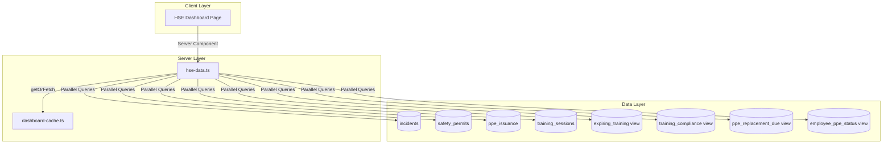

# Design Document: HSE Dashboard

## Overview

The HSE Dashboard provides HSE personnel with a centralized view of safety metrics, incidents, permits, training compliance, and PPE status. This feature follows the established dashboard patterns in GAMA ERP, using server-side data fetching with 5-minute caching for optimal performance.

The dashboard will be implemented at `app/(main)/dashboard/hse/page.tsx` with data fetching logic in `lib/dashboard/hse-data.ts`, following the same architecture as the Engineering Dashboard.

## Architecture



## Components and Interfaces

### Data Service Interface

```typescript
// lib/dashboard/hse-data.ts

export interface IncidentBySeverity {
  critical: number
  major: number
  minor: number
}

export interface RecentIncident {
  id: string
  incidentNumber: string
  title: string
  severity: string
  status: string
  incidentDate: string
  locationType: string
}

export interface RecentPermit {
  id: string
  permitNumber: string
  permitType: string
  workLocation: string
  status: string
  validTo: string
}

export interface ExpiringTraining {
  employeeCode: string
  fullName: string
  courseName: string
  validTo: string
  daysUntilExpiry: number
}

export interface PpeReplacementDue {
  id: string
  employeeCode: string
  fullName: string
  ppeName: string
  expectedReplacementDate: string
  daysOverdue: number
}

export interface HseDashboardMetrics {
  // Safety Overview
  daysSinceLastIncident: number
  lastIncidentDate: string | null
  incidentsYtd: number
  openIncidents: number
  incidentsBySeverity: IncidentBySeverity
  recentIncidents: RecentIncident[]
  
  // Permit Status
  activePermits: number
  expiringPermits: number
  expiredPermits: number
  recentPermits: RecentPermit[]
  
  // Training Compliance
  expiringTrainingCount: number
  overdueTrainingCount: number
  trainingComplianceRate: number
  expiringTrainingList: ExpiringTraining[]
  
  // PPE Status
  ppeReplacementDueCount: number
  ppeOverdueCount: number
  employeesWithIncompletePpe: number
  ppeReplacementDueList: PpeReplacementDue[]
}
```

### Dashboard Page Component

```typescript
// app/(main)/dashboard/hse/page.tsx

// Sections:
// 1. Header with title and description
// 2. Safety Overview - Days Since Last Incident (prominent large counter)
// 3. Safety Overview cards (incidents YTD, open incidents, by severity)
// 4. Permit Status cards (active, expiring, expired)
// 5. Training Compliance cards (expiring, overdue, compliance rate)
// 6. PPE Status cards (replacement due, overdue, incomplete)
// 7. Quick Actions section
// 8. Recent Incidents list with severity badges
// 9. Expiring Training list
// 10. PPE Replacement Due list
```

### Alert Badge Components

```typescript
// Severity badge for incidents
function SeverityBadge({ severity }: { severity: string }) {
  // critical = red, major = orange, minor = yellow
}

// Alert indicator for counts
function AlertIndicator({ type, count }: { type: 'danger' | 'warning' | 'success'; count: number }) {
  // danger = red, warning = yellow, success = green
}

// Compliance rate indicator
function ComplianceIndicator({ rate }: { rate: number }) {
  // >= 90% = green, >= 70% = yellow, < 70% = red
}
```

## Data Models

### Database Tables Used

1. **incidents**
   - Key columns: id, incident_number, title, severity, status, incident_date, location_type, created_at, closed_at

2. **safety_permits**
   - Key columns: id, permit_number, permit_type, work_location, status, valid_from, valid_to, created_at

3. **expiring_training** (view)
   - Key columns: employee_code, full_name, course_name, valid_to, days_until_expiry

4. **training_compliance** (view)
   - Key columns: employee_id, course_id, compliance_status, valid_to

5. **ppe_replacement_due** (view)
   - Key columns: id, employee_code, full_name, ppe_name, expected_replacement_date, days_overdue

6. **employee_ppe_status** (view)
   - Key columns: employee_id, ppe_type_id, ppe_status, is_mandatory

### Query Patterns

```sql
-- Days since last incident
SELECT incident_date FROM incidents 
ORDER BY incident_date DESC LIMIT 1

-- Incidents YTD
SELECT COUNT(*) FROM incidents 
WHERE incident_date >= start_of_year

-- Open incidents
SELECT COUNT(*) FROM incidents 
WHERE status NOT IN ('closed', 'resolved')

-- Incidents by severity
SELECT severity, COUNT(*) FROM incidents 
WHERE incident_date >= start_of_year
GROUP BY severity

-- Active permits
SELECT COUNT(*) FROM safety_permits 
WHERE status = 'active' AND valid_to >= now()

-- Expiring permits (within 30 days)
SELECT COUNT(*) FROM safety_permits 
WHERE valid_to BETWEEN now() AND now() + interval '30 days'
AND status != 'closed'

-- Expired permits
SELECT COUNT(*) FROM safety_permits 
WHERE valid_to < now() AND status NOT IN ('closed', 'cancelled')

-- Training compliance rate
SELECT 
  COUNT(*) FILTER (WHERE compliance_status = 'compliant') * 100.0 / COUNT(*)
FROM training_compliance
WHERE is_mandatory = true

-- PPE replacement due
SELECT COUNT(*) FROM ppe_replacement_due

-- Employees with incomplete PPE
SELECT COUNT(DISTINCT employee_id) FROM employee_ppe_status
WHERE ppe_status != 'issued' AND is_mandatory = true
```


## Correctness Properties

*A property is a characteristic or behavior that should hold true across all valid executions of a system—essentially, a formal statement about what the system should do. Properties serve as the bridge between human-readable specifications and machine-verifiable correctness guarantees.*

### Property 1: Days Since Last Incident Calculation

*For any* collection of incidents with incident dates, the Days_Since_Last_Incident calculation should equal the number of days between today and the most recent incident_date. If no incidents exist, the value should be the number of days since the start of the year.

**Validates: Requirements 1.1**

### Property 2: Status Filtering Correctness

*For any* collection of records (incidents, permits) and any status filter criteria, the count returned should equal exactly the number of records that match the specified status conditions. Specifically:
- Open incidents: records where status NOT IN ('closed', 'resolved')
- Active permits: records where status = 'active' AND valid_to >= today
- Expired permits: records where valid_to < today AND status NOT IN ('closed', 'cancelled')

**Validates: Requirements 1.3, 2.1, 2.3**

### Property 3: Date Range Filtering Correctness

*For any* collection of records with date fields and any date range, the count returned should equal exactly the number of records with dates within that range. Specifically:
- Incidents YTD: incident_date >= start of year
- Expiring permits: valid_to between today and today + 30 days
- Expiring training: valid_to between today and today + 30 days
- Overdue training: valid_to < today

**Validates: Requirements 1.2, 2.2, 3.1, 3.2**

### Property 4: Severity Grouping Correctness

*For any* collection of incidents with severity values, the grouped counts should sum to the total count, and each severity bucket should contain exactly the incidents with that severity value.

**Validates: Requirements 1.4**

### Property 5: Recent Items Ordering and Limiting

*For any* collection of records, the recent items query should return at most 5 items, and those items should be ordered by the specified field in descending order (most recent first for created_at, soonest for expiry dates).

**Validates: Requirements 2.4, 3.4, 4.3**

### Property 6: Compliance Percentage Calculation

*For any* set of training compliance records with total count > 0, the compliance rate should equal (compliant count / total count) * 100, rounded appropriately. If total count is 0, compliance rate should be 100 (no violations).

**Validates: Requirements 3.3**

### Property 7: Threshold Alert Logic

*For any* numeric value and threshold, the alert indicator should correctly determine the alert level:
- Days Since Last Incident < 7 → warning
- Compliance rate >= 90% → green, >= 70% → yellow, < 70% → red
- PPE overdue > 30 days → red alert

**Validates: Requirements 1.6, 3.6, 4.5**

### Property 8: Severity Color Mapping

*For any* severity value, the color mapping should be deterministic and correct:
- 'critical' → red
- 'major' → orange
- 'minor' → yellow

**Validates: Requirements 5.2**

### Property 9: Data Transformation Completeness

*For any* incident record from the database, the transformed RecentIncident object should contain all required fields (id, incidentNumber, title, severity, status, incidentDate, locationType) with appropriate null handling.

**Validates: Requirements 5.1**

### Property 10: Cache Key Generation Format

*For any* role string and date, the generated cache key should match the pattern 'hse-dashboard-metrics:{role}:{YYYY-MM-DD}'.

**Validates: Requirements 7.4**

### Property 11: Cache Round-Trip

*For any* valid metrics data, storing it in the cache and then retrieving it before TTL expiration should return equivalent data.

**Validates: Requirements 7.2, 7.3**

### Property 12: Unauthorized Role Redirect

*For any* user role not in the allowed set ['hse', 'owner', 'director', 'operations_manager'], accessing the dashboard should result in a redirect to the default dashboard path.

**Validates: Requirements 8.3**

## Error Handling

### Database Query Errors

1. **Connection Failures**: If Supabase connection fails, the data service should return default empty metrics rather than throwing an error, allowing the dashboard to render with zero values.

2. **Query Timeouts**: Queries should have reasonable timeouts. If a query times out, return cached data if available, otherwise return empty metrics.

3. **Partial Failures**: If some queries succeed and others fail, return partial data with the successful metrics and zero values for failed queries.

4. **View Unavailability**: If database views (expiring_training, training_compliance, ppe_replacement_due, employee_ppe_status) are unavailable, return zero counts and empty lists.

### Authentication Errors

1. **Missing User**: If `getUser()` returns null, redirect to `/login`.

2. **Missing Profile**: If user profile cannot be fetched, redirect to `/login`.

3. **Invalid Role**: If user role is not in allowed list, redirect to `/dashboard`.

### Cache Errors

1. **Cache Miss**: Normal operation - fetch fresh data from database.

2. **Cache Corruption**: If cached data is malformed, treat as cache miss and fetch fresh data.

### Data Transformation Errors

1. **Null Values**: Handle null values gracefully in all transformations, using default values (empty strings, 0, null dates).

2. **Type Mismatches**: Use TypeScript strict typing to catch type errors at compile time.

3. **Missing Incident Date**: If no incidents exist, Days_Since_Last_Incident should default to days since start of year.

## Testing Strategy

### Unit Tests

Unit tests will cover specific examples and edge cases:

1. **Data Transformation Tests**
   - Test row-to-model transformations with various null combinations
   - Test date formatting with null dates
   - Test severity badge color mapping
   - Test compliance rate color coding

2. **Edge Case Tests**
   - Empty data sets (no incidents, permits, training, PPE)
   - Single record scenarios
   - All records in same status/severity
   - Boundary dates (exactly at 30-day threshold)
   - Zero compliance rate vs 100% compliance rate

3. **Role Access Tests**
   - Test each allowed role (hse, owner, director, operations_manager)
   - Test unauthorized roles redirect

4. **Threshold Logic Tests**
   - Days since incident = 0, 6, 7, 8
   - Compliance rate = 0%, 69%, 70%, 89%, 90%, 100%
   - PPE overdue = 0, 29, 30, 31 days

### Property-Based Tests

Property-based tests will use `fast-check` library with minimum 100 iterations per test.

1. **Days Since Last Incident Property Test**
   - Generate random collections of incidents with random dates
   - Verify calculation matches expected days difference
   - Tag: **Feature: hse-dashboard, Property 1: Days since last incident calculation**

2. **Status Filter Property Test**
   - Generate random collections of records with random statuses
   - Verify filter counts match expected
   - Tag: **Feature: hse-dashboard, Property 2: Status filtering correctness**

3. **Date Range Filter Property Test**
   - Generate random records with random dates
   - Verify date range filtering is correct
   - Tag: **Feature: hse-dashboard, Property 3: Date range filtering correctness**

4. **Severity Grouping Property Test**
   - Generate random incidents with random severities
   - Verify grouped counts sum to total and match expected
   - Tag: **Feature: hse-dashboard, Property 4: Severity grouping correctness**

5. **Recent Items Property Test**
   - Generate random collections of varying sizes
   - Verify ordering and limit constraints
   - Tag: **Feature: hse-dashboard, Property 5: Recent items ordering and limiting**

6. **Compliance Rate Property Test**
   - Generate random compliance record counts
   - Verify calculation formula
   - Tag: **Feature: hse-dashboard, Property 6: Compliance percentage calculation**

7. **Threshold Alert Property Test**
   - Generate random numeric values
   - Verify threshold logic returns correct alert levels
   - Tag: **Feature: hse-dashboard, Property 7: Threshold alert logic**

8. **Severity Color Property Test**
   - Generate random severity values from valid set
   - Verify color mapping is correct
   - Tag: **Feature: hse-dashboard, Property 8: Severity color mapping**

9. **Data Transformation Property Test**
   - Generate random incident records with various null combinations
   - Verify transformed objects contain all required fields
   - Tag: **Feature: hse-dashboard, Property 9: Data transformation completeness**

10. **Cache Key Property Test**
    - Generate random role strings and dates
    - Verify key format matches pattern
    - Tag: **Feature: hse-dashboard, Property 10: Cache key generation format**

11. **Cache Round-Trip Property Test**
    - Generate random metrics objects
    - Verify store-then-retrieve returns equivalent data
    - Tag: **Feature: hse-dashboard, Property 11: Cache round-trip**

12. **Unauthorized Role Property Test**
    - Generate random role strings not in allowed set
    - Verify redirect behavior
    - Tag: **Feature: hse-dashboard, Property 12: Unauthorized role redirect**

### Integration Tests

1. **Full Dashboard Render Test**
   - Test complete page render with mocked data
   - Verify all sections are present

2. **Navigation Link Tests**
   - Verify all quick action links have correct hrefs

### Test Configuration

```typescript
// vitest.config.ts additions
{
  test: {
    // Property tests need more time due to 100+ iterations
    testTimeout: 30000,
  }
}
```
