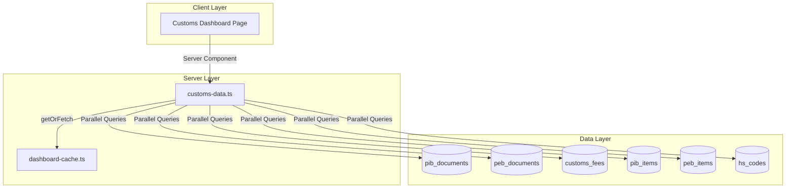

# Design Document: Customs Dashboard

## Overview

The Customs Dashboard provides customs personnel with a centralized view of import/export document status, duty tracking, deadline warnings, and HS code usage statistics. This feature follows the established dashboard patterns in GAMA ERP, using server-side data fetching with 5-minute caching for optimal performance.

The dashboard will be implemented at `app/(main)/dashboard/customs/page.tsx` with data fetching logic in `lib/dashboard/customs-data.ts`, following the same architecture as the HSE Dashboard.

## Architecture



## Components and Interfaces

### Data Service Interface

```typescript
// lib/dashboard/customs-data.ts

export interface DocumentsByStatus {
  draft: number
  submitted: number
  processing: number
  cleared: number
  rejected: number
}

export interface RecentDocument {
  id: string
  documentRef: string
  documentType: 'PIB' | 'PEB'
  status: string
  createdAt: string
  importerExporter: string
}

export interface DueSoonDocument {
  id: string
  documentRef: string
  documentType: 'PIB' | 'PEB'
  etaEtd: string
  daysUntilDue: number
  status: string
}

export interface FrequentHSCode {
  hsCode: string
  description: string
  usageCount: number
}

export interface CustomsDashboardMetrics {
  // Document Overview
  pibPending: number
  pibCompleted: number
  pebPending: number
  pebCompleted: number
  documentsThisMonth: number
  
  // Status Breakdown
  documentsByStatus: DocumentsByStatus
  
  // Duty Tracking
  dutiesPaidThisMonth: number
  unpaidFeesCount: number
  unpaidFeesAmount: number
  
  // Deadlines
  dueSoonCount: number
  overdueCount: number
  dueSoonDocuments: DueSoonDocument[]
  
  // Recent Activity
  recentDocuments: RecentDocument[]
  
  // HS Code Usage
  frequentHSCodes: FrequentHSCode[]
}
```

### Dashboard Page Component

```typescript
// app/(main)/dashboard/customs/page.tsx

// Sections:
// 1. Header with title and description
// 2. Quick Actions (New PIB, New PEB, View All, Pending Fees)
// 3. Document Overview cards (PIB pending/completed, PEB pending/completed)
// 4. Documents This Month counter
// 5. Document Pipeline - status breakdown visualization
// 6. Duty Tracking cards (paid this month, unpaid count, unpaid amount)
// 7. Deadline Warnings cards (due soon, overdue)
// 8. Due Soon Documents list
// 9. Recent Documents list with type badges
// 10. Frequent HS Codes list
```

### Badge Components

```typescript
// Document type badge
function DocumentTypeBadge({ type }: { type: 'PIB' | 'PEB' }) {
  // PIB = blue, PEB = green
}

// Status badge for documents
function StatusBadge({ status }: { status: string }) {
  // draft = gray, submitted = blue, processing = yellow, cleared = green, rejected = red
}

// Alert indicator for counts
function AlertIndicator({ type, count }: { type: 'danger' | 'warning' | 'success'; count: number }) {
  // danger = red, warning = yellow, success = green
}
```

## Data Models

### Database Tables Used

1. **pib_documents**
   - Key columns: id, internal_ref, pib_number, status, eta_date, importer_name, created_at
   - Status values: draft, submitted, checking, approved, released, cancelled

2. **peb_documents**
   - Key columns: id, internal_ref, peb_number, status, etd_date, exporter_name, created_at
   - Status values: draft, submitted, approved, loaded, departed, cancelled

3. **customs_fees**
   - Key columns: id, document_type, pib_id, peb_id, amount, currency, payment_status, payment_date, created_at
   - Payment status: unpaid, paid, waived, cancelled

4. **pib_items**
   - Key columns: id, pib_id, hs_code, hs_description

5. **peb_items**
   - Key columns: id, peb_id, hs_code, hs_description

### Query Patterns

```sql
-- PIB pending count
SELECT COUNT(*) FROM pib_documents 
WHERE status IN ('draft', 'submitted', 'checking')

-- PIB completed count
SELECT COUNT(*) FROM pib_documents 
WHERE status IN ('approved', 'released')

-- PEB pending count
SELECT COUNT(*) FROM peb_documents 
WHERE status IN ('draft', 'submitted')

-- PEB completed count
SELECT COUNT(*) FROM peb_documents 
WHERE status IN ('approved', 'loaded', 'departed')

-- Documents this month (combined PIB + PEB)
SELECT COUNT(*) FROM pib_documents WHERE created_at >= start_of_month
UNION ALL
SELECT COUNT(*) FROM peb_documents WHERE created_at >= start_of_month

-- Documents by status (combined and mapped)
-- draft: pib.draft + peb.draft
-- submitted: pib.submitted + peb.submitted
-- processing: pib.checking
-- cleared: pib.approved + pib.released + peb.approved + peb.loaded + peb.departed
-- rejected: pib.cancelled + peb.cancelled

-- Duties paid this month
SELECT SUM(amount) FROM customs_fees 
WHERE payment_status = 'paid' 
AND payment_date >= start_of_month

-- Unpaid fees
SELECT COUNT(*), SUM(amount) FROM customs_fees 
WHERE payment_status = 'unpaid'

-- Due soon (ETA/ETD within 7 days)
SELECT COUNT(*) FROM pib_documents 
WHERE eta_date BETWEEN now() AND now() + interval '7 days'
AND status NOT IN ('released', 'cancelled')

-- Overdue documents
SELECT COUNT(*) FROM pib_documents 
WHERE eta_date < now() 
AND status NOT IN ('released', 'cancelled')

-- Recent documents (last 10)
SELECT * FROM (
  SELECT id, internal_ref, 'PIB' as type, status, created_at, importer_name 
  FROM pib_documents ORDER BY created_at DESC LIMIT 10
  UNION ALL
  SELECT id, internal_ref, 'PEB' as type, status, created_at, exporter_name 
  FROM peb_documents ORDER BY created_at DESC LIMIT 10
) combined ORDER BY created_at DESC LIMIT 10

-- Frequent HS codes (top 5)
SELECT hs_code, hs_description, COUNT(*) as usage_count
FROM (
  SELECT hs_code, hs_description FROM pib_items
  UNION ALL
  SELECT hs_code, hs_description FROM peb_items
) combined
GROUP BY hs_code, hs_description
ORDER BY usage_count DESC
LIMIT 5
```


## Correctness Properties

*A property is a characteristic or behavior that should hold true across all valid executions of a system—essentially, a formal statement about what the system should do. Properties serve as the bridge between human-readable specifications and machine-verifiable correctness guarantees.*

### Property 1: Status Filtering Correctness

*For any* collection of documents (PIB or PEB) with various status values, filtering by a set of statuses should return exactly the count of records whose status is in that set. Specifically:
- PIB pending: status IN ('draft', 'submitted', 'checking')
- PIB completed: status IN ('approved', 'released')
- PEB pending: status IN ('draft', 'submitted')
- PEB completed: status IN ('approved', 'loaded', 'departed')

**Validates: Requirements 1.1, 1.2, 1.3, 1.4**

### Property 2: Date Range Filtering Correctness

*For any* collection of records with date fields and any date range, the count returned should equal exactly the number of records with dates within that range. Specifically:
- Documents this month: created_at >= start of month
- Duties paid this month: payment_date >= start of month AND payment_status = 'paid'
- Due soon: eta_date between today and today + 7 days
- Overdue: eta_date < today AND status NOT IN terminal statuses

**Validates: Requirements 1.6, 3.1, 4.1, 4.2**

### Property 3: Sum Aggregation Correctness

*For any* collection of fee records with amounts, the sum of amounts for records matching a filter should equal the mathematical sum of those amounts. Specifically:
- Duties paid this month: SUM(amount) WHERE payment_status = 'paid' AND payment_date >= start of month
- Unpaid fees amount: SUM(amount) WHERE payment_status = 'unpaid'

**Validates: Requirements 3.1, 3.3**

### Property 4: Status Grouping Correctness

*For any* collection of documents with status values, grouping by mapped status categories should produce counts that sum to the total document count. The mapping is:
- draft: pib.draft + peb.draft
- submitted: pib.submitted + peb.submitted
- processing: pib.checking
- cleared: pib.approved + pib.released + peb.approved + peb.loaded + peb.departed
- rejected: pib.cancelled + peb.cancelled

**Validates: Requirements 2.1**

### Property 5: Ordering and Limiting Correctness

*For any* collection of records, ordering by a specified field and limiting to N items should return at most N items, and those items should be in the correct order. Specifically:
- Due soon documents: ordered by eta_date ascending, limit 5
- Recent documents: ordered by created_at descending, limit 10
- Frequent HS codes: ordered by usage_count descending, limit 5

**Validates: Requirements 4.5, 5.2, 6.1, 6.3**

### Property 6: Data Transformation Completeness

*For any* document record from the database, the transformed object should contain all required fields with appropriate null handling:
- RecentDocument: id, documentRef, documentType, status, createdAt, importerExporter
- FrequentHSCode: hsCode, description, usageCount
- DueSoonDocument: id, documentRef, documentType, etaEtd, daysUntilDue, status

**Validates: Requirements 5.1, 6.2**

### Property 7: Warning Threshold Logic

*For any* numeric count value, the warning indicator should be displayed if and only if the count is greater than zero. Specifically:
- Unpaid fees count > 0 → show WARNING indicator
- Overdue count > 0 → show DANGER indicator
- Due soon count > 0 → show WARNING indicator

**Validates: Requirements 3.5**

### Property 8: Cache Key Format

*For any* role string and date, the generated cache key should match the pattern 'customs-dashboard-metrics:{role}:{YYYY-MM-DD}'.

**Validates: Requirements 8.4**

### Property 9: Cache Round-Trip

*For any* valid metrics data, storing it in the cache and then retrieving it before TTL expiration should return equivalent data.

**Validates: Requirements 8.2, 8.3**

### Property 10: Role-Based Access Control

*For any* user role, access to the Customs Dashboard should be granted if and only if the role is in the allowed set ['customs', 'owner', 'director', 'finance_manager']. Users with roles not in this set should be redirected to the default dashboard.

**Validates: Requirements 9.1, 9.2, 9.3**

## Error Handling

### Database Query Errors

1. **Connection Failures**: If Supabase connection fails, the data service should return default empty metrics rather than throwing an error, allowing the dashboard to render with zero values.

2. **Query Timeouts**: Queries should have reasonable timeouts. If a query times out, return cached data if available, otherwise return empty metrics.

3. **Partial Failures**: If some queries succeed and others fail, return partial data with the successful metrics and zero values for failed queries.

### Authentication Errors

1. **Missing User**: If `getUser()` returns null, redirect to `/login`.

2. **Missing Profile**: If user profile cannot be fetched, redirect to `/login`.

3. **Invalid Role**: If user role is not in allowed list, redirect to `/dashboard`.

### Cache Errors

1. **Cache Miss**: Normal operation - fetch fresh data from database.

2. **Cache Corruption**: If cached data is malformed, treat as cache miss and fetch fresh data.

### Data Transformation Errors

1. **Null Values**: Handle null values gracefully in all transformations, using default values (empty strings, 0, null dates).

2. **Type Mismatches**: Use TypeScript strict typing to catch type errors at compile time.

3. **Missing Relations**: If related data (customer, job_order) is missing, use placeholder values.

## Testing Strategy

### Unit Tests

Unit tests will cover specific examples and edge cases:

1. **Data Transformation Tests**
   - Test row-to-model transformations with various null combinations
   - Test date formatting with null dates
   - Test document type badge mapping
   - Test status badge color mapping

2. **Edge Case Tests**
   - Empty data sets (no PIB, PEB, fees)
   - Single record scenarios
   - All records in same status
   - Boundary dates (exactly at 7-day threshold)
   - Zero amounts vs positive amounts

3. **Role Access Tests**
   - Test each allowed role (customs, owner, director, finance_manager)
   - Test unauthorized roles redirect

4. **Threshold Logic Tests**
   - Unpaid count = 0, 1, many
   - Overdue count = 0, 1, many
   - Due soon count = 0, 1, many

### Property-Based Tests

Property-based tests will use `fast-check` library with minimum 100 iterations per test.

1. **Status Filter Property Test**
   - Generate random collections of documents with random statuses
   - Verify filter counts match expected
   - Tag: **Feature: customs-dashboard, Property 1: Status filtering correctness**

2. **Date Range Filter Property Test**
   - Generate random records with random dates
   - Verify date range filtering is correct
   - Tag: **Feature: customs-dashboard, Property 2: Date range filtering correctness**

3. **Sum Aggregation Property Test**
   - Generate random fee records with random amounts
   - Verify sum calculations are correct
   - Tag: **Feature: customs-dashboard, Property 3: Sum aggregation correctness**

4. **Status Grouping Property Test**
   - Generate random documents with random statuses
   - Verify grouped counts sum to total
   - Tag: **Feature: customs-dashboard, Property 4: Status grouping correctness**

5. **Ordering and Limiting Property Test**
   - Generate random collections of varying sizes
   - Verify ordering and limit constraints
   - Tag: **Feature: customs-dashboard, Property 5: Ordering and limiting correctness**

6. **Data Transformation Property Test**
   - Generate random document records with various null combinations
   - Verify transformed objects contain all required fields
   - Tag: **Feature: customs-dashboard, Property 6: Data transformation completeness**

7. **Warning Threshold Property Test**
   - Generate random count values
   - Verify threshold logic returns correct indicator
   - Tag: **Feature: customs-dashboard, Property 7: Warning threshold logic**

8. **Cache Key Property Test**
   - Generate random role strings and dates
   - Verify key format matches pattern
   - Tag: **Feature: customs-dashboard, Property 8: Cache key format**

9. **Cache Round-Trip Property Test**
   - Generate random metrics objects
   - Verify store-then-retrieve returns equivalent data
   - Tag: **Feature: customs-dashboard, Property 9: Cache round-trip**

10. **Role Access Property Test**
    - Generate random role strings
    - Verify access control logic
    - Tag: **Feature: customs-dashboard, Property 10: Role-based access control**

### Test Configuration

```typescript
// vitest.config.ts additions
{
  test: {
    // Property tests need more time due to 100+ iterations
    testTimeout: 30000,
  }
}
```

### Test File Structure

```
__tests__/
├── customs-dashboard-data.unit.test.ts    # Unit tests for data layer
└── customs-dashboard-data.property.test.ts # Property-based tests
```
