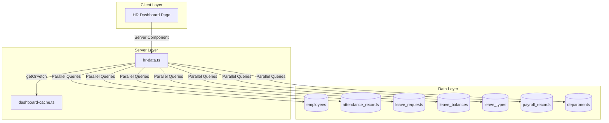

# Design Document: HR Dashboard Enhancement

## Overview

The HR Dashboard Enhancement provides HR personnel with a comprehensive view of payroll metrics, leave balance tracking, attendance analytics, employee lifecycle events, and recent activity. This feature follows the established dashboard patterns in GAMA ERP, using server-side data fetching with 5-minute caching for optimal performance.

The dashboard will be enhanced at `app/(main)/dashboard/hr/page.tsx` with a new data fetching service in `lib/dashboard/hr-data.ts`, following the same architecture as the HSE Dashboard and Customs Dashboard.

## Architecture



## Components and Interfaces

### Data Service Interface

```typescript
// lib/dashboard/hr-data.ts

export interface PayrollByDepartment {
  departmentId: string
  departmentName: string
  totalPayroll: number
  employeeCount: number
}

export interface LeaveBalanceSummary {
  leaveTypeId: string
  leaveTypeName: string
  totalEntitled: number
  totalUsed: number
  totalAvailable: number
}

export interface AttendanceByDepartment {
  departmentId: string
  departmentName: string
  presentCount: number
  absentCount: number
  lateCount: number
}

export interface RecentLeaveRequest {
  id: string
  employeeName: string
  leaveTypeName: string
  status: string
  startDate: string
  endDate: string
  totalDays: number
  createdAt: string
}

export interface RecentAttendanceCorrection {
  id: string
  employeeName: string
  attendanceDate: string
  correctionReason: string
  updatedAt: string
}

export interface HrDashboardMetrics {
  // Payroll Overview
  totalPayrollThisMonth: number
  payrollByDepartment: PayrollByDepartment[]
  overtimeHoursThisMonth: number
  pendingPayrollAdjustments: number
  
  // Leave Balance Tracking
  leaveDaysUsedThisMonth: number
  leaveBalanceSummary: LeaveBalanceSummary[]
  employeesWithLowLeaveBalance: number
  leaveUtilizationRate: number
  
  // Attendance Analytics
  lateArrivalsThisMonth: number
  earlyDeparturesThisMonth: number
  averageWorkHoursPerDay: number
  attendanceByDepartment: AttendanceByDepartment[]
  
  // Employee Lifecycle
  probationEndingSoon: number
  contractRenewalsDue: number
  workAnniversariesThisMonth: number
  resignationsThisMonth: number
  
  // Recent Activity
  recentLeaveRequests: RecentLeaveRequest[]
  recentAttendanceCorrections: RecentAttendanceCorrection[]
  
  // Existing metrics (preserved)
  activeEmployees: number
  inactiveEmployees: number
  attendanceRate: number
  presentToday: number
  absentToday: number
  pendingLeaveRequests: number
  approvedLeavesToday: number
  newHiresThisMonth: number
  upcomingBirthdays: number
  expiringCertifications: number
}
```

### Dashboard Page Component

```typescript
// app/(main)/dashboard/hr/page.tsx

// Sections:
// 1. Header with title "HR Dashboard", Users icon, and subtitle
// 2. Quick Actions (Add Employee, Process Payroll, Approve Leave, View Attendance, Generate Reports)
// 3. Primary Metrics row (Employee Count, Attendance Today, Leave Requests, Payroll This Month)
// 4. Payroll Overview section (Total Payroll, Overtime Hours, Pending Adjustments, Department Breakdown)
// 5. Leave Balance section (Days Used, Low Balance Count, Utilization Rate, Balance by Type)
// 6. Attendance Analytics section (Late Arrivals, Early Departures, Avg Work Hours, By Department)
// 7. Employee Lifecycle section (Probation Ending, Contract Renewals, Anniversaries, Resignations)
// 8. Recent Activity section (Leave Requests list, Attendance Corrections list)
```

### Badge Components

```typescript
// Status badge for leave requests
function LeaveStatusBadge({ status }: { status: string }) {
  // pending = yellow, approved = green, rejected = red, cancelled = gray
}

// Alert indicator for counts
function AlertIndicator({ type, count }: { type: 'danger' | 'warning' | 'success'; count: number }) {
  // danger = red, warning = yellow, success = green
}
```

## Data Models

### Database Tables Used

1. **employees**
   - Key columns: id, employee_code, full_name, department_id, status, employment_type, join_date, end_date, date_of_birth, base_salary, updated_at

2. **attendance_records**
   - Key columns: id, employee_id, attendance_date, clock_in, clock_out, status, late_minutes, early_leave_minutes, work_hours, overtime_hours, is_corrected, correction_reason, updated_at

3. **leave_requests**
   - Key columns: id, employee_id, leave_type_id, start_date, end_date, total_days, status, created_at

4. **leave_balances**
   - Key columns: id, employee_id, leave_type_id, year, entitled_days, used_days, pending_days, carried_over_days, available_days

5. **leave_types**
   - Key columns: id, type_code, type_name, default_days_per_year

6. **payroll_records**
   - Key columns: id, period_id, employee_id, gross_salary, total_deductions, net_salary, status, created_at

7. **departments**
   - Key columns: id, department_code, department_name

### Query Patterns

```sql
-- Total payroll this month
SELECT SUM(gross_salary) FROM payroll_records pr
JOIN payroll_periods pp ON pr.period_id = pp.id
WHERE pp.year = EXTRACT(YEAR FROM NOW()) 
AND pp.month = EXTRACT(MONTH FROM NOW())

-- Payroll by department
SELECT d.id, d.department_name, SUM(pr.gross_salary), COUNT(DISTINCT pr.employee_id)
FROM payroll_records pr
JOIN employees e ON pr.employee_id = e.id
JOIN departments d ON e.department_id = d.id
JOIN payroll_periods pp ON pr.period_id = pp.id
WHERE pp.year = EXTRACT(YEAR FROM NOW()) AND pp.month = EXTRACT(MONTH FROM NOW())
GROUP BY d.id, d.department_name

-- Overtime hours this month
SELECT SUM(overtime_hours) FROM attendance_records
WHERE attendance_date >= start_of_month AND attendance_date <= end_of_month

-- Pending payroll adjustments
SELECT COUNT(*) FROM payroll_records WHERE status IN ('draft', 'pending')

-- Leave days used this month
SELECT SUM(total_days) FROM leave_requests
WHERE status = 'approved' 
AND start_date >= start_of_month

-- Leave balance summary by type
SELECT lt.id, lt.type_name, SUM(lb.entitled_days), SUM(lb.used_days), SUM(lb.available_days)
FROM leave_balances lb
JOIN leave_types lt ON lb.leave_type_id = lt.id
WHERE lb.year = EXTRACT(YEAR FROM NOW())
GROUP BY lt.id, lt.type_name

-- Employees with low leave balance (< 5 days)
SELECT COUNT(DISTINCT employee_id) FROM leave_balances
WHERE year = EXTRACT(YEAR FROM NOW()) AND available_days < 5

-- Leave utilization rate
SELECT (SUM(used_days) / NULLIF(SUM(entitled_days), 0)) * 100 FROM leave_balances
WHERE year = EXTRACT(YEAR FROM NOW())

-- Late arrivals this month
SELECT COUNT(*) FROM attendance_records
WHERE attendance_date >= start_of_month AND late_minutes > 0

-- Early departures this month
SELECT COUNT(*) FROM attendance_records
WHERE attendance_date >= start_of_month AND early_leave_minutes > 0

-- Average work hours per day
SELECT AVG(work_hours) FROM attendance_records
WHERE attendance_date >= start_of_month AND work_hours > 0

-- Attendance by department
SELECT d.id, d.department_name, 
  COUNT(*) FILTER (WHERE ar.status = 'present'),
  COUNT(*) FILTER (WHERE ar.status = 'absent'),
  COUNT(*) FILTER (WHERE ar.late_minutes > 0)
FROM attendance_records ar
JOIN employees e ON ar.employee_id = e.id
JOIN departments d ON e.department_id = d.id
WHERE ar.attendance_date >= start_of_month
GROUP BY d.id, d.department_name

-- Probation ending within 30 days
SELECT COUNT(*) FROM employees
WHERE employment_type = 'probation' 
AND status = 'active'
AND end_date BETWEEN NOW() AND NOW() + INTERVAL '30 days'

-- Contract renewals due within 30 days
SELECT COUNT(*) FROM employees
WHERE employment_type = 'contract' 
AND status = 'active'
AND end_date BETWEEN NOW() AND NOW() + INTERVAL '30 days'

-- Work anniversaries this month
SELECT COUNT(*) FROM employees
WHERE status = 'active'
AND EXTRACT(MONTH FROM join_date) = EXTRACT(MONTH FROM NOW())
AND EXTRACT(DAY FROM join_date) <= EXTRACT(DAY FROM NOW()) + 30

-- Resignations/terminations this month
SELECT COUNT(*) FROM employees
WHERE status IN ('resigned', 'terminated')
AND updated_at >= start_of_month

-- Recent leave requests (5 most recent)
SELECT lr.*, e.full_name, lt.type_name
FROM leave_requests lr
JOIN employees e ON lr.employee_id = e.id
JOIN leave_types lt ON lr.leave_type_id = lt.id
ORDER BY lr.created_at DESC LIMIT 5

-- Recent attendance corrections (5 most recent)
SELECT ar.*, e.full_name
FROM attendance_records ar
JOIN employees e ON ar.employee_id = e.id
WHERE ar.is_corrected = true
ORDER BY ar.updated_at DESC LIMIT 5
```

## Correctness Properties

*A property is a characteristic or behavior that should hold true across all valid executions of a system—essentially, a formal statement about what the system should do. Properties serve as the bridge between human-readable specifications and machine-verifiable correctness guarantees.*

### Property 1: Sum Aggregation with Date Filtering

*For any* collection of records with numeric values and dates, the sum aggregation for a date range should equal the mathematical sum of values for records within that range. This applies to:
- Total payroll (sum of gross_salary for current month)
- Overtime hours (sum of overtime_hours for current month)
- Leave days used (sum of total_days for approved requests in current month)

**Validates: Requirements 1.1, 1.3, 2.1**

### Property 2: Status Filtering Correctness

*For any* collection of records with status values, filtering by a set of statuses should return exactly the count of records whose status matches the criteria. This applies to:
- Pending payroll adjustments: status IN ('draft', 'pending')
- Late arrivals: late_minutes > 0
- Early departures: early_leave_minutes > 0
- Resignations: status IN ('resigned', 'terminated')

**Validates: Requirements 1.4, 3.1, 3.2, 4.4**

### Property 3: Grouping Aggregation Correctness

*For any* collection of records with grouping keys, the grouped aggregations should sum to the total, and each group should contain exactly the records with that key. This applies to:
- Payroll by department
- Leave balance by type
- Attendance by department

**Validates: Requirements 1.2, 2.2, 3.4**

### Property 4: Threshold Date Filtering Correctness

*For any* collection of records with dates and thresholds, filtering by date range should return exactly the records within that range. This applies to:
- Employees with low leave balance (available_days < 5)
- Probation ending within 30 days
- Contract renewals due within 30 days

**Validates: Requirements 2.3, 4.1, 4.2**

### Property 5: Percentage and Average Calculations

*For any* set of numeric values, percentage and average calculations should follow the correct formulas:
- Leave utilization rate = (used_days / entitled_days) * 100, handling division by zero
- Average work hours = sum(work_hours) / count(records), handling empty sets

**Validates: Requirements 2.4, 3.3**

### Property 6: Threshold Alert Logic

*For any* numeric count value and threshold, the alert indicator should be displayed correctly:
- Low leave balance count > 0 → WARNING indicator
- Late arrivals > 10 → WARNING indicator
- Probation ending count > 0 → WARNING indicator
- Contract renewals count > 0 → WARNING indicator

**Validates: Requirements 2.5, 3.5, 4.5, 4.6**

### Property 7: Ordering and Limiting Correctness

*For any* collection of records, ordering by a specified field and limiting to N items should return at most N items in the correct order:
- Recent leave requests: ordered by created_at descending, limit 5
- Recent attendance corrections: ordered by updated_at descending, limit 5

**Validates: Requirements 5.2, 5.5**

### Property 8: Data Transformation Completeness

*For any* record from the database, the transformed object should contain all required fields with appropriate null handling:
- RecentLeaveRequest: id, employeeName, leaveTypeName, status, startDate, endDate, totalDays, createdAt
- RecentAttendanceCorrection: id, employeeName, attendanceDate, correctionReason, updatedAt

**Validates: Requirements 5.1, 5.4**

### Property 9: Status Color Mapping

*For any* leave request status value, the color mapping should be deterministic and correct:
- 'pending' → yellow
- 'approved' → green
- 'rejected' → red
- 'cancelled' → gray

**Validates: Requirements 5.3**

### Property 10: Cache Key Format

*For any* role string and date, the generated cache key should match the pattern 'hr-dashboard-metrics:{role}:{YYYY-MM-DD}'.

**Validates: Requirements 7.4**

### Property 11: Cache Round-Trip

*For any* valid metrics data, storing it in the cache and then retrieving it before TTL expiration should return equivalent data.

**Validates: Requirements 7.2, 7.3**

### Property 12: Role-Based Access Control

*For any* user role, access to the HR Dashboard should be granted if and only if the role is in the allowed set ['hr', 'owner', 'director']. Users with roles not in this set should be redirected to the default dashboard.

**Validates: Requirements 8.1, 8.2, 8.3**

## Error Handling

### Database Query Errors

1. **Connection Failures**: If Supabase connection fails, the data service should return default empty metrics rather than throwing an error, allowing the dashboard to render with zero values.

2. **Query Timeouts**: Queries should have reasonable timeouts. If a query times out, return cached data if available, otherwise return empty metrics.

3. **Partial Failures**: If some queries succeed and others fail, return partial data with the successful metrics and zero values for failed queries.

4. **Missing Relations**: If related data (department, leave_type) is missing, use placeholder values ("Unknown Department", "Unknown Leave Type").

### Authentication Errors

1. **Missing User**: If `getUser()` returns null, redirect to `/login`.

2. **Missing Profile**: If user profile cannot be fetched, redirect to `/login`.

3. **Invalid Role**: If user role is not in allowed list, redirect to `/dashboard`.

### Cache Errors

1. **Cache Miss**: Normal operation - fetch fresh data from database.

2. **Cache Corruption**: If cached data is malformed, treat as cache miss and fetch fresh data.

### Data Transformation Errors

1. **Null Values**: Handle null values gracefully in all transformations, using default values (empty strings, 0, null dates).

2. **Type Mismatches**: Use TypeScript strict typing to catch type errors at compile time.

3. **Division by Zero**: Handle division by zero in percentage calculations by returning 0 or 100 as appropriate.

## Testing Strategy

### Unit Tests

Unit tests will cover specific examples and edge cases:

1. **Data Transformation Tests**
   - Test row-to-model transformations with various null combinations
   - Test date formatting with null dates
   - Test status badge color mapping
   - Test currency formatting

2. **Edge Case Tests**
   - Empty data sets (no employees, payroll, attendance, leave)
   - Single record scenarios
   - All records in same status
   - Boundary dates (exactly at 30-day threshold)
   - Zero amounts vs positive amounts
   - Division by zero scenarios

3. **Role Access Tests**
   - Test each allowed role (hr, owner, director)
   - Test unauthorized roles redirect

4. **Threshold Logic Tests**
   - Low leave balance = 0, 4, 5, 6
   - Late arrivals = 0, 10, 11
   - Probation/contract count = 0, 1, many

### Property-Based Tests

Property-based tests will use `fast-check` library with minimum 100 iterations per test.

1. **Sum Aggregation Property Test**
   - Generate random records with random amounts and dates
   - Verify sum calculations are correct
   - Tag: **Feature: hr-dashboard, Property 1: Sum aggregation with date filtering**

2. **Status Filter Property Test**
   - Generate random records with random statuses
   - Verify filter counts match expected
   - Tag: **Feature: hr-dashboard, Property 2: Status filtering correctness**

3. **Grouping Aggregation Property Test**
   - Generate random records with random group keys
   - Verify grouped sums equal total
   - Tag: **Feature: hr-dashboard, Property 3: Grouping aggregation correctness**

4. **Threshold Date Filter Property Test**
   - Generate random records with random dates
   - Verify threshold filtering is correct
   - Tag: **Feature: hr-dashboard, Property 4: Threshold date filtering correctness**

5. **Percentage Calculation Property Test**
   - Generate random numerator/denominator pairs
   - Verify percentage formula and division by zero handling
   - Tag: **Feature: hr-dashboard, Property 5: Percentage and average calculations**

6. **Threshold Alert Property Test**
   - Generate random count values
   - Verify threshold logic returns correct indicator
   - Tag: **Feature: hr-dashboard, Property 6: Threshold alert logic**

7. **Ordering and Limiting Property Test**
   - Generate random collections of varying sizes
   - Verify ordering and limit constraints
   - Tag: **Feature: hr-dashboard, Property 7: Ordering and limiting correctness**

8. **Data Transformation Property Test**
   - Generate random records with various null combinations
   - Verify transformed objects contain all required fields
   - Tag: **Feature: hr-dashboard, Property 8: Data transformation completeness**

9. **Status Color Property Test**
   - Generate random status values from valid set
   - Verify color mapping is correct
   - Tag: **Feature: hr-dashboard, Property 9: Status color mapping**

10. **Cache Key Property Test**
    - Generate random role strings and dates
    - Verify key format matches pattern
    - Tag: **Feature: hr-dashboard, Property 10: Cache key format**

11. **Cache Round-Trip Property Test**
    - Generate random metrics objects
    - Verify store-then-retrieve returns equivalent data
    - Tag: **Feature: hr-dashboard, Property 11: Cache round-trip**

12. **Role Access Property Test**
    - Generate random role strings
    - Verify access control logic
    - Tag: **Feature: hr-dashboard, Property 12: Role-based access control**

### Test Configuration

```typescript
// vitest.config.ts additions
{
  test: {
    // Property tests need more time due to 100+ iterations
    testTimeout: 30000,
  }
}
```

### Test File Structure

```
__tests__/
├── hr-dashboard-data.unit.test.ts      # Unit tests for data layer
└── hr-dashboard-data.property.test.ts  # Property-based tests
```
