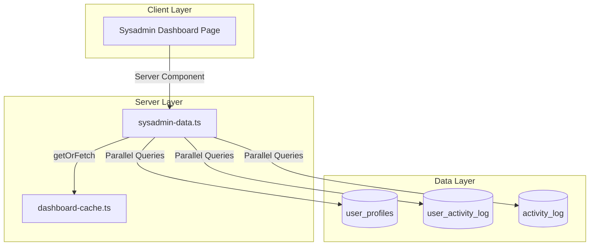

# Design Document: System Admin Dashboard

## Overview

The System Admin Dashboard provides system administrators with a centralized view of system health, user management, and activity monitoring. Unlike business-focused dashboards, this dashboard focuses on IT/system management metrics including user statistics, system activity, and administrative quick actions.

The dashboard will be created at `app/(main)/dashboard/sysadmin/page.tsx` with a new data fetching service in `lib/dashboard/sysadmin-data.ts`, following the same architecture as other role-specific dashboards (HR, HSE, Customs, Engineering).

## Architecture



## Components and Interfaces

### Data Service Interface

```typescript
// lib/dashboard/sysadmin-data.ts

export interface RoleDistribution {
  role: string
  count: number
}

export interface RecentActivity {
  id: string
  userEmail: string | null
  actionType: string
  pagePath: string | null
  resourceType: string | null
  createdAt: string
}

export interface RecentDocumentChange {
  id: string
  userName: string
  actionType: string
  documentType: string
  documentNumber: string
  createdAt: string
}

export interface SysadminDashboardMetrics {
  // User Statistics
  totalUsers: number
  activeUsers: number
  activeToday: number
  activeThisWeek: number
  newUsersThisMonth: number
  
  // Role Distribution
  roleDistribution: RoleDistribution[]
  
  // System Activity
  loginsToday: number
  pageViewsToday: number
  totalActionsToday: number
  actionsPerHour: number
  
  // Recent Activity
  recentActivities: RecentActivity[]
  recentDocumentChanges: RecentDocumentChange[]
}
```

### Dashboard Page Component

```typescript
// app/(main)/dashboard/sysadmin/page.tsx

// Sections:
// 1. Header with title "System Admin Dashboard", Settings icon, and subtitle
// 2. Quick Actions (User Management, View Activity Logs, System Settings)
// 3. User Statistics row (Total Users, Active Users, Active Today, Active This Week, New This Month)
// 4. System Activity row (Logins Today, Page Views Today, Total Actions, Actions/Hour)
// 5. Role Distribution section (list of roles with counts)
// 6. Recent Activity section (last 20 user activities)
// 7. Recent Document Changes section (last 10 document changes)
```

### Badge Components

```typescript
// Action type badge colors
function ActionTypeBadge({ actionType }: { actionType: string }) {
  // login = green
  // page_view = blue
  // create = purple
  // update = yellow
  // delete = red
  // approve/reject = orange
  // default = gray
}
```

## Data Models

### Database Tables Used

1. **user_profiles**
   - Key columns: id, user_id, email, full_name, role, is_active, last_login_at, created_at, updated_at

2. **user_activity_log**
   - Key columns: id, user_id, user_email, action_type, resource_type, resource_id, page_path, metadata, created_at

3. **activity_log**
   - Key columns: id, document_type, document_id, document_number, action_type, user_id, user_name, details, created_at

### Query Patterns

```sql
-- Total users
SELECT COUNT(*) FROM user_profiles

-- Active users
SELECT COUNT(*) FROM user_profiles WHERE is_active = true

-- Active today (logged in today)
SELECT COUNT(*) FROM user_profiles 
WHERE last_login_at >= CURRENT_DATE

-- Active this week (logged in within 7 days)
SELECT COUNT(*) FROM user_profiles 
WHERE last_login_at >= CURRENT_DATE - INTERVAL '7 days'

-- New users this month
SELECT COUNT(*) FROM user_profiles 
WHERE created_at >= DATE_TRUNC('month', CURRENT_DATE)

-- Role distribution (active users only)
SELECT role, COUNT(*) as count 
FROM user_profiles 
WHERE is_active = true 
GROUP BY role 
ORDER BY count DESC

-- Logins today
SELECT COUNT(*) FROM user_activity_log 
WHERE action_type = 'login' 
AND created_at >= CURRENT_DATE

-- Page views today
SELECT COUNT(*) FROM user_activity_log 
WHERE action_type = 'page_view' 
AND created_at >= CURRENT_DATE

-- Total actions today
SELECT COUNT(*) FROM user_activity_log 
WHERE created_at >= CURRENT_DATE

-- Recent activities (last 20)
SELECT id, user_email, action_type, page_path, resource_type, created_at
FROM user_activity_log
ORDER BY created_at DESC
LIMIT 20

-- Recent document changes (last 10)
SELECT id, user_name, action_type, document_type, document_number, created_at
FROM activity_log
ORDER BY created_at DESC
LIMIT 10
```

## Correctness Properties

*A property is a characteristic or behavior that should hold true across all valid executions of a system—essentially, a formal statement about what the system should do. Properties serve as the bridge between human-readable specifications and machine-verifiable correctness guarantees.*

### Property 1: Count Filtering Correctness

*For any* collection of records with filterable attributes (is_active, last_login_at, created_at, action_type), the filtered count should equal the mathematical count of records matching the filter criteria. This applies to:
- Total users count
- Active users count (is_active = true)
- Active today count (last_login_at >= today)
- Active this week count (last_login_at >= 7 days ago)
- New users this month count (created_at >= start of month)
- Logins today count (action_type = 'login' AND created_at >= today)
- Page views today count (action_type = 'page_view' AND created_at >= today)
- Total actions today count (created_at >= today)

**Validates: Requirements 1.1, 1.2, 1.3, 1.4, 1.5, 2.4, 3.1, 3.2, 3.3**

### Property 2: Grouping Aggregation Correctness

*For any* collection of user profiles with role values, the grouped counts by role should:
- Sum to the total count of active users
- Each group should contain exactly the records with that role
- Groups should be sorted by count in descending order

**Validates: Requirements 2.1, 2.3, 2.4**

### Property 3: Actions Per Hour Calculation

*For any* total action count and hours elapsed value, the actions per hour calculation should equal (total actions / hours elapsed), with proper handling for:
- Division by zero (return 0 when hours elapsed is 0)
- Rounding to one decimal place

**Validates: Requirements 3.4**

### Property 4: Ordering and Limiting Correctness

*For any* collection of records, ordering by created_at descending and limiting to N items should:
- Return at most N items
- Return items in descending order by created_at
- Return the N most recent items

This applies to:
- Recent activities (limit 20)
- Recent document changes (limit 10)

**Validates: Requirements 4.1, 4.3, 5.1, 5.3**

### Property 5: Data Transformation Completeness

*For any* record from the database, the transformed object should contain all required fields with appropriate null handling:
- RecentActivity: id, userEmail, actionType, pagePath, resourceType, createdAt
- RecentDocumentChange: id, userName, actionType, documentType, documentNumber, createdAt

**Validates: Requirements 4.2, 5.2**

### Property 6: Action Type Color Mapping

*For any* action type value, the color mapping should be deterministic and correct:
- 'login' → green
- 'page_view' → blue
- 'create' → purple
- 'update' → yellow
- 'delete' → red
- 'approve', 'reject' → orange
- default → gray

**Validates: Requirements 4.5**

### Property 7: Cache Key Format

*For any* role string and date, the generated cache key should match the pattern 'sysadmin-dashboard-metrics:{role}:{YYYY-MM-DD}'.

**Validates: Requirements 7.4**

### Property 8: Cache Round-Trip

*For any* valid metrics data, storing it in the cache and then retrieving it before TTL expiration should return equivalent data.

**Validates: Requirements 7.2, 7.3**

### Property 9: Role-Based Access Control

*For any* user role, access to the Sysadmin Dashboard should be granted if and only if the role is in the allowed set ['sysadmin', 'owner', 'director']. Users with roles not in this set should be redirected to the default dashboard.

**Validates: Requirements 8.1, 8.2, 8.3, 8.4**

## Error Handling

### Database Query Errors

1. **Connection Failures**: If Supabase connection fails, the data service should return default empty metrics rather than throwing an error, allowing the dashboard to render with zero values.

2. **Query Timeouts**: Queries should have reasonable timeouts. If a query times out, return cached data if available, otherwise return empty metrics.

3. **Partial Failures**: If some queries succeed and others fail, return partial data with the successful metrics and zero values for failed queries.

4. **Missing Data**: If user_activity_log or activity_log tables have no data, return empty arrays for recent activities.

### Authentication Errors

1. **Missing User**: If `getUser()` returns null, redirect to `/login`.

2. **Missing Profile**: If user profile cannot be fetched, redirect to `/login`.

3. **Invalid Role**: If user role is not in allowed list ['sysadmin', 'owner', 'director'], redirect to `/dashboard`.

### Cache Errors

1. **Cache Miss**: Normal operation - fetch fresh data from database.

2. **Cache Corruption**: If cached data is malformed, treat as cache miss and fetch fresh data.

### Data Transformation Errors

1. **Null Values**: Handle null values gracefully in all transformations, using default values (empty strings, 0, null dates).

2. **Type Mismatches**: Use TypeScript strict typing to catch type errors at compile time.

3. **Division by Zero**: Handle division by zero in actions per hour calculation by returning 0.

## Testing Strategy

### Unit Tests

Unit tests will cover specific examples and edge cases:

1. **Data Transformation Tests**
   - Test row-to-model transformations with various null combinations
   - Test date formatting with null dates
   - Test action type badge color mapping

2. **Edge Case Tests**
   - Empty data sets (no users, no activities)
   - Single record scenarios
   - All users inactive
   - No logins today
   - Division by zero for actions per hour (0 hours elapsed)

3. **Role Access Tests**
   - Test each allowed role (sysadmin, owner, director)
   - Test unauthorized roles redirect

4. **Calculation Tests**
   - Actions per hour with various inputs
   - Role distribution sorting

### Property-Based Tests

Property-based tests will use `fast-check` library with minimum 100 iterations per test.

1. **Count Filtering Property Test**
   - Generate random user profiles with random attributes
   - Verify filtered counts match expected
   - Tag: **Feature: sysadmin-dashboard, Property 1: Count filtering correctness**

2. **Grouping Aggregation Property Test**
   - Generate random user profiles with random roles
   - Verify grouped sums equal total and sorting is correct
   - Tag: **Feature: sysadmin-dashboard, Property 2: Grouping aggregation correctness**

3. **Actions Per Hour Property Test**
   - Generate random action counts and hours elapsed
   - Verify calculation formula and division by zero handling
   - Tag: **Feature: sysadmin-dashboard, Property 3: Actions per hour calculation**

4. **Ordering and Limiting Property Test**
   - Generate random collections of varying sizes
   - Verify ordering and limit constraints
   - Tag: **Feature: sysadmin-dashboard, Property 4: Ordering and limiting correctness**

5. **Data Transformation Property Test**
   - Generate random records with various null combinations
   - Verify transformed objects contain all required fields
   - Tag: **Feature: sysadmin-dashboard, Property 5: Data transformation completeness**

6. **Action Type Color Property Test**
   - Generate random action type values from valid set
   - Verify color mapping is correct
   - Tag: **Feature: sysadmin-dashboard, Property 6: Action type color mapping**

7. **Cache Key Property Test**
   - Generate random role strings and dates
   - Verify key format matches pattern
   - Tag: **Feature: sysadmin-dashboard, Property 7: Cache key format**

8. **Cache Round-Trip Property Test**
   - Generate random metrics objects
   - Verify store-then-retrieve returns equivalent data
   - Tag: **Feature: sysadmin-dashboard, Property 8: Cache round-trip**

9. **Role Access Property Test**
   - Generate random role strings
   - Verify access control logic
   - Tag: **Feature: sysadmin-dashboard, Property 9: Role-based access control**

### Test Configuration

```typescript
// vitest.config.ts additions
{
  test: {
    // Property tests need more time due to 100+ iterations
    testTimeout: 30000,
  }
}
```

### Test File Structure

```
__tests__/
├── sysadmin-dashboard-data.unit.test.ts      # Unit tests for data layer
└── sysadmin-dashboard-data.property.test.ts  # Property-based tests
```
