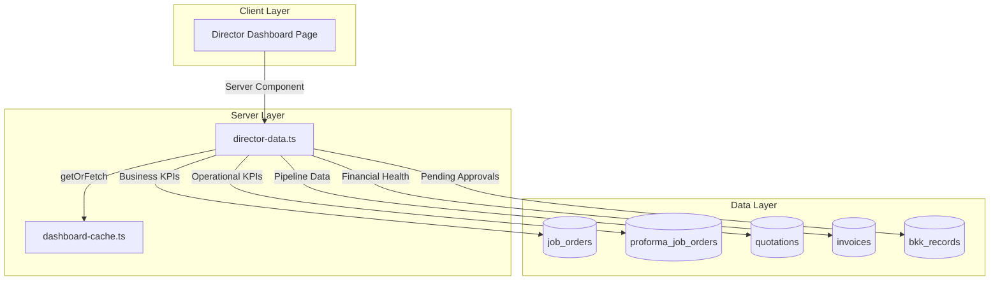

# Design Document: Director Dashboard

## Overview

The Director Dashboard provides business-focused metrics and operational oversight for users with the director role. Unlike the Owner dashboard which focuses on system administration and user management, the Director dashboard emphasizes business performance, operational KPIs, pipeline visibility, and financial health indicators - designed for executives who need business insights without technical complexity.

The dashboard will be implemented at `app/(main)/dashboard/director/page.tsx` with a new data service at `lib/dashboard/director-data.ts`, following established patterns from other dashboard implementations.

## Architecture



## Components and Interfaces

### Data Service Interface

```typescript
// lib/dashboard/director-data.ts

export interface RecentCompletedJob {
  id: string
  joNumber: string
  customerName: string
  finalRevenue: number
  completedAt: string
}

export interface RecentWonQuotation {
  id: string
  quotationNumber: string
  customerName: string
  totalRevenue: number
  outcomeDate: string
}

export interface PipelineSummary {
  quotationsDraft: number
  quotationsSubmitted: number
  quotationsWon: number
  quotationsLost: number
  pjosDraft: number
  pjosPendingApproval: number
  pjosApproved: number
  winRate: number
  wonValueThisMonth: number
}

export interface DirectorDashboardMetrics {
  // Business Performance (Requirement 1)
  totalRevenue: number
  totalProfit: number
  profitMargin: number
  revenueMTD: number
  revenueLastMonth: number
  revenueChangePercent: number
  
  // Operational KPIs (Requirement 2)
  activeJobs: number
  completedJobsThisMonth: number
  jobCompletionRate: number
  pendingPJOApprovals: number
  pendingBKKApprovals: number
  
  // Pipeline Overview (Requirement 3)
  pipeline: PipelineSummary
  
  // Financial Health (Requirement 4)
  arOutstanding: number
  arOverdue: number
  collectionRate: number
  
  // Recent Activity (Requirement 6)
  recentCompletedJobs: RecentCompletedJob[]
  recentWonQuotations: RecentWonQuotation[]
}
```

### Dashboard Page Component

```typescript
// app/(main)/dashboard/director/page.tsx

// Sections:
// 1. Header with "Director Dashboard" title, briefcase icon (indigo), subtitle
// 2. Quick Actions (View Reports, Pending Approvals, Active Jobs) - NO user management
// 3. Business Performance cards (Revenue, Profit, Margin, MoM Change)
// 4. Operational KPIs cards (Active Jobs, Completed This Month, Completion Rate)
// 5. Pending Approvals alert (PJO + BKK counts with warning if > 5)
// 6. Pipeline Overview (Quotations → PJOs flow with win rate)
// 7. Financial Health cards (AR Outstanding, AR Overdue, Collection Rate)
// 8. Recent Activity lists (Completed Jobs, Won Quotations)
```

### Color Coding for Indicators

```typescript
// Profit Margin thresholds
const getMarginColor = (margin: number) => {
  if (margin >= 25) return 'text-green-600'
  if (margin >= 15) return 'text-yellow-600'
  return 'text-red-600'
}

// Collection Rate thresholds
const getCollectionColor = (rate: number) => {
  if (rate >= 85) return 'text-green-600'
  if (rate >= 70) return 'text-yellow-600'
  return 'text-red-600'
}

// Pending Approvals warning
const showApprovalWarning = (count: number) => count > 5
```

## Data Models

### Database Tables Used

1. **job_orders**
   - Key columns: id, jo_number, status, final_revenue, final_cost, completed_at, customer_id
   - Used for: Revenue, profit, active jobs, completed jobs, recent completions

2. **proforma_job_orders**
   - Key columns: id, status, estimated_amount
   - Used for: PJO pipeline, pending approvals

3. **quotations**
   - Key columns: id, quotation_number, status, total_revenue, outcome_date, customer_id
   - Used for: Pipeline, win rate, recent won quotations

4. **invoices**
   - Key columns: id, status, total_amount, amount_paid, due_date
   - Used for: AR outstanding, AR overdue, collection rate

5. **bkk_records**
   - Key columns: id, workflow_status
   - Used for: Pending BKK approvals

6. **customers**
   - Key columns: id, name
   - Used for: Customer names in recent activity

### Query Patterns

```sql
-- Business Performance
SELECT SUM(final_revenue) as total_revenue, 
       SUM(final_cost) as total_cost
FROM job_orders 
WHERE final_revenue IS NOT NULL

-- Revenue MTD
SELECT SUM(final_revenue) FROM job_orders 
WHERE completed_at >= start_of_month

-- Revenue Last Month
SELECT SUM(final_revenue) FROM job_orders 
WHERE completed_at >= start_of_last_month 
AND completed_at < start_of_month

-- Operational KPIs
SELECT COUNT(*) FROM job_orders WHERE status = 'active'
SELECT COUNT(*) FROM job_orders 
WHERE status IN ('completed', 'submitted_to_finance', 'invoiced', 'closed')
AND completed_at >= start_of_month

-- Pending Approvals
SELECT COUNT(*) FROM proforma_job_orders 
WHERE status = 'pending_approval' AND is_active = true
SELECT COUNT(*) FROM bkk_records 
WHERE workflow_status IN ('pending_check', 'pending_approval') AND is_active = true

-- Pipeline
SELECT status, COUNT(*) FROM quotations GROUP BY status
SELECT SUM(total_revenue) FROM quotations 
WHERE status = 'won' AND outcome_date >= start_of_month

-- Financial Health
SELECT SUM(total_amount - amount_paid) FROM invoices 
WHERE status IN ('sent', 'overdue', 'partial')
SELECT SUM(total_amount - amount_paid) FROM invoices 
WHERE status = 'overdue' OR (due_date < now() AND status IN ('sent', 'partial'))

-- Collection Rate
SELECT SUM(amount_paid) / SUM(total_amount) * 100 FROM invoices 
WHERE status IN ('sent', 'paid', 'partial', 'overdue')

-- Recent Completed Jobs (last 5)
SELECT jo.id, jo.jo_number, jo.final_revenue, jo.completed_at, c.name
FROM job_orders jo
LEFT JOIN customers c ON jo.customer_id = c.id
WHERE jo.status IN ('completed', 'submitted_to_finance', 'invoiced', 'closed')
ORDER BY jo.completed_at DESC LIMIT 5

-- Recent Won Quotations (last 5)
SELECT q.id, q.quotation_number, q.total_revenue, q.outcome_date, c.name
FROM quotations q
LEFT JOIN customers c ON q.customer_id = c.id
WHERE q.status = 'won'
ORDER BY q.outcome_date DESC LIMIT 5
```

## Correctness Properties

*A property is a characteristic or behavior that should hold true across all valid executions of a system—essentially, a formal statement about what the system should do. Properties serve as the bridge between human-readable specifications and machine-verifiable correctness guarantees.*

### Property 1: Profit Calculation Correctness

*For any* collection of job orders with revenue and cost values, the total profit should equal total revenue minus total cost, and profit margin should equal (profit / revenue) * 100.

**Validates: Requirements 1.1, 1.2, 1.3**

### Property 2: Revenue Change Calculation

*For any* two revenue values (current month and previous month), the percentage change should equal ((current - previous) / previous) * 100, handling the case where previous is zero.

**Validates: Requirements 1.4, 1.6**

### Property 3: Job Completion Rate Calculation

*For any* count of completed jobs and total jobs this month, the completion rate should equal (completed / total) * 100, handling the case where total is zero.

**Validates: Requirements 2.3**

### Property 4: Win Rate Calculation

*For any* count of won and lost quotations, the win rate should equal (won / (won + lost)) * 100, handling the case where (won + lost) is zero.

**Validates: Requirements 3.5**

### Property 5: Collection Rate Calculation

*For any* total paid amount and total invoiced amount, the collection rate should equal (paid / invoiced) * 100, handling the case where invoiced is zero.

**Validates: Requirements 4.3**

### Property 6: Currency Formatting Correctness

*For any* numeric amount, formatting as Indonesian Rupiah should produce a string starting with "Rp" and containing properly formatted thousands separators.

**Validates: Requirements 1.5, 6.4**

### Property 7: Threshold Color Coding

*For any* profit margin value, the color should be green if >= 25%, yellow if 15-25%, red if < 15%. Similarly for collection rate: green if >= 85%, yellow if 70-85%, red if < 70%.

**Validates: Requirements 1.7, 4.5**

### Property 8: Role-Based Access Control

*For any* user role, access to the Director Dashboard should be granted if and only if the role is in the allowed set ['director', 'owner']. Users with roles not in this set should be redirected to the default dashboard.

**Validates: Requirements 8.1, 8.2, 8.3**

### Property 9: Recent Items Ordering and Limiting

*For any* collection of records, ordering by date descending and limiting to 5 items should return at most 5 items in correct order.

**Validates: Requirements 6.1, 6.2**

### Property 10: Cache Round-Trip

*For any* valid dashboard data, storing it in the cache and then retrieving it before TTL expiration should return equivalent data.

**Validates: Requirements 7.2, 7.3**

## Error Handling

### Database Query Errors

1. **Connection Failures**: If Supabase connection fails, the data service returns default empty metrics, allowing the dashboard to render with zero values.

2. **Query Timeouts**: Queries have reasonable timeouts. If a query times out, return cached data if available.

3. **Partial Failures**: If some queries succeed and others fail, return partial data with successful metrics and zero values for failed queries.

### Authentication Errors

1. **Missing User**: If `getUser()` returns null, redirect to `/login`.

2. **Missing Profile**: If user profile cannot be fetched, redirect to `/login`.

3. **Invalid Role**: If user role is not in allowed list ['director', 'owner'], redirect to `/dashboard`.

### Calculation Edge Cases

1. **Division by Zero**: Handle cases where denominator is zero (previous month revenue = 0, total jobs = 0, etc.) by returning 0 or appropriate default.

2. **Null Values**: Handle null values gracefully in all calculations, treating null as 0.

## Testing Strategy

### Unit Tests

Unit tests will cover specific examples and edge cases:

1. **Calculation Tests**
   - Profit margin calculation with various revenue/cost combinations
   - Revenue change with zero previous month
   - Win rate with zero quotations
   - Collection rate with zero invoiced

2. **Threshold Tests**
   - Margin color at boundaries (14.9%, 15%, 24.9%, 25%)
   - Collection rate color at boundaries (69.9%, 70%, 84.9%, 85%)
   - Approval warning at boundary (5, 6)

3. **Role Access Tests**
   - Test director role has access
   - Test owner role has access
   - Test unauthorized roles redirect

4. **Edge Case Tests**
   - Empty data sets
   - All null values
   - Negative profit
   - 100% collection rate

### Property-Based Tests

Property-based tests will use `fast-check` library with minimum 100 iterations per test.

1. **Profit Calculation Property Test**
   - Generate random revenue and cost values
   - Verify profit = revenue - cost, margin = profit/revenue * 100
   - Tag: **Feature: director-dashboard, Property 1: Profit calculation correctness**

2. **Revenue Change Property Test**
   - Generate random current and previous revenue values
   - Verify percentage change calculation
   - Tag: **Feature: director-dashboard, Property 2: Revenue change calculation**

3. **Completion Rate Property Test**
   - Generate random completed and total job counts
   - Verify rate calculation
   - Tag: **Feature: director-dashboard, Property 3: Job completion rate calculation**

4. **Win Rate Property Test**
   - Generate random won and lost quotation counts
   - Verify win rate calculation
   - Tag: **Feature: director-dashboard, Property 4: Win rate calculation**

5. **Collection Rate Property Test**
   - Generate random paid and invoiced amounts
   - Verify collection rate calculation
   - Tag: **Feature: director-dashboard, Property 5: Collection rate calculation**

6. **Currency Formatting Property Test**
   - Generate random numeric amounts
   - Verify formatted string starts with "Rp"
   - Tag: **Feature: director-dashboard, Property 6: Currency formatting correctness**

7. **Threshold Color Property Test**
   - Generate random percentage values
   - Verify correct color assignment based on thresholds
   - Tag: **Feature: director-dashboard, Property 7: Threshold color coding**

8. **Role Access Property Test**
   - Generate random role strings
   - Verify access control logic
   - Tag: **Feature: director-dashboard, Property 8: Role-based access control**

9. **Recent Items Property Test**
   - Generate random collections of varying sizes
   - Verify ordering and limit constraints
   - Tag: **Feature: director-dashboard, Property 9: Recent items ordering and limiting**

10. **Cache Round-Trip Property Test**
    - Generate random dashboard data objects
    - Verify store-then-retrieve returns equivalent data
    - Tag: **Feature: director-dashboard, Property 10: Cache round-trip**

### Test File Structure

```
__tests__/
├── director-dashboard-data.unit.test.ts      # Unit tests for data layer
└── director-dashboard-data.property.test.ts  # Property-based tests
```

### Test Configuration

```typescript
// vitest.config.ts - existing configuration supports property tests
{
  test: {
    testTimeout: 30000, // Property tests need more time
  }
}
```
