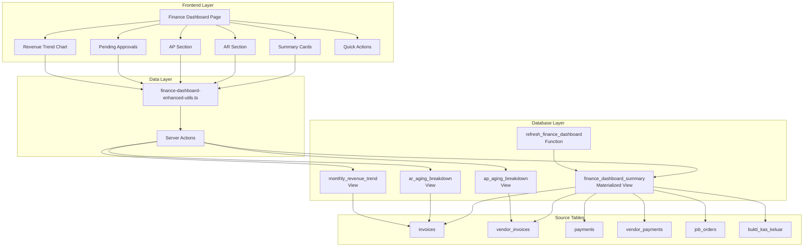

# Design Document: Finance Dashboard Enhanced (v0.9.8)

## Overview

This design document describes the enhanced Finance Dashboard for PT. Gama Intisamudera's ERP system. The dashboard provides Feri (Finance Manager) with comprehensive visibility into Accounts Receivable (AR), Accounts Payable (AP), cash flow, and profitability metrics. The design builds upon the existing finance dashboard infrastructure while adding new capabilities for AP tracking, cash flow monitoring, and revenue trend visualization.

The enhanced dashboard uses materialized views for performance optimization, ensuring that complex aggregations are pre-computed and refreshed on-demand rather than calculated on every page load.

## Architecture



## Components and Interfaces

### Data Types

```typescript
// Finance Dashboard Summary from Materialized View
interface FinanceDashboardSummary {
  // AR Summary
  totalAR: number;
  arOverdue: number;
  arInvoiceCount: number;
  
  // AP Summary
  totalAP: number;
  apOverdue: number;
  apPendingVerification: number;
  
  // Cash Position (MTD)
  cashReceivedMTD: number;
  cashPaidMTD: number;
  
  // Revenue & Profit (MTD)
  revenueMTD: number;
  profitMTD: number;
  
  // BKK Pending
  bkkPendingCount: number;
  bkkPendingAmount: number;
  
  // Metadata
  calculatedAt: string;
}

// Aging Bucket for AR/AP breakdown
interface AgingBucket {
  bucket: 'current' | '1-30 days' | '31-60 days' | '61-90 days' | 'over 90 days';
  invoiceCount: number;
  totalAmount: number;
}

// Monthly Revenue Data Point
interface MonthlyRevenueData {
  month: string; // ISO date string (first of month)
  revenue: number;
  collected: number;
}

// Pending BKK for approval display
interface PendingBKKItem {
  id: string;
  bkkNumber: string;
  joNumber: string;
  amount: number;
  category: string;
  requestedBy: string;
  createdAt: string;
}

// Complete Dashboard Data
interface FinanceDashboardEnhancedData {
  summary: FinanceDashboardSummary;
  arAging: AgingBucket[];
  apAging: AgingBucket[];
  pendingBKKs: PendingBKKItem[];
  revenueTrend: MonthlyRevenueData[];
  previousMonthRevenue: number;
}

// Cash Flow Projection
interface CashFlowProjection {
  expectedInflows: number;
  expectedOutflows: number;
  netProjection: number;
}
```

### Component Hierarchy

```
FinanceDashboardEnhanced
├── DashboardHeader
│   ├── Greeting (time-based)
│   ├── LastUpdated timestamp
│   └── RefreshButton
├── FinancialOverviewSection
│   ├── CashPositionCard
│   ├── RevenueMTDCard
│   ├── ProfitMTDCard
│   └── NetCashCard
├── ARAPSection (grid layout)
│   ├── AROverviewCard
│   │   ├── TotalOutstanding
│   │   ├── OverdueAmount (highlighted)
│   │   ├── InvoiceCount
│   │   ├── AgingBreakdownChart
│   │   └── ViewDetailsLink
│   └── APOverviewCard
│       ├── TotalOutstanding
│       ├── OverdueAmount (highlighted)
│       ├── PendingVerificationCount
│       ├── AgingBreakdownChart
│       └── ViewDetailsLink
├── BottomSection (grid layout)
│   ├── PendingApprovalsCard
│   │   ├── BKKCount badge
│   │   ├── TotalAmount
│   │   ├── BKKList (max 5)
│   │   └── ReviewAllLink
│   └── RevenueTrendCard
│       ├── LineChart (6 months)
│       ├── Legend (Revenue/Collected)
│       └── ViewReportLink
└── QuickActionsBar
    ├── RecordPaymentButton
    ├── RecordVendorInvoiceButton
    ├── ApproveBKKButton
    └── RunARReportButton
```

### Server Actions

```typescript
// actions.ts - Server actions for finance dashboard

'use server'

import { createClient } from '@/lib/supabase/server'
import { revalidatePath } from 'next/cache'

/**
 * Get complete finance dashboard data
 * Refreshes materialized view if stale (>5 minutes)
 */
export async function getFinanceDashboardEnhancedData(): Promise<FinanceDashboardEnhancedData>

/**
 * Force refresh the materialized view
 */
export async function refreshFinanceDashboard(): Promise<{ success: boolean; error?: string }>

/**
 * Get cash flow projection for next 30 days
 */
export async function getCashFlowProjection(): Promise<CashFlowProjection>

/**
 * Get overdue invoices for follow-up
 */
export async function getOverdueInvoicesForFollowup(limit?: number): Promise<OverdueInvoice[]>
```

## Data Models

### Database Schema

```sql
-- Dashboard configuration table
CREATE TABLE IF NOT EXISTS dashboard_configs (
  id UUID PRIMARY KEY DEFAULT gen_random_uuid(),
  user_id UUID REFERENCES user_profiles(id),
  role VARCHAR(30),
  layout JSONB DEFAULT '{}',
  refresh_interval INTEGER DEFAULT 300,
  created_at TIMESTAMPTZ DEFAULT NOW(),
  updated_at TIMESTAMPTZ DEFAULT NOW(),
  UNIQUE(user_id),
  UNIQUE(role)
);

-- Finance dashboard summary materialized view
CREATE MATERIALIZED VIEW IF NOT EXISTS finance_dashboard_summary AS
SELECT
  -- AR Summary
  (SELECT COALESCE(SUM(amount_due), 0) 
   FROM invoices 
   WHERE status != 'cancelled' AND amount_due > 0) as total_ar,
  (SELECT COALESCE(SUM(amount_due), 0) 
   FROM invoices 
   WHERE status != 'cancelled' AND amount_due > 0 AND due_date < CURRENT_DATE) as ar_overdue,
  (SELECT COUNT(*) 
   FROM invoices 
   WHERE status != 'cancelled' AND amount_due > 0) as ar_invoice_count,
  
  -- AP Summary
  (SELECT COALESCE(SUM(amount_due), 0) 
   FROM vendor_invoices 
   WHERE status NOT IN ('paid', 'cancelled')) as total_ap,
  (SELECT COALESCE(SUM(amount_due), 0) 
   FROM vendor_invoices 
   WHERE status NOT IN ('paid', 'cancelled') AND due_date < CURRENT_DATE) as ap_overdue,
  (SELECT COUNT(*) 
   FROM vendor_invoices 
   WHERE status = 'received') as ap_pending_verification,
  
  -- Cash Position (MTD)
  (SELECT COALESCE(SUM(amount), 0) 
   FROM payments 
   WHERE payment_date >= DATE_TRUNC('month', CURRENT_DATE)) as cash_received_mtd,
  (SELECT COALESCE(SUM(amount), 0) 
   FROM vendor_payments 
   WHERE payment_date >= DATE_TRUNC('month', CURRENT_DATE)) as cash_paid_mtd,
  
  -- Revenue (MTD)
  (SELECT COALESCE(SUM(total_amount), 0) 
   FROM invoices 
   WHERE invoice_date >= DATE_TRUNC('month', CURRENT_DATE) 
   AND status != 'cancelled') as revenue_mtd,
  
  -- Profit (MTD, completed jobs)
  (SELECT COALESCE(SUM(net_profit), 0) 
   FROM job_orders 
   WHERE status = 'completed' 
   AND updated_at >= DATE_TRUNC('month', CURRENT_DATE)) as profit_mtd,
  
  -- BKK Pending
  (SELECT COUNT(*) 
   FROM bukti_kas_keluar 
   WHERE status = 'pending') as bkk_pending_approval,
  (SELECT COALESCE(SUM(amount_requested), 0) 
   FROM bukti_kas_keluar 
   WHERE status = 'pending') as bkk_pending_amount,
  
  -- Timestamp
  NOW() as calculated_at;

-- AR Aging breakdown view
CREATE OR REPLACE VIEW ar_aging_breakdown AS
SELECT
  CASE 
    WHEN due_date >= CURRENT_DATE THEN 'current'
    WHEN due_date >= CURRENT_DATE - 30 THEN '1-30 days'
    WHEN due_date >= CURRENT_DATE - 60 THEN '31-60 days'
    WHEN due_date >= CURRENT_DATE - 90 THEN '61-90 days'
    ELSE 'over 90 days'
  END as aging_bucket,
  COUNT(*) as invoice_count,
  COALESCE(SUM(amount_due), 0) as total_amount
FROM invoices
WHERE status != 'cancelled' AND amount_due > 0
GROUP BY 1
ORDER BY 
  CASE 
    WHEN due_date >= CURRENT_DATE THEN 1
    WHEN due_date >= CURRENT_DATE - 30 THEN 2
    WHEN due_date >= CURRENT_DATE - 60 THEN 3
    WHEN due_date >= CURRENT_DATE - 90 THEN 4
    ELSE 5
  END;

-- AP Aging breakdown view
CREATE OR REPLACE VIEW ap_aging_breakdown AS
SELECT
  CASE 
    WHEN due_date >= CURRENT_DATE THEN 'current'
    WHEN due_date >= CURRENT_DATE - 30 THEN '1-30 days'
    WHEN due_date >= CURRENT_DATE - 60 THEN '31-60 days'
    WHEN due_date >= CURRENT_DATE - 90 THEN '61-90 days'
    ELSE 'over 90 days'
  END as aging_bucket,
  COUNT(*) as invoice_count,
  COALESCE(SUM(amount_due), 0) as total_amount
FROM vendor_invoices
WHERE status NOT IN ('paid', 'cancelled')
GROUP BY 1;

-- Monthly revenue trend view (last 6 months)
CREATE OR REPLACE VIEW monthly_revenue_trend AS
SELECT
  DATE_TRUNC('month', invoice_date)::DATE as month,
  COALESCE(SUM(total_amount), 0) as revenue,
  COALESCE(SUM(amount_paid), 0) as collected
FROM invoices
WHERE invoice_date >= CURRENT_DATE - INTERVAL '6 months'
  AND status != 'cancelled'
GROUP BY 1
ORDER BY 1;

-- Refresh function
CREATE OR REPLACE FUNCTION refresh_finance_dashboard()
RETURNS void AS $$
BEGIN
  REFRESH MATERIALIZED VIEW finance_dashboard_summary;
END;
$$ LANGUAGE plpgsql;

-- Performance indexes
CREATE INDEX IF NOT EXISTS idx_invoices_due_date_outstanding 
  ON invoices(due_date) WHERE amount_due > 0;
CREATE INDEX IF NOT EXISTS idx_vendor_invoices_due_date 
  ON vendor_invoices(due_date);
CREATE INDEX IF NOT EXISTS idx_payments_payment_date 
  ON payments(payment_date);
CREATE INDEX IF NOT EXISTS idx_vendor_payments_payment_date 
  ON vendor_payments(payment_date);
```

## Correctness Properties

*A property is a characteristic or behavior that should hold true across all valid executions of a system-essentially, a formal statement about what the system should do. Properties serve as the bridge between human-readable specifications and machine-verifiable correctness guarantees.*

### Property 1: Net Cash Calculation

*For any* set of payments (received) and vendor payments (paid) within the current month, the net cash value SHALL equal the sum of received amounts minus the sum of paid amounts.

**Validates: Requirements 1.4**

### Property 2: Revenue MTD Calculation

*For any* set of invoices with various invoice dates and statuses, the Revenue MTD SHALL equal the sum of total_amount for all non-cancelled invoices where invoice_date falls within the current month.

**Validates: Requirements 1.2**

### Property 3: Profit Margin Calculation

*For any* revenue value greater than zero and profit value, the profit margin percentage SHALL equal (profit / revenue) * 100. *For any* current and previous month revenue values where previous > 0, the percentage change SHALL equal ((current - previous) / previous) * 100.

**Validates: Requirements 1.3, 1.5**

### Property 4: AR Aggregation and Aging Classification

*For any* set of invoices with various statuses, due dates, and amounts:
- Total AR SHALL equal the sum of amount_due for all invoices where status != 'cancelled' AND amount_due > 0
- Overdue AR SHALL equal the sum of amount_due for invoices where due_date < current_date
- Invoice count SHALL equal the count of invoices where status != 'cancelled' AND amount_due > 0
- Each invoice SHALL be classified into exactly one aging bucket based on days overdue:
  - current: due_date >= current_date
  - 1-30 days: 1 <= days_overdue <= 30
  - 31-60 days: 31 <= days_overdue <= 60
  - 61-90 days: 61 <= days_overdue <= 90
  - over 90 days: days_overdue > 90
- The sum of all bucket amounts SHALL equal total AR

**Validates: Requirements 2.1, 2.2, 2.3, 2.4, 2.6**

### Property 5: AP Aggregation and Aging Classification

*For any* set of vendor invoices with various statuses, due dates, and amounts:
- Total AP SHALL equal the sum of amount_due for all vendor invoices where status NOT IN ('paid', 'cancelled')
- Overdue AP SHALL equal the sum of amount_due for vendor invoices where due_date < current_date
- Pending verification count SHALL equal the count of vendor invoices where status = 'received'
- Each vendor invoice SHALL be classified into exactly one aging bucket using the same rules as AR

**Validates: Requirements 3.1, 3.2, 3.3, 3.4**

### Property 6: BKK Aggregation

*For any* set of BKK records with various statuses and amounts:
- Pending BKK count SHALL equal the count of BKKs where status = 'pending'
- Pending BKK amount SHALL equal the sum of amount_requested for BKKs where status = 'pending'

**Validates: Requirements 4.1, 4.2**

### Property 7: BKK List Limiting and Sorting

*For any* set of pending BKK records, the returned list SHALL:
- Contain at most 5 items
- Be sorted by created_at in descending order (most recent first)
- Include only BKKs with status = 'pending'

**Validates: Requirements 4.3**

### Property 8: Revenue Trend Aggregation

*For any* set of invoices spanning multiple months, the revenue trend data SHALL:
- Include only invoices from the last 6 months
- Group invoices by month (using DATE_TRUNC)
- Calculate revenue as sum of total_amount per month
- Calculate collected as sum of amount_paid per month
- Exclude cancelled invoices

**Validates: Requirements 5.1, 5.2**

### Property 9: Staleness Detection

*For any* calculated_at timestamp from the materialized view, the system SHALL trigger a refresh if and only if the timestamp is more than 5 minutes (300 seconds) older than the current time.

**Validates: Requirements 7.3**

### Property 10: Role-Based Access Control

*For any* user role:
- Finance role SHALL have access to the Finance Dashboard
- Roles in ['finance', 'owner', 'admin', 'manager'] SHALL have access to AR/AP totals
- Roles in ['finance', 'owner', 'admin'] SHALL have access to cash position details
- Roles in ['finance', 'owner', 'admin'] SHALL have access to profit margins
- All other roles SHALL be denied access to these features

**Validates: Requirements 8.1, 8.2, 8.3, 8.4**

## Error Handling

### Data Loading Errors

| Error Scenario | Handling Strategy |
|----------------|-------------------|
| Materialized view refresh fails | Log error, display stale data with warning indicator |
| Database connection timeout | Show error toast, offer retry button |
| Partial data load failure | Display available sections, show error for failed sections |
| Permission denied | Redirect to appropriate dashboard for user's role |

### Calculation Edge Cases

| Edge Case | Handling |
|-----------|----------|
| No invoices exist | Display Rp 0 for all AR metrics |
| No vendor invoices exist | Display Rp 0 for all AP metrics |
| No payments this month | Display Rp 0 for cash received MTD |
| Division by zero (margin calc) | Display "N/A" or 0% when revenue is zero |
| Previous month has no data | Hide percentage comparison or show "N/A" |

### UI Error States

```typescript
interface DashboardErrorState {
  hasError: boolean;
  errorMessage: string;
  retryAction?: () => void;
  fallbackData?: Partial<FinanceDashboardEnhancedData>;
}
```

## Testing Strategy

### Unit Tests

Unit tests will verify specific examples and edge cases:

1. **Calculation Functions**
   - Net cash with zero values
   - Profit margin with zero revenue
   - Percentage change with zero previous value
   - Aging bucket boundary conditions (exactly 30, 60, 90 days)

2. **Data Transformation**
   - Empty arrays handling
   - Null/undefined field handling
   - Date parsing edge cases

3. **Permission Checks**
   - Each role type individually
   - Null/undefined user profile

### Property-Based Tests

Property-based tests will use `fast-check` library to verify universal properties:

1. **Financial Calculations** (Properties 1-3)
   - Generate random payment amounts and dates
   - Verify arithmetic properties hold for all inputs

2. **Aggregation Functions** (Properties 4-6)
   - Generate random invoice sets with various statuses/dates
   - Verify totals match filtered sums

3. **Aging Classification** (Properties 4-5)
   - Generate random due dates
   - Verify each invoice lands in exactly one bucket
   - Verify bucket totals sum to overall total

4. **List Operations** (Property 7)
   - Generate random BKK lists of various sizes
   - Verify limiting and sorting invariants

5. **Permission Logic** (Property 10)
   - Generate all role combinations
   - Verify access rules are consistent

### Test Configuration

```typescript
// vitest.config.ts additions
export default defineConfig({
  test: {
    // Property tests need more iterations
    testTimeout: 30000,
  },
})

// Property test configuration
const FC_CONFIG = {
  numRuns: 100,
  seed: Date.now(),
}
```

### Test File Structure

```
__tests__/
├── finance-dashboard-enhanced-utils.test.ts    # Unit tests
├── finance-dashboard-enhanced.property.test.ts # Property tests
└── finance-dashboard-permissions.test.ts       # Permission tests
```

